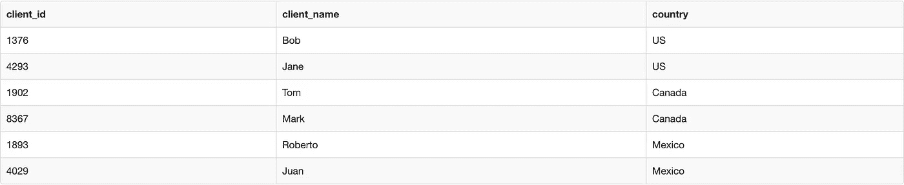
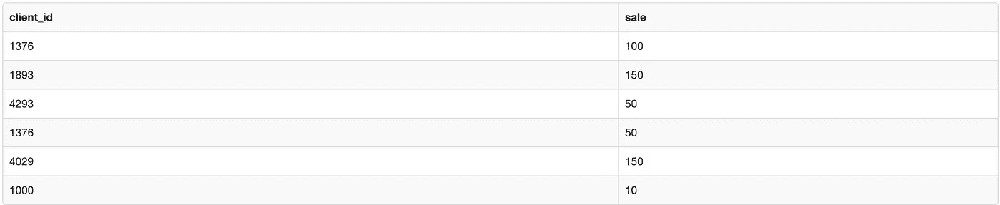
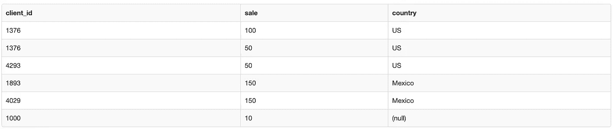
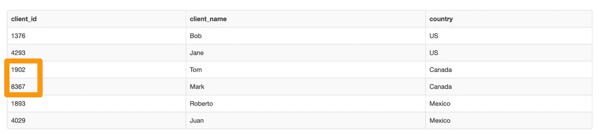
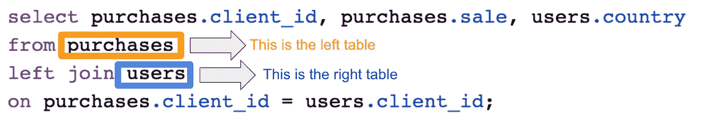
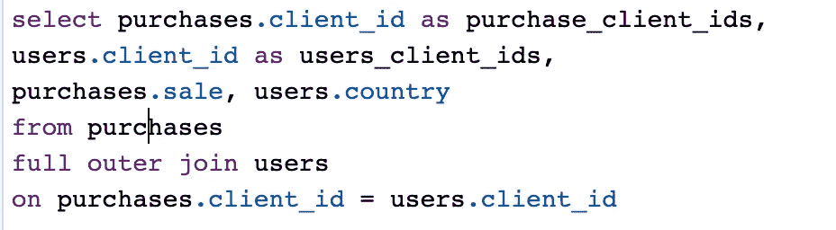
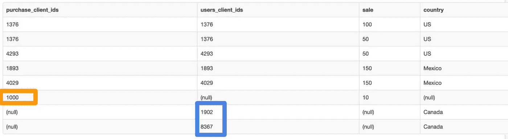
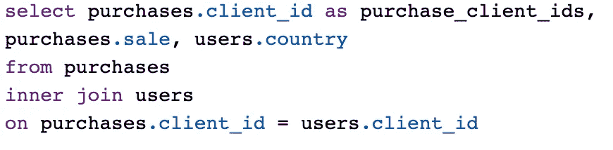
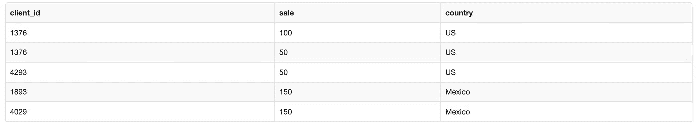

# 连接数据的初学者指南

> 原文：<https://towardsdatascience.com/a-beginners-guide-to-joining-data-935c8e579fb7?source=collection_archive---------28----------------------->


照片由来自[佩克斯](https://www.pexels.com/photo/man-standing-infront-of-white-board-1181345/?utm_content=attributionCopyText&utm_medium=referral&utm_source=pexels)的[克里斯蒂娜·莫里洛](https://www.pexels.com/@divinetechygirl?utm_content=attributionCopyText&utm_medium=referral&utm_source=pexels)拍摄

## 左连接、内连接、外连接

连接数据是数据分析的基本技能之一。不幸的是，当您刚刚开始时，或者当您正在从 excel 过渡到 SQL 或 Python 时，这也可能有点令人困惑。

在本文中，我将直观地解释连接数据意味着什么以及如何有效地进行连接。

# 加入数据是什么意思？

理解连接的最好方法是通过一个简单的例子来完成。

假设你为一家在网站上销售 t 恤的公司工作。

你有一个数据集告诉你关于你的网站**用户**的细节。为简单起见，假设该表只包含唯一的客户端 ID、客户端名称和来源国家:



您还有另一个数据集，它告诉您这些网站用户的所有购买行为:



你的老板走进房间，要求你告诉她哪个国家的网站销售额最高。

要回答她的问题，你需要把告诉你客户在哪里的数据和告诉你他们买了什么的数据放在一起。换句话说，对于每一笔交易，您都需要弄清楚客户端位于何处。

使这成为可能的是，这两个数据集之间有一些共性。在这种情况下，它是客户端 ID。

“连接”就是基于一个公共数据点组合数据。恰当地说，这个公共数据点被称为“连接键”

对于本例，我们可以使用下面的 SQL 查询将用户数据连接到购买数据，该查询使用“client ID”作为连接键:

```
select purchases.client_id, purchases.sale, users.country 
from purchases
left join users
on purchases.client_id = users.client_id;
```

瞧:



现在我们可以看到墨西哥的销售额最高。(注意:如果我们有多行，我们会希望使用“groupby”和“sum”函数。但是由于我们在上面的例子中没有太多的数据，我们可以很容易地当场回答这个问题，并把那些话题留到另一天。)

# 为什么我们需要连接数据？

如果您是数据分析的新手，您可能会感到疑惑，为什么我们首先需要连接数据？为什么数据不能只存在一个表中？

这主要有两个原因。首先，数据通常从不同的来源获得。获取用户数据和事务数据的过程可能是分开的。

如果您是 excel 的超级用户，想想您不得不执行 vlookup 来连接两个数据源的所有时间。本质上，这是一个连接。

第二个原因与速度有关。通常，一个表中的数据越多，从表中检索所需内容的时间就越长。

# 不同类型连接的简单说明

很好，现在我们对什么是联接以及为什么需要联接有了直觉。接下来，我们需要了解不同类型的连接。

这是一个人们经常犯错的领域，所以让我们试着把这部分讲清楚。

我们需要多种类型的连接有一个原因。如果你能记住原因，那么你就能记住类型。

**原因如下:**当你的连接键**中的值**不存在于你正在连接的**和**两个数据集时，计算机需要知道返回什么。

现在，让我们看一个基于之前数据集的例子。

“8367”的客户端 id 在用户表中:



但是它不在事务表中:


因此，join 的“类型”只是告诉计算机在这种情况下做什么。

作为该查询的自豪作者，您可以控制希望计算机返回的内容。

## 左连接

一个“左连接”告诉计算机:“给我左表中的所有东西，即使它不在右表中。”



左边的表是查询中第一个出现的表

还记得前面的例子吗？我们使用了一个左连接，只从左表中获得了 client _ ids:


## 完全外部连接

“完全外部连接”告诉计算机，“给我两个表中的所有记录。”



因此，我们从两个表中获取客户 id，包括 1902 和 8367(仅在 users 表中)以及 1000(仅在 purchases 表中)。



请注意，上表中的一些单元格有“null”(即。缺少)值。这是有意义的，因为这些数据实际上并不存在于原始表中。

我们知道客户 id 1000 购买了 10 美元，但是不知道这个客户来自哪里。如果它在原始数据中丢失，那么它将在连接后丢失。

## 内部连接

最后，一个“内部连接”告诉计算机——“只给我那些连接键在两个表中都存在的记录。”



上述查询返回:



请注意，结果集中缺少所有非重叠的客户端 id—1902、8367 和 1000。

# 需要注意的事项

了解有关连接数据的更多信息时，需要考虑以下几点:

1.  右连接:一个“右连接”告诉计算机“给我右表中的所有东西，即使它不在左表中”。我从来没用过右连接。为什么？因为任何时候你想做一个右连接，你可以颠倒表的顺序，然后做一个左连接。少了一件需要记住的事。
2.  **多键连接**:可以连接多个列值。(即。table1.id1 = table2.id1 和 table1.id2 = table2.id2 的左连接)
3.  **Duplicates:** 始终注意连接前后表中记录的数量。初学者的一个常见错误是执行一个创建不需要的副本的连接。如果您遇到这种情况，您将不得不批判性地思考如何重写连接以得到您真正想要的。