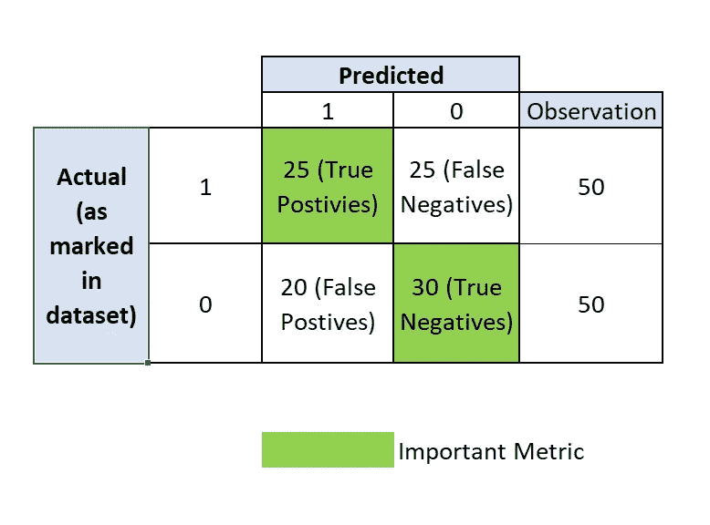
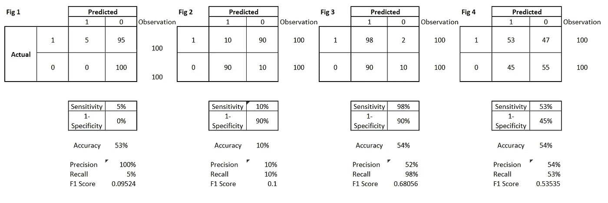
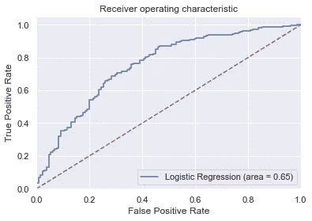
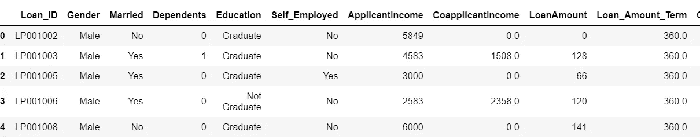
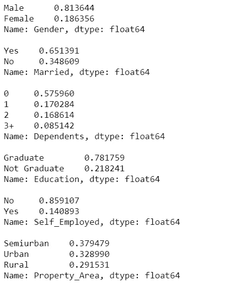
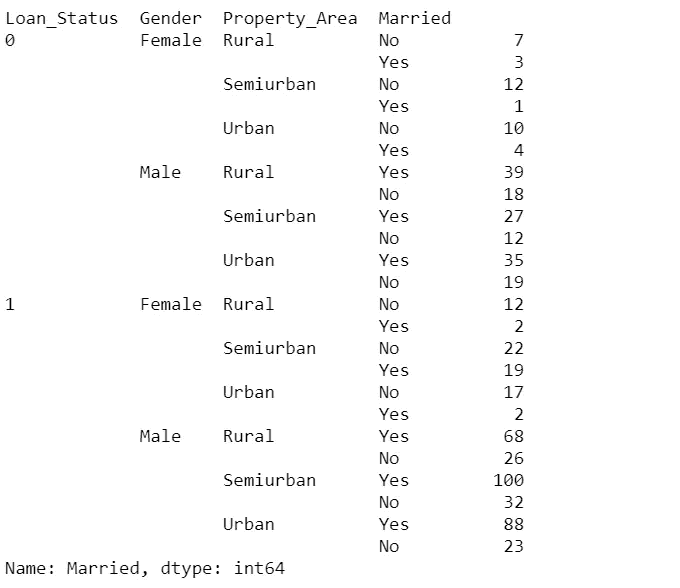
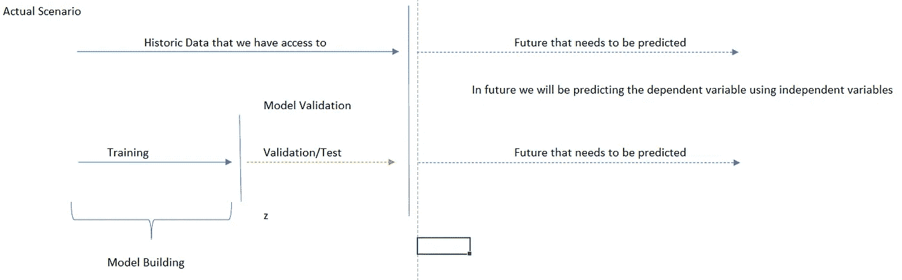

# Python 逻辑回归初学者指南

> 原文：<https://towardsdatascience.com/a-beginners-guide-to-logistic-regression-in-python-470bdc57a33?source=collection_archive---------19----------------------->

## 逻辑回归、混淆度量、AOC 和使用 scikit 学习的解算器的基础


由 [Celpax](https://unsplash.com/@celpax?utm_source=medium&utm_medium=referral) 在 [Unsplash](https://unsplash.com?utm_source=medium&utm_medium=referral) 上拍摄的照片

# 介绍

在统计学中，逻辑斯蒂模型被用于预测一个*二元因变量*。当我们处理需要预测 1 和 0 的数据集时，我们通常依赖逻辑回归或其他分类算法。统计学上，逻辑回归用于预测事件发生的概率。基于概率值和相应的阈值，我们指定事件是否会发生。例如，今天下雨的概率是 0.73，并且考虑到我们的阈值是 0.5，我们可以确认今天会下雨，即输出是 1，这转化为事件(在这种情况下“今天会下雨”)为真的事实。

> 当我写下这篇文章时，天正在下雨。太巧了！


奥斯曼·拉纳在 [Unsplash](https://unsplash.com?utm_source=medium&utm_medium=referral) 上拍摄的照片

现在的问题是这些**概率**和**阈值**是什么？我们如何对数据建模？我们可以用线性回归来代替吗？简而言之，当因变量为 1 或 0 时，*线性回归不是一个选项，因为线性回归遵循因变量连续的基本假设。*当我们使用线性回归对数据建模时，因变量(Y)可以取任何范围的值。当使用线性模型进行预测时，将因变量的输出分别定标为 0 和 1 是具有挑战性的。这就是为什么对于逻辑回归，我们给定独立变量 X1、X2、X3 等等，来模拟事件 Y 的概率。**迷茫？**

让我们用上面的例子来解决这个问题。什么是**概率****会下雨**(这里的 Y 是今天下雨的概率)给定昨天下雨(X1)，今天气温 20 度(X2)，月份 10 月(X3)，湿度 20% (X4)。现在，如果我们建立一个回归模型，假设 Y = a*X1 + b*X2 + c*X3 + d*X4 +常数，Y 的值可以在[A，B]之间，其中 A 和 B 可以取任何可能的值集。然而，我们知道*一个概率可以位于【0，1】*之间。这要求我们以一种输出总是位于 0 和 1 之间的方式对数据建模，因此我们使用如下图所示的 sigmoid 函数。


图一。使用 Sigmoid 函数的逻辑回归方程。作者使用 Latex 开发的图像。

# 逻辑回归在哪里？

我们大多数人都会收到品牌或网站的促销信息，这些信息包含我们的电子邮件 id 和个人信息。你有没有注意到像 Dash、Swiggy、Uber Eats 这样的移动应用程序定期(当你在他们的平台上不活跃时)为你提供定制的折扣？像优步这样的大机构如何知道你是否应该得到促销优惠或定制折扣？一切都可以归结为使用上面讨论的概念实现的客户分类。这些公司有机器学习模型来理解或预测你粗制滥造的概率。如果模型将你标记为一个不满意的客户，他们会部署这些个性化的策略来留住你。


由 [Unsplash](https://unsplash.com?utm_source=medium&utm_medium=referral) 上的 [abillionveg](https://unsplash.com/@abillionveg?utm_source=medium&utm_medium=referral) 拍摄

# 分类的概念

任何分类问题中的因变量都是 0 和 1 的二进制值(也可以是多类，例如产品质量，比如好、中、差)。因此，一旦开发了逻辑回归模型，我们需要将概率转换为 0 和 1。今天下雨的概率是 0.72。这意味着今天会下雨(真/ 1)还是不会下雨(假/ 0)？这里的一般思想是**一个事件必须是真(1)或假(0)，而不能像“不确定”那样介于两者之间。**因此，一旦我们对概率值建模，我们需要将概率得分转换为 1 和 0 的组合。为了达到同样的目的，大多数机器学习算法使用 0.5 的阈值。

***这意味着如果一个事件发生的概率是> 0.5，我们通常认为该事件会发生，或者换句话说，如果一个事件发生的概率超过 50%，那么我们可以声称该事件会发生，也就是说，在这种情况下，会下雨。***

## 混乱矩阵

一旦概率被转换成 1 和 0，我们最终得到一个 2 x 2 矩阵，通常被称为混淆矩阵。混淆矩阵主要用于模型验证或预测模型的拟合程度，或模型与现有数据的吻合程度。这里值得注意的是，当我们建立一个逻辑模型时，我们需要确保我们的预测与数据中给出的相似。例如，如果数据中最初有 100 个 1 和 100 个 0，我们的模型应该将所有 1 预测为 1，所有 0 和 0。这意味着任何错误的分类或不正确的预测都会降低我们的准确性。我们先来看看混淆矩阵。



图二。实际值和预测值的混淆矩阵。所有相应的解释都使用这个混淆矩阵来讨论结果。作者使用 Excel 开发的图像。

*   **真阳性** —模型预测为 1 的值中有多少是原始数据集中的 1？真意味着正确的预测，1 在这里指的是积极的，所以简而言之，积极的正确预测
*   **假阴性** —数据集中有多少被模型预测为 0 的值是 1。False 是不正确的预测，这里负数是 0。所以对 0 或负数的错误预测
*   **假阳性** —有多少值被模型预测为 1，但在数据集中却是 0。False 是不正确的，这里的正数是 1。所以对 1 的错误预测
*   **真阴性** —模型预测为 0 的值中有多少是原始数据集中的 0？True 表示正确的预测，0s 在这里指的是否定的，所以简而言之就是否定的正确预测

## 模型验证术语


*   **准确性:**我们的模型在预测真阳性和真阴性时的准确性，换句话说，我们的预测有多少与数据中的类别变量完全匹配。
*   *假设数据集中有 100 个 0 和 1 的观察值，其中 50 个观察值为 0，50 个观察值为 1* ***(参考实际)***
*   *运行模型后，数据集中被标记为 0 的 50 个观察值中的 30 个也被模型* ***(指真阴性)*** 标记为 0
*   *在数据集中被标记为 1 的 50 个观察值中，有 25 个被模型* ***(指真阳性)*** *标记为 1。所以我们的准确率是(30+25)/100 =55/100 或者 55%。所以准确率是(真阳性+真阴性)/(真阳性+真阴性+假阳性+假阴性)*
*   **召回率或敏感度或真阳性率:**数据集中原本标记为 1 的值被模型预测为 1 的百分比是多少？所以敏感度是真阳性/(真阳性+假阴性)也就是 25 / (25+25) = 50%。
*   *这告诉我什么？—它告诉我，数据集中只有 50%被归类为 1 的值被模型正确预测到。*
*   **特异性或真阴性率:**数据集中原本标记为 0 的值有百分之多少被模型预测为 0？所以敏感度是真阴性/(真阴性+假阳性)也就是 30 / (25+25) = 60%。
*   *这告诉我什么？—它告诉我，在数据集中，只有 60%归类为 0 的值被模型正确预测。*
*   **1-特异性或假阳性率:**数据集中原本标记为 0 的值有百分之多少被模型预测为 1？所以 1-灵敏度是假阳性/(真阴性+假阳性)也就是 20 / (25+25) = 40%。
*   *这告诉我什么？—它告诉我，在数据集中被归类为 0 的值中，只有 40%被模型错误地预测到。*
*   **精度:**预测为 1s 的值有百分之多少是正确的？所以精度是真正/(真正+假正)也就是 20 / (20+25) = 44.4%。
*   *这告诉我什么？—它告诉我，模型预测为 1s 的值中只有 44.4%是正确的*
*   **F1 得分**:是精度和召回率的调和平均值。它的计算方法是 2 x(精度*召回率)/(精度+召回率)。在我们的例子中，它是 2 * (0.44*0.5) / (0.44+0.5) = 0.46

## 使用哪个模型验证指标？

现在我们知道了多个度量标准，很难确定使用哪一个。我在这里举个例子。我们先来看看下图。



图 3。四种不同情景的混淆矩阵及其准确性、回忆/敏感度、精确度和 F1 分数。作者使用 Excel 开发的图像。

上图显示了一个经典的场景示例，其中来自不同模型运行的输出产生了相同的准确性分数。当验证一个逻辑模型时，我们需要在进入模型验证度量之前理解业务用例。一个经典的例子是诊断病人的医疗状况。在处理医疗保健行业的问题时，除了准确性，我们还需要关注召回价值。准确度和精确度并不那么重要。我们需要更准确地预测有健康状况的患者，即使这意味着错误地将没有健康状况的患者分类。

这里的基本原理是，即使**的精确度很差，即我们错误地预测健康患者患有某种疾病，也会有后续的医学测试来帮助诊断**。然而，如果我们的**召回率低**，即**我们不能正确预测患者的医疗状况，那么我们就会危及他们的生命**。

> 想一想——在营销活动中，我们需要预测客户是否会购买产品，并向他发送一些促销信息，这种情况如何？

## 我们应该将阈值从 0.5 更改为不同的值吗？

在统计学中，如果一个事件发生的概率是 0.5，那么就认为是一个*随机事件* ***。*** 大多数 ML 算法使用阈值 0.5 将概率转换为 1 和 0，这转化为随机化因子。如果一个事件的概率大于随机概率值，那么这个事件就有可能发生，否则就不会发生。然而，有时我们需要微调这个阈值来改进模型度量之一。

**如果我提高或降低阈值，会有什么变化？**


1.  始终记住**真阳性+假阴性** **是数据集的** **常数**，这意味着如果其中一个改变，灵敏度也会改变。类似地，数据集的**假阳性+真阴性是常数**，这意味着如果任一变化特异性也发生变化
2.  降低阈值意味着我最终预测 1 多于 0？这意味着什么？
    -这意味着**真阳性+假阳性** **通过增加预测 1
    的数量来增加**-这导致了**假阳性数量增加**的可能性，从而**降低** **精度**
    -如果**假阳性增加，真阴性将下降**，从而**降低特异性**
3.  增加阈值意味着我最终会预测更多的 0 而不是 1
    这意味着什么？
    -这意味着**真阴性+假阴性增加**，因为模型预测的 0 的数量将更高
    -这导致假阴性的数量**可能会增加，从而降低灵敏度**

如果模型的召回(灵敏度)值很低，您可能希望将阈值从 0.5 降低到一个较低的值。

## **接收机工作特性曲线**



图 4。逻辑回归模型的 ROC 曲线。作者使用 Jupyter 笔记本开发的图像。

1.  当灵敏度/真阳性率为 0，1-特异性或假阳性率为 0 时，意味着什么？
    -真阳性为 0，这意味着所有的 1 都被模型
    错误地预测到了-假阳性为 0，或者我们可以说真阴性为 100%，即所有的 0 都被模型
    正确地预测到了-我的模型为 0 返回了极好的回报，但未能识别 1
2.  当灵敏度/真阳性率为 1 且 1-特异性或假阳性为 1 时意味着什么？
    -假阴性为 0，这意味着所有的 0 都被模型
    错误地预测到了-真阳性为 1，或者我们可以说所有的 1 都被模型
    正确地预测到了-我的模型返回了 1 的优秀结果，但未能处理 0
3.  上面的曲线意味着什么？
    -对于不同的概率阈值，灵敏度和 1-特异性值是多少
    -面积越大，表示 1-特异性低时灵敏度高，之后保持饱和

# 使用 Python 预测贷款资格

信用风险是指借款人拖欠任何贷款。在银行部门，这是在批准申请人的贷款之前要考虑的一个重要因素。X 公司经营所有房屋贷款。他们在所有地区都有业务。客户申请贷款，在批准之前，贷款官员会对其进行验证。该分析旨在为客户建模，并确定他们是否合格。

实现相同功能的代码片段如下:

```
import pandas as pd
from sklearn.linear_model import LogisticRegression# importing ploting libraries
import matplotlib.pyplot as plt
# To enable plotting graphs in Jupyter notebook
%matplotlib inline#importing seaborn for statistical plots
import seaborn as sns
sns.set(color_codes=True) # — — — — — — — -adds hue to the color#Let us break the X and y dataframes into training set and test set. For this we will use
#Sklearn package’s data splitting function which is based on random functionfrom sklearn.model_selection import train_test_splitimport numpy as np
import os,sys
from scipy import statsimport warnings
warnings.filterwarnings(‘ignore’)# calculate accuracy measures and confusion matrix
from sklearn import metricsfrom IPython.display import display # — — — — — — — — — — -for displaying multiple data frames in one output
```

**读取数据**

```
df = pd.read_csv(‘CreditRisk.csv’)print(“Shape of the data:”, df.shape)display(df.head())
```



图 5。来自信用数据的数据元素。作者使用 Jupyter 笔记本开发的图像。

```
cr_df = df.drop(‘Loan_ID’, axis =1 ) # dropping this column as it will be 1–1 mapping anywayscr_df['Loan_Amount_Term'].value_counts(normalize=True)#The Loan_Amount_Term/Credit_History is highly skewed - so we will delete this columncr_df.drop(['Loan_Amount_Term'], axis=1, inplace=True)
```

**缺失值处理**

```
for i in list(cr_df.columns[cr_df.dtypes==’object’]): # checking value counts of all object type columns
 print(cr_df[i].value_counts(normalize=True))
 print()
```



图 6。按属性分布数据。作者使用 Jupyter 笔记本开发的图像。

```
#filling Null Valuescr_df[‘Self_Employed’].fillna(‘No’,inplace=True) #replacing with mode, as maximum people are not self employedcr_df[‘Dependents’].fillna(‘0’,inplace=True) #replacing with modecr_df[‘Credit_History’].fillna(0.0,inplace=True) #replacing with modecr_df['Gender'].fillna('Male',inplace=True) #replacing remaining values with mode as no other relationship founddf.groupby(['Loan_Status','Gender','Property_Area'])['Married'].value_counts()
```



图 7。为了取代婚姻状况，我们着眼于属性的组合，以确定插补的类型。作者使用 Jupyter 笔记本开发的图像。

```
cr_df.loc[104,’Married’] = ‘Yes’
cr_df.loc[228,’Married’] = ‘Yes’
cr_df.loc[435,’Married’] = ‘No’
```

**为模型开发准备数据**

数据分为训练集和测试集。



图 8。测试列车概念。作者使用 MS Excel 开发的图像。

```
## Define X and Y variablesX = cr_df.drop([‘Loan_Status’], axis=1)
Y = cr_df[[‘Loan_Status’]]#Convert categorical vriables to dummy variables
X = pd.get_dummies(X, drop_first=True)##Split into training and test setfrom sklearn.model_selection import train_test_splitX_train, X_test, y_train, y_test = train_test_split(X, Y, test_size=0.30,random_state=1)from sklearn.metrics import confusion_matrix, recall_score, precision_score, f1_score, roc_auc_score, accuracy_score, log_loss
from sklearn.linear_model import LogisticRegressionlogreg = LogisticRegression(random_state=42);logreg.fit(X_train, y_train)
```

让我们检查一下测试数据的准确性。

```
y_predict = logreg.predict(X_train) # — — — — — — — — -Prediction here are 0s and 1s# — — — — — — — to get probability values use this snippety_predict_prob = logreg.predict_proba(X_train)confusion_matrix(y_train,y_predict)#-----------------------------------Regression Score--------------------------------------
print("Trainig accuracy",logreg.score(X_train,y_train))  
print()print("Testing accuracy",logreg.score(X_test, y_test))
print()print("Recall:",recall_score(y_train,y_predict))
print()print("Precision:",precision_score(y_train,y_predict))
print()print("F1 Score:",f1_score(y_train,y_predict))
print()print("Log Loss:",log_loss(y_train,y_predict))
print()
```

**使用解算器、正则化和类权重微调模型**

在构建逻辑回归时，我们需要考虑三个可用于提高准确性的参数。这包括解算器(如牛顿-cg、lbfgs、liblinear、sag(随机平均梯度下降)、saga、正则化器(这是 L1 和 L2 罚函数，用于说明较高数量的变量并防止过度拟合)和正则化器的罚函数。我们还可以微调类平衡，以解决数据中的不平衡。下面的代码使用的默认求解器是 lbfgs，惩罚为“l2”，平衡的类权重，惩罚值为 25%。

```
#Therefore final model is
model = LogisticRegression(random_state=42,penalty=’l2', class_weight=’balanced’,C=0.25)model.fit(X_train, y_train)y_predict = model.predict(X_test)print(“Trainig accuracy”,model.score(X_train,y_train)) 
print()
print(“Testing accuracy”,model.score(X_test, y_test))
print()print(‘Confusion Matrix’)print()
print(“Recall:”,recall_score(y_test,y_predict))
print()
print(“Precision:”,precision_score(y_test,y_predict))
print()
print(“F1 Score:”,f1_score(y_test,y_predict))
print()
print(“Roc Auc Score:”,roc_auc_score(y_test,y_predict))
```

[](https://scikit-learn.org/stable/modules/generated/sklearn.linear_model.LogisticRegression.html) [## sklearn.linear_model。逻辑回归-sci kit-学习 0.23.2 文档

### 逻辑回归(又名 logit，MaxEnt)分类器。在多类的情况下，训练算法使用一对其余…

scikit-learn.org](https://scikit-learn.org/stable/modules/generated/sklearn.linear_model.LogisticRegression.html) 

*关于作者:高级分析专家和管理顾问，帮助公司通过对组织数据的商业、技术和数学的组合找到各种问题的解决方案。一个数据科学爱好者，在这里分享、学习、贡献；你可以在* [*LinkedIn*](https://www.linkedin.com/in/angel-das-9532bb12a/) *和*[*Twitter*](https://twitter.com/dasangel07_andy)*上和我联系。*