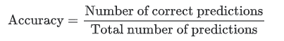
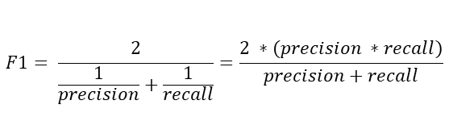

# 为什么您需要在部署后管理 ML 模型

> 原文：<https://towardsdatascience.com/a-beginners-guide-to-machine-learning-model-monitoring-36bf7faf3616?source=collection_archive---------15----------------------->

## 机器学习模型监控初学者指南

图片由[穆罕默德·哈桑](https://pixabay.com/users/mohamed_hassan-5229782/?utm_source=link-attribution&utm_medium=referral&utm_campaign=image&utm_content=4263129)拍摄，来自[皮克斯拜](https://pixabay.com/?utm_source=link-attribution&utm_medium=referral&utm_campaign=image&utm_content=4263129)

# 目录

1.  [简介](#08f9)
2.  [什么是模型监控](#29ca)
3.  [为什么模型监控很重要](#ef70)
4.  [模型监控中的指标](#eeb6)

# 介绍

机器学习(ML)模型的生命周期非常长，而且它肯定不会在你建立模型后结束——事实上，这只是开始。一旦你创建了你的模型，下一步就是生产你的模型，这包括[部署你的模型](https://www.datatron.com/resources/deployment)并监控它。虽然这听起来成本很高，但为了从 ML 模型中获得最大价值，在使用模型的过程中监控模型是非常必要的。

想象一下监控一个 ML 模型，就像你想做年度体检或定期给你的车换油一样。模型建模是一项操作任务，它允许您检查您的模型是否发挥了最佳性能。

在本文中，您将了解什么是模型监控，以及为什么它对于生产化模型如此重要。

# 什么是模型监控

模型监控是机器学习生命周期中的一个操作阶段，在模型部署之后，它需要“监控”您的 ML 模型，例如错误、崩溃和延迟，但最重要的是，确保您的模型保持预定的预期性能水平。

# 为什么模型监控很重要

为什么模型监控很重要的简单答案是，随着使用时间的推移，您的模型会退化，这被称为**模型漂移**。模型漂移，也称为模型衰减，指的是由于各种原因(我将在下面解释)导致的模型预测能力的退化。

## 看不见的数据

一般来说，机器学习模型仅在域内数据总人口的大约百分之十的样本大小上进行训练[1]，并且通常是由于标记数据的稀缺或训练大量数据的计算限制。虽然构建机器学习模型是为了减少偏差并能够归纳数据，但总会有模型输出不正确、不准确或低于标准的数据样本。

## 环境的变化和变量之间的关系

人们经常忘记的是，模型是基于其创建时的变量和参数进行优化的，ML 模型也不例外。想象一下 20 年前创建的垃圾邮件检测模型现在会如何运行。二十年前，互联网还不算什么！垃圾邮件变得越来越复杂，变化也越来越大，因此人们可能会怀疑垃圾邮件检测模型是否能够发挥作用。这是环境变化的一个例子。

影响模型环境及其变量之间关系的另一个因素是我们对数据的解释。例如，十年前创建的情感模型可能会错误地对各种单词和短语的情感进行分类，因为我们说话的方式、我们使用的单词和我们开发的俚语会随着时间不断变化。你再也听不到有人用古英语说话了，是吗？

## 上游数据变更

这指的是数据管道中的操作数据变化。实际上，这很常见，因为数据科学团队或部门通常无法控制输入数据来自的每个系统。例如，一个完全孤立的软件工程团队可能会将一个变量的度量单位从摄氏温度改为华氏温度，尽管其余的数据是以摄氏温度存储的。例如，如果一个人试图找到平均温度，这可能会导致严重的后果。上游数据更改的一个更简单的例子是不再生成要素，从而导致丢失值。

## 总体而言…

机器学习模型的阶段环境永远不会无限期地等同于生产环境，因为我们生活的世界总是在变化。基于上述原因，对你投入生产的任何 ML 进行监控是非常必要的。在下一章中，我们将讨论您可以监控的各种指标，以及在决定要监控什么指标时应该考虑的因素。

# 模型监控中的度量

有几个指标可以用来监控 ML 模型。您选择的指标取决于多种因素:

*   是回归还是分类任务？
*   商业目标是什么？精确度与召回率
*   目标变量的分布是什么？

以下是模型监控中常用的各种指标:

## **类型 1 错误**

也被称为**假阳性**，这是模型错误预测阳性类别的结果。例如，当你没有怀孕时，一个结果为阳性的妊娠测试就是一个 1 型错误的例子。

## **第二类错误**

也被称为**假阴性**，这是模型错误预测阴性类别的结果。这方面的一个例子是，当一个结果说你没有患癌症，而你实际上患了癌症。

## **精度**

模型的准确性简单地等于模型正确预测的分数，由以下等式表示:

## **精度**

Precision 试图回答“多大比例的肯定识别实际上是正确的？”并且可以由下面的等式表示:

## **回忆**

回忆试图回答“多大比例的实际阳性被正确识别？”并且可以由下面的等式表示:

## **F1 得分**

F1 分数是对测试准确性的一种衡量——它是精确度和召回率的调和平均值。它的最高分是 1(完美的精确度和召回率)，最低分是 0。总的来说，它是对模型的精确性和稳健性的一种度量，可以用以下等式表示:

## **R 平方**

r 平方是一种度量，它告诉你因变量的方差在多大程度上是由自变量的方差来解释的。更简单地说，当系数估计趋势时，R 平方表示最佳拟合线周围的散布。

例如，如果 R 是 0.80，那么 80%的变化可以用模型的输入来解释。

如果 R 为 1.0 或 100%，这意味着因变量的所有变动都可以完全由自变量的变动来解释。

## **调整后的 R 平方**

添加到模型中的每个额外的独立变量总是增加 R 值，因此，具有几个独立变量的模型可能看起来更适合，即使它不是。这就是调整后的 R 的用武之地。调整后的 R 补偿每个额外的独立变量，并且仅在每个给定变量将模型改进到超出概率可能的程度时才增加。

## **平均绝对误差**

绝对误差是预测值和实际值之间的差值。因此，平均绝对误差是绝对误差的平均值。

## **均方误差**

均方误差或 MSE 与 MAE 类似，只是取预测值和实际值之间的平方差的平均值。

因为差值是平方的，所以较大的误差被赋予更高的权重，所以当您想要最小化较大的误差时，这应该在 MAE 上使用。下面是 MSE 的等式和代码。

O 总之，您选择监控的指标最终取决于手头的任务和您工作的业务环境。

例如，在数据科学领域，众所周知，准确性指标与欺诈检测模型无关，因为欺诈交易的百分比通常不到 1%。因此，即使欺诈检测模型有 99%的准确率，因为它将**所有**交易归类为非欺诈交易，这也不能帮助我们确定该模型是否有效。

另一个例子是，当涉及到癌症筛查测试时，假阴性分类的严重性比假阳性分类严重得多。说一个癌症患者没有癌症最终会导致他或她的死亡。这比说一个病人得了癌症，进行进一步的检查，却发现病人没有癌症要糟糕得多。(安全总比后悔好！)

> 更多类似的文章，请查看 https://blog.datatron.com/[Datatron 的媒体页面](https://medium.com/getdatatron)或他们的博客

# 感谢阅读！

如果你喜欢我的工作并想支持我，我会非常感谢你在我的社交媒体频道上关注我:

1.  支持我的最好方式是在**媒体**T10【这里上关注我。
2.  在**推特**关注我[这里](https://twitter.com/terence_shin)。
3.  点击这里订阅我的新 **YouTube 频道** [。](https://www.youtube.com/channel/UCmy1ox7bo7zsLlDo8pOEEhA?view_as=subscriber)
4.  在 **LinkedIn** 上关注我[这里](https://www.linkedin.com/in/terenceshin/)。
5.  在我的**邮箱列表** [这里](https://forms.gle/UGdTom9G6aFGHzPD9)报名。
6.  查看我的网站[**terenceshin.com**](https://terenceshin.com/)。

# 资源

[1]德什穆克，奥姆(2019)。部署了你的机器学习模型？以下是你需要了解的后期制作监控。*分析维迪亚。*
[https://www . analyticsvidhya . com/blog/2019/10/deployed-machine-learning-model-post-production-monitoring/](https://www.analyticsvidhya.com/blog/2019/10/deployed-machine-learning-model-post-production-monitoring/)