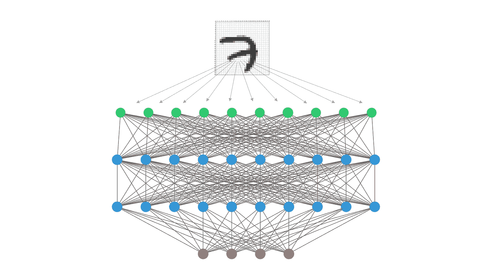
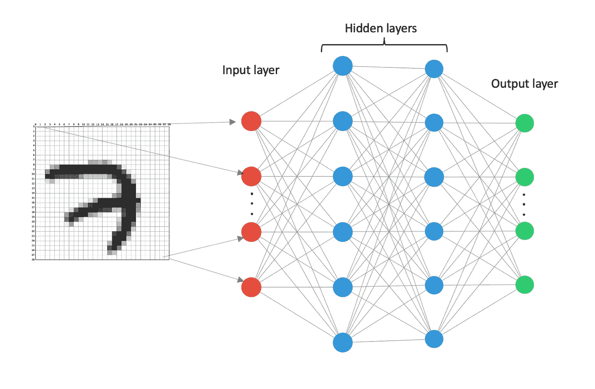
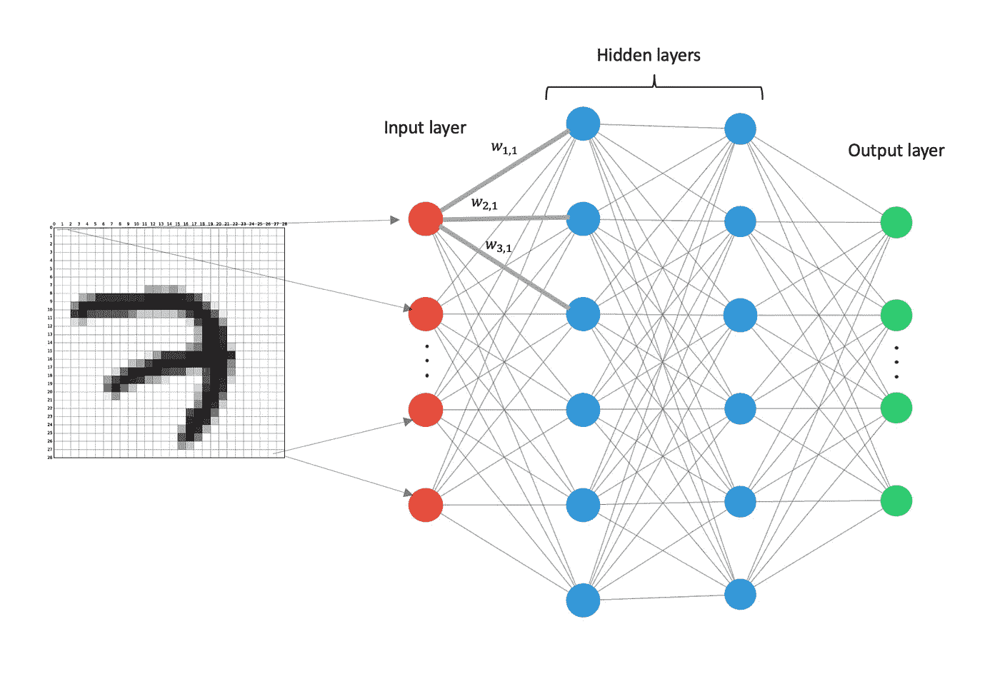
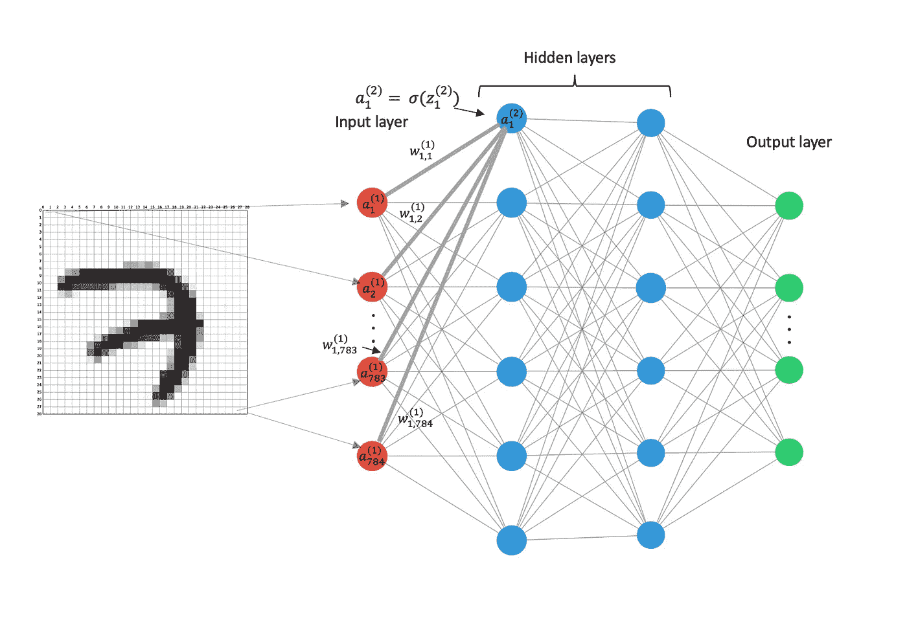
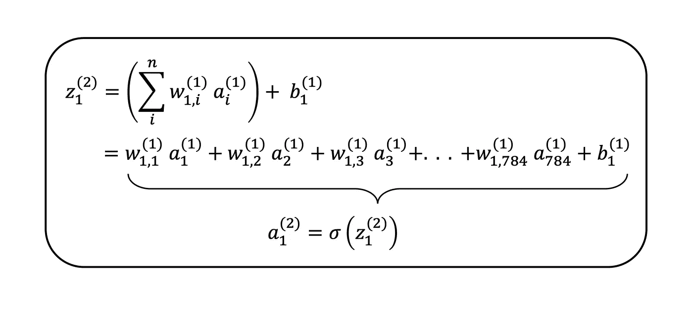
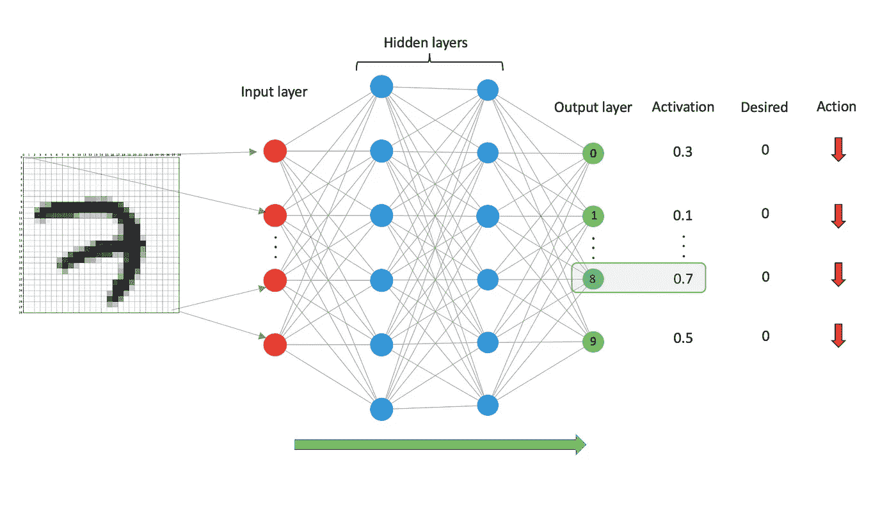
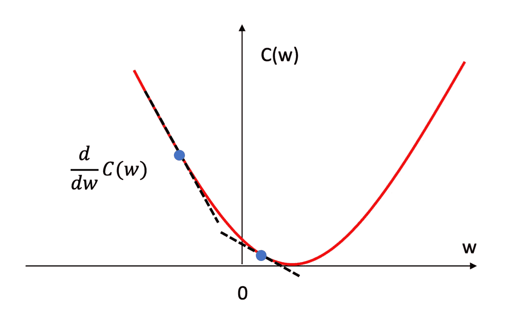
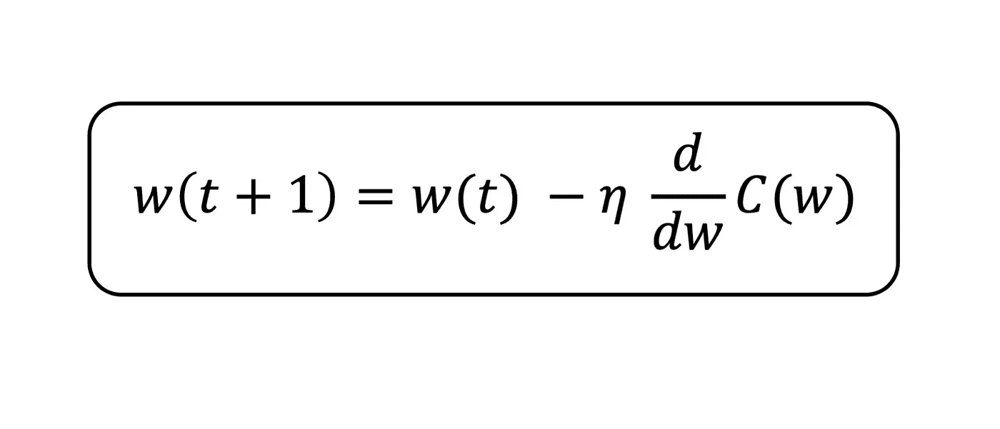
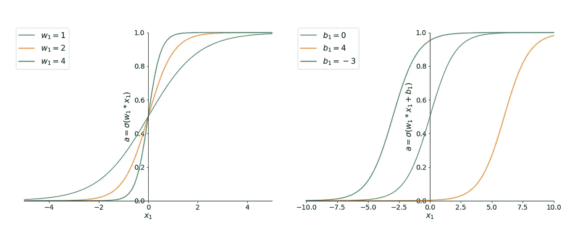
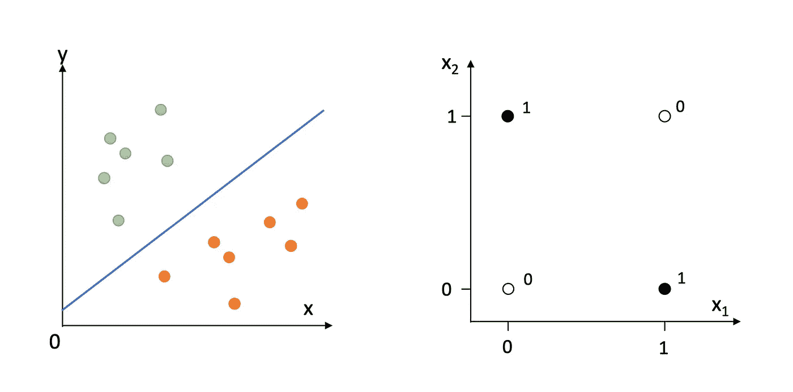

# 神经网络初学者指南

> 原文：<https://towardsdatascience.com/a-beginners-guide-to-neural-nets-5cf4050117cb?source=collection_archive---------17----------------------->

## 全民数据科学

## 对“黑匣子”的探究

# 介绍

如果你正在阅读这篇文章，你可能已经知道神经网络(NN)和深度学习的好处，但也许你想了解它们是如何工作的。你来对地方了！

当我第一次了解神经网络时，最让我惊讶的是它们的数学简单性。尽管神经网络在计算机视觉[1]和自然语言处理[2，3]等领域处于突破的前沿，但它们的内部工作原理很容易理解。

在这篇文章中，我们将通过使用“Hello World！”相当于深度学习——手写数字识别。

所以让我们直入主题吧。

# NN——它们是如何工作的？

NNs 包含两个阶段；

1.  正向传播
2.  反向传播

在神经网络的训练过程中，你执行这两个阶段。当您希望神经网络对未标记的示例进行预测时，您只需执行正向传播。反向传播确实是一种魔力，它使得神经网络能够很好地完成传统上计算机很难完成的任务。

## 正向传播

为了给神经网络一些背景知识，我们将考虑它所应用的原始问题之一——手写数字识别[4]。这个问题通常是深度学习的学生首先遇到的问题之一，因为它代表了传统机器学习方法难以解决的问题。

想象一下，我们的任务是编写一个可以识别手写数字的计算机程序。我们收到的每张图像都是 28 x 28 像素，我们还可以访问该图像的正确标签。我们做的第一件事是建立我们的神经网络，如下图所示。

图 1:通用神经网络

图 1 中的每个圆圈代表一个“ ***神经元*** ”。一个神经元仅仅保存一个标量值，即一个数。红色神经元定义输入层。这是我们输入图像的地方。蓝色神经元代表隐藏层。它们被称为隐藏层，因为用户从不与这些神经元直接交互。绿色神经元代表输出层。这是神经网络将输出其对图像中数字的预测的地方。

我们总共有 784 个像素(28 x 28)，所以我们的输入层由 784 个神经元组成。让我们将图 1 中顶部的红色神经元称为神经元 1，底部的神经元称为神经元 784。每个神经元的值采用它所连接的像素的值。例如，如果我们图像的像素深度为 8 位，那么单个像素可以取 0 到 256 (2⁸).)之间的值 0 将表示全白像素，256 将表示全黑像素，在这些值之间有一个滑动标度。一个神经元的值叫做它的 ***激活*** *。我们将用符号 a 来表示神经元的激活。*

我们要做的下一件事是将输入层的每一个神经元连接到下一层的每一个神经元。这在图 1 中显示为灰色线。我们还为每个连接添加了一个权重。权重就像神经元的值一样，只是一个标量值。图 2 显示了为我们的神经网络标记的三个权重。这里的下标只是帮助我们跟踪权重对应哪两个神经元。例如，权重 w31 是输入层中的神经元 1 和第一个隐藏层中的神经元 3 之间的连接的权重。神经元之间的权重越大，它们之间的联系就越强。

图 2:带权重的通用神经网络

现在我们需要计算出第一个隐藏层中神经元的激活值。我们分两部分做这件事。在第一部分中，我们简单地将前一层中每个神经元的激活乘以与其相关的权重。然后，我们将所有这些项相加，并添加一个“*”项，我们将其表示为 b。最后，我们将这个加权和通过一个非线性函数，如 tanh(x)或 [sigmoid 函数](https://en.wikipedia.org/wiki/Sigmoid_function)，我将用σ表示。*【参见* ***【问题】*** *部分，如果您对我们为什么使用偏置项和非线性函数感兴趣。]**

*让我们把它分解一下。如果我们考虑在隐藏层的第一个神经元上发生了什么，那么我们就有了图 3 所示的结果。*

**

*图 3:标记了权重和激活的一般神经网络*

*该神经元具有来自第一层中所有神经元的贡献。第一层中的每一个神经元都有自己的权重，并乘以权重。然后我们将所有这些项相加，再加上单个偏置项。这个加权和由符号 z₁表示，其中 1 表示我们正在讨论该层中的第一个神经元，上标的 2 表示我们正在讨论网络中的第二层。然后，将该加权和通过非线性函数，以获得第一隐藏层(网络的第二层)中的第一神经元的激活，我们将称之为 a₁。*

**

*图 4:定义第一个隐藏层中第一个神经元的加权和与激活的等式*

*我们对第一个隐藏层中的所有神经元重复这一过程:将稍后输入的每个神经元乘以将其连接到第一个隐藏层中的神经元的权重，添加偏差项，然后将这个加权和 z 放入非线性函数中。*

*现在我们有了第一个隐藏层中所有神经元的激活，我们重复这个过程来获得第二个隐藏层中神经元的激活，然后再次获得输出层的激活。要知道不同层之间的权重是不同的，这一点很重要。*

*由于我们的任务是预测图像中的数字，输出层将包含 10 个神经元，代表数字 0，1，2，…，9。最终层中的每个神经元将包含 0 和 1 之间的激活值，并且我们将具有最高激活的神经元作为 NNs 对图像中哪个数字的猜测。*

*在训练神经网络之前，网络很可能无法正确识别图像中的数字。例如，考虑图 5 所示的情况。*

**

*图 5:通用神经网络，显示了数字 7 输入的网络输出*

*将数字 7 的图像输入到 NN 中，并计算所有的激活。我们在输出层看到的是，代表数字 8 的神经元的激活值最高，因此神经网络认为数字 8 在图像中，这显然是错误的。因此，我们需要做的是改变所有权重和所有偏置的值，以便将输出层中所有神经元的激活推向 0，除了代表数字 7 的神经元。*

*如今的网络可以轻易地包含**数百万**，甚至**数十亿**的权重和偏见，我们到底要如何做出这些改变才能让我们更接近正确答案呢？*

*事实证明，我们知道，而且已经做了相当长一段时间[5]，一种非常有效地计算所需变化的技术。这种算法叫做 ***反向传播。****

## *反向传播*

*为了开始调整我们的权重和偏差以使神经网络更接近正确答案，我们需要做的第一件事是定义一个 ***成本函数*** 。成本函数只是量化了一个系统的错误程度。让我们用均方差(MSE)来表示。为了计算单个训练示例的 MSE，我们通过我们的 NN 运行我们的数字，并计算输出层中神经元的激活与期望激活之间的差异。然后，我们对这些值求平方，将它们相加，然后除以相加的项数，在我们的例子中是 10。*

**

*图 6:图像显示了单个培训示例的成本计算*

*图 6 示出了数字 0 的训练示例的成本函数的计算。这是单个训练例子的成本。然后，我们通过网络运行其余的训练示例，并计算它们的所有成本。我们定义一个数字，称为 ***平均成本，*** 是所有单个示例成本的平均值。例如，如果我们有 400 个训练示例，我们的平均成本将是这 400 个示例的所有成本的总和除以 400。这给出了 1 轮训练的平均成本(通常称为 epoch)，让我们用 C(w)来表示。*

*现在，我们想改变所有的权重和偏差，使这个成本尽可能小。*

*为了更好地理解这一点，想象整个系统的特点是一个单一的重量，而不是我们目前有几千个。那么我们的成本函数可能如图 7 所示。*

**

*图 7:显示成本函数 C(w)(红色)和 w 的两个可能值(蓝色圆圈)及其梯度(黑色虚线)的图表*

*用红色绘制的是不同 w 值的平均成本 C(w)。如前所述，我们希望最小化 C(w)。换句话说，我们想改变 w，使我们达到红色曲线的最小值。*

*图 7 中还示出了作为蓝色圆圈的 w 的两个可能值，它们的相关梯度作为黑色虚线。从图 7 中我们可以推断出，如果当前点的梯度是负的，我们应该向右移动 w，如果梯度是正的，我们应该向左移动 w。*

*此外，我们应该移动一个与梯度成比例的量。如果梯度大，我们应该比梯度小移动更大的量，因为这表明我们接近红色曲线的最小值。这个逻辑可以用 ***权重更新方程来概括。****

**

*图 8:权重更新公式*

***注意**:记住我们不知道如图 7 所示的 C(w)的精确表面，否则我们可以简单地改变我们的重量到最佳值来最小化 C(w)。取而代之的是，我们必须使用我们对梯度的局部测量，来告诉我们向哪个方向移动，以使我们更接近最小值。*

*权重更新等式告诉我们，下一个训练游程(下一个时期)w(t+1)中的权重应该等于由当前游程的梯度 dC(w)/dw 调整的当前游程的权重 w(t)。η称为***‘学习率’***，它控制当前梯度对权重更新的影响有多大。它通常是一个小值，如 0.01 或 0.001。*

*这个计算你当前位置的梯度然后移动与梯度成比例的量的过程叫做***‘梯度下降’。****

*为了执行梯度下降，我们需要计算 C(w)相对于我们的 NN 中的每个权重的导数。寻找神经网络中每个权重的梯度的技术被称为**反向传播**，是神经网络的主力。它被称为反向传播，因为您从计算 C(w)相对于输出层中权重的梯度开始。那么 C(w)相对于输出层之前的层的梯度取决于输出层的梯度。通过这种方式，您可以“反向传播”您对梯度的计算，以计算出权重的梯度，并进一步返回到网络中。*

## *摘要*

*因此，为了训练我们的神经网络，我们需要执行所有训练图像的前向传播。计算平均成本 C(w)。然后使用反向传播来计算 C(w)相对于 NN 中所有权重的导数。最后，使用更新等式使用梯度下降来逐渐将权重移动到 C(w)的最小值。简单！*

*这里我唯一没有介绍的是如何计算 C(w)的梯度，因为这有点复杂，而且不可避免地要包括一些看起来相当吓人的数学。不管方程的形式如何，我认为它们很简单，只需要求导和使用我们在中学微积分课上学过的链式法则。然而，我将把它留给另一篇文章。*

*我希望你喜欢了解 NNs 的内部。下一篇文章再见。*

*保持好奇。*

# *问题*

## ***偏见术语 b 有什么必要？***

*如果我们能想象出它在做什么，那么偏置项是最容易理解的。首先让我们使用 [sigmoid 函数](https://en.wikipedia.org/wiki/Sigmoid_function)作为我们的非线性激活函数。让我们也考虑一个简化的网络，其中有一个单一的加权 w₁和来自前一层 x₁.的单一输入*

**

*图 9:对于偏置项的不同值，第二层中第一个神经元的激活*

*图 9 的左边是单个权重 w₁.的 3 个不同值的 sigmoid 函数你可以看到，如果神经网络改变权重，这将简单地改变图形的陡度。*

*如果当 x₁ = 2，这给了这个神经元一个非常强的激活，我们得到一个高成本函数 C(w)呢。网络然后决定实际上使这个神经元的激活接近于 0 对 C(w)有好处。仅仅改变重量是不可能激活这个神经元的。这就是偏见术语的由来。*

*从图 9 的右侧可以看到，偏置项使整个函数沿 x 轴移动，但并没有改变它的整体形状。因此，你现在可以看到，对于 2 的输入，如果 b₁ > 0，你可以得到接近 0 的激活。同样，如果你的偏差项是负的，你会得到相反的情况。*

*本质上，偏差项给神经网络更多的自由度来拟合你提供给它的数据。*

## *非线性激活函数σ有什么必要？*

***简而言之**:没有非线性函数，许多权重和激活的相乘只是输入的线性函数。因此你只能解决线性可分的问题。*

***长答案**:我们所说的线性可分是什么意思？这意味着你的问题可以用超平面来解决。二维的超平面是一条线，三维的超平面是一个平面(就像一张纸)，通常我们称之为超平面。*

*例如，考虑图 10 的左手侧，其包含用绿色和橙色着色的两个不同的组。蓝线显示了解决这个分类任务的一个可能的超平面。这是一个线性可分问题的例子*

**

*图 10:(左)线性分类问题和(右)非线性分类问题*

*现在考虑一个不是线性可分的问题。这类问题最简单的例子是异或门。它有两个输入，让我们称之为 x₁和 x₂和一个输出。XOR 问题显示在图 10 的右侧。在这种情况下，没有一个超平面可以完美地区分这两个类别。*

*这与神经网络的非线性功能有什么关系？在没有非线性函数的情况下，多层权重和激活乘法可以由一个大矩阵 M 来表示，该矩阵将输入向量 X 映射到输出向量 Y(即 M.X = Y)。这个矩阵将是线性的，因此不能解决 XOR 问题。手写数字识别是非线性问题的另一个例子。因此，非线性函数打破了神经网络的线性，使它们能够解决更复杂的问题。*

## ***参考书目***

*[1] [克日涅夫斯基、亚历克斯、伊利亚·苏茨基弗和杰弗里·e·辛顿。"使用深度卷积神经网络的图像网络分类."*神经信息处理系统的进展*。2012.](https://papers.nips.cc/paper/4824-imagenet-classification-with-deep-convolutional-neural-networks.pdf)*

*[2] [Jozefowicz，Rafal 等，“探索语言建模的极限”arXiv 预印本 arXiv:1602.02410 (2016)。](https://arxiv.org/pdf/1602.02410.pdf%3C/p%3E%3Cp%3E)*

*[3] [Sutskever，Ilya，Oriol Vinyals，和 Quoc V. Le。"用神经网络进行序列对序列学习."*神经信息处理系统的进展*。2014.](http://papers.nips.cc/paper/5346-sequence-to-sequence-learning-with-neural-networks.pdf)*

*[4] [LeCun，Yann 等，“用反向传播网络进行手写数字识别”*神经信息处理系统的进展*。1990.](http://papers.nips.cc/paper/293-handwritten-digit-recognition-with-a-back-propagation-network.pdf)*

*鲁梅尔哈特、戴维·e·杰弗里·e·辛顿和罗纳德·j·威廉姆斯。"通过反向传播误差学习表征."性质 323.6088(1986):533–536。*