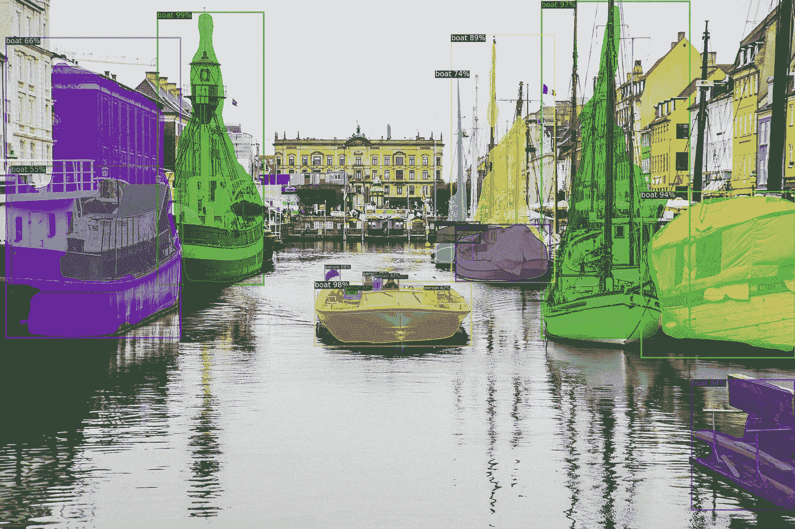
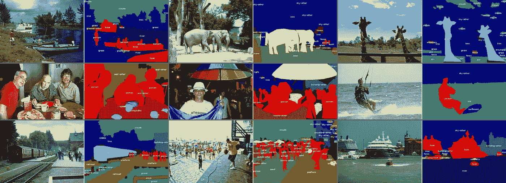
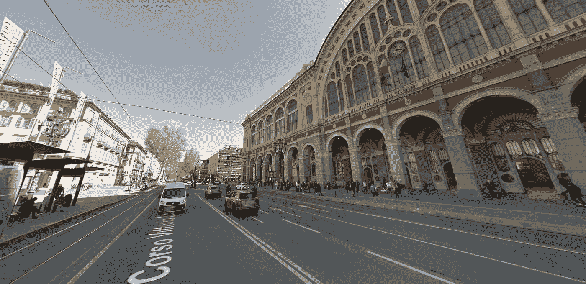
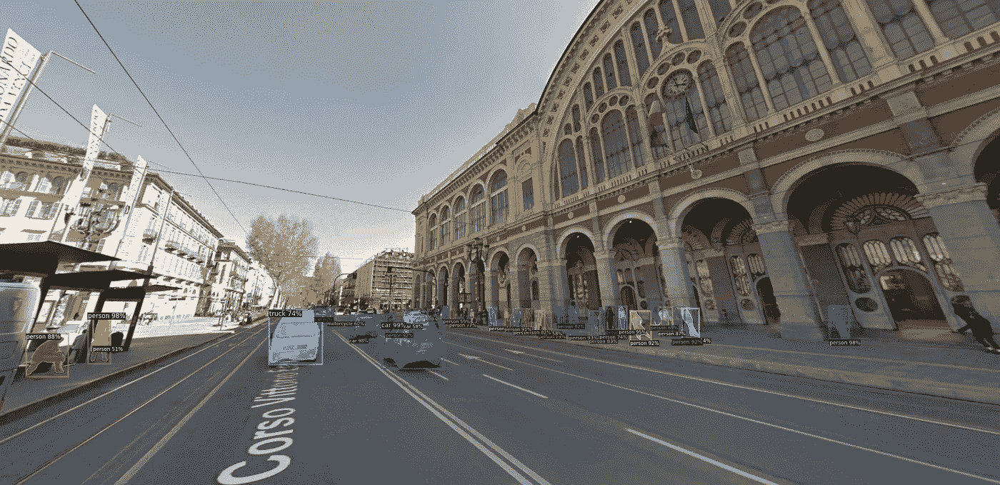

# 如何开始使用脸书检测器 2

> 原文：<https://towardsdatascience.com/a-beginners-guide-to-object-detection-and-computer-vision-with-facebook-s-detectron2-700b6273390e?source=collection_archive---------12----------------------->

> 在许多不同的物体探测技术中，脸书提出了它的模型:探测器 2。这种模型与 Yolo 模型类似，能够围绕对象绘制边界框，并通过全景分割模型进行推理，换句话说，它不是围绕对象绘制一个框，而是“包裹”对象边界的真实边界(可以将其视为 photoshop 的智能剪切工具)。)



行动中的探测器 2(原始图像由[尼克·卡沃尼斯](https://stocksnap.io/author/15899)拍摄)

# 介绍

本指南的目的是展示如何轻松实现预训练的 Detectron2 模型，能够识别来自 [COCO](http://cocodataset.org/#home) (上下文中的公共对象)数据集中的类所代表的对象。本指南旨在为计算机视觉初学者提供一个起点，旨在解释实现预训练模型的第一步是什么，其最终目标是激发您学习更多内容的兴趣，并在这个势不可挡的领域安排您的想法。我提供了一个 [Google Colab 笔记本](http://bit.ly/39cEy2C),你可以随意克隆和使用，也可以**跟进和编码！**



可可数据集一瞥(来源:[https://github.com/nightrome/cocostuff](https://github.com/nightrome/cocostuff))

# 安装依赖项

要开始使用，必须安装其核心依赖项:

*   PyTorch
*   Cython
*   检测器 2
*   OpenCV

这些任务可能需要几分钟，因为你需要一个 GPU 来运行这个笔记本，我建议你克隆我的 Colab 笔记本，并从 Google Colab 编写所有内容，这也将帮助你对命令行片段和云中的文件管理更加自信！

```
!pip install -U torch==1.4+cu100 torchvision==0.5+cu100 -f [https://download.pytorch.org/whl/torch_stable.html](https://download.pytorch.org/whl/torch_stable.html)!pip install cython pyyaml==5.1!pip install -U ‘git+https://github.com/cocodataset/cocoapi.git#subdirectory=PythonAPI'!git clone [https://github.com/facebookresearch/detectron2](https://github.com/facebookresearch/detectron2) detectron2_repo!pip install -e detectron2_repo#!pip install opencv-python Google Colab already comes with OpenCV
```

# 导入库和所需的文件

一旦安装了这些依赖项，您很可能需要重启您的运行时/内核。现在，我们需要导入一些我们需要导入、处理和推断预测的库，其中包括我们已有的库……

由于我使用的是 Google Colab，功能`cv2.imshow()`不可用，如果你在本地机器上运行这个笔记本，我需要使用一个“补丁”版本来摆脱它。

```
# import some common librariesimport numpy as npimport cv2import randomfrom google.colab.patches import cv2_imshow # On your local machine you don’t need it.# import some common detectron2 utilitiesfrom detectron2 import model_zoofrom detectron2.engine import DefaultPredictorfrom detectron2.config import get_cfgfrom detectron2.utils.visualizer import Visualizerfrom detectron2.data import MetadataCatalog
```

在本指南中，我使用了我的 google drive 中的一个图像，您可以安装您的 Google Drive 并使用您选择的图像:

```
from google.colab import drivedrive.mount(‘/content/drive’)
```

现在让我们得到一张我们想要运行模型的图片:

```
im = cv2.imread(“./drive/My Drive/turin.png”)cv2_imshow(im)
```



图片来自我的谷歌硬盘(来源:谷歌街景)

# 拟合模型

一旦我们的图像被加载，我们需要加载我们的模型和一点配置。首先，我们从 Detectron 加载配置，然后我们对其应用来自`COCO-InstanceSegmentation/mask_rcnn_R_50_FPN_3x.yaml`的自定义配置。然后设置阈值，因此检测对象时模型的灵敏度(玩这些参数！).下一步是加载与该模型相关的检查点，换句话说，就是以`.pkl`格式加载模型本身。下一步是实例化模型本身，像在 scikit 中一样思考——例如，当您想要进行回归时，学习:

`reg = LinearRegression()` `reg.fit(X, y)` `reg.predict(X_test)`然而，我们没有将数组`X_train`传递给我们的预测器，而是传递我们的图像，该图像也对应于一个数组(准确地说是一个 3D 数组:一个轴代表宽度，另一个轴代表高度，最后一个轴代表图像的颜色)。

我们使用预训练模型而不是训练我们的模型的原因可以通过描述文件 [detectron2/MODEL_ZOO](https://github.com/facebookresearch/detectron2/blob/master/MODEL_ZOO.md) 的前两行来解释:

> “该文件记录了 2019 年 9 月至 10 月用 detectron2 训练的大量基线。所有数字都是在带有 8 个 NVIDIA V100 GPUs 和 NVLink 的大盆地服务器上获得的。使用的软件是 PyTorch 1.3、CUDA 9.2、cuDNN 7.4.2 或 7.6.3。”。

然而，当然，你可以使用一个基线模型来进一步训练它识别一个特定的物体，这个过程被称为**转移**学习。

```
cfg = get_cfg()cfg.merge_from_file(model_zoo.get_config_file(“COCO-InstanceSegmentation/mask_rcnn_R_50_FPN_3x.yaml”))cfg.MODEL.ROI_HEADS.SCORE_THRESH_TEST = 0.5 # set threshold for this modelcfg.MODEL.WEIGHTS = model_zoo.get_checkpoint_url(“COCO-InstanceSegmentation/mask_rcnn_R_50_FPN_3x.yaml”)predictor = DefaultPredictor(cfg)outputs = predictor(im)
```

如果我们检查由模型生成的`outputs`，我们会看到一个**大规模的**字典(请参考 Colab 笔记本)，这个字典包含检测到的对象的数量(`num_instances`)、关于图像的信息和应该绘制框的图像的坐标，以及每个框(实例)的标签(`pred_classes`)。让我们看看第一个盒子:

`[1314.3333, 485.8268, 1345.7896, 539.3832]`

有 4 个值，每个值分别代表矩形的 x、y、宽度和高度。(有时，在 OpenCV 中，当迭代检测到的对象时，你会做一个类似于`for x, y, w, h in ...`的循环)

# 获取输出图像

现在，我们可以可视化图像以及显示图像中预测对象的方框，为了实现这一点，我们必须使用一个特定的对象，让我们将预测与原始图像合并，这个对象称为`Visualizer`，一旦用我们的图像和元数据实例化了`Visualizer`，我们就可以调用带有`outputs`作为参数的`draw_instance_predictions`方法:

```
v = Visualizer(im, MetadataCatalog.get(cfg.DATASETS.TRAIN[0]), scale=1.5) # Scaling the image 1.5 times, for big images consider a value below 0v = v.draw_instance_predictions(outputs[“instances”].to(“cpu”))cv2_imshow(v.get_image())
```



最终图像，带有识别检测到的“对象”的绘制框

# 现在去哪里？

计算机视觉是一个存在学习障碍的领域，也有一些进入障碍:通常很难获得特定的硬件，一个模型可能需要几个小时的训练，我们的小型笔记本电脑经常会死机，因此很难遵循“经典”的试错学习路径，也许我们在破解 scikit-learn 时尝试一些机器学习算法时会遵循这一路径！

既然(希望)你现在对工作流程有了一个基本的概念，从如何导入图像到如何显示图像，只要如何从 detectron2 库中加载模型，下一步可能是尝试重新训练它，使用(我建议)一些云提供商，可以是 Google Colab，Paperspace Gradient，Azure Notebooks 或任何其他东西。另一个很好的前进步骤可能是尝试实现探测器 2“对手” [Yolo](https://pjreddie.com/darknet/yolo/) ，也许[使用 CoreMLtools 在 iOS 应用程序中实现它](https://github.com/Ma-Dan/YOLOv3-CoreML)。

```
**I have a newsletter 📩.**Every week I’ll send you a brief findings of articles, links, tutorials, and cool things that caught my attention. If tis sounds cool to you subscribe.*That means* ***a lot*** *for me.*
```

 [## 米尔斯形式

### 编辑描述

无情-创造者-2481.ck.page](https://relentless-creator-2481.ck.page/68d9def351)