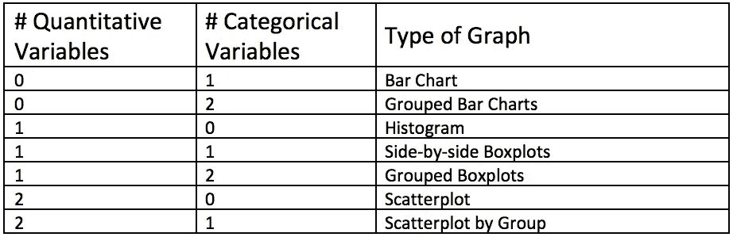
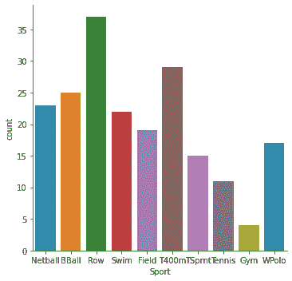
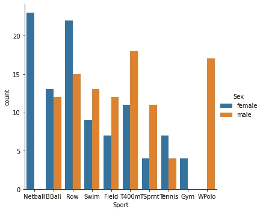
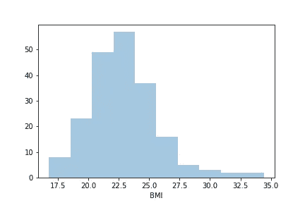
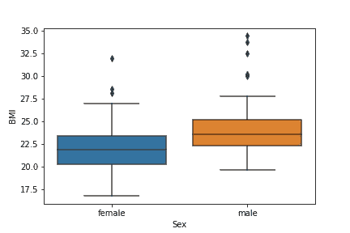
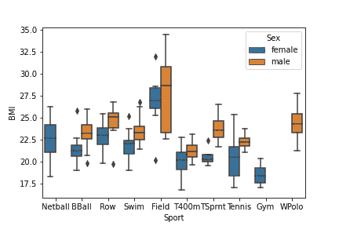
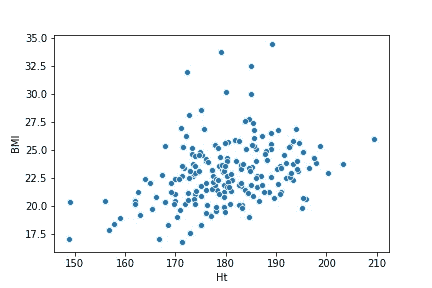
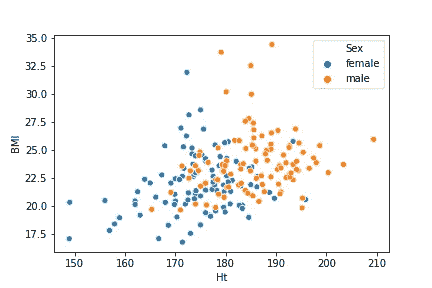

# 绘制数据的初学者指南(Python & R)

> 原文：<https://towardsdatascience.com/a-beginners-guide-to-plotting-your-data-python-r-11e435262ac1?source=collection_archive---------32----------------------->

## 为您的特征变量选择正确的图表

当分析数据时，比如说，确定您希望使用的回归类型时，首先弄清楚您实际拥有的数据类型是很重要的。事实上，在进行任何形式的分析之前，我们都应该进行数据探索，因为这可以节省我们以后的大量工作。例如，我们可能意外地选择了错误的回归模型，因为变量 1 和变量 5 之间存在不可预见的相互作用，如果我们事先仔细查看我们的数据，这是可以避免的。数据分析在很大程度上取决于您的特征变量类型、它们是如何分布的、它们是如何相互关联的，等等。

# 定量变量与分类变量

在进行任何数据分析之前，我们必须首先区分定量和定性/分类变量。

数量变量是可以测量的变量，它们用数字表示。另一方面，分类变量是描述性的，通常采用名称或标签等值。定性数据可以根据相似的特征进行分组，因此是分类的。

# 选择正确的图表



图形选择摘要

所有提到的图形都可以很容易地用 Python 和 Seaborn 库(如果愿意，也可以用 Matplotlib)绘制，或者用 R 和 ggplot 绘制。

我们必须首先将数据作为数据帧加载到 Python 中。在这里，我从同一个目录中的 csv 文件加载它。

```
import pandas as pd
import seaborn as snsdata = pd.read_csv("filename.csv", sep=" ", header="infer")
```

或者将其作为数据帧加载到 R 中。

```
library(tidyverse)data <- read_csv("filename.csv")
```

## 条形图

如果您希望可视化单个分类变量，您应该使用条形图，其中 x 轴是变量，y 轴是计数轴。



在 Python 中:

```
sns.catplot(x = "categorical var", kind = "count", data = data)
```

在 R 中:

```
ggplot(data, aes(x = categorical var)) + geom_bar()
```

## 分组条形图

如果我们有两个分类变量，我们将进行分组条形图。这是按第二个分类变量分组的，通常是分类较少的那个。



在 Python 中:

```
sns.catplot(x = "categorical var1", hue = "categorical var2", kind = "count", data = data)
```

在 R 中:

```
ggplot(data, aes(x = categorical var1, fill = categorical var2)) + geom_bar(position = "dodge")
```

## 柱状图

直方图对于可视化定量变量非常有用。这里，我们希望确保选择适当数量的箱来最好地表示数据。这个数字很容易根据过去的经验来选择，可以摆弄箱的数量，或者使用一个客观的箱选择公式，如斯特奇斯规则。



在 Python 中:

```
sns.distplot(data["quantitative var"], bins = 10, kde = False) 
```

在 R 中:

```
ggplot(data, aes(x = quantitative var)) + geom_histogram(bins = 10)
```

## 并排箱线图

当我们有一个定量变量和一个定性变量时，我们将使用并排箱线图来最好地展示数据。



在 Python 中:

```
sns.boxplot(x = "categorical var", y = "quantitative var", data = data)
```

在 R 中:

```
ggplot(data, aes(x = categorical var, y = quantitative var)) + geom_boxplot()
```

## 分组箱线图

当我们有两个分类变量和一个定量变量时，使用分组箱线图。让分组在具有较少组的分类变量上完成。



在 Python 中:

```
sns.boxplot(x = "categorical var1", y = "quantitative var", hue = "categorical var2", data = data)
```

在 R 中:

```
ggplot(data, aes(x = categorical var1, y = quantitative var, fill = categorical var2)) + geom_boxplot()
```

## 散点图

需要散点图来显示一个量化变量与另一个量化变量之间的关系。这在评估定量特征变量/解释变量和定量响应变量之间存在的关系类型时非常常见，其中 y 轴始终代表响应变量。



在 Python 中:

```
sns.scatterplot(x = "explanatory variable", y = "response variable", data = data)
```

在 R 中:

```
ggplot(data, aes(x = explanatory variable, y = response variable)) + geom_point()
```

## 分组散点图

如果我们试图可视化两个定量变量和一个分类变量，我们将使用散点图，散点图中的点按分类变量分组。



在 Python 中:

```
sns.scatterplot(x = "explanatory variable", y = "response variable", hue = "categorical var", data = data)
```

在 R 中:

```
ggplot(data, aes(x = explanatory variable, y = response variable, color = categorical var)) + geom_point()
```