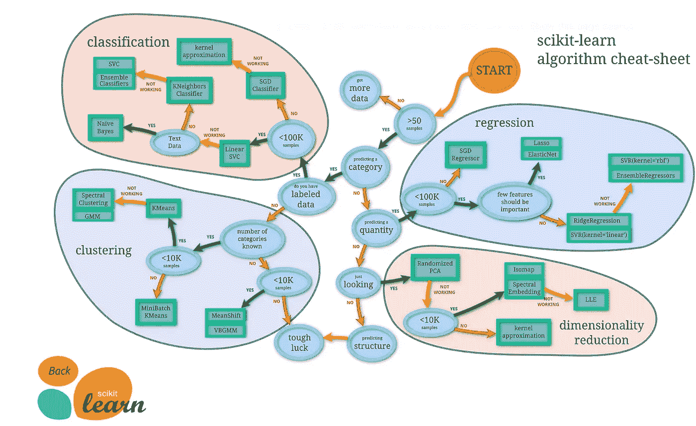
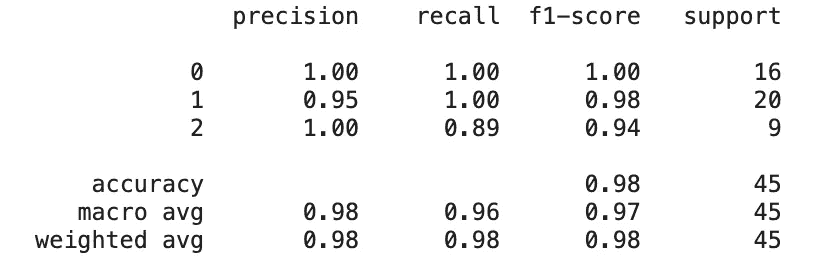
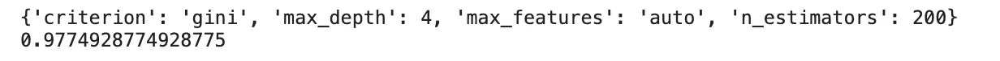

# Scikit 初学者指南-学习

> 原文：<https://towardsdatascience.com/a-beginners-guide-to-scikit-learn-14b7e51d71a4?source=collection_archive---------7----------------------->

## [入门](https://towardsdatascience.com/tagged/getting-started)

## 开始使用排名第一的 python 机器学习库


照片由[克莱门特 H](https://unsplash.com/@clemhlrdt?utm_source=unsplash&utm_medium=referral&utm_content=creditCopyText) 在 [Unsplash](https://unsplash.com/s/photos/code?utm_source=unsplash&utm_medium=referral&utm_content=creditCopyText) 上拍摄

Scikit-learn ，最初是作为 2007 年谷歌代码之夏项目开发的，现在被广泛认为是最受欢迎的机器学习 Python 库。

这个库被视为机器学习项目的最佳选择之一，尤其是在生产系统中，原因有很多。这些包括但不限于以下内容。

*   它对库的开发有高级别的支持和严格的管理，这意味着它是一个非常健壮的工具。
*   有一个清晰、一致的代码风格，确保您的机器学习代码易于理解和可复制，同时也大大降低了编写机器学习模型的门槛。
*   它受到第三方工具的广泛支持，因此可以丰富功能以适应各种用例。

如果你正在学习机器学习，那么 Scikit-learn 可能是最好的入门库。它的简单性意味着它相当容易掌握，通过学习如何使用它，你也将很好地掌握典型的机器学习工作流程中的关键步骤。

下面的文章是对该工具的初学者友好的介绍，应该给你足够的理解，能够开发一个简单的机器学习模型。

要安装最新版本的 Scikit-learn，请运行以下命令。

```
pip install scikit-learn
```

本文中的代码示例都是在经典的 [wine 数据集](https://scikit-learn.org/stable/modules/generated/sklearn.datasets.load_wine.html)上运行的，该数据集可以直接从 Scikit-learn API 导入。

# 评估者

Scitkit-learn 库提供了非常多种预构建的算法来执行有监督和无监督的机器学习。他们通常被称为**估计器**。

您为项目选择的评估者将取决于您拥有的数据集和您试图解决的问题。Scikit-learn 文档提供了下图，帮助您确定哪种算法适合您的任务。



来源: [Scikit-learn 文档](https://scikit-learn.org/stable/tutorial/machine_learning_map/index.html)

Scikit-learn 之所以如此易于使用，是因为不管您使用的是什么模型或算法，用于模型训练和预测的代码结构都是相同的。

为了说明这一点，我们来看一个例子。

假设您正在处理一个回归问题，并希望训练一个线性回归算法，并使用生成的模型进行预测。使用 Scikit-learn 的第一步是调用[逻辑回归估计器](https://scikit-learn.org/stable/modules/generated/sklearn.linear_model.LogisticRegression.html)，并将其保存为一个对象。下面的例子调用算法并将其保存为一个名为 **lr** 的对象。

下一步是使模型符合一些训练数据。这是使用 **fit()** 方法完成的。我们在特性和目标数据上调用`**lr.fit()**`，并将结果模型保存为一个名为**模型**的对象。在下面的例子中，我也使用了`**train_test_split()**`方法将数据集分成测试和训练数据。

接下来，我们使用该模型和 **predict()** 方法来预测之前未见过的数据。

如果我们现在使用 Scitkit-learn 来执行不同的任务，比方说，我们想要训练一个随机森林分类器。代码看起来非常相似，并且有相同的步骤数。

这种一致的代码结构使得开发机器学习模型非常直接，并且还产生了高度可读和可再现的代码。

# 预处理

在大多数现实世界的机器学习项目中，您使用的数据不一定准备好训练模型。很可能首先需要执行一些数据预处理和转换步骤，例如处理缺失值、将分类数据转换为数值或应用要素缩放。

Scikit-learn 具有执行这些预处理步骤的内置方法。例如，**simple imputr()**使用您选择的方法来填充缺失值。

Scikit-learn 文档在这里列出了数据预处理的全部选项[。](https://scikit-learn.org/stable/modules/preprocessing.html)

# 估价

一旦一个模型被训练好了，你就需要衡量这个模型对新数据的预测能力。这一步被称为模型评估，您选择的度量标准将由您试图解决的任务决定。例如，通常在回归问题中，你可能选择 RMSE，而对于分类，你可能选择 F1 分数。

所有估计器都包括一个 **score()** 方法，该方法返回一个与它们执行的机器学习任务最相关的默认度量。

Scikit-learn 另外还有一组**度量函数**，为模型提供更详细的评估。例如，对于分类任务，库有一个分类报告，它提供精确度、召回率、F1 分数和总体准确度。

分类报告代码和输出如下所示。



# 模型优化

Scikit-learn 库中的所有估计器都包含一系列参数，这些参数有多个选项。您为特定算法选择的值将影响最终模型的性能。例如，使用 RandomForestClassifier，您可以将树的 max_depth 设置为任何值，根据您的数据和任务，此参数的不同值将产生不同的结果。

这个尝试不同参数组合以找到最佳组合的过程被称为**超参数优化**。

Scikit-learn 提供了两个工具来自动执行这项任务， **GridSearchCV** 实现了一种称为[穷举网格搜索](https://www.oreilly.com/library/view/mastering-predictive-analytics/9781789617740/231cc752-8164-4248-9557-26d1adb4623a.xhtml)的技术，以及 **RandomizedSearchCV** 执行[随机化参数优化](https://www.jmlr.org/papers/volume13/bergstra12a/bergstra12a.pdf)。

以下示例使用 GridSearchCV 来查找 RandomForestClassifier 的最佳参数。输出显示在代码下方。



# 管道

Scikit-learn 包以**管道**的形式提供了更方便的代码封装形式。该工具将所有预处理任务与分类器步骤链接在一起，因此只需在单个管道对象上调用 fit()或 predict()即可执行工作流中的所有步骤。

这有助于提高代码的可读性，并减少机器学习工作流程中的重复步骤。

要创建管道，我们首先在下面的代码中定义我称为管道的对象中的步骤。然后我们可以简单地在这个对象上调用 fit 来训练模型。管道对象还可以用于对新数据进行预测。

如果您喜欢这篇文章，并想进一步探索 Scikit-learn 库，您可能会喜欢阅读下面显示的我的早期帖子。

[](https://medium.com/vickdata/a-simple-guide-to-scikit-learn-pipelines-4ac0d974bdcf) [## Scikit-learn 管道简单指南

### 了解如何在 scikit-learn 机器学习工作流中使用管道

medium.com](https://medium.com/vickdata/a-simple-guide-to-scikit-learn-pipelines-4ac0d974bdcf) [](/10-things-you-didnt-know-about-scikit-learn-cccc94c50e4f) [## 关于 Scikit 你不知道的 10 件事-了解

### …直到现在

towardsdatascience.com](/10-things-you-didnt-know-about-scikit-learn-cccc94c50e4f) 

感谢阅读！

我每月都会发一份简讯，如果你想加入，请点击此链接注册。期待成为您学习旅程的一部分！