# Python 情感分析初学者指南

> 原文：<https://towardsdatascience.com/a-beginners-guide-to-sentiment-analysis-in-python-95e354ea84f6?source=collection_archive---------0----------------------->

## 关于使用文本数据构建单词云、漂亮的可视化和机器学习模型的端到端指南。


照片由来自 StockSnap 的 Ryan McGuire 拍摄

# 什么是情感分析？

情感分析是一种检测一段文本中潜在情感的技术。

它是将文本分类为*阳性、阴性、*或*中性的过程。*机器学习技术用于评估一段文本，并确定其背后的情感。

# 情感分析为什么有用？

情感分析对于企业评估客户反应至关重要。

***想象一下这个*** :你的公司刚刚发布了一款新产品，正在多个不同的渠道做广告。

为了衡量客户对此产品的反应，可以进行情感分析。

客户通常会在社交媒体和客户反馈论坛上谈论产品。可以收集和分析这些数据，以评估客户的总体反应。

更进一步，还可以检查数据的趋势。例如，某个年龄组和人口统计的客户可能对某个产品的反应比其他产品更积极。

根据收集到的信息，公司可以对产品进行不同的定位，或者改变他们的目标受众。

# 分析

在本文中，我将引导您完成对大量数据执行情感分析的端到端过程。

我们将使用 Kaggle 的**亚马逊美食评论数据集**中的[*Reviews . CSV*](https://www.kaggle.com/snap/amazon-fine-food-reviews?select=Reviews.csv)*文件来执行分析。*

*我使用 Jupyter 笔记本进行所有的分析和可视化，但是任何 Python IDE 都可以完成这项工作。*

## *步骤 1:读取数据帧*

```
*import pandas as pd
df = pd.read_csv('Reviews.csv')
df.head()*
```

*检查数据帧的头部:*

*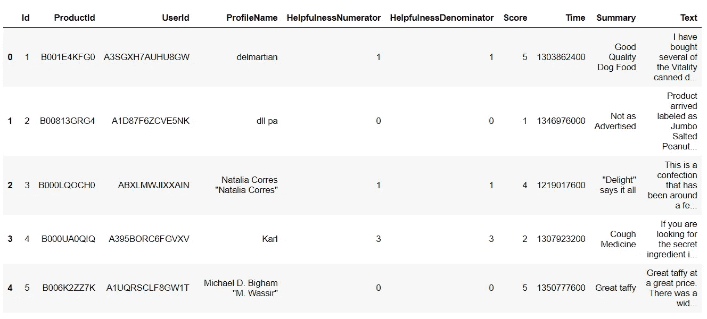*

*我们可以看到数据帧包含一些产品、用户和评论信息。*

*我们在此分析中最常用的数据是“*摘要”、“T17”、“T18”文本、“T19”和“T20”分数**

****文本*** —该变量包含完整的产品评论信息。*

****总结*** —这是整个复习的总结。*

****评分—*** 客户提供的产品评分。*

## *第二步:数据分析*

*现在，我们来看看变量“*得分*”，看看大多数客户评级是正面还是负面。*

*为此，你必须先[安装*库*](https://plotly.com/python/getting-started/)*。**

```
**# Importsimport matplotlib.pyplot as plt
import seaborn as sns
color = sns.color_palette()
%matplotlib inline
import plotly.offline as py
py.init_notebook_mode(connected=True)
import plotly.graph_objs as go
import plotly.tools as tls
import plotly.express as px# Product Scoresfig = px.histogram(df, x="Score")
fig.update_traces(marker_color="turquoise",marker_line_color='rgb(8,48,107)',
                  marker_line_width=1.5)
fig.update_layout(title_text='Product Score')
fig.show()**
```

**结果图如下所示:**

**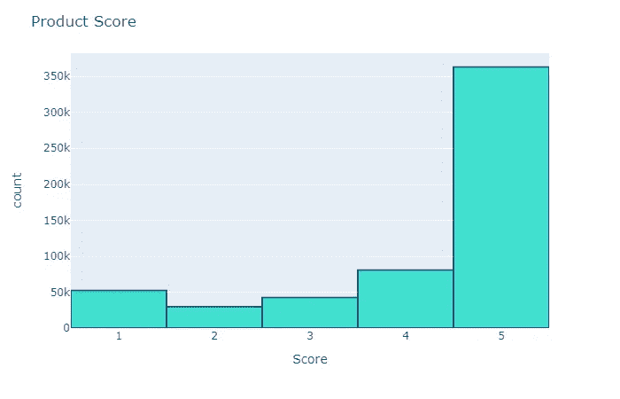**

**从这里，我们可以看到大多数客户的评价是积极的。这让我相信大多数评论也会是非常正面的，这将在一段时间内进行分析。**

**现在，我们可以创建一些 ***词云*** 来查看评论中最常用的词。**

```
**import nltk
from nltk.corpus import stopwords# Create stopword list:
stopwords = set(STOPWORDS)
stopwords.update(["br", "href"])
textt = " ".join(review for review in df.Text)
wordcloud = WordCloud(stopwords=stopwords).generate(textt)plt.imshow(wordcloud, interpolation='bilinear')
plt.axis("off")
plt.savefig('wordcloud11.png')
plt.show()**
```

**运行上面的代码会生成一个单词云，如下所示:**

**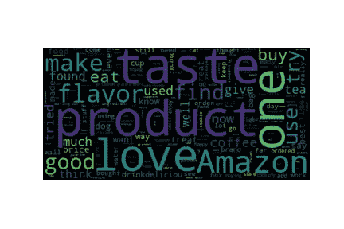**

**这里可以观察到的一些流行词有“*品味*、“*产品*、“*爱情*、“*亚马逊*”这些词大多是积极的，也表明数据集中的大多数评论表达了积极的情绪。**

## **第三步:分类推文**

**在这一步中，我们将评论分为“正面”和“负面”，因此我们可以将此用作情感分类模型的训练数据。**

**正面评价将被归类为+1，负面评价将被归类为-1。**

**我们会将所有‘得分’> 3 的评论归类为+1，表示它们是正面的。**

**所有带“分数”的评论< 3 will be classified as -1\. Reviews with ‘Score’ = 3 will be dropped, because they are neutral. Our model will only classify positive and negative reviews.**

```
**# assign reviews with score > 3 as positive sentiment
# score < 3 negative sentiment
# remove score = 3df = df[df['Score'] != 3]
df['sentiment'] = df['Score'].apply(lambda rating : +1 if rating > 3 else -1)**
```

**Looking at the head of the data frame now, we can see a new column called ‘sentiment:’**

**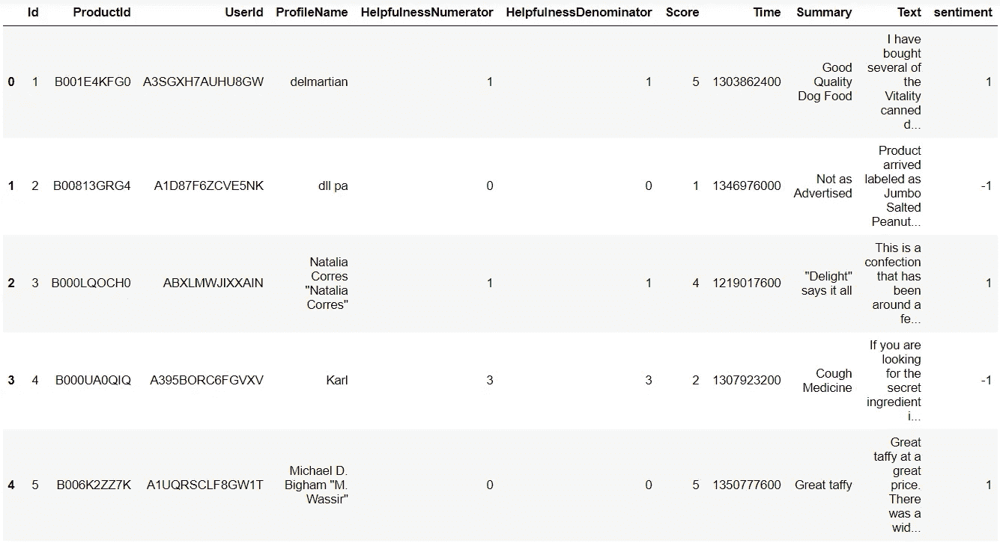**

## **Step 4: More Data Analysis**

**Now that we have classified tweets into positive and negative, let’s build wordclouds for each!**

**First, we will create two data frames — one with all the positive reviews, and another with all the negative reviews.**

```
**# split df - positive and negative sentiment:positive = df[df['sentiment'] == 1]
negative = df[df['sentiment'] == -1]**
```

*****文字云—正面情绪*****

```
**stopwords = set(STOPWORDS)
stopwords.update(["br", "href","good","great"]) ## good and great removed because they were included in negative sentimentpos = " ".join(review for review in positive.Summary)
wordcloud2 = WordCloud(stopwords=stopwords).generate(pos)plt.imshow(wordcloud2, interpolation='bilinear')
plt.axis("off")
plt.show()**
```

**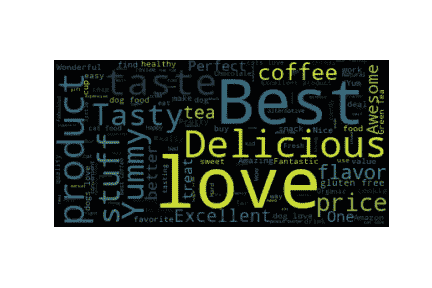**

*****Wordcloud —负面情绪*****

```
**neg = " ".join(review for review in negative.Summary)
wordcloud3 = WordCloud(stopwords=stopwords).generate(neg)plt.imshow(wordcloud3, interpolation='bilinear')
plt.axis("off")
plt.savefig('wordcloud33.png')
plt.show()**
```

**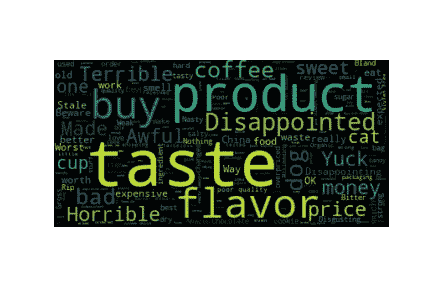**

**如上所见，积极情绪词云中充满了积极的词语，如“****。******

**《负面情绪词云》中充斥的大多是负面词，如“*，“以及“**”。*****

**“*”和“*”这两个词最初出现在负面情绪词云中，尽管是正面词。这可能是因为它们被用在了否定的语境中，比如“ ***不好*** ”正因如此，我把那两个字从单词 cloud 里去掉了。****

**最后，我们可以看看评论在整个数据集中的分布情况:**

```
**df['sentimentt'] = df['sentiment'].replace({-1 : 'negative'})
df['sentimentt'] = df['sentimentt'].replace({1 : 'positive'})
fig = px.histogram(df, x="sentimentt")
fig.update_traces(marker_color="indianred",marker_line_color='rgb(8,48,107)',
                  marker_line_width=1.5)
fig.update_layout(title_text='Product Sentiment')
fig.show()**
```

**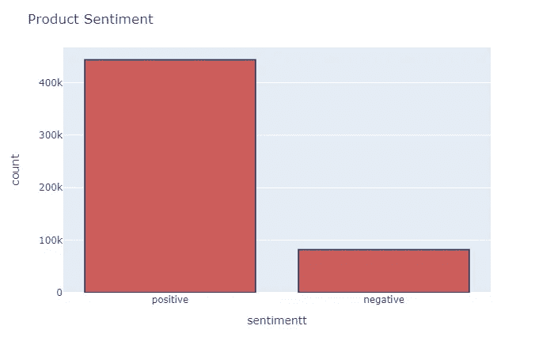**

## **步骤 5:构建模型**

**最后，我们可以建立情感分析模型！**

**这个模型将把评论作为输入。然后它会给出一个关于评论是正面还是负面的预测。**

**这是一个分类任务，因此我们将训练一个简单的逻辑回归模型来完成它。**

**作为参考，再看一下数据框:**

**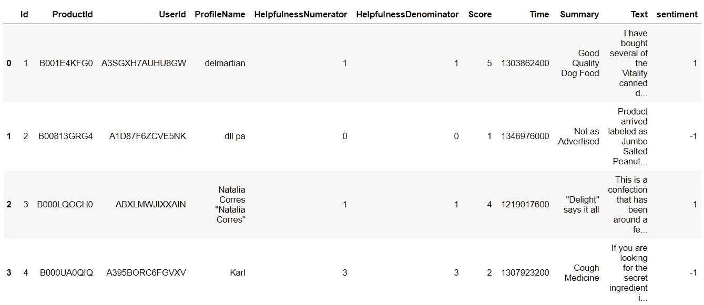**

**我们需要采取几个步骤:**

*   *****数据清理*****

**我们将使用汇总数据进行预测。首先，我们需要删除数据中的所有标点符号。**

```
**def remove_punctuation(text):
    final = "".join(u for u in text if u not in ("?", ".", ";", ":",  "!",'"'))
    return finaldf['Text'] = df['Text'].apply(remove_punctuation)
df = df.dropna(subset=['Summary'])
df['Summary'] = df['Summary'].apply(remove_punctuation)**
```

*   *****分割数据帧*****

**新的数据框应该只有两列—“*摘要*”(评审文本数据)和“*情绪*”(目标变量)。**

```
**dfNew = df[['Summary','sentiment']]
dfNew.head()**
```

**看一下新数据帧的头部，这是它现在将包含的数据:**

**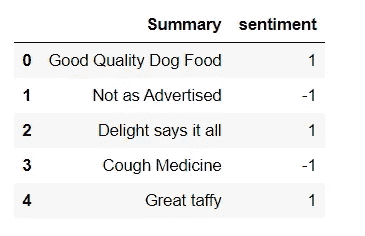**

**我们现在将把数据帧分成训练集和测试集。80%的数据将用于训练，20%将用于测试。**

```
**# random split train and test dataindex = df.index
df['random_number'] = np.random.randn(len(index))train = df[df['random_number'] <= 0.8]
test = df[df['random_number'] > 0.8]**
```

*   *****创造一袋文字*****

**接下来，我们将使用 Scikit-learn 库中的计数矢量器。**

**这将把我们的数据框中的文本转换成一个单词包模型，它将包含一个整数的稀疏矩阵。每个单词出现的次数将被计算并打印出来。**

**我们需要将文本转换成单词袋模型，因为逻辑回归算法不能理解文本。**

```
**# count vectorizer:from sklearn.feature_extraction.text import CountVectorizervectorizer = CountVectorizer(token_pattern=r'\b\w+\b')train_matrix = vectorizer.fit_transform(train['Summary'])
test_matrix = vectorizer.transform(test['Summary'])**
```

*   *****导入逻辑回归*****

```
**# Logistic Regressionfrom sklearn.linear_model import LogisticRegression
lr = LogisticRegression()**
```

*   *****分割目标和自变量*****

```
**X_train = train_matrix
X_test = test_matrix
y_train = train['sentiment']
y_test = test['sentiment']**
```

*   *****拟合模型上的数据*****

```
**lr.fit(X_train,y_train)**
```

*   *****做出预测*****

```
**predictions = lr.predict(X_test)**
```

**我们成功地建立了一个简单的逻辑回归模型，并对数据进行了训练。我们还使用该模型进行了预测。**

## **第六步:测试**

**现在，我们可以测试模型的准确性了！**

```
**# find accuracy, precision, recall:from sklearn.metrics import confusion_matrix,classification_report
new = np.asarray(y_test)
confusion_matrix(predictions,y_test)**
```

**你会得到一个类似这样的混淆矩阵:**

**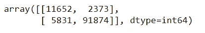**

```
**print(classification_report(predictions,y_test))**
```

**分类报告:**

**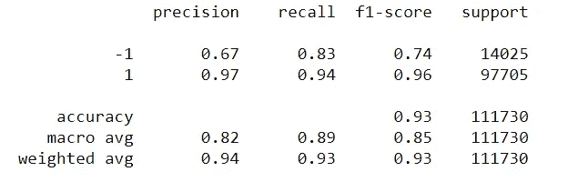**

**该模型在测试数据上的总体准确率约为 93%，考虑到我们没有进行任何特征提取或大量预处理，这已经相当不错了。**

**还有…就是这样！**

**我希望你能从这篇教程中学到一些有用的东西。在这之后，你可以尝试的一个很好的练习是在你的分类任务中包括所有三种情绪——*积极、消极*和*中立。***

**感谢阅读，记住— ***永远不要停止学习！*****

> **世界是一所大学，里面的每个人都是老师。确保你早上醒来时，你去上学。**