# 用 Python 模拟动态系统的初学者指南

> 原文：<https://towardsdatascience.com/a-beginners-guide-to-simulating-dynamical-systems-with-python-a29bc27ad9b1?source=collection_archive---------5----------------------->

## Python 中数字积分微分方程

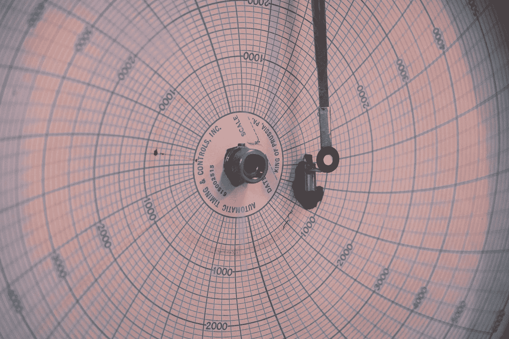

丹·梅耶斯在 [Unsplash](https://unsplash.com?utm_source=medium&utm_medium=referral) 上的照片

考虑单摆。

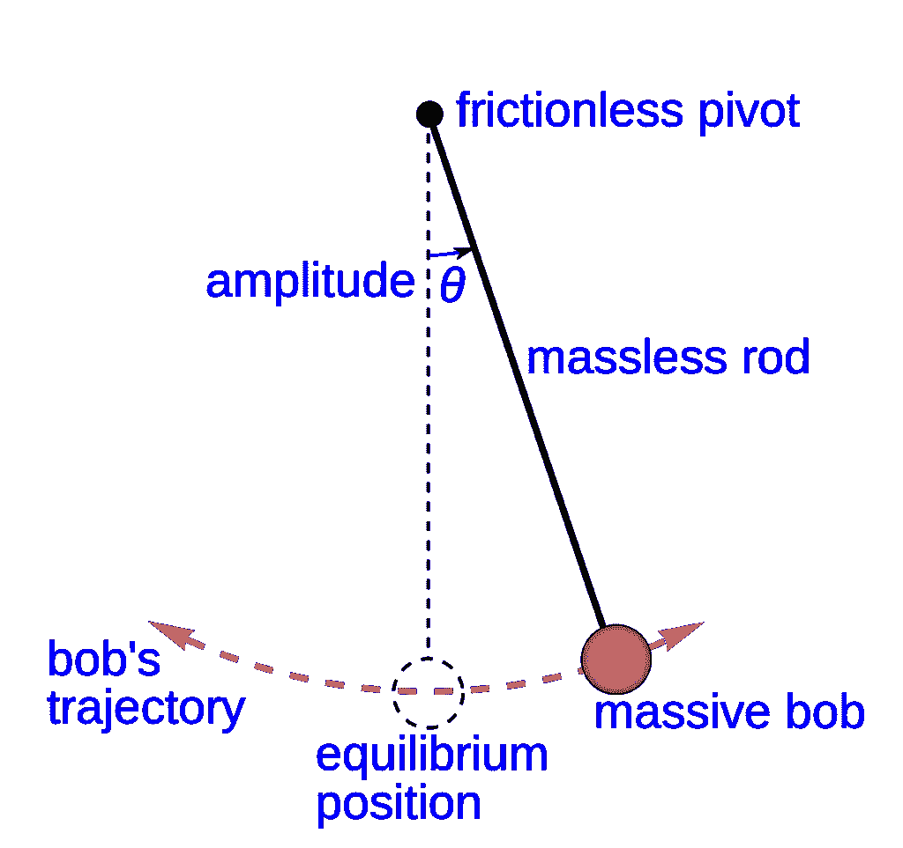

我们有一个质量为 m 的物体，挂在一根长度为 L 的绳子上，绳子来回摆动。

这基本上是我们能使用的最简单的系统。但是不要让这种简单欺骗了你，它可以创造一些有趣的动态。我们将以此为起点，介绍一些控制理论，并将其与连续控制强化学习进行比较。在此之前，我们需要花一些时间来了解系统的动态以及如何模拟它！

# TL；速度三角形定位法(dead reckoning)

我们推导了质量和摆系统的动力学，并使用 Python 的一个集成包和使用欧拉方法建立了两个独立的仿真模型。这为更复杂的系统提供了一个很好的垫脚石；机器人控制中的许多关节和系统甚至可以建模为链接在一起的钟摆。

你也可以在这里查看[的原始帖子](https://www.datahubbs.com/simulating-dynamical-systems-with-python/)，这里的方程格式比 Medium 允许的要好得多。

# 挥杆动力学

如果我们想模拟这个系统，我们需要了解动力学。首先，我们将绘制一个单摆的自由体图(FBD ),其中显示了长度、质量、重力和作用在系统上的力矢量。

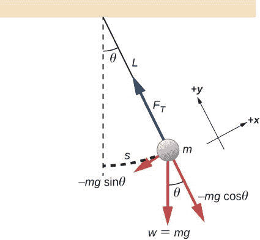

单摆的自由体图。

画 FBD 有助于明确所有的力，以确保我们不会错过任何东西。一旦我们有了这个，我们就可以用牛顿第二运动定律来得到动力学。你可能熟悉 F=ma 的形式，但是我们将对[旋转运动](https://brilliant.org/wiki/rotational-form-of-newtons-second-law/)稍微修改一下，写成:

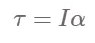

在这种情况下，τ是关于原点的力矩，III 是转动惯量，α是角加速度。力矩由施加在质量上的力的垂直分量给出(关于原点的力矩)，转动惯量正好是 I=mL，角加速度是θ的二阶时间导数。我们可以将这些值代入上面的牛顿第二定律，我们得到:

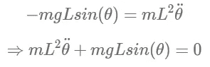

为了完整起见，我们还可以考虑摆上的摩擦力，这样我们可以得到:

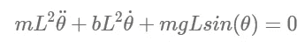

首先要注意的是，由于方程中的二阶导数(θ),我们手上有一个二阶常微分方程。我们想把这个简化为一阶系统来积分模拟。这是以复杂性为代价的，因为我们将把一个二阶系统分解成两个一阶方程。在这种情况下，成本相对较小，但对于更复杂的模型(我们将在以后的文章中讨论)，这可能会变得非常棘手。

为此，我们需要引入两个新变量，我们称之为θ_1 和θ_2，定义如下:

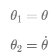

这很有帮助，因为我们现在可以说θ2 =θ，并降低了方程的阶数。

现在，我们有:

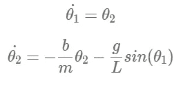

有了我们的方程，让我们转向建模的代码。

# 模拟钟摆动力学

首先导入相关的库。

```
import numpy as np
from scipy import integrate
import matplotlib.pyplot as plt
```

我们需要设定一些价值观。让质量和长度分别为 1 kg 和 1 m，至少现在，我们将通过设置 b=0 忽略摩擦力。我们将模拟钟摆从π/2(向右提升 90 度)开始摆动，并在没有初始速度的情况下释放。我们可以用 0.02 秒的时间离散化(δt)对此进行 10 秒的模拟。

```
# Input constants 
m = 1 # mass (kg)
L = 1 # length (m)
b = 0 # damping value (kg/m^2-s)
g = 9.81 # gravity (m/s^2)
delta_t = 0.02 # time step size (seconds)
t_max = 10 # max sim time (seconds)
theta1_0 = np.pi/2 # initial angle (radians)
theta2_0 = 0 # initial angular velocity (rad/s)
theta_init = (theta1_0, theta2_0)
# Get timesteps
t = np.linspace(0, t_max, t_max/delta_t)
```

我们将演示两种模拟方法，首先是使用`scipy`进行数值积分，然后再次使用欧拉方法。

# 科学整合

为了使用`scipy`进行集成，我们需要为我们的模型构建一个函数。在我们的综合模拟中，我们称它为`int_pendulum_sim`。该模型将采用θ_1 和θ_2 的初始值(上面标记为`theta_init`)并对单个时间步长进行积分。然后它返回得到的θ值。函数本身就是我们上面推导的θ1 和θ2 的两个方程。

```
def int_pendulum_sim(theta_init, t, L=1, m=1, b=0, g=9.81):
    theta_dot_1 = theta_init[1]
    theta_dot_2 = -b/m*theta_init[1] - g/L*np.sin(theta_init[0])
    return theta_dot_1, theta_dot_2
```

我们可以通过将函数作为参数传递给`scipy.integrate.odeint`来模拟我们的系统。此外，我们需要给出我们的初始值和模拟结束的时间。

```
theta_vals_int = integrate.odeint(int_pendulum_sim, theta_init, t)
```

`odeint`函数接收这些输入，并为我们整合θ\ dot { \ theta }θ值，然后将这些结果再次反馈到函数中，作为下一个时间步的初始条件。重复这个过程，直到我们对所有的时间步长 t 积分。

我们可以绘制θ和θ，看看位置和速度如何随时间演变。

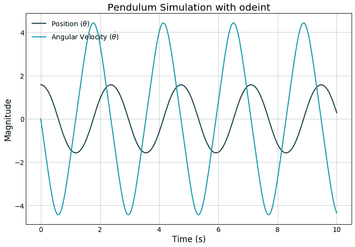

在我们的模型中，没有摩擦力或其他力，所以钟摆会在π/2 和π/2 之间来回摆动。如果你增加初始速度，比如说，10 弧度/秒，你会看到位置继续增加，因为模型显示它一次又一次地旋转。

# 半隐式欧拉方法

通过集成求解模型相对容易，但是集成可能非常昂贵，尤其是对于较大的模型。如果想看到模型的长期动态，可以用[欧拉法](https://en.wikipedia.org/wiki/Semi-implicit_Euler_method)来代替，对系统进行积分模拟。这就是如何在 OpenAI 中解决控制问题，如推车杆，并允许我们为 RL 控制设置问题。

要做到这一点，我们需要得到我们的颂歌的[泰勒级数展开](https://en.wikipedia.org/wiki/Taylor_series) (TSE)。TSE 只是一种近似函数的方法。级数越多，你越精确。出于我们的目的，我们只展开到一阶导数，并截断高阶项。

首先，注意我们需要一个θ(t)的函数。如果我们将 TSE 应用于关于 t-t_0 的θ(t ),我们得到:

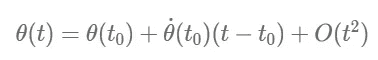

其中，O(t)仅代表高阶项，可以去掉而不会损失太多保真度。请注意，这只是根据 TSE 的一般公式得出的。有了这个等式，我们就可以参考上面的 ODE 替换，即:

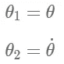

这样，我们可以将 TSE 与我们的 ODE 链接起来:


这为我们提供了一种在每个时间步长更新模型的便捷方式，以获得θ_1 (t)的新值。我们可以对θ(t)重复展开和代入，得到如下结果:

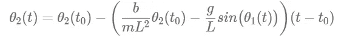

当我们在模拟中循环时，我们会将 t0t_0t0 更新为之前的时间步长，因此我们会逐步向前移动模型。此外，请注意，这是**半隐式欧拉方法**，这意味着在我们的第二个方程中，我们使用我们计算的最新θ_1 (t ),而不是直接应用泰勒级数展开式得到的θ_1 (t_0)。我们做了这个微妙的替换，因为没有它，我们的模型将会发散。本质上，我们使用 TSE 得出的近似值存在一些误差(请记住，我们丢弃了那些高阶项),并且这种误差是复合的。在这个应用中，误差给我们的钟摆引入了新的能量——这显然违反了热力学第一定律。进行这种替换可以解决所有问题。

```
def euler_pendulum_sim(theta_init, t, L=1, g=9.81):
    theta1 = [theta_init[0]]
    theta2 = [theta_init[1]]
    dt = t[1] - t[0]
    for i, t_ in enumerate(t[:-1]):
        next_theta1 = theta1[-1] + theta2[-1] * dt
        next_theta2 = theta2[-1] - (b/(m*L**2) * theta2[-1] - g/L *
            np.sin(next_theta1)) * dt
        theta1.append(next_theta1)
        theta2.append(next_theta2)
    return np.stack([theta1, theta2]).T
```

现在运行这个新函数:

```
theta_vals_euler = euler_pendulum_sim(theta_init, t)
```

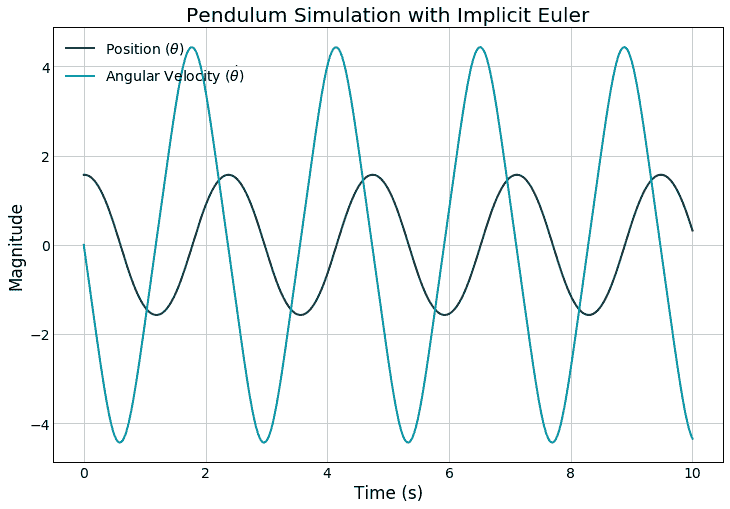

剧情看起来不错，就看和我们之前的结果是否吻合了。

```
mse_pos = np.power(
    theta_vals_int[:,0] - theta_vals_euler[:,0], 2).mean()
mse_vel = np.power(
    theta_vals_int[:,1] - theta_vals_euler[:,1], 2).mean()
print("MSE Position:\t{:.4f}".format(mse_pos))
print("MSE Velocity:\t{:.4f}".format(mse_vel))

MSE Position:	0.0009
MSE Velocity:	0.0000
```

不同方法之间的均方误差非常接近，这意味着我们得到了一个非常好的近似值。

我们使用了两种不同的方法，因为我说过应用欧拉方法比用`odeint`积分求解要快。与其相信我的话，不如让我们来验证一下这个说法。

```
%timeit euler_pendulum_sim(theta_init, t)

2.1 ms ± 82.8 µs per loop (mean ± std. dev. of 7 runs, 100 loops each)%timeit integrate.odeint(int_pendulum_sim, theta_init, t)

5.21 ms ± 45.5 µs per loop (mean ± std. dev. of 7 runs, 100 loops each)
```

与积分法相比，欧拉法的速度提高了约 2 倍。

这样，我们学会了如何根据基本原理建立和模拟一个动态模型，并将其应用于一个简单的无摩擦摆。

像这样的动力系统对于理解自然是非常强大的。我最近用同样的技术写了一篇文章，展示了我们如何模拟病毒爆发在人群中的传播。ODE 对于机器人和工程中的反馈控制和其他相关应用也非常有用，所以掌握基本的数字积分是必须的！