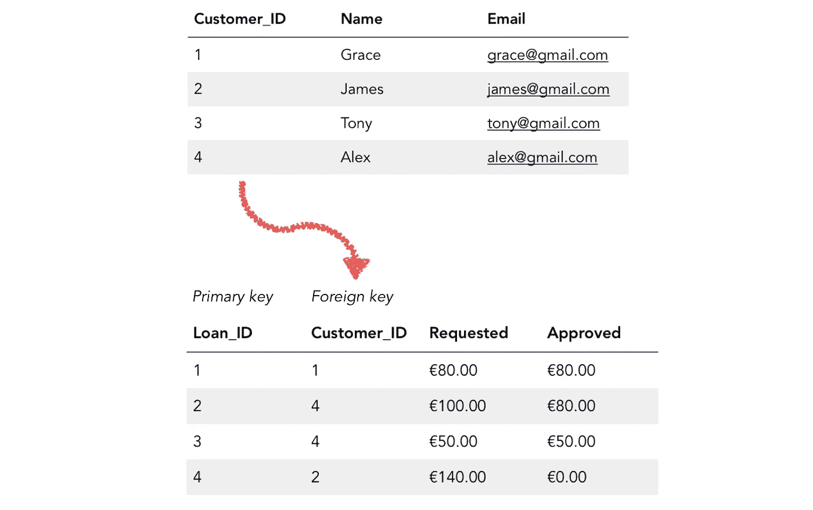
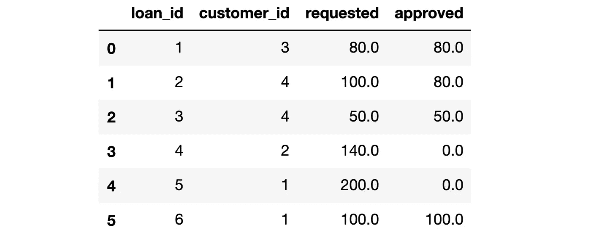
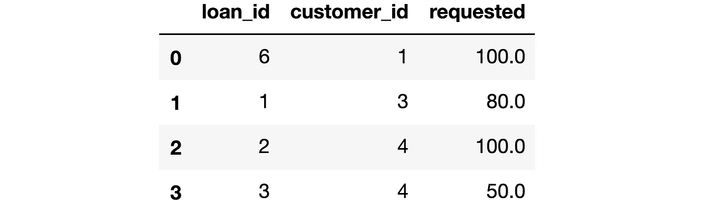
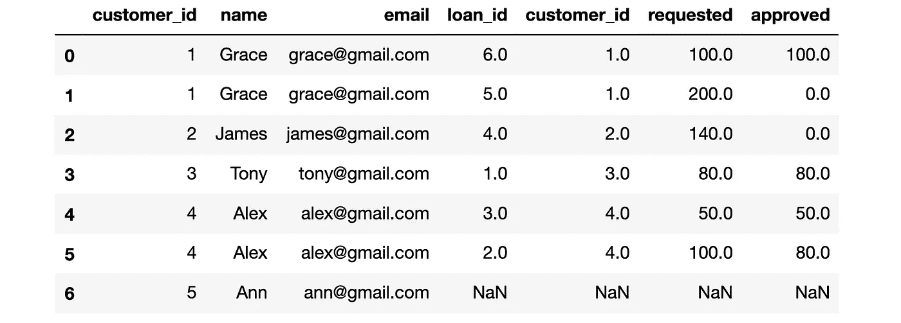

# SQL 初学者指南

> 原文：<https://towardsdatascience.com/a-beginners-guide-to-sql-b8a94be51db9?source=collection_archive---------43----------------------->

## 在不到 10 分钟的时间里学会一项最渴望的技术技能


照片由 [Unsplash](https://unsplash.com/s/photos/server?utm_source=unsplash&utm_medium=referral&utm_content=creditCopyText) 拍摄

# **简介**

数据库是计算机系统，允许存储和方便地访问数据。根据数据的组织方式，数据库可以是关系型的( **RDBMS** )或非关系型的( **NoSQL** )。关系数据库以表格的形式构建，类似于彼此相关的 csv 文件或 excel 电子表格。虽然，关系数据库比 csv 或 json 文件健壮得多。与单个文件不同，如果多个用户试图与存储在数据库中的数据进行交互，所采取的操作不会相互影响，并且只有根据某些规则有效时才会被保存。此外，如果操作的一部分失败，整个操作将失败，数据库将保持不变；一旦完成，它将被永久保存(即使数据库崩溃)。

下图显示了关系数据库的一个示例，其中的表有一个带*主键*的列，该列包含每行的唯一值。表也可以有*外键*，作为到其他表的链接。这些链接定义了关系数据库。



关系数据库的一些例子是 MySQL 和 PostgreSQL(免费和开源)或 Oracle 和 Microsoft SQL(主要由公司使用)。

所有这些数据库都可以用 SQL 来访问和操作，SQL 是一种编程语言，代表结构化查询语言。学习 SQL 比学习其他编程语言容易得多，因为它读起来像一种自然语言。在接下来的部分中，我将展示如何在 SQL 数据库中创建、操作和查询数据。

# 用 SQLite 建立数据库

在本练习中，我们将使用 SQLite，它类似于其他 SQL 数据库，只是它是一个单磁盘文件，因此没有中间服务器进程。这些特性使得 SQLite 更适合小型项目，因为它是基于文件的，所以不需要任何安装。在您的[命令行](https://www.ionos.com/help/email/troubleshooting-mail-basicmail-business/access-the-command-prompt-or-terminal/#:~:text=Open%20Command%20Prompt%20in%20Windows,cmd%22%20and%20then%20click%20OK.)中，您可以简单地键入`sqlite3` ，后跟您想要访问或创建的数据库的名称`exercise.sqlite`。

您会注意到终端提示符变成了`sqlite>`。您可以在这里键入您的 SQL 命令，后跟一个分号(；)来执行它们。

# 创建表格

我们现在将尝试重新创建上面的插图，它显示了*客户*表和*贷款*表。SQL 命令的语法遵循简单的模式:`CREATE TABLE table_name (column_name data_type constrains)`创建表，`ALTER TABLE table_name ADD/DROP COLUMN column_name`修改表。

指定哪种数据将被插入到表中是很重要的。SQL 支持不同的字段类型，包括字符串、数字、日期和时间。有关不同数据类型的更多细节，您可以查看此[链接](https://www.journaldev.com/16774/sql-data-types)。

创建表时，还可以添加几个约束。最常见的是`NOT NULL`，它防止列有空值，以及`PRIMARY KEY`或`FOREIGN KEY`，它们唯一地标识一个表中或另一个表中的记录。

```
CREATE TABLE customers (
    customer_id INTEGER PRIMARY KEY AUTOINCREMENT NOT NULL,
    name VARCHAR(50) NOT NULL,
    email VARCHAR(50) NOT NULL
);CREATE TABLE loans (
    loan_id INTEGER PRIMARY KEY AUTOINCREMENT NOT NULL,
    customer_id INTEGER NOT NULL,
    requested DOUBLE NOT NULL,
    approved DOUBLE NOT NULL,
    FOREIGN KEY (customer_id) REFERENCES customers (customer_id) ON DELETE CASCADE ON UPDATE CASCADE
);
```

到目前为止，我们的数据库有一个结构，但没有数据。您可以通过键入以下代码向表中添加数据。请注意，两个表的第一列只支持主键，因此，如果我们使用现有的条目，我们将会得到一个错误。

```
/*Data for the table customers */INSERT INTO customers (customer_id,name,email) VALUES (1,'Grace','grace@gmail.com');
INSERT INTO customers(customer_id,name,email) VALUES (2,’James’,’james@gmail.com’);
INSERT INTO customers(customer_id,name,email) VALUES (3,’Tony’,’tony@gmail.com’);
INSERT INTO customers(customer_id,name,email) VALUES (4,’Alex’,’alex@gmail.com’);/*Data for the table loans */INSERT INTO loans(loan_id,customer_id,requested,approved) VALUES (1,1,80.00,80.00);
INSERT INTO loans(loan_id,customer_id,requested,approved) VALUES (2,4,100.00,80.00);
INSERT INTO loans(loan_id,customer_id,requested,approved) VALUES (3,4,50.00,50.00);
INSERT INTO loans(loan_id,customer_id,requested,approved) VALUES (4,2,140.00,0.00);
INSERT INTO loans(loan_id,customer_id,requested,approved) VALUES (5,1,200.00,0.00);
INSERT INTO loans(loan_id,customer_id,requested,approved) VALUES (6,1,100.00,100.00);
```

要更新或删除记录，您可以使用`UPDATE`或`DELETE`命令。

示例:`UPDATE loans SET customer_id = 3 WHERE loan_id = 1;`将表 *loans* 中的 customer_id 更改为 3，其中 loan_id 等于 1。

示例:`DELETE FROM customers WHERE name like 'Leonard';`从*客户*表中删除所有名为“伦纳德”的客户。

# 在 Python 环境中查询数据库

就我个人而言，我更喜欢使用 Jupyter Notebook 来查询数据库，而不是终端，因为它有更好的视觉效果。有几种方法可以直接在笔记本上运行 SQL。

一个不需要安装任何库的选项是使用 **Python SQLite3 包**。只需导入库并运行下面的代码来建立与数据库的连接。

```
import sqlite3                              # import library
sqlite_db = 'exercise.sqlite'               # select database
conn = sqlite3.connect(sqlite_db)           # connect
c = conn.cursor()                           # create cursor object
```

使用 SQLite3 时，有必要创建 cursor 对象来迭代数据行并获取信息。创建表的语法类似于控制台，只是现在我们需要编写括号内的 SQL 代码，并使用游标对象`c`的`.execute()`方法执行它。

```
c.execute("INSERT INTO customers VALUES (5,’Ann’,’ann@gmail.com’);")# commit changes
conn.commit()
```

## 从表中选择列

现在我们都设置好了，我们可以运行我们的第一个数据查询。每个数据查询中必须存在的两个主要子句是`SELECT`和`FROM`。

`SELECT`允许从数据库中选择我们想要的列。

`FROM`指定我们从哪个表中提取列。

要使用 SQLite3 包运行查询，首先我们需要存储我们的结果，然后使用`.fetchall()`方法提取它们。

```
results = c.execute("SELECT * FROM loans")    
results.fetchall()
```

另一种方法是使用 pandas 函数`.read_sql()`将 SQL 查询读入数据帧。

```
sql_query = (“SELECT * FROM loans”) 
pd.read_sql(sql_query, con=conn)
```



请注意，要选择所有列，可以使用星号(*)。SQL 也是不区分大小写的，这意味着键入`SELECT`和`select`没有区别。

## 聚合函数

聚合函数接受值列表并返回单个值。它们可以在`SELECT`语句中使用，通常与`GROUP BY`函数结合使用。

最常见的有:`AVG()`、`COUNT()`、`MAX()`、`MIN()`、`SUM()`。

```
sql_query = (“SELECT AVG(requested) FROM loans”) 
pd.read_sql(sql_query, con=conn)
```

在此示例中，查询返回请求贷款的平均金额。

## 过滤数据

`WHERE`子句是在 SQL 中过滤结果的最常见方式。它出现在`FROM`子句之后，包含一个或多个逻辑表达式，用于评估每一行，如果条件为真，则返回这些表达式。

在`WHERE`子句中最常用的**比较运算符**有:=(等于)、< > or！=(不等于)、<(小于)、>(大于)、< =(小于等于)、> =(大于等于)。

**逻辑运算符**，如`AND`、`OR`、`LIKE`，也可用于检验条件的真值。要获得所有逻辑运算符的完整列表，我建议查看这个[链接](https://www.sqltutorial.org/sql-logical-operators/)。

```
sql_query = ("""SELECT * FROM customers
WHERE name = 'Tony' OR name = 'Grace'""")
pd.read_sql(sql_query, con=conn)
```

上面的查询返回姓名为“Tony”或“Grace”的客户。


## 分类数据

可以使用`ORDER BY`子句对查询结果进行排序。该子句出现在`FROM`子句和`WHERE`子句(如果存在)之后。要对结果进行排序，您需要指定要对值进行排序的列和顺序(升序`ASC`或降序`DESC`)。

```
sql_query = ("""SELECT loan_id, customer_id, requested 
FROM loans
WHERE approved != 0
ORDER BY customer_id ASC""")
pd.read_sql(sql_query, con=conn)
```

在此示例中，查询从表“loans”中选择三列，筛选数据，使批准的金额不等于 0，然后按 customer_id 以升序对结果进行排序。



## 分组数据

在`SELECT`语句之后使用`GROUP BY`子句将行组合成组。如果您想在分组之前过滤行，那么在`GROUP BY`子句之前应用`WHERE`子句，而要过滤组，您需要在分组之后使用`HAVING`子句。

```
sql_query = ("""SELECT customer_id, AVG(requested) AS avg_requested 
FROM loans
GROUP BY customer_id
HAVING avg_requested > 100
ORDER BY customer_id ASC""")
pd.read_sql(sql_query, con=conn)
```

这里，数据按 customer_id 分组并进行筛选，以便每个客户的平均请求量大于 100。请注意，最后添加了`ORDER BY`子句。


## 连接表格

到目前为止，我们一直是一次查询一个表，但是我们也可以将表链接在一起，同时查询它们。这个过程被称为“连接”,类似于交叉表的概念。最常见的连接类型有:

`INNER JOIN`:只保留两个表共有的行。

`LEFT JOIN`:将保留第一个表格的行。

`RIGHT JOIN`:将保留第二个表格的行。

`FULL OUTER JOIN`:将保留两个表中的行。

```
sql_query = ("""SELECT * FROM customers
LEFT JOIN loans ON customers.customer_id = loans.customer_id""")
pd.read_sql(sql_query, con=conn)
```

在此查询中，我们将连接列“customer_id”上的两个表。因为我们使用了`LEFT JOIN`，所以即使 Ann 没有申请贷款，结果也会包含“customers”表中的所有行。



如果我们使用`INNER JOIN`，结果将只包括请求贷款的客户。

## 其他资源和注意事项

本教程到此为止！如果你喜欢它，请继续关注，因为还会有更多的。与此同时，您可以查看[sqltutorial.org](https://www.sqltutorial.org/)了解更多关于 SQL 语法和子句的细节。

注意，根据您使用的数据库，SQL 有许多方言，所以一定要检查可能的差异。

领英:[https://www.linkedin.com/in/veronica-nigro/](https://www.linkedin.com/in/veronica-nigro/)

[](https://github.com/veronicanigro) [## veronicanigro -概述

### 在 GitHub 上注册你自己的个人资料，这是托管代码、管理项目和构建软件的最佳地方…

github.com](https://github.com/veronicanigro)