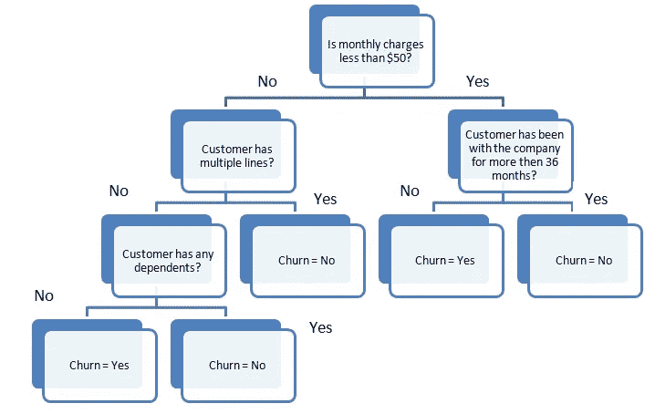
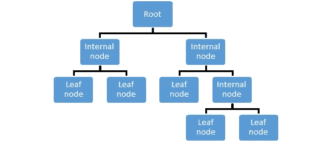

# 监督机器学习算法初学者指南

> 原文：<https://towardsdatascience.com/a-beginners-guide-to-supervised-machine-learning-algorithms-6e7cd9f177d5?source=collection_archive---------52----------------------->

## 预测分析路线图

照片由[威廉·布特](https://unsplash.com/@williambout?utm_source=unsplash&utm_medium=referral&utm_content=creditCopyText)在 [Unsplash](https://unsplash.com/s/photos/guide?utm_source=unsplash&utm_medium=referral&utm_content=creditCopyText) 拍摄

如果你在这里阅读这篇文章，你一定很清楚机器学习的重要性。近年来，由于许多商业领域的高需求和技术的进步，机器学习的流行程度已经大大增加。有各种各样的机器学习算法，可以分为三个主要类别:

*   **监督学习**算法在给定一组观察值的情况下，对特征(独立变量)和标签(目标)之间的关系进行建模。然后，该模型被用于使用这些特征来预测新观察的标签。
*   **无监督学习**算法试图在未标记的数据中找到结构。
*   **强化学习**基于行动奖励原则工作。一个**代理**通过迭代计算其行动的**回报**来学习达到一个目标。

在这篇文章中，我将向您概述常用的监督机器学习算法。监督学习算法试图使用特征(自变量)来预测目标(因变量)。根据目标变量的特性，可以是**分类**(离散目标变量)或**回归**(连续目标变量)任务。我们将讨论的算法包括:

*   线性回归
*   支持向量机
*   朴素贝叶斯
*   物流回归
*   k-最近邻
*   决策树
*   随机森林
*   梯度推进决策树

我们开始吧。

# **线性回归**

线性回归试图通过对数据拟合线性方程来模拟目标变量和一个或多个自变量之间的关系。顾名思义，目标变量是连续的，如价格、对象的面积或长度。

线性回归是一个好的选择，自变量和目标变量之间需要有线性关系。有许多工具可以探索变量之间的关系，如散点图和相关矩阵。例如，下面的散点图显示了两个变量之间的正相关关系。一个增加，另一个也增加。

线性回归模型试图将回归线拟合到最能代表关系或相关性的数据点。最常用的技术是**普通最小二乘法** (OLE)。使用这种方法，通过最小化数据点和回归线之间距离的平方和来找到最佳回归线。对于上面的数据点，使用 OLE 获得的回归线看起来像:

这是一个自变量和一个目标变量的情况。对于包含多个独立变量的问题，我们也可以使用线性回归。

# **支持向量机**

支持向量机(SVM)主要用于分类任务，但也适用于回归任务。

SVM 通过画一个**决定边界来区分阶级。**如何绘制或确定决策边界是 SVM 算法中最关键的部分。在创建决策边界之前，在 n 维空间中绘制每个观察值(或数据点)。“n”是使用的特征数量。例如，如果我们使用“长度”和“宽度”来对不同的“细胞”进行分类，则观察值被绘制在二维空间中，而决策边界是一条线。如果我们使用 3 个特征，则判定边界是三维空间中的平面。如果我们使用 3 个以上的特征，决策边界就变成了一个超平面，很难可视化。

二维空间中的决策边界

以到支持向量的距离最大化的方式绘制决策边界。如果决策边界离支持向量太近，会对噪声高度敏感，不能很好地泛化。即使独立变量非常小的变化也可能导致错误分类。

如果你想阅读一个关于 SVM 实现的更详细的帖子，你可以访问下面的帖子:

 [## 支持向量机—解释

### 详细的理论解释和代码示例

towardsdatascience.com](/support-vector-machine-explained-8d75fe8738fd) 

# **朴素贝叶斯**

朴素贝叶斯是一种用于分类任务的监督学习算法。因此，它也被称为朴素贝叶斯分类器。

朴素贝叶斯假设**特征相互独立**和**特征**之间没有相关性。然而，现实生活中并非如此。这种特征不相关的天真假设是这种算法被称为“天真”的原因。

朴素贝叶斯算法背后的直觉是贝叶斯定理:

p(A|B):给定事件 B 已经发生的概率

p(B|A):事件 B 的可能性给定事件 A 已经被占用

p(A):事件 A 的概率

p(B):事件 B 的概率

朴素贝叶斯分类器计算给定一组特征值(即 p(yi | x1，x2，…，xn))的类的概率。将此输入贝叶斯定理:

**p(x1，x2，…，xn | yi)** 表示给定类别标签的特征的特定组合的概率。为了能够计算这一点，我们需要非常大的数据集来估计所有不同特征值组合的概率分布。为了克服这个问题，**朴素贝叶斯算法假设所有特征都是相互独立的。**此外，分母(p(x1，x2，…，xn))可以被移除以简化方程，因为它仅归一化给定观察值的类的条件概率的值(p(yi | x1，x2，…，xn))。

一个类的概率(p(yi))很容易计算:

在特征相互独立的假设下， **p(x1，x2，…，xn | yi)** 可以写成 **:**

给定类标签(即 p(x1 | yi))的单个特征的条件概率可以更容易地从数据中估计出来。该算法需要独立地存储每个类别的特征的概率分布。例如，如果有 5 个类别和 10 个特征，则需要存储 50 个不同的概率分布。

综上所述，对于朴素贝叶斯算法来说，计算观察一类给定值的特征的概率( **p(yi | x1，x2，…，xn) )** 变得很容易

下面是一篇关于朴素贝叶斯的更详细的文章，并附有一个例子:

 [## 朴素贝叶斯分类器-解释

### scikit-learn 的理论和实现

towardsdatascience.com](/naive-bayes-classifier-explained-50f9723571ed) 

# **逻辑回归**

逻辑回归是一种监督学习算法，主要用于**二元**分类问题。虽然“回归”与“分类”相矛盾，但这里的重点是“逻辑”一词，指的是在该算法中执行分类任务的逻辑函数**。逻辑回归是一种简单但非常有效的分类算法，因此它通常用于许多二元分类任务。客户流失、垃圾邮件、网站或广告点击预测是逻辑回归提供强大解决方案的一些领域的例子。**

逻辑回归的基础是逻辑函数，也称为 sigmoid 函数，它接受任何实数值并将其映射到 0 到 1 之间的值。

假设我们要求解以下线性方程:

逻辑回归模型将线性方程作为输入，并使用逻辑函数和对数比值来执行二元分类任务。然后，我们会得到著名的逻辑回归 s 形图:

我们可以“原样”使用计算出的概率。例如，输出可以是电子邮件是垃圾邮件的概率是 95%,或者客户将点击该广告的概率是 70%。然而，在大多数情况下，概率被用来分类数据点。如果概率大于 50%，则预测为正类(1)。否则，预测为负类(0)。

如果你想深入了解，这里有一个更详细的帖子:

 [## 逻辑回归—已解释

### 详细的理论解释和 scikit-learn 示例

towardsdatascience.com](/logistic-regression-explained-593e9ddb7c6c) 

# **K-最近邻(kNN)**

k-最近邻(kNN)是一种受监督的机器学习算法，可用于解决分类和回归任务。kNN 背后的主要思想是，数据点的值或类由其周围的数据点决定。

kNN 分类器通过多数表决原则确定数据点的类别。例如，如果 k 设置为 5，则检查 5 个最近点的类。根据多数类进行预测。类似地，kNN 回归取 5 个最近点的平均值。让我们看一个例子。考虑以下属于 4 个不同类别的数据点:

让我们看看预测类如何根据 k 值变化:

确定最佳 k 值是非常重要的。如果 k 太低，模型太具体，不能很好地概括。它对噪音也很敏感。该模型在训练集上实现了高精度，但是在新的、以前看不到的数据点上将是差的预测器。因此，我们很可能以一个过度拟合的模型而告终。另一方面，如果 k 太大，则该模型太一般化，并且在训练集和测试集上都不是好的预测器。这种情况被称为欠适配。

以下是 kNN 上更详细的帖子:

 [## k-最近邻(kNN)-解释

### 详细的理论解释和 scikit-learn 实现

towardsdatascience.com](/k-nearest-neighbors-knn-explained-cbc31849a7e3) 

# **决策树**

决策树建立在反复询问问题以划分数据的基础上。用决策树的可视化表示来概念化分区数据更容易:

这代表了预测客户流失的决策树。第一次拆分基于每月费用金额。然后算法不断提问分离类标签。随着树越来越深，问题也越来越具体。

你在每一步问什么是最关键的部分，并极大地影响决策树的性能。例如，假设数据集的“要素 A”范围为 0 到 100，但大多数值都在 90 以上。在这种情况下，首先要问的问题是“特征 A 大于 90 吗？”。问“特性 A 大于 50 吗？”是没有意义的因为它不会给我们太多关于数据集的信息。

我们的目标是在每次分区时尽可能增加模型的预测性，以便模型不断获得关于数据集的信息。随机分割要素通常不会给我们提供关于数据集的有价值的信息。增加节点纯度的分割更能提供信息。节点的纯度与该节点中不同类的分布成反比。要问的问题是以增加纯度或减少杂质的方式选择的。

我们要问多少问题？我们什么时候停止？什么时候我们的树足以解决我们的分类问题？所有这些问题的答案将我们引向机器学习最重要的概念之一:**过拟合**。模型可以一直提问，直到所有节点都是纯的。纯节点只包括来自一个类的数据点。

模型可以一直提问(或者拆分数据)，直到所有的叶子节点都是纯的。然而，这将是一个过于具体的模型，不能很好地概括。它在训练集上实现了高精度，但在新的、以前看不到的数据点上表现不佳。

# **随机森林**

随机森林是许多决策树的集合。随机森林是用一种叫做**装袋**的方法构建的，其中每个决策树都被用作并行估计器。如果用于分类问题，结果基于从每个决策树接收的结果的多数投票。对于回归，叶节点的预测是该叶中目标值的平均值。随机森林回归取决策树结果的平均值。

随机森林降低了过度拟合的风险，并且准确性比单个决策树高得多。此外，随机森林中的决策树并行运行，因此时间不会成为瓶颈。

随机森林的成功高度依赖于使用不相关的决策树。如果我们使用相同或非常相似的树，总体结果将不会比单个决策树的结果有太大的不同。随机森林通过**自举**和**特征随机性**实现不相关的决策树。

*   Bootsrapping 是从带有替换的训练数据中随机选择样本。它们被称为 bootstrap 样本。下图清楚地解释了这一过程:

[图源](https://www.researchgate.net/figure/An-example-of-bootstrap-sampling-Since-objects-are-subsampled-with-replacement-some_fig2_322179244)

*   通过为随机森林中的每个决策树随机选择特征来实现特征随机性。随机森林中每棵树使用的特征数量可通过 **max_features** 参数控制。

特征随机性

自助样本和特征随机性为随机森林模型提供了不相关的树。

下面是一篇关于决策树和随机森林的详细文章，并附有一个实现示例:

 [## 决策树和随机森林—解释

### 详细的理论解释和代码示例

towardsdatascience.com](/decision-tree-and-random-forest-explained-8d20ddabc9dd) 

# **梯度推进决策树(GBDT)**

**GBDT** 算法，该算法使用**助推**方法来组合个体决策树。

Boosting 是指将一个学习算法串联起来，从许多顺序连接的弱学习器中实现一个强学习器。在梯度提升决策树算法的情况下，弱学习器是决策树。

每棵树都试图最小化前一棵树的错误。boosting 中的树是弱学习器，但是连续添加许多树，并且每个树集中于前一个树的错误，使得 boosting 成为高效且准确的模型。与装袋不同，增压不涉及自举取样。每次添加新树时，它都适合初始数据集的修改版本。

由于树是按顺序添加的，boosting 算法学习起来很慢。在统计学习中，学习速度慢的模型表现更好。

梯度提升算法以这样的方式顺序地组合弱学习器，即每个新的学习器适合于来自前一步骤的残差，从而改进模型。最终的模型汇总了每一步的结果，从而形成了一个强学习者。**梯度提升决策树**算法使用决策树作为弱学习器。损失函数用于检测残差。例如，均方误差(MSE)可用于回归任务，对数损失(log loss)可用于分类任务。值得注意的是，当添加新的树时，模型中现有的树不会改变。添加的决策树符合当前模型的残差。

GBDT 算法非常强大，已经实现了许多升级版本，如 XGBOOST、LightGBM、CatBoost。

以下是关于 GBDT 的详细帖子:

 [## 梯度推进决策树-解释

### 详细解释了 boosting 和 scikit-learn 实现

towardsdatascience.com](/gradient-boosted-decision-trees-explained-9259bd8205af) 

感谢您的阅读。如果您有任何反馈，请告诉我。

# **参考文献**

*   [https://www . researchgate . net/figure/An-example-of-bootstrap-sampling-Since-objects-is-sub-sampled-with-replacement-some _ fig 2 _ 322179244](https://www.researchgate.net/figure/An-example-of-bootstrap-sampling-Since-objects-are-subsampled-with-replacement-some_fig2_322179244)