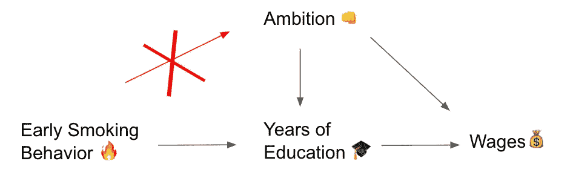

# 工具变量初学者指南

> 原文：<https://towardsdatascience.com/a-beginners-guide-to-using-instrumental-variables-635fd5a1b35f?source=collection_archive---------22----------------------->

## 当他们可能成为你的超人时[包括 R 代码]


埃斯特万·洛佩兹在 [Unsplash](/s/photos/superman?utm_source=unsplash&utm_medium=referral&utm_content=creditCopyText) 上的照片

作为一名大学生，我学习经济学，这意味着我研究了*很多回归。*这基本上是课程的 90%(当然，当我们不讨论供需曲线时)。[腐败对相扑的影响](https://pubs.aeaweb.org/doi/pdf/10.1257/000282802762024665)？*回归。*[最低工资变动对新泽西州一家温蒂的影响](https://www.nber.org/papers/w4509.pdf)？*回归。*又或许 [*僵尸律师天启*](https://papers.ssrn.com/sol3/papers.cfm?abstract_id=2550498) 更是你的速度(还好，不是回归，不过标题很酷)。

不管怎样，我的大学生涯教会了我三件事:1)供给和需求，2)回归是生活，3)经济学家认为它们非常可笑。

但是如果你的回归失败了呢？如果它没有预测到它应该预测的事情，因为你的 X 与你没有数据的事情联系在一起，那该怎么办？

好吧，我的朋友们，那就是你可能要考虑使用静脉注射的时候了。

> 一个**工具变量是第三个变量**，Z，当你有内生变量时用于回归分析，这些变量受模型中其他变量的影响。换句话说，您可以用它来解释变量之间的意外行为。使用工具变量来识别隐藏的(未观察到的)相关性可以让您看到解释变量和响应变量之间的真实相关性，Y. — [*统计如何*](https://www.statisticshowto.com/instrumental-variable/)

让我们把其中的一些分解成我们能理解的部分。

## 第 1 部分:线性回归方程

假设你有两个你认为相关的变量，教育和工资(X 和 Y)。你想调查教育是否会导致更高的工资，即 X → Y。这很有道理。你写 ***y = α + βx +* ε** ，然后，满足于自己，用剩下的时间狂吃*权力的游戏。*

等等。慢点。首先让我们澄清一些事情。

*   ***【α=*“起点”。**并非所有回归都从零开始；例如，如果 X 是教育水平，Y 是工资，你不会从零教育水平开始(T4)，因为现在大多数人不会在 2 年级、3 年级、4 年级甚至 9 年级后辍学(耶，进步！).你可能会考虑从高中文凭开始的教育，一年一次，截距解释了这一点。
*   ***β=*X 影响 y 的权重。**例如，如果 1 年的教育预计会带来 100 美元的额外工资，那么系数 *β* 就是 100。β指定了多受一年教育能给你带来多少。
*   **ε =误差项。经济学家喜欢使用花哨的行话和希腊语，就像他们喜欢时髦的标题一样，所以ε只是错误的一个花哨的“e”。这吸收了 X 不能完美映射到 Y 的任何东西；很少会出现一对一映射的完美直线。**

既然我们已经把 ***y = x*** 翻译成了 ***y = α + βx +* ε。**现在的问题与*理论有关，如果*X 真的导致 y。教育导致工资，这是有道理的；但是，如果努力接受高等教育的人也将获得更高的工资，因为他们是人口中更有活力、更有抱负、更有动力的一部分，那又会怎样呢？

这是个大问题。为什么？因为不是 X 导致了 Y，而是别的什么导致了 Y，那个“别的什么”目前被吸收在误差项里，因为我们*无法衡量野心*。这违反了线性回归的基本假设。经济学家称之为*内生性。*


[埃斯特万·洛佩兹](https://unsplash.com/@exxteban?utm_source=unsplash&utm_medium=referral&utm_content=creditCopyText)在 [Unsplash](/s/photos/lego-batman?utm_source=unsplash&utm_medium=referral&utm_content=creditCopyText) 上的照片

## 第 2 部分:选择工具变量

我们想用 ***y = α + βx +* ε** ，但很快就清楚了，x、*教育*和 y、*工资*，也受到 z、*野心/驱动力/那种创造出迈克尔·乔丹这样的人的神奇品质的影响。*既然我们无法衡量抱负并将其转化为一个整洁的 CSV，我们该怎么办？

我们用别的东西，一些*可测量的东西，*与教育(X)相关，但与误差项(ε)无关。

**这些是 IV 的要求:1)它们不能与错误(外生性)相关，2)它们*与 X(教育)相关*。**

在这种情况下，早期吸烟行为是一个很好的工具。为什么？因为早期吸烟行为和受教育年限是相关的。另一方面，早期吸烟行为和野心则不是；许多成功人士都有吸烟的艰难童年。事实上，Matt Dickson 博士已经发表了一篇关于这种效应的论文。



我在例子中使用了太多表情符号吗？🤷*表情符号中的耸肩*

## 第 3 部分:通过 2SLS 使用工具变量

现在你有了 X ( *学历*)，Y ( *工资*)，Z ( *早期吸烟行为*)的数据。你已经宣布 Z 将成为一个很好的工具变量来处理 x 的内生性遗传。还有一个问题:**我们如何在回归方程中包含一个工具变量？**

我们将通过创建*两个*方程来做到这一点，这被称为**两阶段最小二乘(2SLS)** 估计。它所实现的只是将教育变量稍微重新定义为早期吸烟行为的函数:

*   ***教育= c + d*(早期吸烟行为)+ v***
*   ***工资*=*α+β*学历+* ε**

在这个例子中， **c** 是起点(像 ***α)，d*** 是权重(像*)，而*是误差(像 **ε** )。我们首先将*教育*变量重新校准为*早期吸烟行为*的函数，然后将我们的新定义代入原始方程。这就是为什么它被称为两阶段最小二乘法；我们创建了两个方程来正确回答第一个方程。**

## **第 4 部分:R 中的分析**

**你现在已经有了理解什么是工具变量，以及我们如何在 IRL 和 2sl 中使用它所需的所有理论。在 R 中运行分析非常简单:**

```
**install.packages("AER")          # library with ivreg() function
library(AER)reg_1 = ivreg(wages ~ education | early_smoking_age, data = _source)**
```

**用人类的话来说；这种回归是关于工资的教育，早期吸烟年龄被用作一种工具。正在使用的数据源称为 `*_source*` *。我将这个回归命名为* `*reg_1*` *，这样我以后可以调用它。***

**整个`ivreg()`文档在[这里](https://www.rdocumentation.org/packages/AER/versions/1.2-9/topics/ivreg)。**

****

**照片由[阿里·科卡布](https://unsplash.com/@_alikokab_?utm_source=unsplash&utm_medium=referral&utm_content=creditCopyText)在 [Unsplash](/s/photos/batman?utm_source=unsplash&utm_medium=referral&utm_content=creditCopyText) 上拍摄**

## **第五部分:结论**

**我花了*很长的*时间才明白一个工具变量的用途，或者说如何挑选一个很棒的；在完全理解之前，我甚至在 2019 年 UChicago 计量经济学比赛中获得了[第二名。出于这个原因，如果你不完全理解静脉注射的一切，那也没什么，完全正常。](https://lsa.umich.edu/econ/news-events/all-news/student-news/undergraduate-econ-team-place-second-at-annual-uchicago-economet.html)**

**我希望你现在对使用工具变量有了更多的了解；如果你有任何想法，请在下面评论(或留下掌声)。感谢阅读！❤️**

**—阿曼达**

## ****参考文献****

**大卫·卡德和艾伦·克鲁格，《最低工资和就业:新泽西和宾夕法尼亚快餐业的案例研究》，1993 年 10 月([https://www.nber.org/papers/w4509.pdf](https://www.nber.org/papers/w4509.pdf))**

**马特·迪克森，重新审视教育对工资的因果影响，2009 年 9 月([http://ftp.iza.org/dp4419.pdf](http://ftp.iza.org/dp4419.pdf))**

**马克·达根和史蒂芬·列维特，《胜利不是一切:相扑中的腐败》，2000 年 7 月([https://pubs.aeaweb.org/doi/pdf/10.1257/000282802762024665](https://pubs.aeaweb.org/doi/pdf/10.1257/000282802762024665))**

**黄文雄和科里·罗森，《僵尸律师启示录》，2014 年 8 月([https://papers.ssrn.com/sol3/papers.cfm?abstract_id=2550498](https://papers.ssrn.com/sol3/papers.cfm?abstract_id=2550498))**