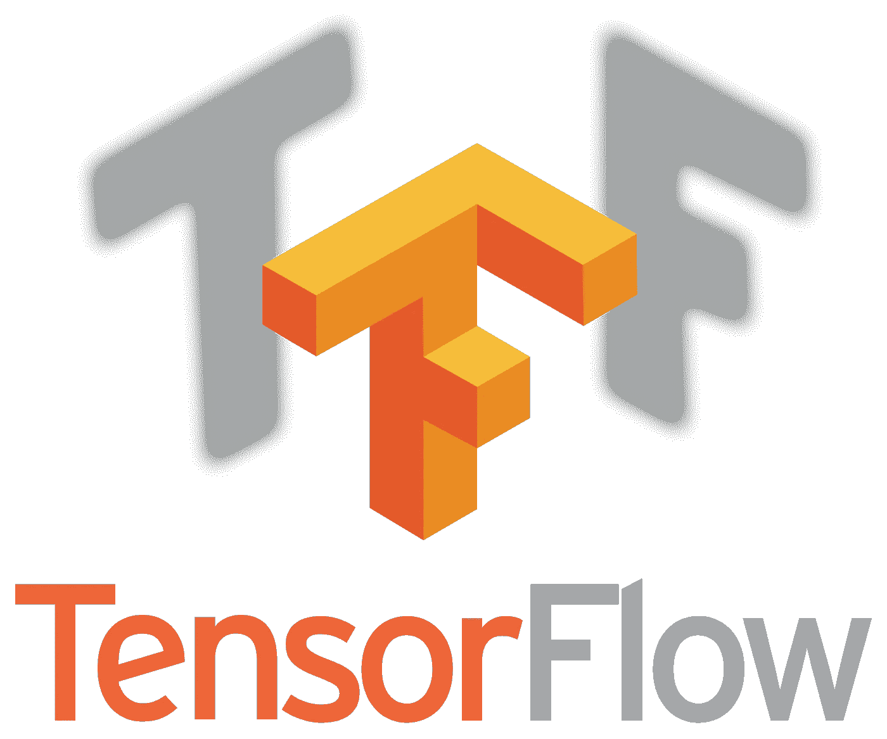

# TensorFlow Lite 初学者入门

> 原文：<https://towardsdatascience.com/a-beginners-introduction-to-tensorflow-lite-924320deed5?source=collection_archive---------15----------------------->

## 本文简要介绍了 TensorFlow，并概述了 TensorFlow Lite，包括它的优点和广泛使用的替代工具。

[TensorFlow 徽标图像](https://en.wikipedia.org/wiki/TensorFlow)

> 本文的目标读者是那些想简单了解 TensorFlow 和 TensorFlow Lite 的人，不需要复杂的术语和代码。

机器学习技术在当前以各种形式可用的几个应用中得到利用。大多数利用机器学习，更具体地说，深度学习的应用程序都有需要 GPU 进行推理的 ML 模型。

面临的挑战是，我们如何让需要 GPU 能力的 ML 模型在处理芯片和存储空间不太强大的移动设备上有效运行。

通常，要在移动或嵌入式设备上访问 ML 功能，ML 模型需要托管在云服务器上，并通过 Restful API 服务访问。

但今天，我们将探索工具，使 ML 模型足够高效和优化，以驻留在这些设备中。

## 这就是 TensorFlow 和 TensorFlow Lite 的用武之地。

# 什么是张量流？

> “TensorFlow 是一个端到端的开源机器学习平台”——Tensorflow.org

来自官方[网站](https://www.tensorflow.org/)的 Tensorflow 的定义可以被分解成单独的组件，这些组件提供了对流行的机器学习框架对机器学习社区的贡献的理解。

**首尾相连。** Tensorflow 为各个阶段的机器学习问题提供了全面的解决方案。短语*端到端*意味着张量流在以下阶段是有用的:

*   机器学习模型的实现和发展
*   机器学习模型的训练和评估
*   机器学习模型的部署和生产

**开源。**Google Brain 团队开发了 TensorFlow **，**，但该软件于 2015 年 11 月获得开源状态，这意味着 TensorFlow 的源代码[对 ML 社区公开](https://github.com/tensorflow/tensorflow)以供测试和修改。

**机器学习平台。** Tensorflow 提供了一系列工具，使机器学习模型能够实现各种目的和环境。在整理的工具中有 [TensorBoard](https://www.tensorflow.org/tensorboard) (与 ML 模型相关的度量/数据的可视化和跟踪工具)和 [Colab](https://colab.research.google.com/notebooks/welcome.ipynb) (用于实现 ML 模型的在线 Jupyter 笔记本环境)。

# 什么是 TensorFlow lite？

当使用 TensorFlow 实现和训练 ML 模型时，您通常会得到一个需要足够存储空间和 GPU 来运行推理的模型文件。大存储空间和 GPU 等奢侈品是大多数移动设备所不具备的。

[**TensorFlow Lite**](https://www.tensorflow.org/lite) 是在移动设备中启用 ML 模型的解决方案。

> TensorFlow Lite 是一个开源的深度学习框架，用于设备上的推理。—Tensorflow.org/lite

我们之前已经介绍了什么是开源，大多数读者都熟悉术语'*深度学习*'，如果不熟悉，请查看这篇文章，其中包括一些标准 ML 术语的定义，包括深度学习。

 [## 你是什么类型的人工智能爱好者？

### 根据人工智能领域内的常用术语，衡量你在人工智能爱好者等级中的排名。

towardsdatascience.com](/what-type-of-artificial-intelligence-enthusiast-are-you-32ca88c01a7e) 

**设备上的推断。**此短语指的是在智能手机等设备中利用 TensorFlow Lite 实现的模型的能力，更重要的是在存储空间有限的设备中。

TensorFlow Lite 模型存在于设备中，具有低延迟，这对于实时推理应用程序至关重要，因为从移动设备到托管模型的云服务器的网络往返可能会考验应用程序用户的耐心。

TensorFlow Lite 采用现有的 TensorFlow 模型，[将它们以. *tflite* 文件的形式](https://www.tensorflow.org/lite/convert/index)转换成优化的高效版本。流线型模型足够小，可以存储在设备上，并且足够精确，可以进行适当的推断。

# TensorFlow Lite 可以用在哪里？

TensorFlow Lite 的应用领域在本文中已经提到过几次，但本节将详细讨论 TensorFlow lite 的应用领域。

*   **移动设备(iOS 和 Android)** :移动设备是利用 TensorFlow Lite 模型的主要设备。TensorFlow Lite 提供了各种预训练模型，可以轻松转换为。tflite 版本，并在其专用开发环境中与移动应用程序集成。
*   物联网设备
*   [树莓派](https://www.tensorflow.org/lite/guide/build_rpi)

# Tensorflow Lite 有哪些优点？

*   轻松将 TensorFlow 模型转换为 TensorFlow lite 模型，用于移动优化模型
*   轻松开发 iOS 和 Android 设备的 ML 应用程序
*   与基于服务器的模型相比，移动模型支持的更有效替代方案
*   在移动设备上启用离线推断
*   Tensorflow Lite 使您能够在移动和嵌入式设备上以低延迟快速运行机器学习模型，因此您可以在这些设备上执行典型的机器学习，而无需使用外部 API 或服务器。这意味着您的模型可以在离线设备上运行。
*   您训练一个 TensorFlow 模型，然后将其转换为 TensorFlow Lite 模型，通过 TensorFlow lite 模型文件，您可以将您的应用程序转换为 android 应用程序或 iOS 应用程序

# Tensorflow Lite 有哪些缺点？

*   一些型号仍然太大，无法存储在设备上
*   TensorFlow Lite 模型中的效率和优化成本是对模型准确性的权衡。因此，TensorFlow Lite 模型的精确度低于其同类产品。

# Tensorflow lite 有哪些替代品？

*   [**Core ML**](https://developer.apple.com/documentation/coreml) :这是苹果发布的一个框架，用来打造 iOS 专用机型。CoreML 为常见的机器学习任务(如识别和检测)提供了一些模型。它是 TensorFlow Lite 的 iOS 专用替代产品。
*   [**py torch Mobile**](https://pytorch.org/mobile/home/):py torch 是一个流行的机器学习框架，被[广泛用于机器学习相关的研究](https://chillee.github.io/pytorch-vs-tensorflow/)。PyTorch mobile 可以与 TensorFlow Lite 相比较，因为它能够将 PyTorch 训练模型转换为移动优化版本，可以在 iOS 和 Android 设备上利用。虽然，PyTorch Mobile 还处于起步阶段，目前处于实验发布状态。
*   **在云服务上托管模型** ( [GCP](https://cloud.google.com/) ， [AWS](https://aws.amazon.com/) )并通过 REST APIs 公开功能

## 随着我探索更多的生态系统并在实际环境中利用它们，我将在 TensorFlow 和 TensorFlow Lite 上写更多的东西。

## 如果你喜欢这篇文章，并想阅读类似的内容，请在 [Medium](https://medium.com/@richmond.alake) 上关注我。