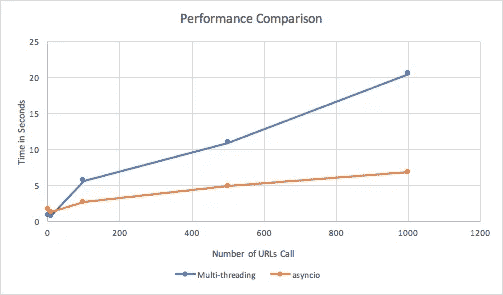

# 异步编程的更好方法:多线程上的异步

> 原文：<https://towardsdatascience.com/a-better-way-for-asynchronous-programming-asyncio-over-multi-threading-3457d82b3295?source=collection_archive---------3----------------------->

## 用 Python 中的 *asyncio* 库应对 I/O 限制挑战。我将为您提供一个完美的解决方案来获取数百万个 URL，这将击败多线程的性能。


由[卡罗琳娜·格拉博斯卡](https://www.pexels.com/@kaboompics)在[像素](https://www.pexels.com/)上拍摄的照片

如果您来到这里，可能是因为您听说过 Python 3.4 中引入的 [*asyncio*](https://docs.python.org/3/library/asyncio-task.html) 模块。你可能想知道你是否应该开始使用它。我记得那一刻我被它精彩的表演惊呆了。在我了解 asyncio 之前，我一直在使用多处理和线程来提高作业速度。它们工作得很好，直到有一天我在处理数亿个 URL 调用时遇到了瓶颈。这一挑战促使我寻找其他可行的解决方案来完成 I/O 任务。虽然它的语法和概念初看起来很复杂，但 asyncio 最终成为了改变人生的工具。

## 异步编程

一个 *syncio* 完全是关于异步编程的，但它不是异步运行作业的唯一选项。你可能会在这里打断我，问我，什么是异步编程？简单来说，异步编程允许不同的任务开始执行，而不需要等待前一个任务完成。这是一个巨大的数字，因为读取 URL 的大部分时间是由网络延迟造成的。在等待另一台服务器的响应时，没有必要忍受高延迟并保持机器空闲。异步编程正好解决了这个问题。

## 多线程上的异步

多线程是异步执行任务的传统解决方案。异步和多线程同时运行。哦，等等，什么是并发？并发是与并行相对的概念；它意味着同时执行多个任务，但不一定是同时执行，而并行意味着同时执行任务。这两个概念之间的区别在博客中并不重要(参见[此处](https://realpython.com/python-concurrency/)了解更多关于区别的信息)，但是请记住，我们并不是在这篇博客中探索并行解决方案。听起来不错，并行对于 I/O 受限的任务来说并不理想；它可以很好地处理 CPU 绑定的任务。

那么如果都属于异步编程，为什么 *asyncio* 比多线程快呢？这是因为 *asyncio* 在任务调度方面更加健壮，并为用户提供了对代码执行的完全控制。您可以通过使用 *await* 关键字暂停代码，在等待期间，您可以什么都不运行或者继续执行其他代码。因此，资源在等待期间不会被锁定。

多线程的任务轮流方式完全不同。在线程中，Python 解释器负责任务调度。在事先不知道代码或任务的情况下，解释器在切换到下一个线程之前给每个线程一段时间来轮流利用资源。这种安排存在一定程度的低效。一个简单的任务可能会中途中断，不管它有多琐碎。资源可能被锁定到一个线程，在该线程中，任务仍在等待来自外部服务器的响应，因此没有准备好继续进行。因此，在时间和资源上仍然存在一些浪费。

## 多线程基准测试

在我们进入 *asyncio* 之前，让我们使用多线程作为基准！对于所有的例子，我的机器有 8 个 CPU。

用于测试的所有库都在前面导入。是的，我使用*日志*。我基本上已经把*打印*掉了，换成了*记录。*记住总是使用异常。一个详细的例外是最好的。但是如果你不知道或者不关心，就用通用*异常*！

代码片段中有两个函数。

*   第一个函数， *fetch_url* 使用 *requests* 模块和 GET 方法从指定的 url 检索数据。try 和 except 块捕获服务器或超时错误，这样我们就可以不间断地运行多线程。
*   第二个函数， *fetch_all* 使用线程池通过 *concurrent.futures* 模块中的 *ThreadPoolExecutor()* 异步执行第一个函数。 *map* 方法收集所有线程的响应。
*   在这两个函数之外，它多次调用 *fetch_all* 。每次，我们传递一个不同长度的 URL 列表，并记录它所花费的时间。

现在让我们来看看一些性能结果:

```
INFO:root:Fetch 1 urls takes 0.7269587516784668 secondsINFO:root:Fetch 10 urls takes 0.7232849597930908 secondsINFO:root:Fetch 100 urls takes 5.631572008132935 secondsINFO:root:Fetch 500 urls takes 10.897085905075073 secondsINFO:root:Fetch 1000 urls takes 20.450702905654907 seconds
```

结果一点都不差。你可以看到多线程在读取 1000 个 URL 方面做得相当不错。

## asyncio 简介

```
**import** asyncio
**from** aiohttp **import** ClientSession

async **def** fetch(url):
    async **with** ClientSession() **as** session:
        async **with** session.get(url) **as** response:
            return await response.read()
```

这基本上就是 *asyncio* 版本的 fetch_url。我使用 *aiohttp* ，因为它提供了一个优秀的客户端会话，我们可以在其中异步地发出 http 请求。

除了 *aiohttp* 。使用*异步*和*等待*语法，代码可能看起来很奇怪。这两个是 *asyncio* 的关键符号。 *async* *def* 和 *async* *with* 语句创建可暂停执行的协程对象； *await* 关键字告诉程序等待哪个执行。这两个关键字的使用使得代码异步运行成为可能。

我们不直接调用 *fetch* 函数来启动异步执行。相反，我们需要创建一个事件循环，并在循环中添加任务。下面两行代码帮助您开始只获取一个 URL。

```
loop = asyncio.get_event_loop()
loop.run_until_complete(fetch(url))
```

要运行多个 URL 并异步收集所有响应，您需要利用来自 *asyncio* 的*确保 _ 未来*和*收集*函数。

## 一个完美的例子

我希望你还记得之前的多线程例子，因为我现在向你展示的是一个完整的 asyncio 版本！代码片段的结构与多线程示例相同。

使用 *asyncio* 获取 URL

*   它拥有从之前的 *asyncio* 介绍中升级的 *fetch* 功能。它通过启用额外的异常来升级。另一个大的变化是客户端会话变成了函数的一个参数。
*   *fetch_async* 是 *fetch_all* 的 *asyncio* 版本。函数创建了一个客户端会话，其中创建了一个事件循环并加载了任务，其中一个 URL 请求就是一个任务。这是一个重要的经验，让一个客户机会话处理所有 HTTP 请求是一种更好、更快的方式。
*   异步操作的结果是一个*未来*对象，并且在 *fetch_async* 中使用一个 *gather* 方法来聚集结果。
*   一个定时器围绕着 *fetch_async* 函数调用来跟踪时间。

代码在与之前相同的 8 CPU 机器上执行，结果显示如下:

```
INFO:root:Fetch 1 urls takes 1.5993337631225586 secondsINFO:root:Fetch 10 urls takes 1.2335288524627686 secondsINFO:root:Fetch 100 urls takes 2.6485719680786133 secondsINFO:root:Fetch 500 urls takes 4.8839111328125 secondsINFO:root:Fetch 1000 urls takes 6.814634084701538 seconds
```

## 结果分析



*   您可能已经注意到，在这两个例子中，1 个 URL 所需的时间比 10 个 URL 所需的时间稍长。这可能看起来与通常的做法相反。但是仔细想想。多线程和 asyncio 都是为“并行”任务设计的，它们都消耗了额外的资源来更快地完成任务。使用它们中的任何一个来阅读一个 URL 都不会节省你的时间，如果不是浪费你的时间的话。
*   在 1 到 10 个 URL 之间， *asyncio* 花费更多的时间来发送请求和收集响应。这可能意味着多线程是小型 I/O 任务的首选。
*   从 10 到 100 个 URL 之间的某个地方开始， *syncio* 的执行时间下降到多线程之下。随着 URL 数量的增加，两种解决方案的时间差越来越大。这说明了 *asyncio* 在大量 URL 请求上的卓越性能。