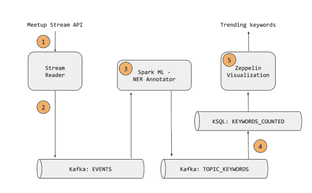
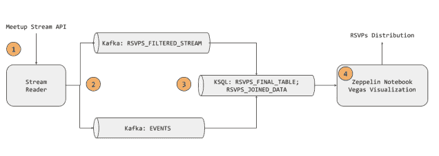
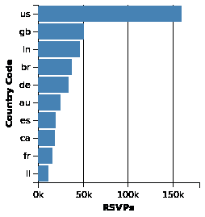
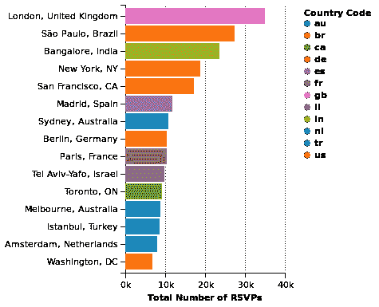
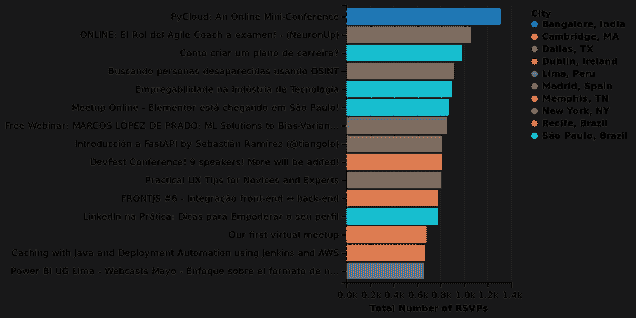
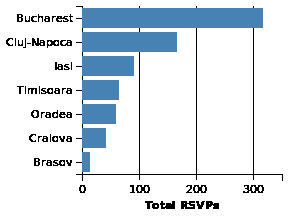
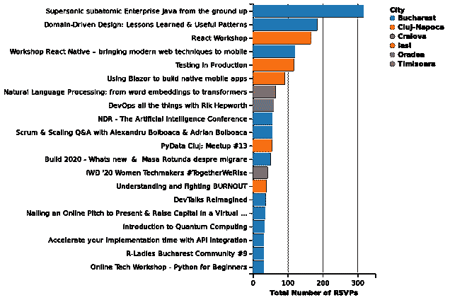
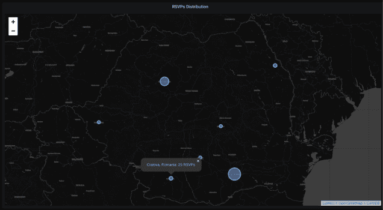
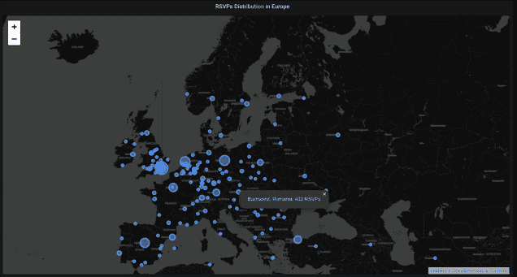
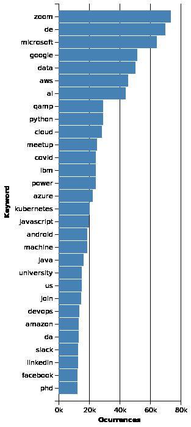

# 使用 Spark NLP、Kafka 和 Vegas 可视化对 Meetup 事件进行大数据分析

> 原文：<https://towardsdatascience.com/a-big-data-analysis-of-meetup-events-using-spark-nlp-kafka-and-vegas-visualization-af12c0efed92?source=collection_archive---------48----------------------->

## 使用流数据、命名实体识别和 Zeppelin 笔记本寻找趋势 Meetup 主题——疫情时报期间一个超级热情的工作小组的故事

我们从 [bigdata.ro](https://bigdata.ro/working-groups-2020/) 开始作为一个工作组。这个团队由[瓦伦蒂娜·克里桑](https://www.linkedin.com/in/valentinacrisan/)、[奥维迪乌·波德里乌](https://www.linkedin.com/in/ovidiu-podariu/)、[玛利亚·卡塔纳](https://www.linkedin.com/in/maria-catana-1091a610/)、克里斯蒂安·斯坦西乌勒斯库[、埃德温·布林扎](https://www.linkedin.com/in/edwin-brinza-b315a915/)和我[、安德烈·德乌斯特努](https://www.linkedin.com/in/andrei-deusteanu/)组成。我们的主要目的是学习和实践 Spark 结构化流、机器学习和 Kafka。我们设计了整个用例，然后从头开始构建架构。

由于 Meetup.com 通过一个实时 API 提供数据，我们把它作为我们的主要数据源，我们没有把数据用于商业目的，只是用于测试。

这是一个学习案例故事。我们从一开始就不知道什么是可能的，什么是不可能的。回过头来看，有些步骤本可以做得更好。但是，嘿，生活就是这样的。

**我们试图解决的问题:**

*   允许 meetup 组织者确定与其 meetup 相关的热门话题。我们根据与我们感兴趣的标签相匹配的事件描述来计算趋势话题。我们使用 John Snow Labs Spark NLP 库来提取实体。
*   确定哪些 Meetup 活动在我们地区吸引了最多的响应。因此，我们根据与我们感兴趣的领域——大数据——相关的某些标签来监控聚会的回复。

**为此，我们开发了两套可视化工具:**

*   趋势关键词
*   RSVPs 分布

# 体系结构

前两个元素在两组可视化中是通用的。这是从 Meetup.com API 读取数据并保存在 2 个 Kafka 主题中的部分。

1.  流阅读器脚本从 Meetup 流 API 中获取由特定标签过滤的 Yes RSVPs 上的数据。然后，它选择我们需要的相关列。之后，它将这些数据保存到 rsvps_filtered_stream Kafka 主题中。
2.  对于每个 RSVP，只有在 events.idx 文件中不存在 event_id 时，流读取器脚本才会为其获取事件数据。这样，我们可以确保只读取一次事件数据。流阅读器脚本的设置可以在-> [安装 Kafka 并获取 RSVP](https://bigdataro.files.wordpress.com/2020/08/install-kafka-and-fetch-rsvps.pdf)中找到

## 趋势关键词

趋势关键词建筑

3.Spark ML — NER 注释器从 Kafka 主题事件中读取数据，然后使用 Spark NLP 应用命名实体识别管道。最后，它将注释数据保存在 Kafka topic TOPIC_KEYWORDS 中。有密码的笔记本可以在这里找到[。](https://app.zepl.com/viewer/notebooks/bm90ZTovL2ZpeG9uZUBnbWFpbC5jb20vOTZjZGM4M2QwYWNiNDlhZjg2Y2YzODRiYTkwZTBhNTYvbm90ZS5qc29u)

4.使用 KSQL，我们创建了 2 个后续流来转换数据，最后创建了一个表，Spark 将使用它进行可视化。在大数据架构中，SQL 引擎只构建一个逻辑对象，该对象将元数据分配给物理层对象。在我们的例子中，这些是我们在主题之上构建的流。我们通过 KSQL 将来自 TOPIC_KEYWORDS 的数据链接到一个新的流，称为 KEYWORDS。然后，使用 Create as Select，我们创建一个新的流 EXPLODED _ KEYWORDS，用于分解数据，因为所有的关键字都在一个数组中。现在，每个关键字都有一行。接下来，我们统计每个关键字的出现次数，并将其保存到一个表 KEYWORDS_COUNTED 中。用 KSQL 代码建立流和表的步骤可以在这里找到:[卡夫卡——详细架构](https://bigdataro.files.wordpress.com/2020/08/kafka-detailed-architecture.pdf)。

5.最后，我们使用 Vegas 库来生成趋势关键词的可视化。描述所有步骤的笔记本可以在[这里](https://app.zepl.com/viewer/notebooks/bm90ZTovL2ZpeG9uZUBnbWFpbC5jb20vN2ZkODQ5MDZlODNlNDdhM2IwMTRiZGZmYmRkMjYzMTkvbm90ZS5qc29u)找到。

## NER 管道的详细说明

为了注释数据，我们需要将数据转换成某种格式，从文本转换成数字，然后再转换回文本。

1.  我们首先使用 DocumentAssembler 将文本转换成文档类型。
2.  然后，我们使用句子检测器将文档分成句子。
3.  在这之后，我们通过使用记号化器找到单词的边界来将文本分成更小的单元。
4.  接下来，我们使用规格化器从文本中移除 HTML 标签和数字符号。
5.  在准备和清理文本之后，我们需要把它转换成数字格式，向量。我们使用一个预先训练好的英语单词嵌入模型。
6.  接下来是使用英语 NerDLModel 注释器进行实际的关键字提取。NerDL 代表命名实体识别深度学习。
7.  接下来，我们需要将数字转换回人类可读的格式，即文本。为此，我们使用一个 NerConverter 并将结果保存在一个名为 entities 的新列中。
8.  在将模型应用到我们的数据之前，我们需要运行一个空的训练步骤。我们在空数据帧上使用 fit 方法，因为模型是预先训练好的。
9.  然后，我们将管道应用于我们的数据，并只选择我们感兴趣的字段。
10.  最后我们将数据写入**卡夫卡:主题 _ 关键词**

## RSVPs 分布

RSVPs 分布体系结构

3.使用 KSQL，我们聚合并连接来自 2 个主题的数据，以创建 1 个流 RSVPS_JOINED_DATA，并随后创建 1 个表 RSVPS_FINAL_TABLE，其中包含所有 RSVPS 计数。KSQL 操作及其代码可以在这里找到:[卡夫卡——详细架构](https://bigdataro.files.wordpress.com/2020/08/kafka-detailed-architecture.pdf)

4.最后，我们使用 Vegas 库来制作 RSVPs 在世界各地和罗马尼亚的分布的可视化。飞艇笔记本可以在[这里](https://app.zepl.com/viewer/notebooks/bm90ZTovL2ZpeG9uZUBnbWFpbC5jb20vODJmZWZjNDFkZGM0NDI4Nzk1MDVkMGMwN2RkYzA0ODMvbm90ZS5qc29https://app.zepl.com/viewer/notebooks/bm90ZTovL2ZpeG9uZUBnbWFpbC5jb20vODJmZWZjNDFkZGM0NDI4Nzk1MDVkMGMwN2RkYzA0ODMvbm90ZS5qc29uu)找到。

# 基础设施

我们使用了一台来自 Hetzner Cloud 的机器，其规格如下:CPU:英特尔至强 E3 处理器–1275 V5(4 核/8 线程)，存储:2×480 GB 固态硬盘(RAID 0)，RAM: 64GB

# 形象化

## RSVPs 分布

这些可视化是对世界协调时 5 月 8 日 22:15 到 6 月 4 日 11:23 之间的数据进行的。

*全球 RSVPs 数量最多的国家*

*全球 RSVPs 数量最多的城市*

如你所见，大多数回复发生在美国，但是回复数量最多的城市是伦敦。

*全球—按回复人数排名的热门事件*

*罗马尼亚—罗马尼亚 RSVPs 数量最多的城市*

如你所见，大多数 RSVPs 都在这个国家最大的城市。这可能是因为公司倾向于在这里设立办事处，因此吸引人才到这些地方。

*罗马尼亚—热门 Meetup 活动*

*罗马尼亚— RSVPs 分布*

*这是 Grafana 使用在 Spark 中处理并保存在本地的 RSVP 数据制作的。

*欧洲— RSVPs 分销*

*这是 Grafana 使用在 Spark 中处理并保存在本地的 RSVP 数据制作的。

## 趋势关键词

*全球*

这个可视化是根据 7 月份的数据完成的。

*罗马尼亚*

这种可视化是对从 8 月初开始的近 1 周的数据进行的。原因详见“遇到的问题”一节的第 5 点。

# 过程中发现的问题

所有这些在出版的笔记本中都有提及。

1.  使用 Helium Zeppelin 插件和 Vegas 库直接从流中可视化数据是行不通的。我们必须将数据溢出到磁盘，然后在文件上构建数据帧，最后进行可视化。
2.  Spark NLP 不适用于 Spark 独立本地集群安装(带有本地文件系统)。独立本地集群意味着集群运行在同一台物理机器上——Spark Cluster Manager & Workers。这样的设置不需要分布式存储，如 HDFS。我们的解决方法是将 Zeppelin 配置为使用 local Spark，local (*)，这意味着 Zeppelin 中可用的非分布式单 JVM 部署模式。
3.  Vegas 插件最初无法启用。运行[github](https://github.com/vegas-viz/Vegas)—% dep z . load(" org . Vegas-viz:Vegas _ 2.11:{ Vegas-version } ")—建议总是出现错误。解决方法是在/opt/spark/jars 中手动添加所有依赖项。这些依赖关系可以在使用 Vegas 库部署 spark shell 时找到—/opt/spark/bin/spark-shell–packages org . Vegas-viz:Vegas-spark _ 2.11:0 . 3 . 11
4.  氦气飞艇插件不起作用/无法启用。当在我们的配置中从 Zeppelin GUI 启用它时，这也产生了一个错误。我们没能解决这个问题。这就是为什么我们只使用维加斯，虽然它不支持地图可视化。最后，我们发挥了一点创意——我们导出了数据，并将其加载到 Grafana 中进行地图可视化。
5.  Kafka 的默认保留策略是 7 天。这意味着超过 1 周的数据将被删除。对于一些主题，我们更改了此设置，但对于一些主题，我们忘记了这样做，因此我们丢失了数据。这影响了我们对罗马尼亚热门关键词的可视化。

# 结论和学习要点

*   在大数据的世界**中，在构建数据架构**之前，你需要明确你试图回答的问题**，然后按照计划行事，以确保你仍在按照这些问题进行工作**。否则，你最终可能会得到一些不能满足你实际需要的东西。这听起来是一个相当笼统的说法，而且相当“显然是”。一旦我们看到了可视化，我们意识到我们没有根据我们最初的每个国家的关键字分布可视化来创建 Kafka 对象—例如，我们在 KEYWORDS_COUNTED 表中创建了每个国家的计数聚合。再加上忘记更改默认的 7 天 Kafka 保留期的错误，当我们意识到这个错误时，我们已经丢失了历史数据。主要学习点。
*   **数据应该在 ML/NLP 过程之前进行过滤** —我们应该删除一些没有确切意义的关键字，例如“的”、“打”。为了获得更相关的见解，可能需要几轮数据清理和提取关键词。
*   在看到最终的可视化效果后，我们可能应该过滤掉一些显而易见的单词。例如，毫无疑问，Zoom 是得分最高的关键词，因为到 6 月份，每个人都只在 Zoom 上运行在线聚会。

T 他的研究小组是我们了解端到端解决方案的一个很好的途径，该解决方案使用 Kafka 摄取流媒体数据，Spark 处理流媒体数据，Zeppelin 进行可视化。我们向任何有兴趣与其他热情的人一起在一个休闲友好的环境中学习大数据技术的人推荐这一体验。

本文原载于 https://bigdata.ro/2020/08/09/spark-working-group/的