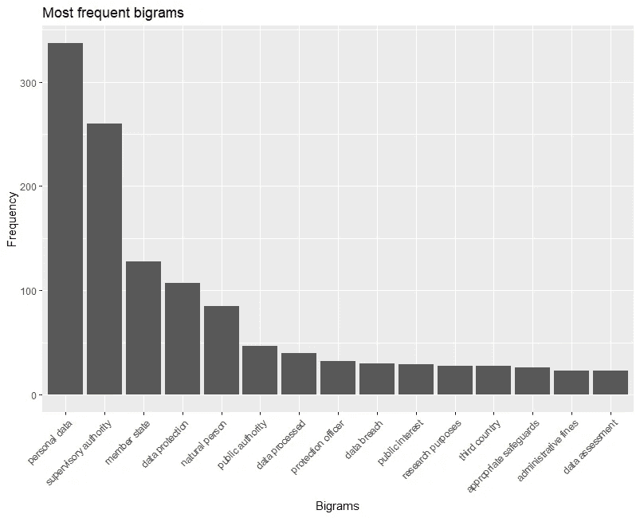
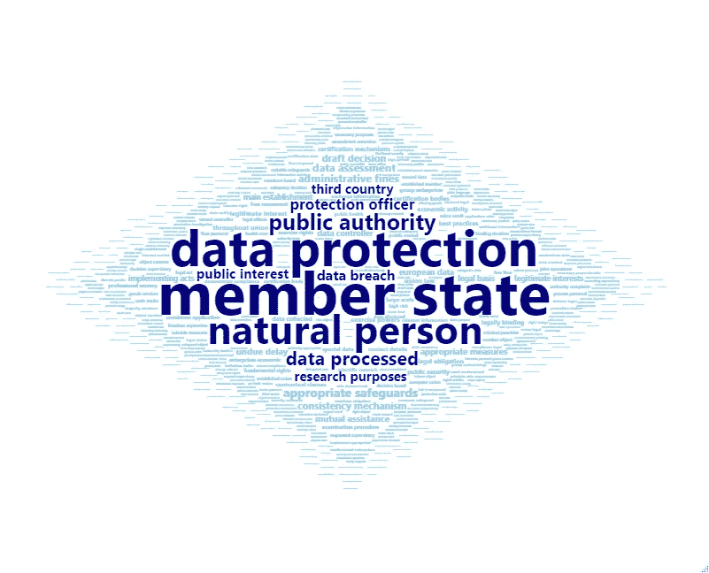

# 欧盟通用数据保护法规的二元模型分析

> 原文：<https://towardsdatascience.com/a-bigram-analysis-of-the-eu-general-data-protection-regulation-33685e32bde7?source=collection_archive---------44----------------------->

## 用单词云可视化

图片由[穆罕默德·哈桑](https://pixabay.com/users/mohamed_hassan-5229782/?utm_source=link-attribution&utm_medium=referral&utm_campaign=image&utm_content=3256079)拍摄，来自[皮克斯拜](https://pixabay.com/?utm_source=link-attribution&utm_medium=referral&utm_campaign=image&utm_content=3256079)

《通用数据保护条例》( GDPR)于 2018 年 5 月实施，是欧盟乃至全世界迄今为止最全面的数据保护法。在这篇面向初学者的教程中，我将使用 RWeka 把 GDPR 的语料库可视化成 R 语言的 bigram 单词云。

## **字云及其弱点**

文字云是一个简单而强大的文本可视化工具。它允许您根据关键字在数据集中出现的频率，按比例打印不同大小的关键字。这是直观的和视觉上令人愉快的。但致命的是，它断章取义。

例如，在上面的表示中，很容易理解“权威”是我们数据集中的一个突出的词。但是，因为它已经被剥离了周围的词，我们不知道它是在“宣战权”中作为权利使用，还是在“地方权力”中作为政府机构使用，还是在“有约束力的权力”中作为引用来源使用。

## **二元模型和 GDPR**

缓解这个问题的一个方法是制作一个两个单词的单词云。当然，即使是*二元词*——技术上称为双词复合词——也不能完全捕捉原始完整句子文本数据的细微差别和上下文。但幸运的是，GDPR 的许多核心概念通常由两个词组成:

*   [监督机构](https://gdpr-info.eu/art-51-gdpr/):监督 GDPR 在欧盟成员国的应用的公共机构
*   [一致性机制](https://gdpr-info.eu/art-63-gdpr/):确保 GDPR 在整个欧盟范围内统一适用的合作体系
*   [合法利益](https://gdpr-info.eu/art-6-gdpr/):处理个人数据的六个合法理由之一

因此，进行二元语法分析而不是默认的一元语法分析是可取的，这将在语义上撕裂那些只有在复合形式下才有意义的概念。

## **数据导入和语料库创建**

让我们从安装和加载必要的包开始。

`tm`包是一个广泛使用的文本挖掘工具，用于提炼原始文本数据。同样，`RWeka`是一个简化复杂的预处理技术和其他机器学习算法的接口。在本教程中，我将专门使用它来将成对的单词组合成二元模型。然后我们将使用`ggplot2`绘制一个探索图，最后打印我们的单词云。

首先，加载文本数据并检查是否一切都完好无损。正文以该法案的官方长标题开始，以时任欧盟理事会主席的名字结束。

检查数据的前几行和后几行总是一个好习惯。

然后，我们使用`VCorpus()`函数创建一个语料库。一个[语料库](https://cran.r-project.org/web/packages/tm/vignettes/tm.pdf)是一个抽象结构，当我们使用`tm`包时，它保存文档。在硬件层面上，`VCorpus`(易失性语料库)将文档存储在内存中，而`PCorpus`(永久性语料库)则利用单独的数据库。对于我们的目的来说，`VCorpus`已经足够了——只是要记住，在清除内存或关闭 RStudio 时，corpus 对象将会丢失。

我们现在已经从文本文件创建了一个语料库，并准备挖掘。

## 预处理

正如我们从上面的`head()`和`tail()`函数的结果中看到的，在机器看来，原始文本数据充满了拼写不一致。有数字、标点符号和大写字母，文本似乎也是双倍行距。我们将把它和`tm`包统一起来，使它更容易使用。

`tm_map()`函数是简单文本细化的银弹。通过在第二个参数中提供不同的参数，如`removeNumbers`和`removePunctuation`，该函数从语料库中删除数字和标点符号。为了改变内容而不是简单地删除，例如从大写变成小写，我们使用`content_transformer()`。

然后是停用词。停用词是由于它们在自然语言源中的语义可忽略性而应该被过滤掉的词。尽管它们缺乏实质意义，但它们经常在一篇文章中出现多次，并扭曲了频率分析的结果。例子包括冠词“the”和“a/an”以及介词“on”、“of”和“about”。"

`tm`包提供了一组不同语言的校对过的停用词。为了访问英语集，我们将参数设置为`stopwords()`中的`"english"`。因为这里只包含了最常见的例子，所以我添加了一组自定义的停用词。使用`removeWords`，选择的停用词将被删除。最后，通过`stripWhitespace`，我们去除了语料库中的空行和空格。

同一文本的第 21 行现在看起来“干净”了，可以让`RWeka`包捆绑成有意义的二元模型。

然而，在我们继续之前，我们还必须执行基本的引理运算，以防止将同一个单词的不同形式作为单独的单词进行计数。词条释义是将一个单词的词形变化合并成标准词典形式的过程。例如，它可以帮助我们的机器将“runs”、“ran”和“running”都视为“run”的规范实例。

有像 [textstem](https://cran.r-project.org/web/packages/textstem/textstem.pdf) 这样的 R 包来促进这个过程。请随意试验它们，但是请记住，一些 lemmatisation 函数可能弊大于利。例如，他们可能会将“通用数据保护条例”变成“通用数据保护条例”在我们的例子中，我们想要做的就是将某些二元模型的复数形式视为单数，因此不值得冒这种破坏性改造的风险。

为了用单数形式替换复数形式，我们提供了`gsub`函数作为`content_transformer()`的参数。`pattern`参数接收要替换的字符模式，而`replacement`参数定义如何改变该模式。

不幸的是，`RWeka`包并不评估二元模型的语义可行性，而是简单地返回它在语料库中可以识别的每个词对。检查最重要的结果并消除无意义的分组是非常重要的。

## 符号化

为了用`[RWeka](https://cran.r-project.org/web/packages/RWeka/RWeka.pdf)`生成二元模型，必须对语料库进行标记。记号化是将字符串分割成称为记号的更小单元的过程。令牌可以是一个单词、几个单词、一个句子或任何其他逻辑片段。在我们的二元模型分析中，一个 token 应该由两个单词组成，所以在`NGramTokenizer()`中`Weka_control()`的`min`和`max`参数中，分别输入`2`。

然后，我们将数据塞进一个[文档术语矩阵](https://www.rdocumentation.org/packages/tm/versions/0.7-7/topics/TermDocumentMatrix)，这是一个数学矩阵，将术语的频率组织成行和列。接下来，按降序对矩阵进行排序，从最频繁到最少排列术语。前十名和后十名的结果如下:

我们已经成功地从语料库中提取出二元模型。

## 使用 ggplot2 进行探索性可视化

让我们用一个带`ggplot2`的条形图来简单地想象一下。

这是一个柱状图，显示了 15 个最常见的二元模型。我将 x 轴标为“二元模型”，y 轴标为“频率”，并沿着 x 轴调整了术语的位置和角度。

图表显示了前两个二元模型的压倒性出现。这意味着我们的词云将既不平衡也不漂亮，但在世界上最广泛的个人数据立法中有太多的“个人数据”调用可能并不令人惊讶。

## 词云

接下来让我们打印出 word cloud。首先，我们按原样打印所有内容，以检查数据的形状，然后，将最小频率设置为 2，以丢弃只出现一次的统计上无关紧要的二元模型。最后，我们可以应用一些格式，用深蓝色强调出现超过 20 次的主要二元模型，而用浅蓝色保留其余部分。

#全部打印

#最小尺寸 2

#颜色编码

如果我们暂时将前两个数据点视为异常值，我们也可以得出如下表示:

众所周知，bigram 词云没有克服词云或频率分析的固有缺点。然而，它们可以为文本提供双重有趣的洞察力。