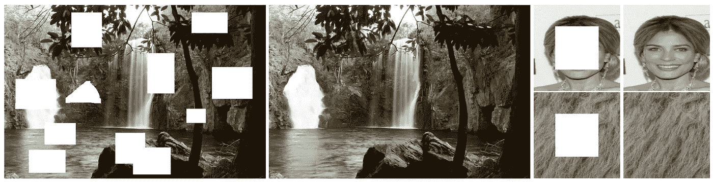
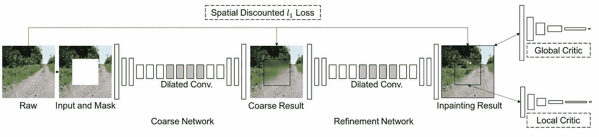
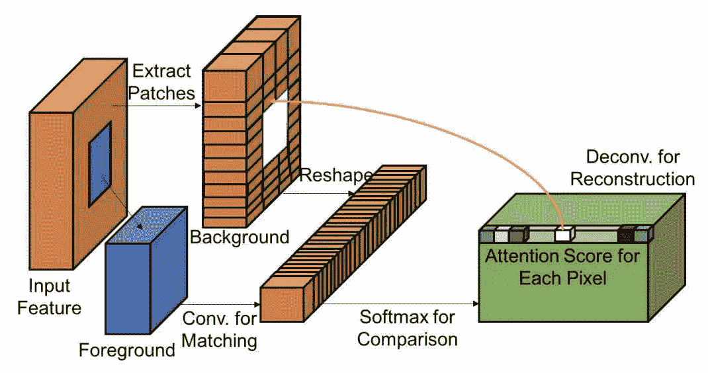
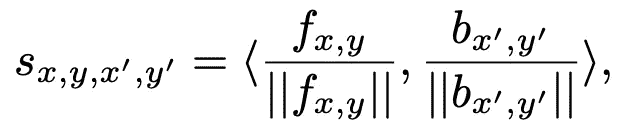
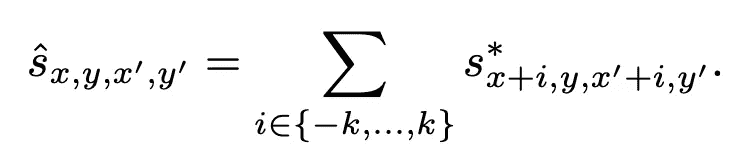
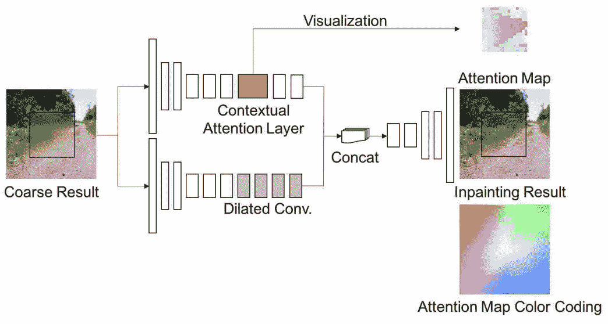
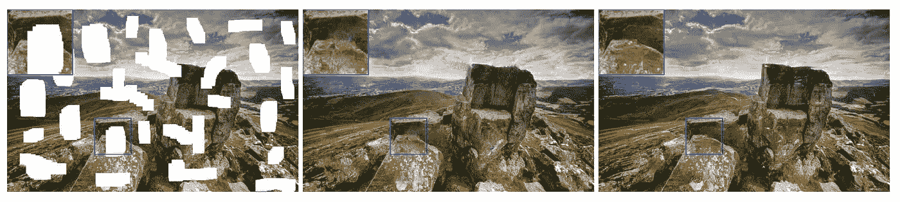
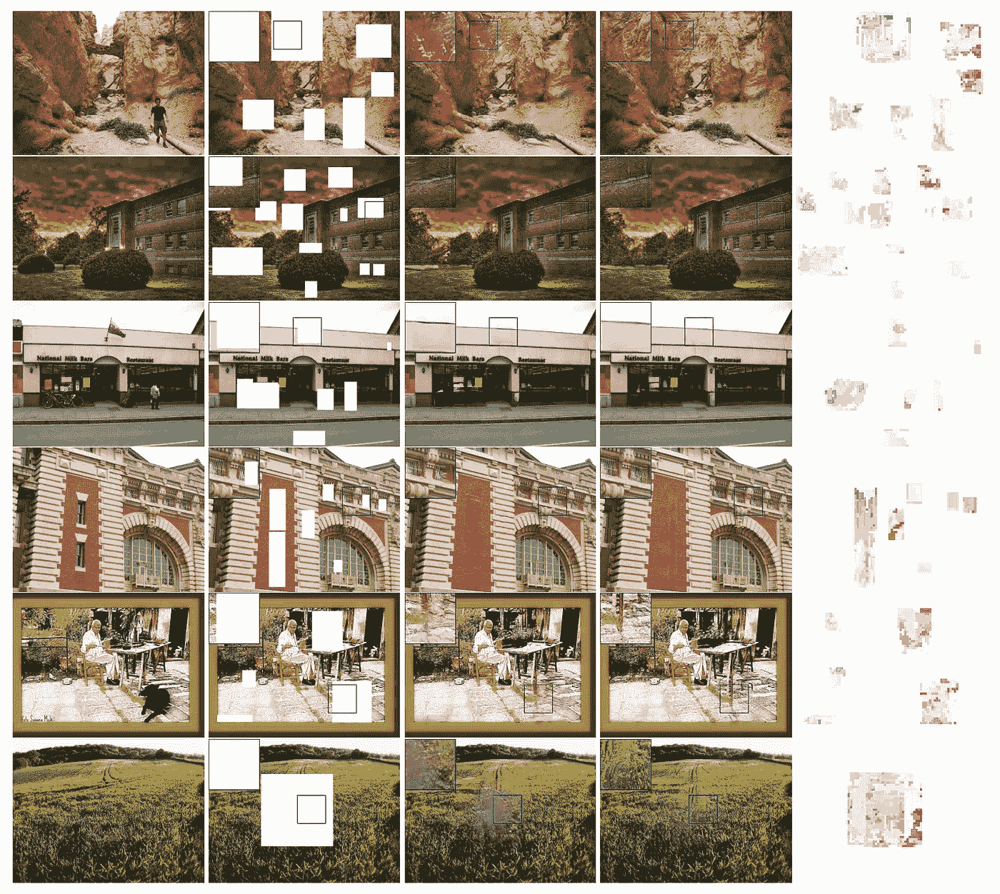
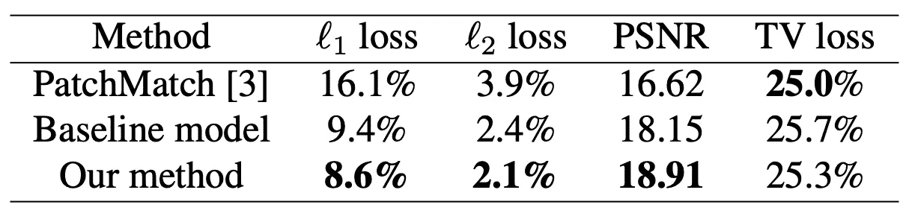
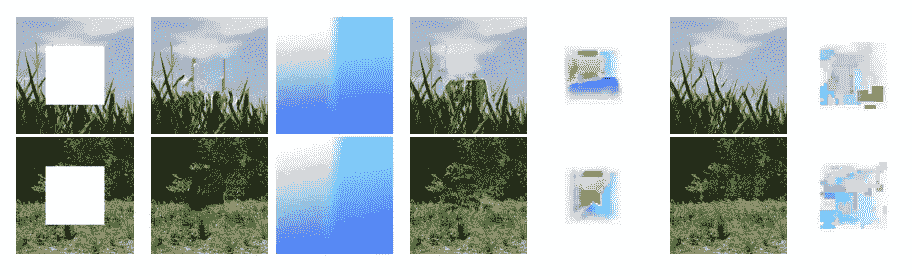

# 深层图像修复的突破

> 原文：<https://towardsdatascience.com/a-breakthrough-in-deep-image-inpainting-review-generative-image-inpainting-with-contextual-1099c195f3f0?source=collection_archive---------24----------------------->

## 基于上下文关注的生成式图像修复综述

欢迎回来伙计们！很高兴见到你们:)上一次，我们意识到复制粘贴是如何嵌入 CNN 进行深度图像修复的。你能领会主旨吗？如果是的话，很好！如果没有，不用担心！今天，我们将深入研究深层图像修复的突破，为此提出了上下文注意。通过使用上下文注意，我们可以有效地从遥远的空间位置借用信息来重建局部缺失的像素。这个想法实际上和复制粘贴差不多。让我们看看他们如何一起做到这一点！

# 回忆

在[我之前的帖子](/how-copy-and-paste-is-embedded-in-cnns-for-image-inpainting-review-shift-net-image-433a2a93c963)中，我已经介绍了**移动连接层**，其中来自已知区域的 ***特征作为缺失区域内生成特征的参考，以允许我们进一步细化生成的特征，从而获得更好的修复结果*** 。这里，我们假设所生成的特征是对基本事实的合理估计，并且根据来自已知区域的特征和缺失区域内所生成的特征之间的相似性来确定合适的参考。

# 动机

对于图像修复任务， ***细胞神经网络的结构不能有效地模拟缺失区域和由遥远的空间位置*** 给出的信息之间的长期相关性。如果你熟悉 CNN，你应该知道核大小和扩张率控制卷积层的感受野，网络必须越来越深，才能看到整个输入图像。这意味着 ***如果我们想要捕捉图像的上下文，我们必须依赖更深的层，但我们会丢失空间信息，因为更深的层总是具有更小的空间尺寸特征*** 。因此，我们必须找到一种方法，在不深入网络的情况下，从遥远的空间位置借用信息(即理解图像的上下文)。

如果你记得什么是扩展卷积(我们在[之前的](/a-milestone-in-deep-image-inpainting-review-globally-and-locally-consistent-image-completion-505413c300df)文章中已经讨论过)，你会知道扩展卷积是一种在早期卷积层增加感受野的方法，而不需要增加额外的参数。然而， ***扩张卷积有其局限性。它跳过连续的空间位置，以便扩大感受野*** 。注意，跳过的连续空间位置对于填充缺失区域也是至关重要的。

# 介绍

这项工作分享了类似的网络架构，损失函数和相关技术，我们已经涵盖了前[。对于架构， ***提出的架构由两个发生器网络和两个鉴别器网络*** 组成。这两个生成器遵循具有扩展卷积的全卷积网络。一个生成器用于粗略重建，另一个用于精细重建。这被称为标准的由粗到细的网络结构。 ***两个鉴别器也同时全局和局部查看完成的图像*** 。全局鉴别器将整个图像作为输入，而局部鉴别器将填充区域作为输入。](/a-milestone-in-deep-image-inpainting-review-globally-and-locally-consistent-image-completion-505413c300df)

对于损失函数，简单地说，他们也采用对抗损失(GAN 损失)和 L1 损失(为了像素重建精度)。对于 L1 损失，他们使用一个 ***空间折扣 L1 损失*** ，其中为每个像素差异分配一个权重，该权重基于一个像素到其最近的已知像素的距离。对于 GAN 损失，他们使用一个 ***WGAN-GP 损失*** 而不是我们介绍的最标准的对抗性损失。他们声称，这种 WGAN 对抗损失也是基于 L1 距离度量的，因此网络更容易训练，并且训练过程更稳定。

在这篇文章中，我想重点介绍一下提出的*。因此，我在上面简要介绍了由粗到细的网络架构、WGAN 对抗性损耗和加权 L1 损耗。感兴趣的读者可以参考我之前的帖子和本作的[论文了解更多详情。](https://arxiv.org/pdf/1801.07892.pdf)*

# *解决方案(简而言之)*

***提出了 ***上下文注意***机制，有效地从遥远的空间位置借用上下文信息来重建缺失像素** 。上下文关注被应用于第二细分网络。第一粗略重建网络负责丢失区域的粗略估计。和前面一样，全局和局部鉴别器被用来鼓励生成像素的更好的局部纹理细节。*

# *贡献*

**

*图一。在自然场景、人脸和纹理图像上的修复结果的一些例子。图片来自于佳卉等人的[论文](https://arxiv.org/pdf/1801.07892.pdf) [1]*

*本文中最重要的思想是**上下文注意**，它允许我们利用来自遥远空间位置的信息来重建局部缺失像素。第二， **WGAN 对抗损失**和**加权 L1 损失**的使用提高了训练的稳定性。此外，所提出的修复框架在各种数据集(如自然场景、人脸和纹理)上实现了高质量的修复结果，如上图 1 所示。*

# *方法*

**

*图二。所提出的修复框架的网络结构。图片来自于佳卉等人的[论文](https://arxiv.org/pdf/1801.07892.pdf)*

*图 2 显示了所提出的修复框架的网络架构。如上所述，它由**两个发生器**和**两个鉴别器**组成。如果你读过我以前的帖子，你会发现这是典型的深层图像修复网络架构。*

# *语境注意*

*这是这篇文章的重点。让我们看看所提出的上下文注意层是如何被设计来借用由遥远空间位置处的已知区域给出的特征信息来在缺失区域内生成特征的。*

**

*图 3。提议的上下文注意层的图示。图片来自于佳卉等人的[论文](https://arxiv.org/pdf/1801.07892.pdf)【1】*

*图 3 以图形方式展示了所提议的上下文关注层。 ***运算可微且全卷积*** 。*

**

*图 4。上下文注意力层的更具体的例子。图片作者。*

*图 4 是提议的上下文注意层的更详细的例子。如图 3 所示，前景表示缺失区域内生成的特征，而背景表示从已知区域提取的特征。类似于复制粘贴的方法，我们首先要 ***将缺失区域内生成的特征与缺失区域外的特征*** 进行匹配。*

*以图 4 为例，缺失区域内生成的特征大小为 64×64×64，假设缺失区域外的特征分为 128 个大小为 64×3×3 的小特征块。请注意，本例中特征的通道大小为 64。然后，利用 128 个小特征块和缺失区域内生成的特征进行卷积，得到大小为 128×64×64 的特征图。在论文中，这种操作被描述为，*

**

*其中{ *f* _ *x* ， *y* }为前景补片(缺失区域内生成的特征补片)，{*b*_*x’*，*y’*}为背景补片(缺失区域外提取的特征补片)。 *s* _ *x* ， *y* ，*x’*，*y’*是生成的以缺失区域为中心的面片( *x* ， *y* )与以已知区域为中心的已知面片(*x’*，*y’*)之间的相似度。实际上，这是一个标准的余弦相似性度量过程。*

*当我们沿着通道维度观察时，128 个元素代表了所有已知补片和缺失区域内特定位置之间的相似性。这反映了 128 个已知斑块对该位置的贡献。然后，我们沿着通道维度对特征图执行 Softmax 归一化，如图 4 中蓝色区域所示。在 Softmax 归一化之后，沿着通道维度的每个位置的总和应该是 1。*

> *与我在[上一篇文章](/how-copy-and-paste-is-embedded-in-cnns-for-image-inpainting-review-shift-net-image-433a2a93c963)中提到的移位网相比，你可以看到，这次我们为每个已知特征块分配了一个权重，以表明它对于重建缺失区域内每个特征位置的重要性(**软分配**)，而不是只保留与缺失区域内每个特征位置最相似的已知特征块(**硬分配**)。这也是为什么提出的语境注意是可微的原因。*

*最后，我们使用注意特征图作为输入特征，使用已知补丁作为核，通过反卷积来重建缺失区域内的生成特征。对于对实际实现感兴趣的读者，可以访问他们的 [github 项目页面](https://github.com/JiahuiYu/generative_inpainting/tree/v1.0.0)了解更多细节。*

# *注意力传播*

*注意力传播可以被视为注意力特征图的微调。这里的关键思想是 ***相邻像素通常具有更接近的像素值*** 。这意味着他们考虑邻域的关注值来调整每个关注分数，*

**

*例如，如果我们考虑左右邻居的关注值，我们可以使用上面列出的等式来更新当前的关注值。注意 *k* 控制要考虑的邻居数量。*

*作者声称，这可以进一步改善修补结果，并且这也可以通过以单位矩阵作为核的卷积来完成。*

*关于注意机制的另一点是，使用了两种技术来控制提取的已知特征补丁的数量。 ***i)*** 提取步幅较大的已知特征面片，减少核的数量。 ***ii)*** 操作前对特征图大小进行下采样，得到关注图后再进行上采样。*

# *网络注意力*

**

*图 5。在第二细化网络中嵌入上下文注意层的图示。图片来自于佳卉等人的[论文](https://arxiv.org/pdf/1801.07892.pdf) [1]*

*图 5 显示了作者如何将提出的上下文关注层整合到第二个细化网络中。你可以看到 ***又引入了一个分支来应用上下文关注，然后两个分支被连接起来以获得最终的修复结果*** 。注意力地图颜色编码用于可视化注意力地图。例如，中间的白色表示像素聚焦于自身，粉色在左下区域，绿色在右上区域，等等。你可以看到这个例子有一个粉红色填充的注意力地图。这意味着填充区域从左下区域借用了很多信息。*

# *实验*

*作者首先与我们之前介绍过的[之前的最新技术](/a-milestone-in-deep-image-inpainting-review-globally-and-locally-consistent-image-completion-505413c300df)进行了比较。*

**

*图 6。提议的基线模型与 GLCIC 的比较[2]。从左至右，输入图像、GLCIC 结果和基线结果。图片来自于佳卉等人的论文*

*图 6 显示了所提出的基线模型和之前的最新技术 GLCIC [2]的修复结果。提议的基线模型如图 2 所示，没有提议的上下文注意分支。很明显，基线模型在局部纹理细节方面优于 GLCIC。请放大以便看得更清楚。*

**

*图 7。基线和完整模型修复结果的视觉比较。从左到右，地面实况、输入图像、基线结果、全模型结果、全模型注意力图。图片来自于佳卉等人的[论文](https://arxiv.org/pdf/1801.07892.pdf) [1]*

*图 7 显示了在 Places2 数据集上使用基线模型和完整模型(注意上下文)的定性结果。很明显，完整模型提供了更好的修复结果，具有精细的局部纹理细节。这反映了上下文注意层可以有效地从远处的空间位置借用信息来帮助重建丢失的像素。请放大以获得更好的视图，尤其是注意力地图。*

**

*表 1。Places2 数据集上不同方法的定量比较。表由于佳卉等人从他们的[论文](https://arxiv.org/pdf/1801.07892.pdf) [1]*

*表 1 列出了一些客观的评估指标供参考。如前所述，这些度量不能完全反映修补结果的质量，因为有许多可能的解决方案来填充缺失区域。你可以看到，建议的完整模型提供了最佳的 *l* 1、 *l* 2 损耗和 PSNR。对于电视损耗，PatchMatch 提供了更低的电视损耗，因为它直接复制原始图像补丁来填充孔洞。*

*作为参考，建议的全模型有 2.9M 参数。对于 512×512 大小的图像，在 GPU 上每张图像需要 0.2 秒，在 CPU 上每张图像需要 1.5 秒。*

# *消融研究*

*注意机制不是一个新的想法，在文献中有几个注意模块。作者做了使用不同注意力模块的实验。*

**

*图 8。使用不同注意模块的修复结果。从左到右:输入、使用空间变换网络的结果、使用外观流的结果、以及使用提议的上下文注意的结果。图片来自于佳卉等人的[论文](https://arxiv.org/pdf/1801.07892.pdf)*

*作者对比了文献中两个著名的注意模块，即空间变换网络[3]和表象流[4]。简单来说，对于外观流，使用卷积层来代替上下文注意层，以直接预测 2D 像素偏移作为注意。这意味着我们添加了一个卷积层来预测已知像素向缺失像素的偏移。在图 8 中，您可以看到使用外观流(中间)的结果为不同的测试图像提供了相似的注意力图。这意味着注意力地图对于给予我们想要的“注意力”没有用。您还可以观察到，空间转换器网络(左)无法为图像修复任务提供有意义的注意力图。一个可能的原因是空间变换网络预测全局仿射变换的参数，这不足以帮助填充也需要局部信息的缺失区域。在这里，我没有深入探讨不同的注意力模块。感兴趣的读者可以参考报纸了解更多的细节。*

***选择 GAN 损失进行图像修复**。作者实验了不同的 GAN 损失，例如 WGAN 损失、典型对抗损失和最小平方 GAN。他们凭经验发现，WGAN 损失提供了最好的修复结果。*

***基本重建损失**。作者在没有 L1 损失的情况下训练精化网络。他们发现，L1 损失是必要的，以确保像素重建精度，即使 L1 损失使修补结果模糊。因此，L1 损失对于确保完整图像的更好的内容结构是至关重要的。*

***感性丧失、风格丧失、电视丧失**。我们将很快涵盖感知损失和风格损失。这里一个简单的结论是，这三个损失并没有给修复结果带来明显的改善。因此，他们的模型仅使用加权 L1 损耗和 WGAN 损耗来训练。*

# *结论*

*显然，本文的核心思想是语境注意机制。上下文关注层嵌入在第二细化网络中。注意，第一粗略重建网络的作用是对缺失区域进行粗略估计。这种估计用于上下文注意层。通过匹配缺失区域内的生成特征和缺失区域外的特征，我们可以知道缺失区域外的所有特征对缺失区域内每个位置的贡献。注意，上下文注意层是可微分的和完全卷积的。利用提出的上下文注意，他们实现了最先进的修复结果。*

# *外卖食品*

*你可能会发现，我们正在越来越深入到深层图像修复领域。在我之前的文章中，[转移连接层](/how-copy-and-paste-is-embedded-in-cnns-for-image-inpainting-review-shift-net-image-433a2a93c963)被介绍，它以硬分配的形式将复制粘贴的概念嵌入到 CNN 中。本文以软分配的形式制定了上下文注意层，使得该层是可微分的，并且可以在不修改梯度计算的情况下端到端地学习。*

*希望你能掌握本文提出的情境注意层的关键思想，尤其是它的提法如图 3 和图 4 所示。对于想了解更多网络架构和损失函数的读者，请参考[论文](https://arxiv.org/pdf/1801.07892.pdf)。*

# *下一步是什么？*

*在以后的文章中，我们将会研究更多的特定任务修复技术。希望我们能一起学习和享受！*

# *参考*

*[1]，林哲，，沈晓辉，路欣，，*Proc .计算机视觉与模式识别* ( *CVPR* )，2018。*

*[2]饭冢聪，埃德加·西莫-塞拉，石川宽，“[全局和局部一致的图像完成](http://iizuka.cs.tsukuba.ac.jp/projects/completion/data/completion_sig2017.pdf)， *ACM Trans .论图形*，第 36 卷，№4，第 107 条，出版日期:2017 年 7 月。*

*[3] M. Jaderberg，K. Simonyan，A. Zisserman 等人，“[空间变换网络](https://arxiv.org/abs/1506.02025)”，载于《神经信息处理系统进展》，2017–2025 页，2015 年。*

*[4] T. Zhou，S. Tulsiani，W. Sun，J. Malik 和 A. A. Efros，"通过外观流的视图合成[，" *Proc .2016 年欧洲计算机视觉会议* ( *ECCV* )。](https://arxiv.org/abs/1605.03557)*

*再次感谢你阅读我的帖子！如果您有任何问题，请随时给我发电子邮件或在这里留言。*

*事实上，我尽量缩短文章的长度，只关注文章的一个关键观点。我认为读者已经从我以前的帖子中了解了深层图像修复的基本知识。顺便说一下，我必须不断提高我的写作技巧，以更有效地表达我对论文的理解。欢迎任何建议。系统学习对我们来说极其重要。非常感谢，下次再见！:)*