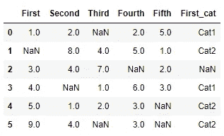
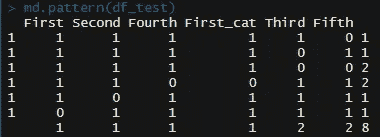
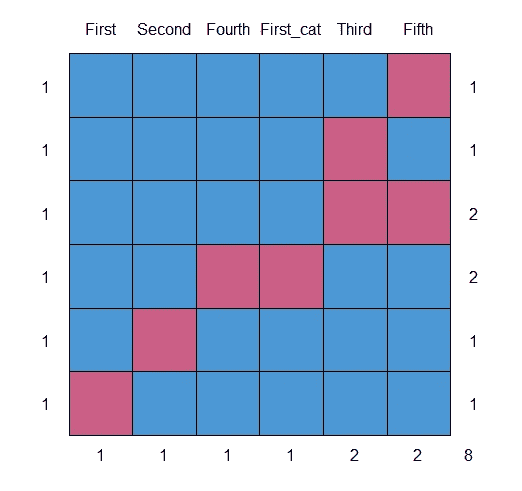
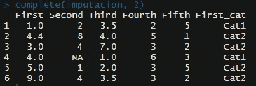
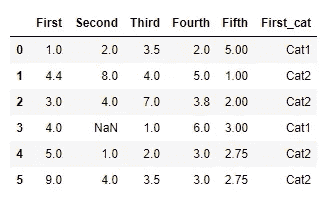

# 使用 Python 和 R 进行数据插补的简要指南

> 原文：<https://towardsdatascience.com/a-brief-guide-to-data-imputation-with-python-and-r-5dc551a95027?source=collection_archive---------33----------------------->

## 数据科学提示

## 让数据变得干净


[胡安·戈麦斯](https://unsplash.com/@nosoylasonia?utm_source=medium&utm_medium=referral)在 [Unsplash](https://unsplash.com?utm_source=medium&utm_medium=referral) 上拍照

我们都知道，数据清理是数据分析过程中最耗时的阶段之一。我们需要[获取缺失值](/7-idioms-to-acquire-missing-values-every-data-scientist-should-know-2edf4224360c)、[检查它们的分布](/handle-missing-data-with-r-10-daily-used-idioms-13d849d01690)，找出模式，并决定如何填充空间。此时，您应该意识到，缺失数据模式的识别和正确的插补过程将影响进一步的分析。所以，让我介绍一些常见分析语言的技巧:R 和 Python。

## 为什么数据丢失了？

在开始插补过程之前，我们应该首先获取数据，并找到缺失数据的模式或方案。简单地说，有两种类型的缺失数据:MCAR 和 MNAR。

MNAR(非随机缺失)是数据最严重的问题。这意味着，我们需要找到缺失功能之间的依赖关系，并开始数据收集过程。它提供了某种分析步骤，包括使用不同的数据源、分析连接和搜索替代数据。

MCAR(完全随机缺失)意味着缺失值中没有深层模式，因此我们可以利用这一点来决定是否可以移除或估算一些行/要素。这是我们可以处理的事情，但只能在经验范围内，因为可能有太多的缺失数据(占总记录的百分比)。

因此，为了便于说明，我们将使用下一个玩具示例:



我们可以看到对多个缺失值、数值和分类缺失值的影响。

## R 的力量

R 编程语言有一个很棒的社区，给 R 开发仓库增加了很多包和库。所以，这并不奇怪，我们有了[鼠标包](https://cran.r-project.org/web/packages/mice/index.html)。它包括许多与链式方程多元插补相关的功能([即 MICE 算法](https://www.ncbi.nlm.nih.gov/pmc/articles/PMC3074241/))。您可以深入[文档](https://cran.r-project.org/web/packages/mice/mice.pdf)了解细节，但我将给出基本示例。

首先，让我们看看上面提到的玩具示例中缺失数据的模式:

```
library(mice)
md.pattern(df_test)
```



Mice 包内置工具`md.pattern()`，显示缺失值的分布和缺失特征的组合。你可以在我之前的关于用 R 熟悉[缺失数据的文章中读到更多关于这个工具的内容。这个函数也给了我们一个很好的例子:](/handle-missing-data-with-r-10-daily-used-idioms-13d849d01690)



使用 mice-imputor 的工作分为两个阶段。在第一阶段，我们准备估算器，在第二阶段，我们应用它。

插补准备包括预测方法的选择以及在计算中包括/排除列。我们只需要通过`$method`属性重写必要列的默认插补方法。在我们的例子中，我们对第一列和第三列使用了`mean`(无条件均值)，对第五列使用了`pmm`(预测均值匹配)，对第四列使用了 norm(基于其他特征的贝叶斯线性回归预测)，对条件变量使用了`logreg`(对 2 值变量的逻辑回归预测)。关于`mice()`方法和命令`methods(your_mice_instance)`，请参见文档中的更多[。我们还从算法中排除了第二列。](https://www.rdocumentation.org/packages/mice/versions/2.25/topics/mice)

现在我们已经为第二阶段做好了准备:重用当前的 mice 实例作为实际估算器的输入值:

```
imputation <- mice(df_test, method=init$method, 
                            predictorMatrix=init$predictorMatrix, 
                            maxit=10,
                            m = 5,
                            seed=123)
```

MICE 软件包的一个主要特性是生成几个插补集，我们可以在进一步的 ML 模型中使用它们作为测试示例。因此，我们将能够选择最合适的设置。在我们的例子中，我们有`m=5`，所以算法生成 5 个估算数据集。你可以在这个包的作者的文章中阅读更多关于生成的数据集的工作和它们在你的 ML 管道[中的使用。](https://www.jstatsoft.org/article/view/v045i03)

最后一步是用估算数据集的具体数字运行算法:

```
imputed <- complete(imputation, 2)
```

您可以在 mice 实例的`$imp`属性中看到所有生成的集合。不过，我选择了第二个生成集:



## Pythonic 式的

在其他编程语言中，Python 拥有来自社区的最强支持。数据科学包有特别棒的代码库。你可能会在著名的 `[scikit-learn](https://scikit-learn.org/stable/modules/impute.html)` [包](https://scikit-learn.org/stable/modules/impute.html)里找到几种插补算法[。](https://scikit-learn.org/stable/modules/impute.html)

这个软件包也支持多变量插补，但正如文档所述，它仍处于实验阶段。那么，我们来看一个不那么复杂的算法:`SimpleImputer`。尽管如此，`sklearn`软件包的估算组件有更酷的特性，比如通过 K-nearest 算法进行估算，所以你可以在文档中自由地[探索它。](https://scikit-learn.org/stable/modules/impute.html)

我们将使用相同的玩具示例。当然，一个简单的插补算法并不那么灵活，给我们的预测能力也比较低，但它仍然可以处理这项任务。我将跳过缺失数据检查这一部分，因为它与前面的示例相同。不过，你可以在我的文章[中找到一些关于 Python](/7-idioms-to-acquire-missing-values-every-data-scientist-should-know-2edf4224360c) 中丢失数据的好习惯用法。

```
from sklearn.impute import **SimpleImputer**
impNumeric = **SimpleImputer**(missing_values=np.nan, strategy='mean')
impCategorical = **SimpleImputer**(missing_values=np.nan, 
                               strategy='most_frequent')
```

我们为每个数字列选择了`mean`策略，为分类列选择了`most_frequent`策略。你可以在`SingleImputer`的文档页面上阅读更多关于应用策略[的信息。您可能还注意到，`SingeImputer`允许设置我们视为缺失的值。进一步的过程比 R 中的要短得多:input 类和其他`sklearn`组件有相同的拟合转换过程。因此，我们再次为每一列设置插补策略(第二列除外):](https://scikit-learn.org/stable/modules/impute.html)

这是我们估算的数据集:



您可以自由地试验、比较和选择 R 和 Python 实现中最好的一个。

数据清理只是分析过程的开始，但是这个阶段的错误可能会对后续步骤造成灾难性的影响。清理数据，查看我的 Github 上的文章中的工作代码:

[](https://github.com/Midvel/medium_jupyter_notes/tree/master/data-imputation) [## 中级/中等 _jupyter_notes

### 此时您不能执行该操作。您已使用另一个标签页或窗口登录。您已在另一个选项卡中注销，或者…

github.com](https://github.com/Midvel/medium_jupyter_notes/tree/master/data-imputation) 

另外，请确保您没有错过我的其他数据清理文章:

[](/7-idioms-to-acquire-missing-values-every-data-scientist-should-know-2edf4224360c) [## 每个数据科学家都应该知道的获取缺失值的 7 个习惯用法

### 你应该把命令自动化

towardsdatascience.com](/7-idioms-to-acquire-missing-values-every-data-scientist-should-know-2edf4224360c) [](/handle-missing-data-with-r-10-daily-used-idioms-13d849d01690) [## 用 R: 10 日常习惯用法处理缺失数据

### 你应该把命令自动化

towardsdatascience.com](/handle-missing-data-with-r-10-daily-used-idioms-13d849d01690)