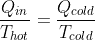
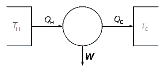
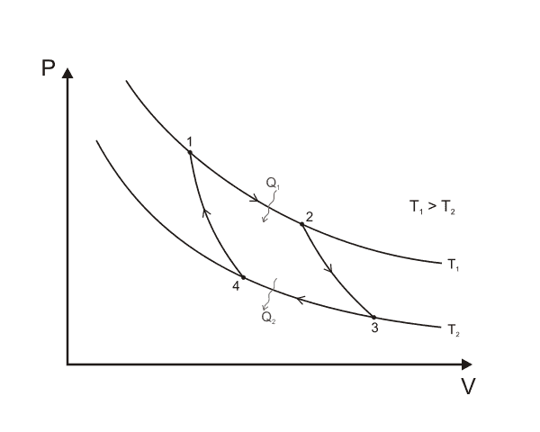
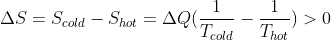
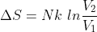
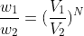
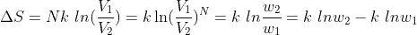
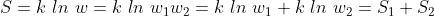
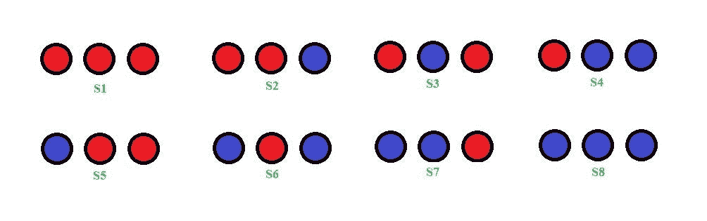
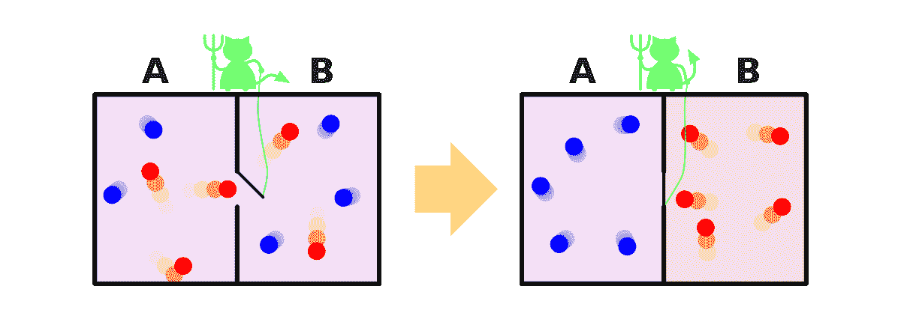

# 熵的简史:第一章

> 原文：<https://towardsdatascience.com/a-brief-history-of-entropy-chapter-1-9a2f1bc0d6de?source=collection_archive---------21----------------------->

虽然熵的概念是在从热力学角度研究系统的过程中引入的，但这一概念在多个不相关的领域激发了新的创新，其中最突出的是人工智能的计算机算法设计和通信系统的设计。加入我的这一系列文章，我将带你和我们的朋友熵一起踏上旅程，他将从热力学走向深度学习中使用的分类算法。

# **第一章:热力学**

19 世纪初，法国工程师萨迪·卡诺正在研究热机所做的功。经过一些详细的分析，他得出结论，任何热机，不仅需要一个热的身体，而且还需要一个温度较低的第二个身体来运行。在一个思想实验中，他设计了一种热机，它以最大可能的效率工作(每单位能量你从发动机得到的功)，任何发动机都可以以这种效率工作，这就是著名的卡诺热机。卡诺热机的细节可以在任何一本热力学标准书中找到。但我们最关心的是，在分析他的发动机时，卡诺意识到下面的等式成立:

等式 1

热机。图片提供:维基百科，【https://en.wikipedia.org/wiki/Carnot_cycle 

卡诺循环。图片提供:维基百科，[https://en.wikipedia.org/wiki/Carnot_cycle](https://en.wikipedia.org/wiki/Carnot_cycle)

也就是说，从热储器获取的热量与热储器的温度之比等于排出到冷储器的热量与冷储器的温度之比。他的发动机的另一个重要特性是发动机以可逆过程运行。这一性质来自于过程中没有耗散力的假设和卡诺循环的巧妙设计，由于卡诺循环，没有必要将循环的任何部分近似为准静态过程(总是平衡的过程)。因此，这种理论上的发动机没有任何能量损失的余地，这使得它很容易逆转……但它永远不可能达到完美的效率。

卡诺对可逆发动机的分析随后也得出结论，只有可逆发动机才能具有最大效率。但是，他的分析只适用于可逆过程，这在自然界中很少发现。因此，等式 1 对大多数现实生活中的过程都不成立，因为自然界中的大多数过程不会自行逆转。物体总是下落，永远不会自己上升……热量总是从热的物体流向冷的物体，而不是从冷的物体流向热的物体……自然界有很多这样的例子。在不可逆过程中，为什么自然总是喜欢它而不是可逆过程？

当我们无法解释一个过程时，我们该怎么办？我们让它成为一个构成法，一个把观察描绘成一个规则，并且说这个规则不能被违反的法律。这是热力学第二定律，至少当它由开尔文-普朗克和克劳修斯(独立地)阐明时是这样。总的来说，该定律表明，如果没有外力确保热量从冷的物体流向热的物体，热量就不能从冷的物体流向热的物体。这是自然界中一个明显的现象，没有人知道为什么会这样。这里我想强调外部代理的作用。因此，除非有外力介入这个过程，否则热量无法从冷的物体流向热的物体……这表明，前面提到的所有观察结果都只发生在系统没有被篡改的时候，或者用正式的术语来说，是一个封闭的系统。

解释我刚才的陈述的一种方式是假设外部因素以工作的形式影响系统。这给了我们克劳修斯对第二定律的陈述。但是，嘘嘘，在我们继续讨论之前，让我们看看熵作为一个概念是如何在这样的背景下诞生的…

## **熵的诞生**

热力学(至少在当时)是对系统状态变量的研究。卡诺方程(1)使克劳修斯在能量守恒定律和前者之间画出了平行线，并且他假设，也许，这个量 Q/T 在可逆过程中是守恒的。他将这个量称为熵(通常用 S 表示)，并声称这也是一个状态变量。酷！所以，熵在可逆过程中是守恒的。但是不可逆的呢？

让我们考虑一个不可逆的过程，即热量从热的物体传导到冷的物体。热物体熵的变化将为=(它损失的热量/热物体的温度)，而冷物体获得的熵=(它获得的热量/冷物体的温度)。记住热物体失去的热量和冷物体得到的热量是一样的，由这两个物体组成的系统的熵的总变化将是:

等式 2

因此，在这个不可逆过程中，熵增加了。请原谅，但在这里我必须扩展我的主张，即任何不可逆过程的熵都会增加。

好，我们定义可逆过程的熵为 Q/T，对于可逆过程，熵是守恒的。但是很明显，对于不可逆过程，熵是不守恒的。

根据所述的第二定律，我们的分析可以得出以下两个结论:

*   封闭系统的熵总是随时间而增加。一个封闭的系统只能有不可逆的过程发生，因为它不能有任何外部影响。
*   关于开放系统的熵，没有什么可说的。

到目前为止，我们只是列出了一些观察结果，作为我们不会违反的规则。那么我们能证明为什么这样的观察存在吗？这个问题的答案在于物质的运动论和气体的统计分析。

## **熵的概率解释**

到目前为止，没有人知道这个新提出的状态变量——熵——的本质，它是什么？我们能不能把它和现实生活中可以观察到的一些属性联系起来？在我们正式在概率和熵之间画出一些相似之处之前，让我们先对其建立一个直观的感觉。

假设一个容积为 V2 的容器里装着一种气体，现在它的体积是 V1。有一个分区阻止它，当删除该分区时，它会扩展到卷 V2。我们通过给它一些热量 Q 来确保这个过程是等温的，因为气体在膨胀过程中会趋于冷却。因此，与此过程相关的熵变为:

等式 3

其中 N 是参与膨胀的气体分子数，k 是玻尔兹曼常数。

用这个例子，我们可以基于概率解释熵的增加。在膨胀之前(就在隔板被抬起之后)，气体分子存在于 V1 体积中的概率是 V1/V2。在一个 V1 体积中出现两个分子的概率是(V1/V2)。因此，体积为 V1 的气体中存在 n 个气体分子的概率为(V1/V2)^N.)。膨胀后，气体分子占据体积为 V2 的气体分子的概率为 1。如果我们将 N 个气体分子存在于体积 V1 中的概率表示为 w1，将 N 个分子存在于体积 V2 中的概率表示为 w2，则它们的比率为:

等式 4

比较等式 3 和 4，

等式 5

## **玻尔兹曼公式**

1872 年，路德维希·玻尔兹曼发表了一个公式，其中他将系统在某一状态下的熵表示为与该状态概率的对数成比例。比例常数后来被称为玻尔兹曼常数。

等式 6

我们可以很快验证，等式 5 可以从等式 6 推导出来。

熵的这一新定义使熵的可加性显而易见。假设一个系统由处于状态 1(概率为 w1)和状态 2(概率为 w2)的两个子系统组成。整个系统处于这种状态的概率是 w1*w2。因此，这个系统的熵将是

等式 7

因此，系统的熵是其子系统熵的总和。

## **熵作为无序度的量度**

给定一个处于某种状态的系统，玻尔兹曼公式将其熵与该系统处于当前状态的可能性联系起来。概率越高，熵越高。所以一个问题自然出现……*比其他状态更有可能出现的状态是什么？*

在我们进入上述问题之前，我们必须问自己一个更基本的问题。作为一个人，我所感知的系统状态是什么？这两种状态的区别是什么？让我们用一个例子来说明这一点:

假设我们有三个球，可以是以下两种颜色中的任何一种:红色或蓝色。因此，这种 3 球系统可以有以下 8 种配置:

作者图片

这 8 个状态中的每一个都不能进一步分解成状态。给这些基本状态的一个通俗术语是“微观状态”。现在的问题是，对你来说，什么构成了一种状态？你可以说，所有这些微观状态，至少有两个蓝色的球，是一种状态，其余的是另一种状态。是的，这是一个国家的有效定义。同时，另一个人可以说，对他来说，所有那些至少有一个蓝球的微观状态是一种状态，其余的是另一种状态。你看到了吗，一个人所感知的状态取决于他的目的和决定。顺便说一下，这些“虚构”的状态必须是微观状态的组合，通常被称为“宏观状态”。

尽管有绝对的自由来选择由自己喜欢的微观状态组成的状态，但我们作为人类(至少是我们大多数人)有敏锐的眼睛来观察这些微观状态中的模式，并为这些状态指定一个特殊的类别，称为“秩序”。例如，我认为所有红色和蓝色的球(S1 和 S8)都是“秩序”，因为观察这些状态对我来说是一种奇怪的满足，我相信我的许多人类同胞会很高兴地同意我的观点。但是最常发生的是我们人类认为的有序的子集，与我们认为的“无序”相比是非常小的。因此，在这种状态的二元分类中，系统更可能处于“无序”状态，而不是“有序”状态。

概率越高，熵越大，因此无序越大。

## **重温第二定律**

当熵被引入解释第二定律时，我们得出结论，对于一个封闭的系统，熵随时间而增加。这是第二定律的另一种说法。但是熵的概率性质告诉我们第二定律在多大程度上是正确的。热力学第二定律是概率性的，而不是像牛顿定律那样是确定性的。这是一个必然要遵循的规律，只有我们给这个系统足够的时间去遵循它。如果从长远来看，系统增加了它的熵，那么它在短时间内减少它的熵是允许的(对于那些读过丹·布朗的《起源》的人来说，这句话有很多共鸣:)。长跑有多长？我们不能说……对气体分子来说可以短到几纳秒，对某些其他系统来说可以是几年，但我们可以肯定的是，给定 **lot** 时间，熵会增加(这就是数学家所说的概率收敛)。

## **麦克斯韦妖**

1867 年，詹姆斯·克拉克·麦克斯韦(没错，就是提出四个电磁方程的那个人)提出了一个思想实验，这个实验提出了违反热力学第二定律的一种可能方式。他的实验如下:

麦克斯韦的恶魔。图片提供:维基百科，【https://en.wikipedia.org/wiki/Maxwell%27s_demon 

考虑一个装有一定温度气体的容器。容器在中间被隔开，壁上只有一个门，在任何给定的时间只有一个气体分子可以通过。现在麦克斯韦提出让一个有智慧的生物(恶魔)站在门的旁边，在所有从左边部分接近门的分子中，只允许那些比某个阈值速度快的分子移动到右边部分，同时在所有从右边部分接近门的分子中，只允许那些比某个阈值速度慢的分子移动到左边部分。

现在你需要明白这样一个存在的后果。但在此之前，有没有可能这样的存在是有能力存在的？是的，很明显；我们这些做决定的人就是这类人的一个很好的例子。让我们看看恶魔在我们的容器里做了什么。恶魔充当了过滤器的角色，将速度较快的分子与速度较慢的分子分离开来。所以，本质上，它创造了秩序。同样在分离过程中，较快的分子聚集在容器的一侧，而较慢的分子聚集在另一侧。右边分子的平均动量高于左边分子的平均动量，直接暗示右边的温度高于左边的温度。那么这个恶魔完成了什么？

*   它创造了秩序，因此减少了熵
*   它产生了一个温度梯度，从而能够从系统中提取功

但是恶魔完成这一壮举的代价是什么？

这个问题是麦克斯韦思想实验的症结所在。我们很容易认为恶魔不是系统的一部分，并认为容器是一个开放的系统，因此外部干扰是允许的，因此如果熵减少就完全没问题。但是如果我们强迫自己认为恶魔是我们系统的一部分，这个论点就失败了，这是完全正当的，因为我们可以完全自由地选择构成我们系统的东西。

另一个容易受骗的论点来自第二定律的概率性质，即它允许熵减少，至少在短时间内。但人们可以很容易地得出结论，这个系统中的熵永远不会增加，因为恶魔一直在努力分离分子，并将永远继续这样做。

如果由容器和恶魔组成的系统是开放的，那么漏洞在哪里？这个系统是如何获得能量在自身内部创造秩序的？但是如果这个系统是封闭的…如果我们把热力学第二定律视为神圣不可侵犯…这里到底发生了什么？这里有一个相关的问题:

> 你不认为恶魔需要某种方法来获取关于分子速度的信息吗？难道这种方法会消耗能量，从而在这个“封闭系统”中产生泄漏吗？

这是 Leó Szilárd 在 1929 年提出的论点。他提出，恶魔需要某种手段来测量分子速度，这种获取信息的方法耗费能量。恶魔在消耗能量时，只能增加自己的熵，因为容器中气体的熵明显在减少。Szilard 认为恶魔的熵增加应该比容器中分离过程引起的熵减少更多。相当合理的解释！除了问题…增加妖的熵是什么意思？恶魔的哪一部分变得比以前更混乱了？在实验过程中，当我观察到电流表的读数后，我变得更加混乱，这意味着什么？

一个问题引出了其他几个问题。那么我来结束一下趋势……***观察数据是什么意思？***

在第 2 章中找出如何驱除麦克斯韦妖！