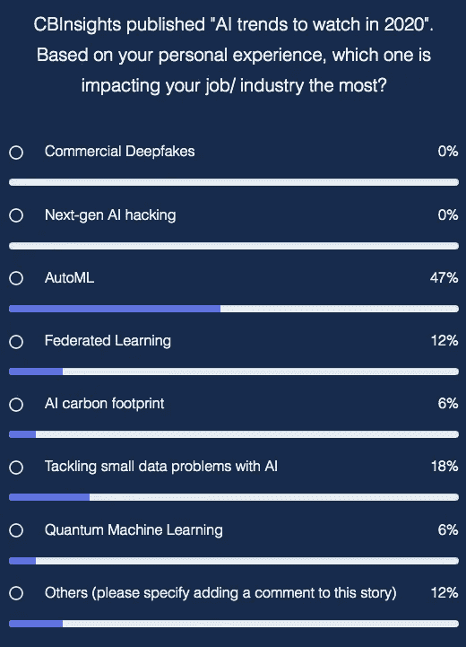
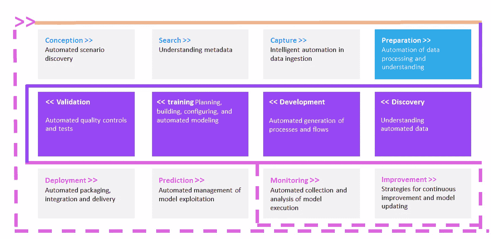
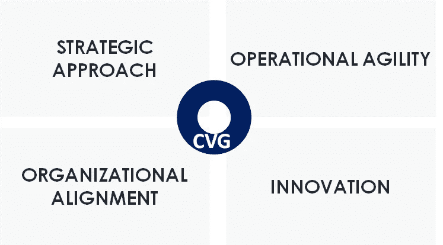
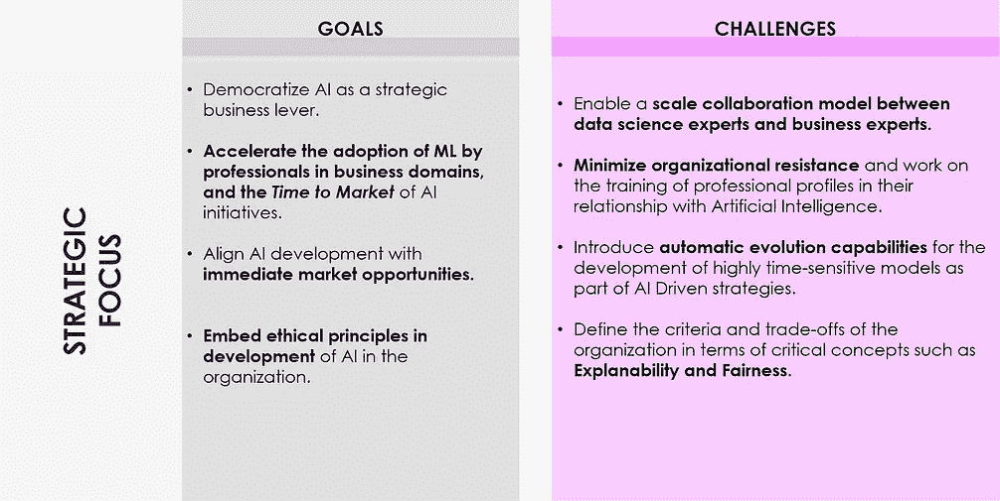
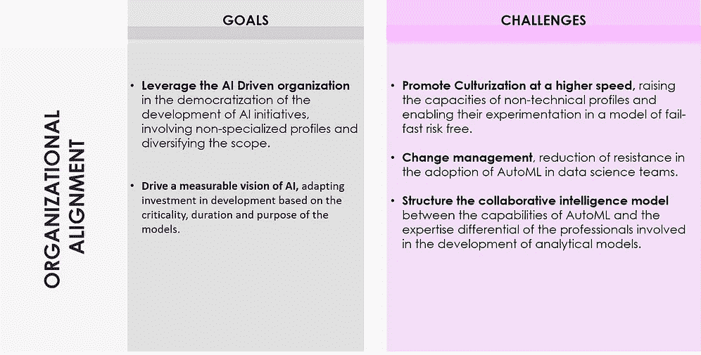
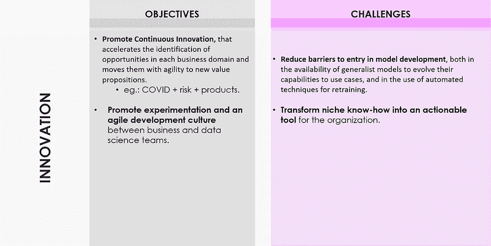
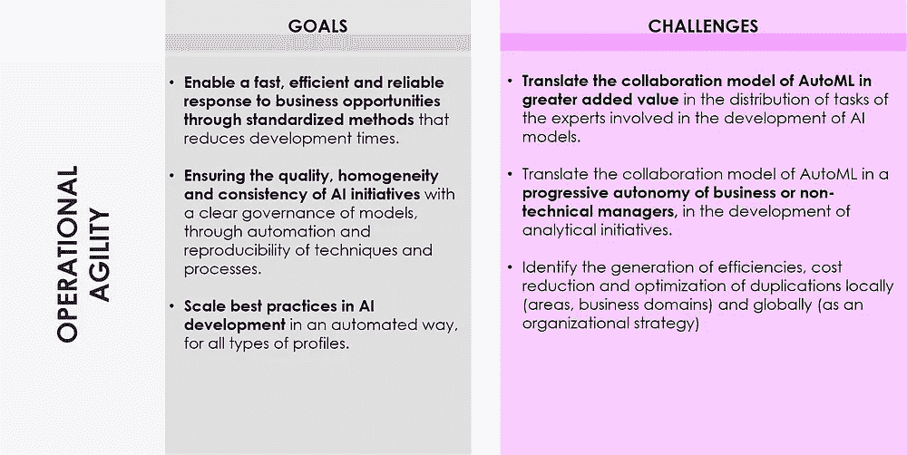
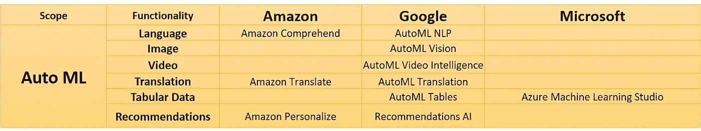

# AutoML 简介

> 原文：<https://towardsdatascience.com/a-brief-introduction-to-automl-4854c76877b6?source=collection_archive---------33----------------------->

## 我的读者选择 AutoML 作为在短时间内对他们的工作/行业影响最大的趋势。它是什么，你为什么要关心？

[【机器学习&人工智能](https://www.flickr.com/photos/152824664@N07/42271822770)由 [mikemacmarketing](https://www.flickr.com/photos/152824664@N07) 授权于 [CC BY 2.0](https://creativecommons.org/licenses/by/2.0/?ref=ccsearch&atype=rich)

在我的暑假期间，我偶然看到了一份名为“2020 年人工智能趋势观察”的 [CBInsights 报告](https://www.cbinsights.com/research/report/ai-trends-2020/#:~:text=Data%20for%20AI%20will%20be,language%20processing%20in%20understanding%20proteins.)。我很好奇我的同事和读者会怎么看待所选的趋势，所以我发起了一个[调查](https://medium.com/@dpereirapaz/ai-trends-to-watch-in-2020-863b355e7bb4?source=friends_link&sk=e93de1bf6bf4c68112d83e0de62652c0)，看看他们是怎么想的。我简单问了一个问题:“根据你的个人经历，哪一个对你的工作/行业影响最大？”这些是结果:

调查结果显示，AutoML 是迄今为止影响最大的趋势

调查结果很清楚:到目前为止，AutoML 是我的听众认为对他们的工作/行业影响最大的趋势。在这篇文章中，我将尝试向你介绍 AutoML 的概念，以及它在短期内对人工智能意味着什么。

## 什么是 AutoML？

AutoML 可以定义为一组工具，可以自动化用机器学习解决问题的过程。这样的过程包括几个需要该领域特定专业知识的步骤，例如数据预处理、特征工程、提取和选择。不仅如此，机器学习专家还必须选择正确的算法，并在超参数中执行优化任务，以最大限度地提高其准确性。

当与用于大规模开发和部署机器学习模型的 MLOps 方法和框架相结合时，AutoML 可以成为商业组织民主化 AI 的有趣工具。

一个典型的机器学习过程，其中 AutoML 可以帮助自动化步骤

## 为什么 AutoML 对一个愿意采用 AI 的公司有意思？

对于一个愿意加速采用的组织来说，AutoML 可以是常规机器学习项目的一个非常好的补充。我们可以确定其目标和挑战，并将它们分为四类，目的是为人工智能计划实现持续的价值生成:

AutoML 有利于人工智能的采用和大规模民主化的四个领域

对于其中的每一个领域，AutoML 都可以帮助实现与 AI 民主化和可扩展采用相关的目标。尽管如此，它也给组织带来了一些挑战，如下所列:

AutoML 的战略、组织、运营和创新目标及挑战

## AutoML 解决方案的现状如何？*

首先，值得注意的是，您可以找到不同种类的工具，这些工具可以归类为 AutoML。对它们进行分类的一种方法是，将专注于机器学习过程自动化的特定部分的那些和试图覆盖端到端的那些分开。对于后者，Forrester 在 2019 年发布了其[Forrester New Wave:Automation-Focused Machine Learning solutions](https://www.forrester.com/report/The+Forrester+New+Wave+AutomationFocused+Machine+Learning+Solutions+Q2+2019/-/E-RES143845)，其中得出结论，H20.ai 和 DataRobot 是最受欢迎的 AutoML 解决方案，正如 Forrester 提到的，它们是最成熟的解决方案之一。

虽然 Forrester 报告中没有提到，但我也将 Dataiku 列为顶级商业解决方案之一。

**数据机器人**

DataRobot 可能是 AutoML 最知名的商业解决方案，而[是人工智能领域的独角兽之一](http://forbes.com/sites/jilliandonfro/2019/09/17/machine-learning-startup-datarobot-raises-206-million/)，估值超过 10 亿美元。在这篇[博客文章](https://www.datarobot.com/blog/top-10-features-to-look-for-in-automated-machine-learning/)中，他们总结了你应该在 AutoML 解决方案中寻找的 10 个顶级特性(当然也是 DataRobot 提供的)，包括:

*   数据预处理
*   特征工程
*   多样的算法
*   算法选择
*   培训和调整
*   组装
*   面对面的模特比赛
*   人性化的见解
*   易于部署
*   模型监控和管理

DataRobot 的产品由四个独立的产品(自动机器学习、自动时间序列、MLOps 和 Paxata)组成，您可以通过多种方式使用这些产品，从托管云到私有云或混合云。你可以在这里找到[的详细内容](https://www.datarobot.com/platform/)。

**H2O.ai**

[H20.ai](https://www.h2o.ai/) 将 it 平台定义为“人工智能和机器学习领域的开源领导者，其使命是为每个人实现人工智能的民主化”。该公司提供了一个 [AutoML 包](https://www.h2o.ai/products/h2o-automl/)作为其开源平台的一部分，根据其网站，该包包括以下功能:

*   数据预处理，包括插补，一键编码，标准化。分类特征的特征选择和/或提取以及计数/标记/目标编码。
*   模型生成，包括笛卡尔或随机网格搜索和贝叶斯超参数优化。
*   合奏。

H2O.ai 还出售名为[无人驾驶 AI](https://www.h2o.ai/products/h2o-driverless-ai/) 的企业版，他们在其网站上用[架构图](https://www.h2o.ai/wp-content/uploads/2019/11/Bring-Your-Own-Recipes-3.png)很好地概括了这一点。

**大台库**

正如该公司在最近的一篇[博客文章](https://blog.dataiku.com/dataiku-comes-with-visual-automl-and-you-didnt-even-know-about-it)中提到的，他们不仅长期专注于功能工程 AutoML 功能，还提供了一个可视化工具，可以训练模型选择最佳模型、功能等。只需点击一个按钮(如果用户愿意，仍然可以手动完成训练过程的不同步骤)。

Dataiku 提供四种产品包装，从免费到企业。你可以在这里找到不同版本如何比较[。](https://www.dataiku.com/product/get-started/)

除了这些特定的 AutoML 解决方案，超大规模计算开始将自动机器学习功能纳入其开发工具。以下是 AWS、Google Cloud 或微软等人工智能公司开始引入 AutoML 功能的非详尽列表。

超大规模人工智能开发工具中由 AutoML 驱动的功能的非详尽列表

你已经在使用 AutoML 功能来扩展和民主化人工智能了吗？如果是这样，我很乐意在评论区听到你的经历。

*请注意，本文中提供的信息是在编写时通过提到的不同公司的公开网站收集的，因此在阅读时可能不准确。*

*如果你喜欢阅读这篇文章，请* [*考虑成为会员*](https://dpereirapaz.medium.com/membership) *以便在支持我和媒体上的其他作者的同时，获得每个故事的全部信息。*