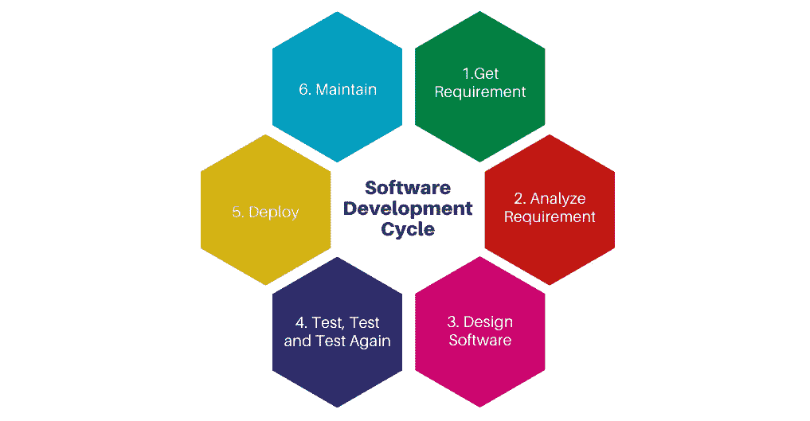
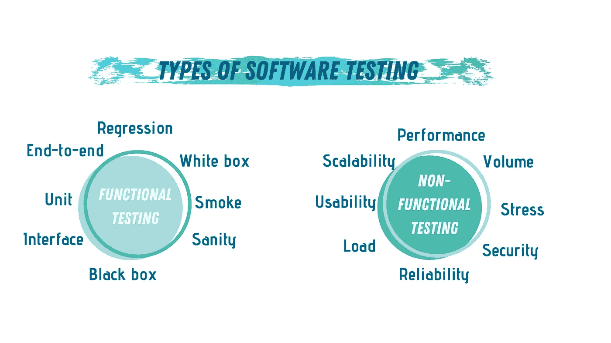

# 软件测试简介

> 原文：<https://towardsdatascience.com/a-brief-introduction-to-software-testing-38499dd4189?source=collection_archive---------34----------------------->

## 您的应用程序需要什么样的测试？

来自 [Pexels](https://www.pexels.com/photo/man-wearing-black-and-white-stripe-shirt-looking-at-white-printer-papers-on-the-wall-212286/?utm_content=attributionCopyText&utm_medium=referral&utm_source=pexels) 的[创业股票照片](https://www.pexels.com/@startup-stock-photos?utm_content=attributionCopyText&utm_medium=referral&utm_source=pexels)

在软件开发中，任何代码都需要经过一系列步骤才能发布。无论应用领域、目标受众/平台或规模如何，所有开发人员都必须经历软件开发过程。

这个过程包括 6 个主要步骤:收集项目/应用程序需求，分析这些需求，设计软件，测试和调试，部署和维护项目。

可以说，这个过程中最关键的步骤是测试步骤。尽管在循环中测试步骤在设计步骤(包括设计、概述和实现代码)之后，但实际上，测试与编写代码是并行的。

作者照片(使用 [Canva](https://www.canva.com/) 制作)

软件测试的主要目标是消除代码中的错误。然而，一个项目可以从一个好的测试过程中获得额外的好处。好处，如增强性能、用户体验和整个项目的安全性。

通常，在处理大项目时，团队被分成几个部分。每个都有其开发任务，每个任务都有其独立的功能。然后将这些任务组合起来，形成整个软件产品。这就是为什么每个部分都必须经历自己的测试过程，以确保它在添加到主项目之前正常工作。

现在的问题是，应该使用什么样的测试？

# 软件测试的类型

您可以使用许多不同类型的软件测试来确保代码正常运行，并且对代码的任何更改都不会丢失项目的全部功能。尽管所有的测试技术都是有用的，但并不是所有的技术都是一样的。在这篇文章中，我们将讨论不同的测试实践之间的区别。

让我们开始测试…

我们通常可以将软件测试分为两大类:功能测试和非功能测试。

## 功能测试

功能测试包括软件应用程序功能方面的测试。当你执行功能测试时，你必须检查代码中的每个功能。您需要确保代码的每个部分都正常运行。有许多类型的功能测试，例如:

1.  单元测试。
2.  集成测试。
3.  端到端测试。
4.  烟雾测试。
5.  回归测试。

## 非功能测试

非功能测试的目标是应用程序的非功能方面，如性能、可靠性、可用性和安全性。非功能性测试旨在提高代码的质量。手动执行这种类型的测试并不容易。因此，这些测试通常使用特殊的测试工具来执行。无功能测试的一些例子有:

1.  性能测试。
2.  安全测试。
3.  兼容性测试。
4.  可用性测试。
5.  可扩展性测试。

# 功能测试与非功能测试

问题不是选择功能性测试还是非功能性测试，而是您应该为特定的应用程序选择哪种类型的功能性测试或非功能性测试。原因是，使用功能测试和非功能测试的目的是完全不同的。

如果你想确保你的代码的所有组件都按照它们应该的方式运行，你将使用*功能*测试。但是，如果你已经知道一切都正常工作，然而你需要分析代码的性能，那么你将使用*非功能性*测试。

作者照片(使用 [Canva](https://www.canva.com/) 制作)

# 功能测试的类型

功能测试有许多种类，您可以根据您执行测试过程的目标使用不同的种类。为了更好地讨论各种功能测试类别之间的区别，让我们来讨论 5 种最常用的功能测试技术。

## №1:单元测试

单元测试通常由开发人员编写不同的 ***单元测试*** 来执行，以实现代码中的特定功能。例如，您可以为一个特定的函数编写不同的测试来测试它在不同输入下的行为。

这通常需要编写单元测试，在每个单元测试中使用不同的输入来调用函数，并验证其输出。代码覆盖率对于单元测试质量至关重要。所有的测试用例需要涵盖三个方面:

1.  线路覆盖。
2.  代码路径覆盖率。
3.  方法覆盖率。

单元测试是大多数数据科学应用程序遵循的主要测试技术。

## №2:集成测试

通常，一个项目由不同的代码文件(模块)组成，每个代码文件执行整个项目中的特定任务。单元测试对于测试这些文件中的每一个是否能独立工作非常重要；然而，当所有这些模块组合在一起时，我们需要集成测试。

集成测试确保不同的模块能够正确地协同工作。通常，您需要执行的集成测试比单元测试少。

单元和集成测试的两个有用工具是 [Jasmine](https://jasmine.github.io/) 和 [Mocha](https://mochajs.org/) 。

## №3:回归测试

构建和维护软件项目通常是一个持续的过程。从来都不是一蹴而就的。通常，会频繁添加新的特征和属性。

如果您需要在对任何模块或功能进行更改后测试您的项目，那么您需要一种测试整个系统的测试技术，那就是*回归测试*。

回归测试不需要像最初的单元和集成测试那样广泛，但是应该确保覆盖的数量，以证明功能是稳定的。

一些有用的回归测试工具有 [TestComplete](https://smartbear.com/product/testcomplete/overview/) 、 [Selenium](https://www.seleniumhq.org/) 和 [Appium](https://appium.io/) 。

## №4:端到端测试

端到端测试是对整个软件系统的功能测试。该测试仅在系统集成测试完成时执行，包括功能和非功能需求。

当您测试的项目涉及用户交互时，这种类型的测试是最佳的。端到端测试确保代码的每一部分，从源代码到用户，都能正常运行。

[黄瓜](https://cucumber.io/)、[量角器](https://www.protractortest.org/)和 [Karma](https://karma-runner.github.io/1.0/index.html) 是一些很棒的端到端测试工具。

## №5:烟雾测试

冒烟测试，也被称为*构建验证测试*，是一种专注于确保最重要功能工作的软件测试。这个测试的结果被用来决定一个构建是否足够稳定以进行部署。

“烟雾测试”一词来自一种类似的硬件测试的软件测试，在这种测试中，如果设备在第一次打开时没有释放任何烟雾，则通过测试。

# 结论

测试是软件开发中最重要的步骤之一。无论你提交的是什么或者你的申请是什么，在你发布一个项目之前，你都需要经历不同阶段的测试。

软件测试有两大类，功能性的和非功能性的。功能性测试侧重于测试代码的功能，而非功能性测试的目标是代码的性能。

基于您的应用程序和最终目标，您可以使用不同的功能性和非功能性测试技术。通常，功能测试会在非功能测试之前运行，因为您需要在决定增强项目性能之前确保项目正常运行。