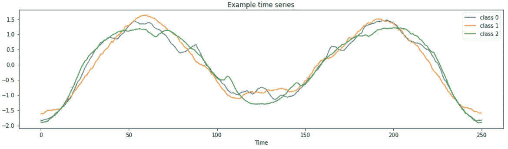
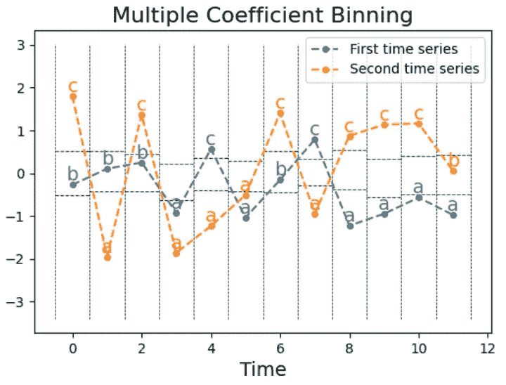
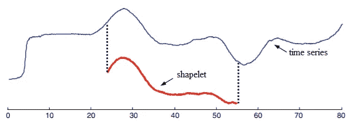
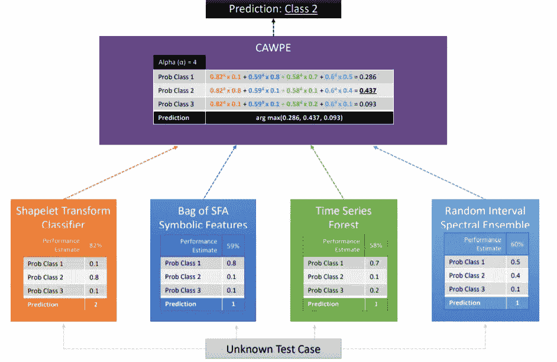

# 时间序列分类算法综述

> 原文：<https://towardsdatascience.com/a-brief-introduction-to-time-series-classification-algorithms-7b4284d31b97?source=collection_archive---------0----------------------->

## 专门为时间序列分类设计的专用算法

由[杰拉德](https://pixabay.com/users/geralt-9301/)在[皮克斯拜](https://pixabay.com/illustrations/mechanics-gear-gears-blue-4595804/)

时间序列机器学习的一个常见任务是**分类。**给定一组带有类标签的时间序列，是否可以训练一个模型来准确预测新时间序列的类？

来源:[用 sktime 进行单变量时间序列分类](https://github.com/alan-turing-institute/sktime/blob/master/examples/02_classification_univariate.ipynb)

*专门用于时间序列分类的算法有很多！*这意味着您不必将数据放入 scikit-learn 分类器中，也不必求助于深度学习来解决每个时间序列分类任务。

在本文中，我将介绍五类时间序列分类算法，并详细介绍具体的算法。在大量不同的数据集上，这些特定的算法已经显示出比基线分类器(KNN)平均执行得更好[1]。

1.  基于距离(具有动态时间弯曲的 KNN)
2.  基于间隔(时间序列森林)
3.  基于字典(BOSS，cBOSS)
4.  基于频率(上升-类似时间序列森林，但具有其他功能)
5.  基于 shape let(shape let 变换分类器)

最后，我简要介绍了如何选择合适的算法。

本文描述的算法已经在`[sktime](https://github.com/alan-turing-institute/sktime)` python 包中实现。

 [## Sktime:用于时间序列机器学习的统一 Python 库

### 用于时间序列预测、分类和回归的“sklearn”

towardsdatascience.com](/sktime-a-unified-python-library-for-time-series-machine-learning-3c103c139a55) 

# 为什么要为时间序列设计专用算法？

在时间序列分类问题上，时间序列分类算法往往比表格分类器表现更好。

时间序列分类的一个常见但有问题的解决方案是将每个时间点视为一个单独的特征，并直接应用标准学习算法(例如 scikit-learn 分类器)。在这种方法中，算法忽略数据的时间顺序中包含的信息。如果要素顺序被打乱，预测不会改变。

使用深度学习对时间序列进行分类也很常见。LSTMs 和 CNN 能够挖掘时间序列的动态特征，因此获得了成功。然而，神经网络有一些挑战，使它们不适合许多分类任务:

*   选择高效的架构
*   超参数调谐
*   有限的数据(神经网络需要许多例子)
*   训练缓慢

尽管存在这些挑战，但确实存在用于时间序列分类的特定神经网络架构。这些已经在 [sktime-dl](https://github.com/sktime/sktime-dl) python 包中实现了。

# 时间序列分类的基本概念

## 时间序列转换

**许多时间序列特定算法是转换后的时间序列和常规分类算法**的组合，例如 scikit-learn 中的算法。

特征提取非常多样和复杂。

可以全局地(在整个时间序列上)或者局部地(在规则间隔/箱、随机间隔、间隔的滑动窗口等等上)提取特征**。**

系列可以转换成**原始**值(如平均值、标准差、斜率)或其他**系列**(如傅立叶变换、拟合自回归系数系列)。

最后，变换可以是一维的**或多维的**。

 [## 高度比较的时间序列分析——一篇论文综述

### 用于比较、聚类、分类和注释的时间序列特征提取分析

medium.com](https://medium.com/towards-artificial-intelligence/highly-comparative-time-series-analysis-a-paper-review-5b51d14a291c) 

## 收缩的

*收缩*是本文描述的大多数算法中使用的关键概念。

简单来说，**收缩限制了算法的运行时间**。直到分配的时间到期，算法继续迭代以学习给定的任务。

# 基于距离的分类

这些分类器使用距离度量来确定类成员。

## 时间序列的 k-最近邻(具有动态时间弯曲)

流行的 [k 最近邻](https://scikit-learn.org/stable/modules/neighbors.html#classification) (KNN)算法可以通过用[动态时间弯曲](https://en.wikipedia.org/wiki/Dynamic_time_warping) (DTW)度量代替欧几里德距离度量来适应时间序列。DTW 测量在时间、速度或长度上可能不完全一致的两个序列之间的相似性。(点击[此处](/how-to-apply-k-means-clustering-to-time-series-data-28d04a8f7da3)了解我对时间序列聚类的 DTW 的解释)。

KNN 与 DTW 通常被用作评估时间序列分类算法的基准，因为它简单，稳健，不需要大量的超参数调整。

虽然 KNN 和 DTW 很有用，但需要大量的空间和时间来计算。在分类期间，KNN-DTW 将每个对象与训练集中的所有其他对象进行比较。此外，KNN 提供的关于为什么将一个系列归入某一类的信息有限。

KNN 也可能在有噪声的序列中表现不佳——序列中的噪声可能盖过形状的细微差异，而形状的细微差异对于类别区分是有用的[4]。

# 区间分类器

这些分类器基于包含在系列的不同区间中的信息进行分类。

## 时间序列森林分类器

时间序列森林(TSF)分类器使随机森林分类器适应序列数据。

1.  将序列分割成随机间隔，具有随机起始位置和随机长度。
2.  将每个区间的汇总特征(均值、标准差和斜率)提取到单个特征向量中。
3.  在提取的特征上训练决策树。
4.  重复步骤 1-3，直到完成所需数量的树或时间用完。

新系列是根据森林中所有树木的多数投票进行分类的。(在多数投票中，预测是由最多的树预测的类是森林的预测)。

实验研究表明，时间序列森林可以胜过基线竞争者，例如具有动态时间扭曲的最近邻[1，7]。

时序森林的计算效率也很高。

最后，时间序列森林是一个可解释的模型。时间特征重要性可以从时间序列森林中提取，如 [sktime 单变量时间序列分类演示](https://github.com/alan-turing-institute/sktime/blob/master/examples/02_classification_univariate.ipynb)所示。

# 基于词典的分类

基于字典的分类器首先将实值时间序列转换成离散的“单词”序列。然后基于提取的符号词的分布进行分类。

字典分类器都使用相同的核心过程:长度为`w`的滑动窗口在一系列中运行。对于每个窗口，数字序列被转换成长度为`l`的“单词”。这个单词由`α`可能的字母组成。

## SFA 符号包(BOSS)

使用[符号傅立叶近似](https://www.openproceedings.org/2012/conf/edbt/SchaferH12.pdf) (SFA)变换从序列中提取 BOSS 分类器的单词特征:

1.  计算窗口的[傅立叶变换](https://en.wikipedia.org/wiki/Fourier_transform)(如果发生归一化，则忽略第一项)
2.  使用[多系数宁滨](https://pyts.readthedocs.io/en/stable/auto_examples/approximation/plot_mcb.html#:~:text=The%20Multiple%20Coefficient%20Binning%20%28MCB%29%20algorithm%20bins%20continuous,series%20independently%2C%20MCB%20bins%20each%20time%20point%20independently.) (MCB)将第一个`l`傅立叶项离散成符号，形成一个“单词”。MCB 是一种监督算法，它将连续的时间序列分成一系列字母。

*如不同位置的绿线所示，MCB 独立于其他时间点对每个时间点进行分类。SAX 是另一种宁滨系列算法，它独立地对每个时间序列进行分类。来源:* [*pyts 文档*](https://pyts.readthedocs.io/en/stable/auto_examples/approximation/plot_mcb.html#:~:text=The%20Multiple%20Coefficient%20Binning%20%28MCB%29%20algorithm%20bins%20continuous,series%20independently%2C%20MCB%20bins%20each%20time%20point%20independently)

当窗口滑动时，这些单词的字典被构建，记录每个单词的频率。如果同一个单词是由两个或两个以上的连续窗口产生的，那么这个单词只计算一次。当滑动窗口完成时，序列被转换成基于字典的直方图。

最后，任何分类器都可以根据从系列中提取的单词直方图进行训练。

## 老板乐团

最初的 BOSS 算法实际上是先前描述的 BOSS 分类器的集合。BOSS 集成在单个 BOSS 分类器的参数(`l`、`α`、`w`和`p`)之间进行网格搜索。(`p`控制子系列是否规范化。)集成仅保留其准确度在最佳分类器的 92%准确度内的成员。

BOSS 集成使用最近邻算法作为其分类器。分类器使用一个定制的非对称距离函数:一个部分欧几里德距离，只包括测试实例的直方图中包含的单词。

由于在大的预定义参数空间上搜索，BOSS 会带来时间开销和内存使用不稳定的风险。

BOSS ensemble 是[大型时间序列分类竞赛](https://www.researchgate.net/profile/Anthony_Bagnall/publication/301856632_The_Great_Time_Series_Classification_Bake_Off_An_Experimental_Evaluation_of_Recently_Proposed_Algorithms_Extended_Version/links/579b580e08ae80bf6ea33d12.pdf)论文【1】中最准确的基于字典的分类器。

## 可承包老板

cBOSS 算法比 BOSS 快一个数量级。与 BOSS 相比，cBOSS 在 UCR 分类档案库中的数据集上的准确性没有显著差异。

cBOSS 不像 BOSS 那样在整个参数空间进行网格搜索，而是从参数空间随机采样，没有替换。然后，cBOSS 对每个基本分类器的数据进行二次采样。

cBOSS 通过保留固定数量的基分类器，而不是保留给定性能阈值以上的所有分类器，来提高 BOSS 的内存需求。最后，cBOSS 根据训练精度指数加权每个基本分类器的贡献。

# 基于频率的

基于频率的分类器依赖于从序列中提取的频率数据。

## 随机间隔光谱集合

随机区间光谱集合，或上升，是时间序列森林的一个流行的变种。

RISE 在两个方面不同于时序森林。首先，它对每棵树使用一个时间序列间隔。第二，使用从系列中提取的光谱特征而不是汇总统计来训练它。

RISE 使用几个串到串特征提取变压器，包括:

*   拟合自回归系数
*   估计的自相关系数
*   功率谱系数(傅立叶变换的系数)

上升算法很简单:

1.  选择一个系列的随机间隔(长度是 2 的幂)。(对于第一棵树，使用整个系列)
2.  对于每个序列的相同间隔，应用序列到序列特征提取转换器(自回归系数、自相关系数和功率谱系数)
3.  通过连接提取的特征来形成新的训练集
4.  训练决策树分类器
5.  合奏 1-4

类别概率按基本分类器投票的比例计算。RISE 通过创建一个自适应模型来控制构建单棵树的运行时间。这对于长序列(如音频)很重要，因为很大的间隔意味着很少的树。

# 基于 Shapelet 的分类器

Shapelets 是代表一个类的时间序列的子序列或小的子形状。它们可用于检测“同一类别内系列之间的独立于相位的局部相似性”[1]。

蓝线是原始时间序列。红线是从中提取的 shapelet。从[4]修改的图像。

单个 shapelet 是时间序列中的一个间隔。任何序列中的间隔都可以被枚举。例如，`[1,2,3,4]`有 5 个区间:`[1,2]`、`[2,3]`、`[3,4]`、`[1,2,3]`、`[2,3,4]`。

基于 Shapelet 的分类器搜索具有辨别能力的 shape let。

然后，这些 shapelet 特征可用于解释基于 shapelet 的分类器-某些 shape let 的存在使一个类比另一个类更有可能。

## Shapelet 变换分类器

在 Shapelet 变换分类器中，该算法首先识别数据集中的前 *k 个*shape let。

接下来，计算新数据集的 *k* 个特征。每个特征被计算为系列到每个*k s*shapelet 的距离，每个 shape let 一列。

最后，任何基于矢量的分类算法都可以应用于 shapelet 变换的数据集。在[1]中，使用了加权集成分类器。在[2]中，作者仅使用了一个[旋转森林](https://www.researchgate.net/publication/6806976_Rotation_Forest_A_New_Classifier_Ensemble_Method)分类器，这是一个基于树的集成，在 PCA 变换的特征子集上构建每棵树[5]。**平均来说，对于具有连续特征的问题，旋转森林是最好的分类器，如图**[**【6】**](https://arxiv.org/abs/1809.06705)**。**

在`[sktime](https://github.com/alan-turing-institute/sktime)`中，默认使用随机森林分类器(500 棵树)，因为 python 中还没有旋转森林[8]。

*算法如何识别和选择 shapelets？*

在`sktime`中，shapelet 搜索过程不会完全枚举和评估所有可能的 shape let。相反，它随机搜索 shapelets 进行评估。

根据信息增益来评估所考虑的每个 shapelet。保留最强的非重叠小形状。

您可以指定在执行 shapelet 变换之前搜索 shape let 的时间。`sktime`的默认时间是 300 分钟。

# 集成分类器

## 蜂巢

基于变换的集成的分层投票集合(HIVE-COTE)是建立在前面讨论的分类器上的元集成。

" HIVE-COTE 1.0 的系综结构概述."

HIVE-COTE 预测是其成员生成的预测的加权平均值:shapelet 转换分类器、BOSS、时序森林和 RISE。

每个子分类器估计每个类别的概率。控制单元然后组合这些概率(CAPWE)。权重被分配为在训练数据上找到的分类器的相对估计质量。

# 使用哪个分类器？

选择时间序列分类器时有三个主要考虑因素:预测精度、时间/内存复杂性和数据表示。

在没有具体数据信息的情况下，从 [*火箭*](https://www.sktime.org/en/latest/examples/rocket.html) 或*蜂巢*开始。(ROCKET 是一个简单的线性分类器，基于随机卷积核——随机长度、权重、偏差、膨胀和填充)。[2]的作者认为“在没有相反的专家知识的情况下，最准确的算法设计是集成基于不同表示的分类器。”平均来说，ROCKET 并不比 HIVE-COTE 差，而且要快得多。

 [## ROCKET:快速准确的时间序列分类

### “时间序列分类的任务可以被认为是学习或检测信号或模式…

link.medium.com](https://link.medium.com/qYcaC7lL69) 

*当最佳特征可能是一系列中相位无关模式的存在或不存在时，基于 Shapelet 的分类器*会更好。

当您可以使用模式的频率进行区分时，基于字典的 *(BOSS)* 或基于频率的 *(RISE)* 分类器会更好。

# 最后一句话

如果您喜欢这篇文章，请关注我，了解更多关于数据科学主题的内容！我计划继续撰写关于时间序列分类、聚类和回归的文章。

 [## 阅读亚历山德拉·阿米登(以及媒体上成千上万的其他作家)的每一个故事

### 作为一个媒体会员，你的会员费的一部分会给你阅读的作家，你可以完全接触到每一个故事…

alexandra-amidon.medium.com](https://alexandra-amidon.medium.com/membership) 

感谢 Markus Loning 对本文的反馈，感谢 Anthony Bagnall 对模型选择的指导。

# 参考

[1] [Bagnall，Anthony 等人，“伟大的时间序列分类烘焙:对最近算法进展的回顾和实验评估。”数据挖掘与知识发现 31.3(2017):606–660。](https://www.researchgate.net/profile/Anthony_Bagnall/publication/301856632_The_Great_Time_Series_Classification_Bake_Off_An_Experimental_Evaluation_of_Recently_Proposed_Algorithms_Extended_Version/links/579b580e08ae80bf6ea33d12.pdf)还有

[2] Bagnall，Anthony，等.[两个工具包的故事，报告之三:关于 HIVE-COTE v1.0 的使用和性能.](https://arxiv.org/abs/2004.06069)《2019

[3] [Fawaz，Hassan Ismail 等，“时间序列分类的深度学习:综述”数据挖掘与知识发现 33.4(2019):917–963。](https://arxiv.org/pdf/1809.04356)

[4] [L .叶和 e .基奥。时间序列 shapelets:一种允许精确、可解释和快速分类的新技术。数据挖掘和知识发现，22(1–2):149–182，2011。](https://core.ac.uk/download/pdf/81784396.pdf)

[5] [Rodriguez，J，等.旋转森林:一种新的分类器集成方法。2006 年 11 月 IEEE 模式分析与机器智能汇刊 28(10):1619–30。DOI: 10.1109](https://www.researchgate.net/publication/6806976_Rotation_Forest_A_New_Classifier_Ensemble_Method)

[6] [Bagnall，Anthony 等，“旋转森林是具有连续特征问题的最佳分类器吗？”2018.arXiv: 1809.06705。](https://arxiv.org/abs/1809.06705)

[7]邓，H，等.[一种用于分类和特征提取的时间序列森林](https://arxiv.org/abs/1302.2277)信息科学 239:142–153(2013)。

[8] Bagnall，Anthony 等.“[两个工具包的故事，报告第一个:对时间序列分类算法的正确性和效率进行基准测试。](https://arxiv.org/pdf/1909.05738.pdf)“2019。

[9] Dempster A，Petitjean F，Webb GI (2019) [ROCKET:使用随机卷积核的异常快速和准确的时间序列分类](https://arxiv.org/pdf/1910.13051.pdf)。 [arXiv:1910.13051](https://arxiv.org/abs/1910.13051)

[sk time 中基于字典的时间序列分类](https://sktime.org/examples/dictionary_based_classification.html)

sktime 的[单变量时间序列分类教程](https://github.com/alan-turing-institute/sktime/blob/master/examples/02_classification_univariate.ipynb)