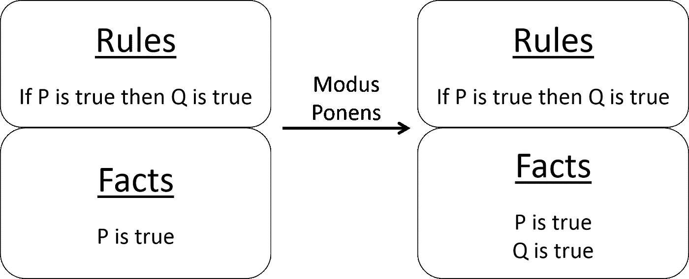
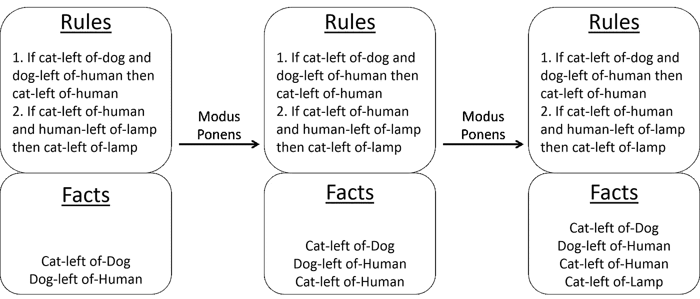

# 经典人工智能的早期简史

> 原文：<https://towardsdatascience.com/a-brief-pre-history-of-classical-ai-40a98a6e6db4?source=collection_archive---------35----------------------->

Giammarco Boscaro 在 [Unsplash](https://unsplash.com/s/photos/history?utm_source=unsplash&utm_medium=referral&utm_content=creditCopyText) 上拍摄的照片

## 推理和经典人工智能

## 人工智能的两个基本概念

*要谈推理，理解我们是如何走到这一步的很重要。这篇文章涵盖了我所谓的经典人工智能的前历史——故事中发生在现代计算机发明之前(20 世纪 50 年代之前)的那些部分，但对于理解我们为什么相信人工智能是可能的至关重要。*

这是推理系列的第二部分。

像大多数事情一样，经典人工智能的起源植根于哲学，始于古代世界(希腊人、印度人和中国人都有一些早期的逻辑形式)。但是，由于我不是一个受虐狂，我们从更现代的时代开始，有两大思想为现代人工智能奠定了基础:

1.  将智能机械化——是否存在一个*可信的、自动的*过程，它接收一些信息并吐出新信息？*可信赖的*，在这种情况下，意味着所产生的信息得到所获取的信息的支持。*自动*表示无需人为干预即可工作。当然，简单地发现新信息可能看起来像是非常有限的智能定义，但它反映了人工智能的数学起源，这些技术最初应用于自动定理证明等主题。
2.  可计算性——有可能在计算机上实现这个自动过程吗？

# 命题逻辑

逻辑的发展是人类在智能机械化方面的第一次伟大尝试，现代逻辑的基础在于乔治·布尔、查尔斯·皮尔斯和戈特洛布·弗雷格。乔治·布尔不满足于为现代计算机打下基础(你好，布尔代数)，还发明了命题逻辑(T14)差点毁掉了我初出茅庐的研究生生涯(我的 PHIL 650 逻辑导论课不及格)。命题逻辑通过一组事实或命题来表示世界的当前状态。这些命题可以用布尔运算符组合起来形成公式。例如:
*猫在狗*的左边，或者 *Whiskers 是猫，Fido 是狗，Whiskers 坐在 Fido 的左边*

除了当前状态，命题逻辑还有以 *if-then* 规则形式存储的关于世界的知识。
***如果*** *络腮胡是一只猫* ***那么*** *络腮胡有四只脚，络腮胡有一条尾巴*或者
***如果*** *络腮胡是一只猫而 Fido 是一只狗* ***那么*** *Fido 害怕络腮胡*

新的事实是使用一个非常重要的演绎工具从目前已知的事实中推导出来的，这个工具叫做*假言假语*，它说当你有一个这样的规则:*如果 p 然后 q* 并且事实 *p* 为真，那么事实 *q* 为真。

图片由 Unmesh Kurup 提供

> 假言可能看起来微不足道，但它保证当知识以可信任的规则的形式表示时，使用假言从这些规则生成的新信息也是可信任的。

机械化过程称为*规则匹配*，将规则应用于事实。作为例子，考虑只有一个规则的情况:
***如果*** *猫在狗的左边，狗在人的左边* ***那么*** *猫在人的左边。* 现在想象一下，在这种情况下有两个你知道为真的事实:
*狗的左边有一只猫*和
*人的左边有一只狗* 规则匹配过程将这两条信息与规则匹配，并创建第三个事实:
*人的左边有一只猫*。

在我们的例子中，只有一个匹配的规则，而且只匹配一次。但是想象有一个额外的事实:
*人类在灯的左边*
和一个额外的规则:
***如果*** *猫在人类的左边，人类在灯的左边* ***那么*** *猫在灯的左边* 一旦第一个规则匹配，并且添加了猫在人的左边的事实*，我们的新规则将匹配并添加第四个事实:
*灯的左边有一只猫*。*

**

*图片由 Unmesh Kurup 提供*

*将规则应用于当前情况会产生新的信息。这个新信息触发另一轮匹配(使用一组可能不同的规则),产生附加的新信息。这个重复的过程就是命题逻辑自动寻找新信息的方式。*

# *谓词(一阶)逻辑*

*现在，我们不应该让乔治独霸我的博士学位过早夭折的所有荣誉。查尔斯·皮尔斯和戈特洛布·弗雷格对这个故事同样重要，因为他们发明了谓词或一阶逻辑。举一个猫离开狗离开人的例子。这不仅仅适用于猫、狗和人类。任何三件事都是如此。有了命题逻辑，你必须为你能想到的每一组三个规则写下来…狗在猫的左边，人在猫的左边，狗在猫的左边，猫-猫-狗，猫-人-水豚，人-番茄-勃肯斯托克……你明白了。有一些变通方法可以更简洁地表示信息，但是在大多数情况下，以这种方式表示事实是非常乏味的，也不是非常有用。*

*使用谓词逻辑，您可以使用变量来表示事实。不写:
***如果***猫在狗的左边，狗在人类的左边， ***那么*** *猫在人类的左边*
你可以写:
*对于所有的 A、B、C:* ***如果*** *A 在 B and B 的左边* ***然后*** *A 在 C* 的左边，涵盖了动物、人类、无生命物体等广泛的场景，大家耐心地坐在一起。 代表所有的*称为量词，允许谓词逻辑代表可以代表所有对象的变量。还有一个额外的量词—“*There exists*”——允许谓词逻辑表示代表一件事情的变量。例如:
*存在 x:这样 x 是一个人，x 是美国总统***

*谓词(和命题)逻辑可以写成更短、更易读的形式:
*【left of(A，B)】&left of(B，C) → LeftOf(A，C)* 。
在这里，的*left 被称为谓词，A 和 B 是代表命题的变量。谓词逻辑使用与命题逻辑相同的词汇——命题、布尔运算符、推理规则(通常是假言词)——外加变量和两个量词。这些增加使得谓词逻辑在表示规则方面更加强大，但代价是运行起来更加复杂(由于需要匹配变量)。**

*还有二阶谓词逻辑，您甚至可以为的*Left 使用一个变量，因为适用于 *Left* 的也适用于其他类似的谓词。于是，我们可以把 *LeftOf(A，B) & LeftOf(B，C) → LeftOf(A，C)* 写成 *D(A，B) & D(B，C) → D(A，C)* 。其中 *D* 可以是*左、右、上、下、前、后*等等。二阶逻辑使规则匹配变得更加困难，我从未见过在野外使用的规则匹配，但我的逻辑入门课程不及格，所以我知道什么。**

*从命题逻辑和谓词逻辑中，我们可以提炼出机械化智能意味着三个要求:*

1.  *一种表现你的知识的方式(例如规则)*
2.  *一种表示当前情况的方式(命题或谓词)*
3.  *一种自动保持将知识(从 1)应用于当前情况(2)的方法，以生成/推断/推导值得信赖的新信息。(形式和规则匹配)*

*这些要求并不特别苛刻。神经网络满足这些条件中的大部分——权重矩阵代表知识，输入矩阵是当前状况，前向传递是应用知识发现新信息的方式。神经网络失败的唯一地方是，它们没有将该过程应用于新信息(递归网络是例外)。神经网络显然不是逻辑系统。一个真正的逻辑系统有更严格的要求和定义，我们将在后面遇到。我们目前的目的是引入智能机械化的思想，即确定一个智能(狭义定义为发现新信息)是自动的过程。*

# *离题进入健全和完整。*

*让命题逻辑和谓词逻辑(以及其他形式的逻辑)有趣的不仅仅是你能用它们做什么，而是你能证明什么；特别是称为*稳固性*、*完备性*和*可判定性*的三个属性。如果你还不知道这些概念，那么你应该密切关注，因为这可能是你今天会读到的最酷的东西:*

*如果从一个逻辑系统中得到的任何信息都是真实的，那么这个逻辑系统就是合理的。在一个合理的逻辑系统中，如果你从一组事实开始并运行逻辑机器，产生的所有信息在逻辑上都是可证明的，也就是说，你可以相信机器只产生正确的信息。*

*完整性是硬币的反面。一个逻辑系统(初始事实+过程)被认为是完整的，如果该系统中所有真实的信息都可以使用逻辑过程从开始的事实集中导出，也就是说，如果有新的信息在逻辑上遵循系统所知道的，系统将最终找到它。*

*总的来说，健全性和完整性使得一个逻辑系统是可靠的，因为你可以确定从它里面出来的所有东西都是有效的，并且它会找到任何逻辑上有效的东西。为了真正有用，逻辑系统也必须是可判定的。也就是说，需要有一种有效的方法(一种在有限的时间内运行的方法，尽管可能非常长)来确定该逻辑系统中的语句是真还是假。*

*命题逻辑是合理的、完整的、可判定的。一阶谓词逻辑是合理和完整的，但对于非平凡系统是不可判定的。(注:你可以有一门 5 学分的研究生水平的课程来证明上述观点)*

*健全性、完整性和可决定性共同赋予我们对机械过程的选择以尊严，因为它为我们提供了关于其有效性的理论保证。*

*无论如何，这里有三个要点供仍在阅读的人参考。*

1.  *布尔、皮尔斯和弗雷格奠定了逻辑、推理和人工智能的基础*
2.  *如果你学的是计算机科学，那就选数学系而不是哲学系提供的逻辑入门课程。你以后会感谢我的。*
3.  *吸它布尔，皮尔斯和弗雷格。我拿到了博士学位。*

*关于逻辑的最后一点。逻辑可以绊倒任何人。伯特兰·罗素花了一生的时间试图建立对数学的逻辑理解。他想从几个假设(四个或五个)出发，证明所有数学的**都可以通过逻辑机器从这些假设中推导出来。他的尝试最终是徒劳的，就像我试图通过我的逻辑入门课程一样。当他未能找到数学的逻辑基础时，他确实成功地完成了一些其他的事情——在广泛的学科范围内广泛地写作，创造了全新的学科，彻底改变了对数学和逻辑的理解，获得了诺贝尔奖。真是个懒鬼。玩笑归玩笑，罗素是 20 世纪哲学和自由主义的巨人之一。他看穿了布尔什维克主义的外表，随着希特勒的崛起，他的和平主义信仰出现了例外，担任印度联盟主席，并在 89 岁时因参加反核示威而入狱。真的，值得学习的人。***

# *丘奇-图灵论题*

*逻辑系统(命题和谓词逻辑)彻底改变了我们对机械过程如何产生新信息的理解。丘奇-图灵论题让我们相信，建造一台真正实现这种过程的机器是可能的。*

*美国数学家阿隆佐·邱奇发明了一种数学逻辑系统，称为λ演算，作为解决数学问题的框架。Lambda 演算的表达能力允许它表示各种各样的逻辑。艾伦·图灵(他因图灵测试而出名)当然是图灵机的发明者，图灵机是一种用于计算的机器。丘奇和图灵意识到，任何用λ演算表示的东西都可以用图灵机来计算，反之亦然。由于 Lambda 演算涵盖了包括一阶逻辑在内的广泛过程，Church-Turing 论题考虑到了可以展示推理和智能的计算机器的可能性。*

*丘奇-图灵假说也是我们称大脑为计算机的原因。这并不是因为我们的大脑和计算机的计算方式相似。我们称大脑为计算机是因为*

1.  *据我们所知，大脑正在实现一个可计算的功能，*
2.  *图灵机可以实现任何可计算的功能，并且*
3.  *计算机是图灵机。*

*因此大脑作为计算机的类比。*

*我们不知道这个可计算的函数是什么，也不知道它是如何实现的。但可计算功能及其实现之间的这种区别反映在经典人工智能和神经网络等概率对等物之间的分歧上。经典人工智能有一个很好的故事，讲述了这个可计算的函数看起来是什么样子，但在实现中却不那么令人信服。神经网络有一个关于实现可能看起来像什么的很好的故事，但是关于它们正在实现什么样的可计算功能就不那么令人信服了。*

*最后，很有可能存在许多不同但等价的这种可计算功能以及实现它们的许多不同方式。人工智能的历史是试图找到一个这样的功能和实现的故事(而认知科学的历史是试图确定人类智能背后的特定可计算功能和实现)。*

# *这个系列的下一部是什么？*

*我最初打算这篇文章是经典人工智能的简史，但我很快意识到我必须把它分成两篇文章——这一篇讨论史前史，下一篇将关注自 20 世纪 50 年代以来的发展。*

# *本系列的前几篇文章*

*[六个容易和不那么容易的 AI 棋子](https://medium.com/@unmesh.kurup/six-easy-and-not-so-easy-ai-pieces-e8fee651eaf3)
[第一部分:什么是推理？](/what-is-reasoning-526103fd217)*

**免责声明:本文表达的观点是我自己的观点，不一定代表我的雇主的观点。**

*你可以在我很少发帖子的 Medium 上关注我，也可以在我很少发微博的 Twitter (@manashastram)上关注我。:)*