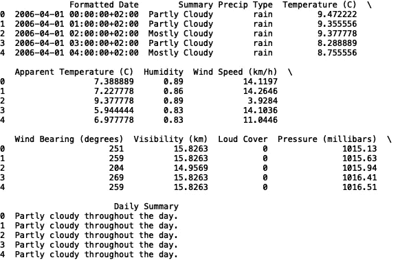
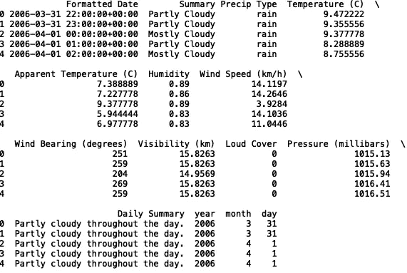
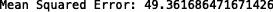
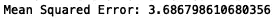
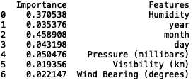
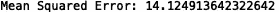
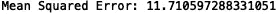

# Scikit-learn (Sklearn)简介

> 原文：<https://towardsdatascience.com/a-brief-tour-of-scikit-learn-sklearn-6e829a9db2fd?source=collection_archive---------23----------------------->

## Sklearn 简介


照片由[阮光](https://www.pexels.com/@quang-nguyen-vinh-222549)在[拍摄](https://www.pexels.com/photo/people-riding-a-boat-2161449/)

对于机器学习来说，Python 和 R 是当今应用最广泛的编程语言。Scikit-learn 是一个 python 库，它提供了数据读取、数据准备、回归、分类、无监督聚类等方法。在本帖中，我们将回顾一些构建回归模型的基本方法。该软件包的文档内容丰富，是每位数据科学家的绝佳资源。你可以在这里找到文档。

我们开始吧！

**数据准备**

对于我们的回归问题，我们将使用天气数据，这些数据可以在[这里](https://www.kaggle.com/rtatman/datasets-for-regression-analysis)找到。

首先，让我们导入数据并打印前五行:

```
import pandas as pd 
df = pd.read_csv("weatherHistory.csv")
print(df.head())
```



接下来，让我们将日期列转换成熊猫日期时间对象，并创建年、月和日列:

```
df['Formatted Date'] = pd.to_datetime(df['Formatted Date'],  utc=True,)
df['year'] = df['Formatted Date'].dt.year
df['month'] = df['Formatted Date'].dt.month
df['day'] = df['Formatted Date'].dt.day
```

让我们再次打印前五行，以验证新列的创建:

```
print(df.head())
```



现在，让我们定义我们的输入和目标变量。我们将使用湿度、年、月、日、压力、能见度和风向来预测温度:

```
import numpy as np
X = np.array(df[[ 'Humidity', 'year', 'month', 'day', 'Pressure (millibars)', 'Visibility (km)', 'Wind Bearing (degrees)']])
y = np.array(df['Temperature (C)'])
```

然后，我们将分割数据用于训练和测试:

```
from sklearn.model_selection import train_test_split
X_train, X_test, y_train, y_test = train_test_split(X, y, test_size = 0.2, random_state = 42)
```

现在我们所有必要的变量都定义好了。让我们建立一些模型！

**线性回归**

先说线性回归。线性回归拟合带有系数的线性函数，使得目标和预测之间的残差平方和最小。

我们导入线性回归包如下:

```
from sklearn.linear_model import LinearRegression
```

我们用来评估模型性能的误差指标是均方误差(MSE)。MSE 由以下等式定义:


这里，y 是实际值，y-波形符是预测值。

让我们定义一个线性回归对象，拟合我们的模型，并评估性能:

```
reg = LinearRegression()
reg.fit(X_train, y_train)
y_pred = reg.predict(X_test)from sklearn import metrics
print('Mean Squared Error:', metrics.mean_squared_error(y_test, y_pred))
```



表演不是很好。这仅仅意味着输入和目标之间的关系不是线性的。此外，探索性数据分析(EDA)可以进一步通知智能特征选择和工程，这可以提高性能。

**随机森林**

现在我们来看看随机森林。随机森林是一种基于树的方法，它集成了多个单独的决策树。

我们导入 RandomForestRegressor 包，如下所示:

```
from sklearn.ensemble import RandomForestRegressor
```

让我们定义一个随机森林回归对象，拟合我们的模型，并评估性能:

```
reg_rf = RandomForestRegressor()
reg_rf.fit(X_train, y_train)
y_pred = reg_rf.predict(X_test)from sklearn import metrics
print('Mean Squared Error:', metrics.mean_squared_error(y_test, y_pred))
```



我们可以看到随机森林的性能比线性回归好得多。

我们还可以打印特征重要性。这使我们能够了解哪些变量对温度预测最为重要:

```
feature_df = pd.DataFrame({'Importance':reg_rf.feature_importances_, 'Features': [ 'Humidity', 'year', 'month', 'day', 'Pressure (millibars)', 'Visibility (km)', 'Wind Bearing (degrees)'] })
print(feature_df)
```



我们可以看到月份具有最高的重要性，这是有道理的。

我想指出的是，通过不传递任何参数，比如 max_depth 和 n_estimators，我选择了默认的随机森林值(n_estimators = 10 和 max_depth = 10)。我们可以通过优化随机森林中的参数来进一步提高性能。这可以手动完成，也可以使用网格搜索技术自动完成。我将把参数优化的问题留给另一篇文章。

**支持向量机**

我要讨论的下一个方法叫做支持向量回归。这是支持向量机(SVM)的扩展。支持向量机在高维特征空间中构造一组超平面，可用于回归和分类问题。

我们导入 SVR 包，如下所示:

```
from sklearn.svm import SVR
```

由于 SVR 的训练速度很慢，我将只选择前 100 条记录进行训练和测试。请随意在完整的数据集上进行训练和测试，以便更好地比较不同型号之间的性能。

```
df = df.head(100)
```

让我们定义一个支持向量回归对象，拟合我们的模型，并评估性能:

```
reg_svr = SVR()
reg_svr.fit(X_train, y_train)
y_pred = reg_svr.predict(X_test)from sklearn import metrics
print('Mean Squared Error:', metrics.mean_squared_error(y_test, y_pred))
```



我们看到支持向量回归比线性回归表现更好，但比随机森林差。同样，这种比较并不完全合适，因为我们没有使用完整的数据集进行训练。

类似于随机森林示例，可以优化支持向量机参数，使得误差最小化。

***K*-最近邻居**

我将讨论的最后一种方法是 *k-* 最近邻回归法。k-最近邻使用欧几里德距离计算，其中预测是 k*最近邻的平均值。*

我们导入 KNeighborsRegressor 包，如下所示:

```
from sklearn.neighbors import KNeighborsRegressor
```

让我们定义一个 *k-* 最近邻回归对象，拟合我们的模型，并评估性能:

```
reg_knn = KNeighborsRegressor()
reg_knn.fit(X_train, y_train)
y_pred = reg_knn.predict(X_test)
from sklearn import metrics
print('Mean Squared Error:', metrics.mean_squared_error(y_test, y_pred))
```



我们看到 *k-* 最近邻算法在全数据集上训练时优于线性回归。

**结论**

我将在这里停下来，但是您可以随意选择模型特性，看看是否可以改进其中一些模型的性能。

概括地说，我简要介绍了 python 机器学习库。我讲述了如何定义模型对象、使模型适合数据，以及使用线性回归、随机森林、支持向量机和最近邻模型来预测输出。此外，通过探索这些不同类型的模型，我们能够窥视机器学习库的内部。请注意我们在库中使用的四个模块:

1.  线性模型
2.  全体
3.  SVM
4.  邻居

虽然我们只看了回归方法，但是每个模块都有额外的分类方法。在另一篇文章中，我将概述 python 机器学习库中最常见的一些分类方法。

我希望这篇文章是有益的。这篇文章的代码可以在 GitHub 上找到。感谢阅读，机器学习快乐！