# 流失分析商业实践指南

> 原文：<https://towardsdatascience.com/a-business-practical-guide-on-churn-analysis-for-analysts-ebdeb4e0424?source=collection_archive---------31----------------------->

## 分析客户流失时，实践、理论和技术的正确方法


编辑过的照片，由[马頔·库多罗日科夫](https://unsplash.com/@wolair)在 [Unsplash](https://unsplash.com/?utm_source=medium&utm_medium=referral) 上原创

**为什么大多数关于客户流失的文章没有帮助** 没有人喜欢被忽略，企业也是如此。为了尽量减少这种情况，我们分析流失。当我开始学习客户流失分析时，我选择了 Medium 和 Kaggle。在阅读了许多文章和笔记本之后，我得出了一些促使我写这篇文章的结论。大多数作品要么是:

o Too **技术:**代码多，推理少。我们处理的数据是对现实的描述，但许多文章缺乏交流。

o 太理论化:很多你应该做流失分析的理由，也许是一些数学，缺乏清晰的例子。经常跟着炒作。

o Too **Specific:** 商业是实用的，大多数文章都过于深入后两部分，对商业没有重大价值。分析师通过可操作的见解提供价值。一般如何获得这样的见解？

嗯，有些作品太无聊了！所以，我会把我们的分析总结在约会的世界里。毕竟我们不希望 Jack 永远一个人:)

因此，这篇文章将带你经历如何进行流失分析的步骤，我向你保证会有代码，我会把它弄清楚。这篇文章总结在下面的文氏图中，以约会酱为顶:

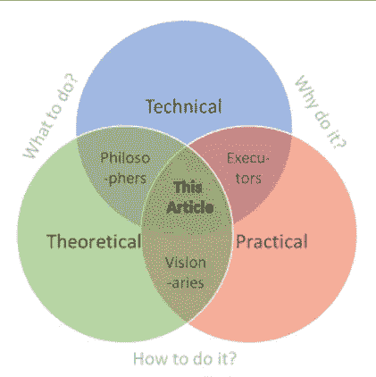

作者图片|我对作为分析师获得可行见解的看法

因为当我们过于关注理论时，我们可能会忽略科学过程，这使得证明我们的结论更加困难。

当我们对技术部分关注太少时，我们就会错过开展工作所必需的技能和经验。

当我们对实践方面关注太少时，我们会忽略我们的工作对商业的必要性和价值。

所以取得平衡是关键，尽管我们有时需要关注三者中的一个，但我们绝不能忽略任何一个！

说了这么多，还是走一遍流程吧！

**1)** **是否应该进行流失分析？开始时的实际关注点**

让我们开始实际的。在开始分析之前，考虑努力和它的价值。你将不得不获取数据，处理数据，并以一种能被理解和有用的方式使数据呈现出来。尽管早期评估价值可能很难，但没有人希望他们的工作不被注意。要回答这个问题，您需要了解以下内容:

*   学会了解你的公司所处的商业环境(大时代？探索新的选择？糟糕的时光？).想到什么先分析给定的情况，然后沟通。
*   你的经理可能不知道什么是最好的，或者只有一个大概的想法。积极主动，协助选择项目。杰克并不知道约会的所有事情，帮助他专注于重要的事情。
*   瞄准低垂的果实，能快速实现什么价值？当你不把所有时间都花在一件事情上时，你的工作可能会更有价值。杰克也有自己的生活，要努力让你的时间发挥最大价值。
*   复杂性很重要。如果分析太难，就需要太多时间。开始之前，考虑并讨论结果的价值。

**何时进行客户流失分析？**

我们进行流失分析，以估计人们离开的原因，并预测哪些人可能会离开，所有这些都是为了防止这种情况发生。什么时候这种分析是优先考虑的？按照正确的顺序查看一些触发事件或进行流失分析的原因:

1.  你的公司从未分析过客户流失，最近的*数据可以用来进行良好的分析* - >你有一些日期，但还没有反映出来。
2.  过去曾做过分析，但客户获得量下降或离职率上升->没有计划日期或取消了太多日期。
3.  过去做过分析，但我们有改进的数据，或者过去的见解已经过时->女士们，对 X 博士说‘你好…

没错，这意味着如果你过去做过客户流失分析，当没有好的理由来改进或扩展之前的分析时，你就不应该在客户流失上花费时间！..更有可能是收购或协助现有业务。

关于 1，**数据对于一个好的分析**意味着什么？它是指对满足任何分析的基本要求的数据进行的分析。

1.  我们有足够的样本进行分析吗？
    考虑你今年预期的(客户)人口，我们假设一千人。然后你要有足够的样本。我敢说，至少有一百个这样的数据。
2.  *样本是否代表真实人群？*
    同样重要且相关的是，你的样本反映了你要研究的人群的相似属性。花时间去了解你感兴趣的人。
3.  *我们是否收集了有助于回答问题的数据？*
    不是所有重要的东西都能被测量，也不是所有被测量的东西都重要。最喜欢的颜色作为一个变量可能对人们是否离开没有太大影响。然而，年龄与人生阶段有关，在这个阶段，我们会改变自己的观点和偏好，对产品也是如此。
4.  数据收集是否正确？
    每一个数据条目都是在某个时间、地点、通过某个上下文内的方法收集的。这些元素中有什么改变了(很多)吗？问问你自己:在收集这些数据的过程中，发生了什么变化？请注意，当您分析数据时，您的目标是从噪声中提取有用的信号。把它看作一台收音机，你需要调到正确的频率来听音乐。当采集条件改变时，就像增加了噪声，这意味着如果不是不可能的话，也将更难获得想要的信号。

> 我得到了所有这些混合信号，她是什么意思？！—杰克在夜总会

**2)**如何进行流失分析？理论焦点塑造思想

**第一步:定义问题**

我们要做分析了，万岁！那么，我们该如何着手呢？首先，我们看问题陈述，作为科学过程的第一步。将这一点与我们项目的商业价值结合起来——这是项目选择过程中的一个要求——您实际上已经为自己的成功做好了准备。

因此，这个项目的商业价值是什么？嗯，客户流失是指客户离开，这意味着收入减少。然而，客户总是会离开，这是正常的，所以流失本身是一个现实，而不是一个问题。然而，如果它太大，就会成为一个问题。从这个意义上说，流失分析的价值在于防止损失太多收入。

什么叫过分？如果这是你的第一次流失分析，那么我们可以说，当它与收购率相匹配，或者高于收购率时，流失率肯定过高。如果这是一个持续的分析，或者如果你的企业的目标是将其流失 KPI 设置为不超过 10%,那么就这样做。关键是你需要以一种可衡量的方式定义你的问题，例如:

问题陈述示例:
*“我们在【时间段】内的平均流失率..
..大于或等于保留率"*或"..*高于我们 10%的目标”*

在下面的部分中，我们将处理理论步骤，然后应用这些步骤。

**第二步:** **理解问题**

要知道如何解决这个问题，你需要了解问题的本质，尽管初看起来客户流失率似乎是一个简单的指标，但它可以针对每个企业进行独特的定义。因此，定义客户流失是一个可以单独填充一篇文章的主题。虽然我不会在这里深究，但请知道大致有两种类型的流失:契约性和非契约性。不同的是，契约式流失是由契约来固定的。客户通过明确不续订合同来终止服务。对于非契约性流失，事件不会被明确观察到。这意味着这两种类型都有自己的问题要解决。

*   合同流失是一个分类问题
    →从返回变为不返回→日期继续
*   非合同性流失是一个异常检测问题
    →行为变化→日期异常

由于定义非合同流失的复杂性，大多数执行流失分析的分析师将只研究合同流失。如果你确实想阅读关于后者的分析，请点击从[这篇文章中了解更多。](/modelling-customer-churn-when-churns-are-not-explicitly-observed-with-r-a768a1c919d5)

接下来，要明白客户流失是决策过程的结果，是所有对我们重要的因素汇集在一起的过程。我们可以将这些元素排列成一个模型。有了模型，我们可以展示和复制这个过程。

**第三步:创建心智模型**

我们已经定义并理解了这个问题，现在我们考虑与之相关的元素。什么与客户流失有关？哪些影响它？头脑风暴这些项目对不同的人意味着什么，并写下来。

我们从一般的开始，比如人们想要什么和你能提供什么？然后想象一个合适的分数作为结果。对于电信行业，可能如下:

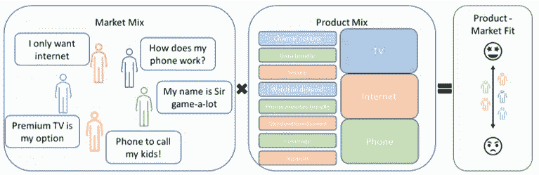

按作者分类的图片|不同客户与电信产品的对比，结果是适合

或者如果我们用约会来类比:

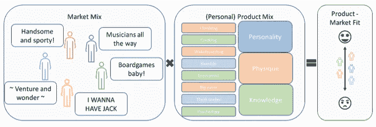

按作者分类的图片|不同的日期与 Jack 的个人资料(个性、体格、知识)的对比，结果为符合

然后，我们可以简单地将物品与人进行对比，以获得分数:

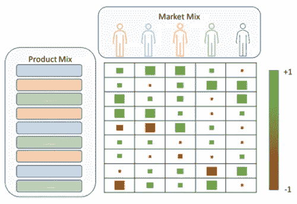

图片作者|市场中的每个人都有自己独特的产品偏好组合

你注意到我是如何将不同的产品项目作为变量分类到**颜色组**中的吗？杰克正在寻找一个有个性、有知识、体格对他有吸引力的人。大多数人都在寻找相同的东西，所以我们的分类足够广泛，可以用于更广泛的人群。

我们可以使用这些类别来创建一个简单的心理模型，作为一个线性方程，其中每个人指定一个数字来表示他们认为个性、知识和体格有多重要，乘以杰克的档案。我们进行计算，然后将其相加，得到一个合适的分数:

> *契合度得分= (Pers * Pers。W) +(知道*知道。W) + (Phys * Phys.W)
> Pers =性格，Know =知识，Phys =体格，w =体重*

如果我们现在通过这个模型输入大量数据，我们就可以评估杰克和他的约会对象之间的契合度。但是这是一个好的模式吗..？分数对他有用吗？我现在知道杰克在找谁了吗？不要！约会是微妙的，这太笼统而没有用。抱歉杰克。尽管我们的目标是实用，但我们如何才能制作出一个我们都能理解和使用的性能良好的模型呢？

**第四步:理解(变量之间的)关系**

首先，**我们需要看看我们的变量以及它们与客户流失的关系**。如果变量 X 发生变化，对 Y 有什么影响？有直接的因果关系，还是更像是关联？我们正在进入假说发展的领域，这对创造一个好的心智模型是有用的。

然而，我们需要理解每一件事情是如何相互联系的吗？再想想实际。我们只需要知道事物或多或少是如何相互联系的。因此，我们不需要进入测试或获得深刻的知识。例如，如果你喜欢某人，你只是喜欢某人。你的感受与你和那个人的关系密切。就这么简单。

> 别想多了杰克！你知道这是怎么回事。打一针，然后过去！

为了更好地解释这是如何工作的，从现在开始我将使用数据和编码。别担心。我尽可能简单，让每个人都明白。人们喜欢你的经理，其他同事，也许还有你的下一个约会对象！

**3)进行第一次分析:工作的技术重点**

我将使用一个常用的客户流失数据集，电信客户流失数据集。与分析师获得的任何数据一样，我们首先要问:

**第一步:我们有什么数据？** [*电信客户流失* *数据集*](https://www.kaggle.com/blastchar/telco-customer-churn) 是关于一家提供家庭电话和互联网订阅的虚拟电信公司。该数据涵盖了第三季度加州的 7043 名客户，包含 21 个不同的变量，包括流失标签。避免这里的第一个错误，阅读变量定义。如果你没有你正在看的东西的定义，去获取它们。接下来，检查数据。

为了简洁明了，我将输出和定义放在一起:

```
# Getting necessary packages.
import pandas as pd
import numpy as np# Getting the data.
file_handler = open("Telco Churn Dataset.csv", "r")
data = pd.read_csv(file_handler)
file_handler.close()# Having a first look at the data.
data.info()
```

电信数据—如果您收到“502 错误网关”错误，请刷新:)

好的，所有的栏目包括 7043 个条目。因此，没有空条目。我们有 18 个包含文本(对象)数据的列和三个数字(int 和 float)列。

接下来，我们检查格式。

```
# Checking the first 5 entries.
data.head()
```

电信公司优先数据条目—如果您收到“502 错误网关”错误，请刷新:)

我们检查了我们的数据，注意到一些不一致的地方需要修正。
要解决的问题有:
客户 ID、任期和性别→姓名需要像其他人一样大写
总费用→以文本形式存储的货币数字
高级公民→是和否作为 1 和 0，使用文本进行业务解释

```
# Proper capitalization of variable names
data.rename(columns={'customerID':'CustomerID', 'gender':'Gender', 'tenure':'Tenure'}, inplace=True)# Change the variable format, set any errors to NaN (Not a Number).
data['TotalCharges'] = pd.to_numeric(data['TotalCharges'], errors='coerce', downcast='integer')# Drop missing NaN values
data.dropna(inplace=True)# Changing 1 and 0 to Yes and No
data['SeniorCitizen'].replace({0:'No',1:'Yes'}, inplace=True)
```

由于更正了格式，我们在 TotalCharges 中发现了 11 个缺失值，并删除了这些条目。原因是我们开始注重实际:努力与价值。为了获得完整的数据，丢失 11 个条目是可以忽略的。

> 别担心细节，杰克，继续前进。

**第二步:将数据与问题联系起来**

我们现在是在向机器学习迈进吗？啊-啊。还是太早了！我们现在必须考虑我们的数据如何与问题联系起来。我们用一个简单的单变量分析来看我们关心的东西，客户流失。因为我们可能认为我们了解我们的问题，客户流失，但是我们的数据也和这些想法相似吗？在开始分析之前，我们会确认客户流失是否是一个问题。

```
# Plotting non-churners versus churners.
data['Churn'].value_counts().plot.bar(title='Count of Churn')# How big is the churn proportion in percentages?
print(data.Churn.value_counts(normalize=True))
```

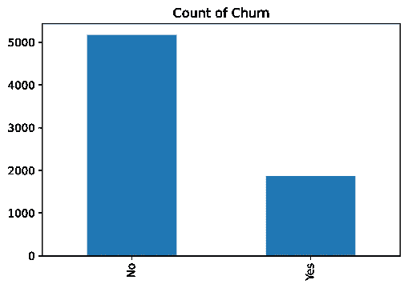

作者图片|客户流失条形图

```
No     0.73463
Yes    0.26537
Name: Churn, dtype: float64
```

好的，那么到第三季度末，大约有四分之一的客户流失了。这个高吗？那么，在第 3 季度，有多少客户的租期为 3 个月或更短？

```
# Finding acquisition in Q3.
data.Acquisition = (data['Tenure'] <= 3)# Creating a churn to acquisition table to then plot the data.
Churn = data.Churn.value_counts().values
Acquisition = data.Acquisition.value_counts().values
index = ['No', 'Yes']
pd.DataFrame({'Churn':Churn, 'Acquisition':Acquisition}, index=index).plot.bar(rot=0)
```

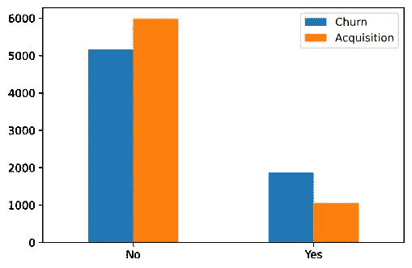

按作者分类的图片|流失率与收购率的条形图

好吧，所以在同一时期，更多的客户是在流失，而不是被收购。所以，做这样的分析对支持业务是有意义的！

还要注意的是，如果我们要谈论平衡，搅拌器似乎在数据集中代表不足。大约 27%被搅动，而不是 50%。很高兴知道进一步的分析！因为即使减少搅动器对企业更好，如果我们现在使用机器学习会发生什么..它会最了解谁？没错，73%的非搅拌者！我们想了解搅拌者，以及是什么将他们与非搅拌者区分开来。因此，我们有了第一次学习:我们需要稍后解决不平衡，以便进行更深入的分析。

> 你看，杰克，如果你想更擅长约会，你只需要有更多的约会

这意味着杰克也将不得不遇到更多的拒绝，以便进一步学习。可怜的杰克。幸运的是，我们可以人工制造更多的搅拌器。我们的方法是对它们进行过采样(制造更多的)。当业务需要时，我们将在稍后阶段这样做，现在我们从我们的自然样本中了解更多:)。到目前为止最好的结论是:我们 27%的流失率大于收购率，并造成了业务问题。

**第三步:创建心智模型(用数据)**

还记得我们的心智模型是如何由许多不同的项目组成的吗？有些是关于市场和其中的客户，有些是关于产品和规格。我们集思广益，衍生出与客户流失相关的项目。比如上网时的网速..我们有客户选择有线电视还是更快的光纤互联网的数据。

因此，我们将理论与数据联系起来。不幸的是，我们永远不会有所有必要的数据来联系我们最初的想法，然而我们的头脑风暴确实给我们带来了更广阔的视角，如果我们立即跳到数据上，我们就会错过这个视角。非常重要。

现在转到我们的客户流失变量，为了大致了解它们之间的关系，我们进行双变量分析。也就是说，我们将每个变量与我们的流失变量进行比较。

```
# Counting unique values per column.
for column in data.columns:
    print(column + ':' + str(data[column].nunique()))
    print(data[column].unique())
    print('-'*40)
```

电信公司变量信息—如果您收到“502 错误网关”错误，请刷新:)

更仔细地观察我们的变量，根据上下文，我们可以看出一些列是关于与订阅互联网服务或电话服务相关的附加服务。明智的做法是将它们分组，类似于我们之前的分组。

```
# Grouping variables.
dependent   = ['Churn']
identifier  = ['CustomerID']
numerical   = ['Tenure', 'MonthlyCharges', 'TotalCharges']
categorical = [col for col in data.columns if col not in numerical + dependent + identifier]# Grouping add-on sub-groups.
internet_add_on = ['OnlineSecurity', 'OnlineBackup', 'DeviceProtection', 'TechSupport', 'StreamingTV', 'StreamingMovies']
phone_add_on = ['MultipleLines']
```

关于数据，我们的大部分分类数据包含“是”或“否”,有时还包含关于客户是否拥有主要服务的第三个选项。

例如，有“无互联网服务”作为互联网附加变量的第三个选项。作为一个是或否问题的答案，这似乎有点奇怪。这里我们需要避免错误的两个原因是:

1.  在直观比较选项时，我们希望比较两个变量。如果我们问杰克是否尝试过网上约会，我们不会添加第三个变量来使比较复杂化，例如，他是否有互联网？
2.  一组在购买主要服务(互联网)时接受附加服务，另一组不购买主要服务。这些群体各不相同，我们希望避免从他们那里得出混淆的结论。

处理这个问题的正确方法是有一个关于主服务是否被购买的单独的列，并且将变量限制为两个选项。下一步是在可视化数据时注意组的大小。让我想象一下:

```
# importing visual packages.
import matplotlib.pyplot as plt
import seaborn as sns# Showing two countplots: Before and After
sns.countplot(data=data, x='OnlineSecurity', hue='Churn')
plt.show()sns.countplot(data=data[data['OnlineSecurity'] != 'No internet service'], x='OnlineSecurity', hue='Churn')
plt.show()
```

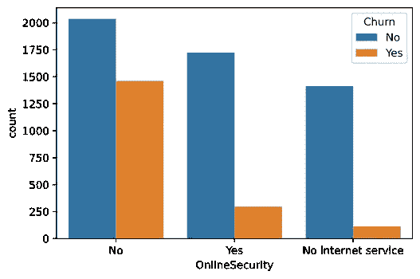

图片由作者提供|第 1 组:有互联网的人，他们是否参加了在线安全+第 2 组:没有互联网服务的人，他们是否参加了在线安全

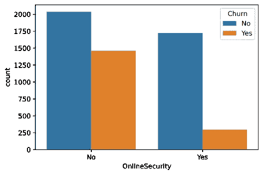

作者图片|第一组:有互联网的人以及他们是否采取了网络安全措施

现在你可能会想，这不是很明显吗..？好吧，我已经看到这个简单的错误发生在相当多的笔记本和媒体文章中，以此来证明这一点。好了，是时候一起看看我们所有的分类变量了！

```
# We have 16 categorical variables so a 4 by 4 matrix is nice.
fig, axes = plt.subplots(nrows = 4,ncols = 4,figsize = (16, 16))# Selecting and plotting the data, inputting them into the matrix.
for i, item in enumerate(categorical):
    if item in internet_add_on: 
        df = data[data['InternetService'] != 'No']
    elif item in phone_add_on: 
        df = data[data['PhoneService'] != 'No']
    else: df = data if i < 4:
        ax = sns.countplot(data=df, x=item, hue='Churn',
        ax=axes[0, i]) elif i >=4 and i < 8:
        ax = sns.countplot(data=df, x=item, hue='Churn',
        ax=axes[1, i-4]) elif i >=8 and i < 12:
        ax = sns.countplot(data=df, x=item, hue='Churn',
        ax=axes[2, i-8]) elif i < 16:
        ax = sns.countplot(data=df, x=item, hue='Churn',
        ax=axes[3, i-12])# Limiting characters to 5 and setting the title on top.
    ax.set_title(item)
    ax.set_ylabel('')
    ax.set_xlabel('')
    ax.set_xticklabels(item.get_text()[:5] for item in
    ax.get_xticklabels())
```

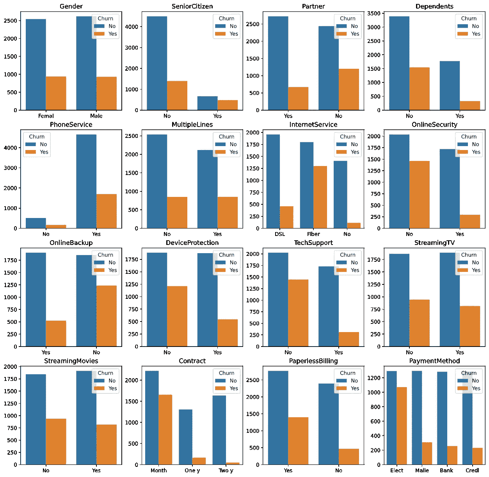

作者图片|分类变量的计数图

这个视觉效果的好处在于，它显示了每组的大小，旁边是其中的搅拌器数量。因此，我们避免了因群体规模而产生的偏见。

我们在这里学到了一些东西！比他们的对手有更多变动的群体是老年人，没有伴侣的人，有光纤网络的人，没有网络安全的人；在线备份或高级技术支持，每月签约的客户，以及自动支付电费的客户。不错！

然而，这一切对约会意味着什么呢？我的意思是，杰克似乎有点缺乏数据。嗯，杰克最近有一个很棒的约会，一些给他的建议是，不是所有的浪漫想法都适用于所有的情况…


杰克最后一次约会！图片作者|原始照片作者(上)[奥克塔视觉项目](https://unsplash.com/@oktavisual?utm_source=unsplash&utm_medium=referral&utm_content=creditCopyText)和下图([马頔·胡多罗日科夫](https://unsplash.com/@wolair?utm_source=unsplash&utm_medium=referral&utm_content=creditCopyText))在 [Unsplash](https://unsplash.com/s/photos/spaghetti?utm_source=unsplash&utm_medium=referral&utm_content=creditCopyText)

嗯…杰克，玩得很开心，这才是最重要的！正如你所看到的，杰克可能没有太多的“约会”,但他仍然在那里！当他回顾这顿饭时，他想知道:什么食物对约会的成功最有帮助？当他绘制食物等级与后续日期的关系时，我们可以以他为例来研究我们自己的数字数据:

```
# Histogram and scatterplot, 3 numerical variables, 2 by 3 matrix.
fig, axes = plt.subplots(nrows = 2, ncols = 3,figsize = (16, 8))# Selecting and plotting the data, inputting them into the matrix.
for i, item in enumerate(numerical + numerical):
    if i < 3:
        sns.histplot(data[numerical + dependent], x=item,
        hue='Churn', ax=axes[0, i])
    elif i >= 3 and i < 6:
        df = data[numerical + dependent]
        df.replace({'Yes':1, 'No':0}, inplace=True)
        df = df.groupby(item).Churn.mean().reset_index()
        sns.scatterplot(data = df, x=item, y='Churn', 
        ax=axes[1, i-3])
```

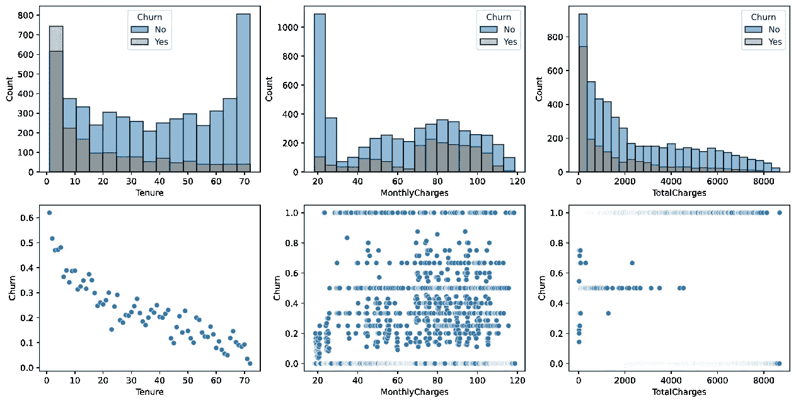

按作者分类的图像|第一行=按流失分类的直方图。第二行=每组平均流失散点图

好吧好吧好吧，我们这里有什么！似乎流失率随着任期的增加而降低，所以我们对相对较新的客户感兴趣！这也反映在较低的总费用中较高的流失率。此外，月度费用显示，大多数客户似乎每月支付 20 美元左右，当每月支付 70 美元或更多时，流失率相对较高。虽然我们的散点图可以更好，因为我们看到宁滨的结果确实改善了我们的分析，我们发现有用的结论。

**第四步:理解关系(变量之间，用数据！)**

关于关联性，我们的变量是如何相互作用的。为此，我们看一个相关图。相关图以及我们最终的机器学习模型将使用数字数据。为此，我们希望将我们的分类格式化为是或否问题，其中是为 1，否为 0。

> 杰克:所以。我们有一个很棒的约会…这让我想到，她是我的唯一吗？

```
# Changing our binominal data into numerical
numerical_format = {'No':0, 'No internet service':1, 'No phone service':0, 'Yes':1, False:0, True:1}
data.replace(numerical_format, inplace=True)# Creating a list of dummy variables for our remaining categoricals.
dummies = []
for column in categorical:
    if data[column].dtype == 'O':
        if column not in dummies:
            dummies.append(column)# Generating the dummy variables
data = pd.get_dummies(data = data, columns = dummies, drop_first=True)# Fiber optic and DSL stayed but I'm more interested in no internet.
data['InternetServiceNone'] = ((data['InternetService_DSL'] == 0) & (data['InternetService_Fiber optic'] == 0)).astype('int')
data.drop(columns='InternetService_DSL', axis=1, inplace=True)# Adjusting the long names.
data.rename(columns={'Gender_Male':'Male', 'InternetService_Fiber optic':'InternetFiberOptic', 'Contract_One year':'ContractOneYear',
'Contract_Two year':'ContractTwoYear', 'PaymentMethod_Credit card (automatic)':'PmCreditCard','PaymentMethod_Electronic check':'PmElectronicCheck', 'PaymentMethod_Mailed check':'PmMailedCheck'}, inplace=True)# Create the correlation matrix, rounding to one decimal
corr = data.corr().round(1)# Generate a mask for the upper triangle; True = do NOT show
mask = np.zeros_like(corr, dtype=np.bool)
mask[np.triu_indices_from(mask)] = True# Setup the correlation matrix as a heatmap with diverging colors
f, ax = plt.subplots(figsize=(11, 9))
cmap = sns.diverging_palette(220, 10, as_cmap=True)# Draw the heatmap with the mask and correct aspect ratio
sns.heatmap(corr, mask=mask, cmap=cmap, annot=True, vmax=1, vmin=-1, center=0, square=True, linewidths=.5)
```

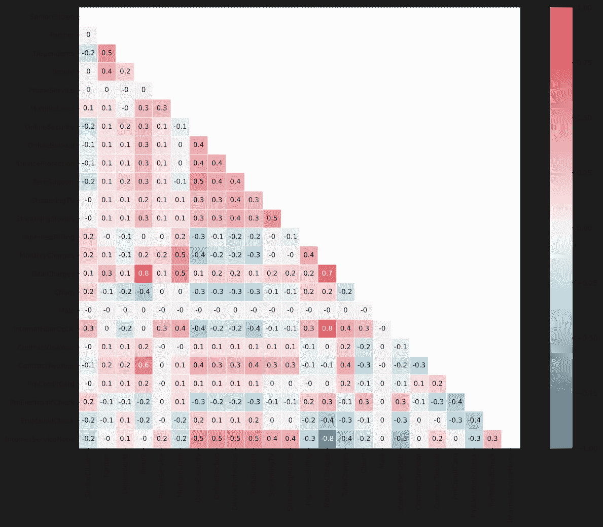

按作者分类的图像|数据集中所有变量的相关矩阵

我们又发现了有趣的东西！光纤与月费高度正相关。或许纤维价格过高？因为我们看到这个团队中有很多人流失！当我们看到这个结论与没有互联网有很强的负相关性时，我们会发现更多的支持。

太好了，现在我们对数据有了一个大致的概念。我们现在继续分析吗？没有。我们只触及了表面，但已经学到了很多。

这对现在来说已经足够了。准备好您的报告，并与组织分享您的经验！人们可能会提出有趣的评论，如确认之前的预感，怀疑数据的正确性以及其他重要的事情，以便尽早沟通。

报告写完了吗？不要忘记传达接下来的步骤。从而帮助你的经理做出是否继续分析的实际决定。如果实际需要深入研究，我们将进一步将其与以下理论和技术项目相结合:

1.  用机器学习解决班级失衡
2.  利用机器学习细分客户
3.  用机器学习预测未来的客户流失

> 杰克:我想我现在明白了，昨天的约会非常成功！我现在就打电话给她！
> 
> 华纳:不，不，不！耐心点，杰克。她需要一些时间来消化。

感谢阅读，请在评论中告诉我你的想法！欢迎在 LinkedIn 上与我联系。还想知道更多吗？你准备好下一步了吗？

(工作正在进行中，欢迎提出想法:)点击此处阅读下一篇文章，该文章将讨论如何通过将机器学习应用于下一次流失分析来获得可操作的见解。