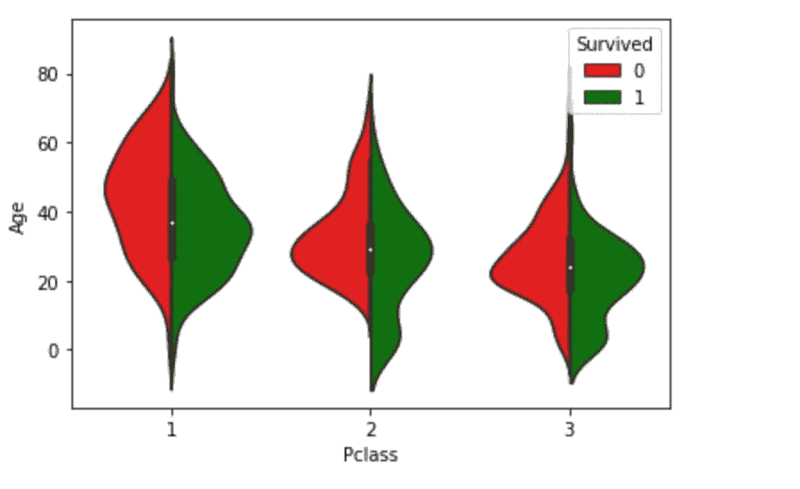
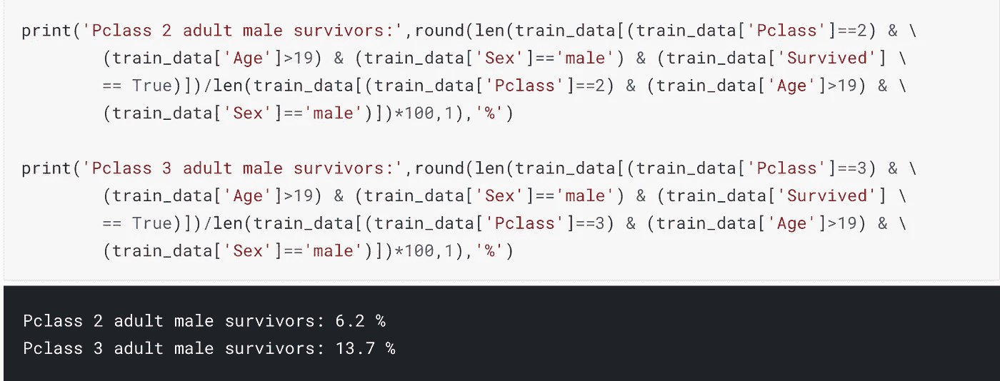
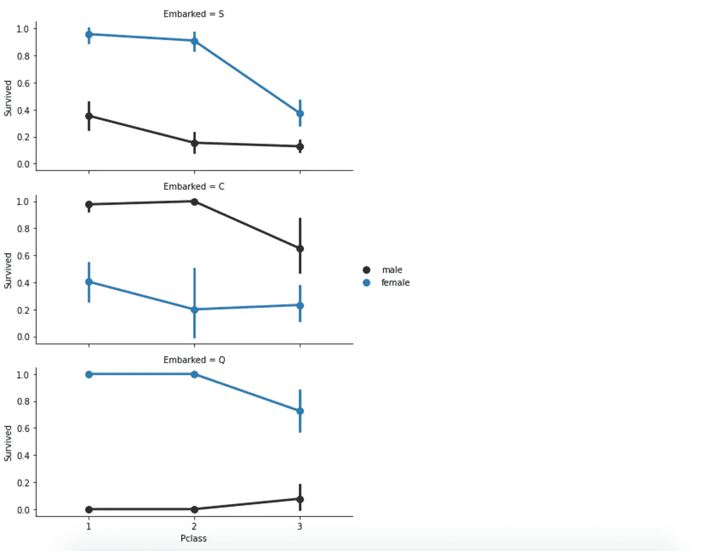
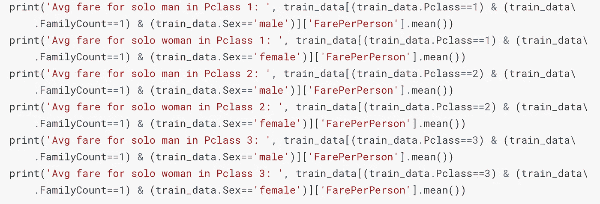
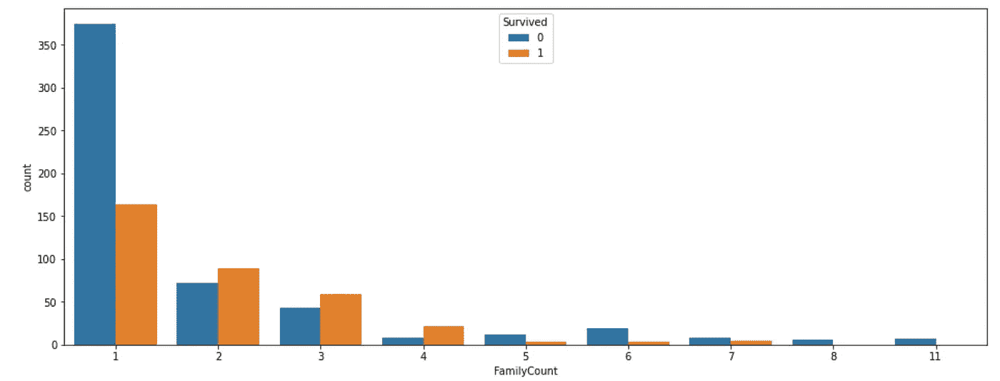
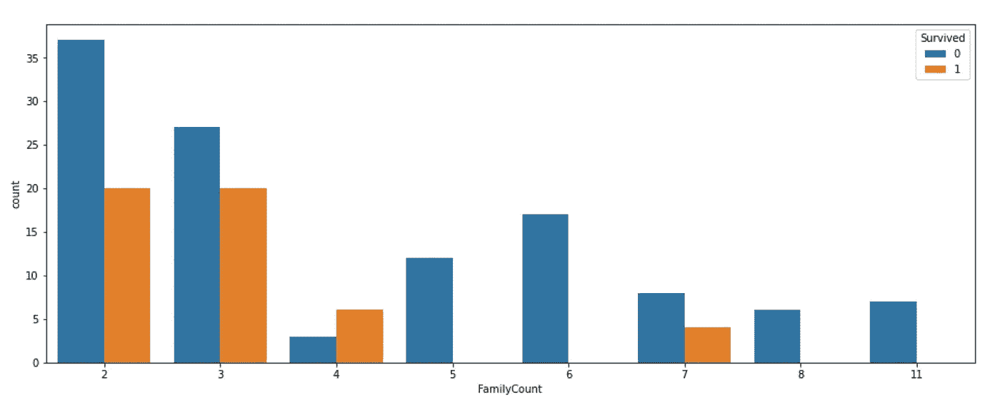

# 公海利他主义案例及其他有趣的故事

> 原文：<https://towardsdatascience.com/a-case-for-altruism-on-the-high-seas-and-other-interesting-stories-970a04444db2?source=collection_archive---------33----------------------->

## 从 Kaggle 十年前的泰坦尼克号数据集得到的新推论


作者图片

在我与泰坦尼克号数据集讨论的过程中，一些独特的小插曲被抛了出来。其中一些在过去有很好的记录，一些没有。几个例子:

*   如果你坐二等舱或三等舱旅行，你会觉得更安全吗？与因好莱坞电影而出名的流行观点相反，如果你乘坐三等舱而不是二等舱，成年男性在泰坦尼克号上幸存的几率会增加一倍
*   “名字里有什么？我们称之为玫瑰的东西，不管叫什么名字，闻起来还是一样香”——第二幕，第二场。*不幸的是，泰坦尼克号的数据似乎与茱丽叶的说法大相径庭，因为与长名字的人相比，短名字的人在泰坦尼克号上的死亡率极高*
*   公海上利他主义的一个例子——*那天晚上达尔文被证明是错误的，但是数据是否提到了其他没有记录在案的利他主义行为？3 个独立的证据出现在更近的观察中*
*   哎呀，泰坦尼克号数据集教程博客上的勘误表— *一个原始错误，几个副本*
*   泰坦尼克号上的女性可能要多付一点— *,但是男性要多付很多*
*   相关性不是因果关系— *“群体生存”结论的谬误*
*   Titanic 数据集上最大的生存指标是什么— *不，它不是数据集*中列出的 11 列中的任何一列
*   填空— *在填补缺失的年龄时，是否有关于女性儿童的重要线索被忽略了？*
*   不管领导怎么说，单干并不一定意味着你生存的机会更低。如果你是女性，为了在泰坦尼克号上生存下来，你会想单飞。在探究原因后，这些数据讲述了一个令人心碎的故事，涉及 100 多年前那个灾难性的夜晚上演的终极牺牲行为……

卡格尔主持泰坦尼克号比赛已经快十年了。对于任何有抱负的数据科学家来说，这就像众所周知的“成年礼”。你可以看到当今 Kaggle 的一些大师是世界上最好的数据科学家之一，他们在过去的某个时候在这个数据集上留下了不可磨灭的印记。这是一个简单得可笑的小数据集，但在数据科学和机器学习的几乎所有方面都提供了令人惊讶的好练习——从数据探索/可视化到猜测缺失值、特征工程，再到测试许多 ML 模型。

比赛的细节可能已经众所周知，我用两到三句话来总结——它涉及预测泰坦尼克号上的乘客是否能够生还..给出一组特征，如他们的年龄、性别、旅行等级、上船港口等。有抱负的数据科学家应该让他的模型从训练数据集(包含一个关于乘客是否幸存的附加列)中“学习”，并将这些“学习”应用于测试数据集，并预测测试数据集中的哪些乘客幸存。

虽然许多年过去了，但数据集中仍然隐藏着数量惊人的信息。不过，经过一点哄骗，它非常愿意说出自己的秘密。因此，我们没有费太多周折，直接进入了我用 Python 对这个迷人的数据集进行讨论的文字记录——我学习这种语言就是为了和它交流。我们将仅使用 Kaggle 数据集来得出我们的结论，不会参考任何外部数据源。所以这个分析只能从那个角度来看，可能是也可能不是真实事件的反映。

```
import pandas as pd
import seaborn as sns
import matplotlib.pyplot as plttest_data = pd.read_csv (‘/kaggle/input/titanic/test.csv’)
train_data = pd.read_csv(“/kaggle/input/titanic/train.csv”)*##These survival rates will be used as a reference*
print(round(train_data [['Pclass','Survived']].groupby(['Pclass']).mean()*100,1))print(round(train_data [['Sex', 'Pclass','Survived']].groupby(['Pclass', 'Sex']).mean()*100,1))
```


基本的观察结果是众所周知的，因此可以用几句简短的话来概括。乘客的性别和他们乘坐的舱位(Pclass)似乎与存活率有着最高的相关性。年龄似乎是一个因素。其他因素，如港口着手似乎发挥了很小的作用。上述数字似乎也符合普遍预期。

我们从紫罗兰图开始分析。

```
sns.violinplot(x=’Pclass’, y=’Age’, hue=’Survived’, split=True, data=train_data, palette={0: “r”, 1: “g”});
```



我们马上看到一些令人困惑的事情需要调查。Pclass 2 和 3 在 20-35 岁年龄范围附近有一个非常明显的到期峰值。然而，Pclass 1 的情况并非如此。除了 50 岁左右的人之外，PClass 1 在所有年龄段都有更多的幸存者。60 岁以后，寿命会急剧增加。这在 Pclass 2 或 3 中没有那么尖锐。这是一个奇怪的现象。让我们调查一下。

```
**print**('Pclass 1 survivors above Age 60:', round(len(train_data[*(train_data['Pclass']==1) & (train_data['Age']>59) & (train_data['Survived']==True)*])/len(train_data[(train_data['Pclass']==1) & (train_data['Age']>59)])*100,1), '%')**print**('Pclass 2 survivors above Age 60:', round(len(train_data[*(train_data['Pclass']==2) & (train_data['Age']>59) & (train_data['Survived']==True)*])/len(train_data[(train_data['Pclass']==2) & (train_data['Age']>59)])*100,1), '%')**print**('Pclass 3 survivors above Age 60:', round(len(train_data[*(train_data['Pclass']==3) & (train_data['Age']>59) & (train_data['Survived']==True)*])/len(train_data[(train_data['Pclass']==3) & (train_data['Age']>59)])*100,1), '%')**print**('Pclass1 survivors between 20-30 Age:',round(len(train_data[*(train_data['Pclass']==1) & (train_data['Age']>19) & (train_data['Age']<31) & (train_data['Survived']==True)*])/len(train_data[(train_data['Pclass']==1) & (train_data['Age']>19) & (train_data['Age']<31)])*100,1),'%')**print**('Pclass2 survivors between 20-30 Age:',round(len(train_data[*(train_data['Pclass']==2) & (train_data['Age']>19) & (train_data['Age']<31) &(train_data['Survived']==True)*])/len(train_data[(train_data['Pclass']==2)&(train_data['Age']>19) &(train_data['Age']<31)])*100,1),'%')**print**('Pclass3 survivors between 20-30 Age:',round(len(train_data[*(train_data['Pclass']==3) & (train_data['Age']>19) & (train_data['Age']<31) &(train_data['Survived']==True)*])/len(train_data[(train_data['Pclass']==3) & (train_data['Age']>19) &(train_data['Age']<31)])*100,1),'%')
```


事实上，在 Pclass=1 的情况下，如果一个人的年龄在 20-30 岁之间，那么他的存活几率是 60 岁的 2.5 倍。随着阶级的变化，我们可以看到 2 个年龄组之间的生存差距是如何缩小的。这怎么解释呢？这是一种利他主义行为吗——让年轻一代活下去？为什么这仅限于第一类？是不是只是数据的一个怪癖，意义不大？对数据的快速分析表明，Pclass 2 和 Pclass 3 的老年乘客数量在统计上不显著。任何幸存者都有可能扭曲百分比。但是，Pclass1 有 17 人年龄超过 60 岁，这不是一个微不足道的数字。

一种可能是，在第一类人群中，老年群体中男性较多，中年群体中女性较多..这就是差距的原因。一系列快速命令显示，与中年组 19 个中的 9 个相比，pclass 1 中 14 个中只有 2 个大于 60 的男性存活。因此，即使在考虑了所有参数后，我们仍然看到 14%的存活率与接近 50%的存活率之间的差异，这是一个谜。这并不是说中年人欺负老年人。事实上，除了不幸的最后几分钟，大部分疏散都是有序的。大多数退出的人都是身体健康的中年男性..这就是为什么那天晚上我谈到达尔文被证明是错误的，作为利他主义的第一个行为。但就头等舱乘客而言，这一理论似乎有些扭曲。看起来确实是一些年长的雄性主动为年轻的雄性让路..这可能是泰坦尼克号上的第二次利他行为吗？数据很少，但并非完全无关紧要，它确实指向那个方向。

当我们进一步将“性别”列添加到过滤器中时，另一个惊人的数据出现了。我们看到中年组(20-30 岁)的 33 名 Pclass 2 男性无一存活。正如我们之前看到的，Pclass2 男性乘客的存活率为 16%，因此这很奇怪。事实上，很奇怪的是，我扩大了年龄范围，发现 20-60 岁年龄组的 72 名男性中只有 4 人幸存。与 Pclass2 雄性的 16%的存活率相比，这只是 5%。这可能意味着两种情况之一:要么是 p 2 班比正常情况下有更多的孩子存活下来，要么是 p 2 班中有超过%的男孩存活下来。这意味着，与第三组相比，第二组的成年雄性实际上存活的机会更少，这有点颠覆了流行的理论。让我们检查一下…



令人难以置信的迷人，这是一个奇迹，至今没有记录。直截了当地说，如果你是一名成年男性，如果你在泰坦尼克号上订了三等舱而不是二等舱，你有两倍的生存机会！这确实颠覆了流行的理论..到目前为止，我们已经在泰坦尼克号上发现了三种利他行为。第一个是众所周知的。第二个是由于缺乏足够的数据，不是很有结论性，但在统计上不是无关紧要的。第三个让我大吃一惊。一大块 Pclass 2 男性自愿放弃了他们的生命，以便更多的女性和儿童(来自所有阶层)生存下来。还有表演吗？让我们看看。

但在此之前，让我们用 facetgrid 图来分析 apollowed 列。

```
fg = sns.FacetGrid(train_data, row='Embarked', aspect=2)
fg.map(sns.pointplot, 'Pclass', 'Survived', 'Sex')
fg.add_legend()
```



你有没有注意到船上的港口发生了一些奇怪的事情？就性而言，那些登上 C 港的乘客已经完全颠覆了生存几率。大部分雄性活下来，雌性断气！这是错误的信息&可以通过查询收集按性别分组的 C 港登船幸存者的年龄百分比来快速验证。很明显，中间一排的雄性&雌性的颜色混淆了。如果您的控制台警告被抑制，您甚至可能不会注意到它..幸运的是，警告是明确的。*请使用“订单”参数，否则您可能会得到不正确的订单*

```
fg = sns.FacetGrid(train_data, row='Embarked', aspect=2)
fg.map(sns.pointplot, 'Pclass', 'Survived', 'Sex', hue_order=['female','male'], order=[1,2,3],palette={'female':"r",'male': "g"})
fg.add_legend()
```


更好！一个非常受欢迎的博客帖子(& *至少有十几个其他副本)做出了这个错误的观察，并继续讨论其他话题，好像这是完全正常的数据行为。我提出这一有限观点的唯一目的是要求年轻读者不要把数据探索阶段看得好像是一种需要在进入真正的 ML 建模之前快速完成的形式。请深入研究数据，尤其是如果您看到需要进一步调查的模式或 anamolies。*

现在让我们取很小的偏差..只是为了好玩，我试着分析女性乘客的票价，看看她们是否与男性不同。这仅仅是一种干扰……就费用而言，列出(可能的)性别歧视的证据从未在我的议程上，但以下是我的观察:



看起来，平均来说，女性票的价格在第一组中高出 20%，在第二组中高出 8%，在第三组中高出 4%。我停止我的案子。也许男人讨价还价更多，以获得更好的交易？在任何情况下，票价显然更有利于男性，但他们得到的比他们最终讨价还价的更多。另外，我有时觉得我们认为这些绅士的骑士精神是理所当然的，并认为同样的事情在任何情况下都会发生，但在其他一些类似的悲剧中显然不是这样(在这些事件中，妇女和儿童的死亡率低于男性)。所以铁达尼号上的这些绅士肯定有些特别之处..也可能是剧组和领导团队促成了这一切。我们只能推测…

现在让我们把注意力转向一个流行的观点——2-4 人一组的人有很好的生存机会，5 人一组的人生存机会较低。

```
train_data[‘FamilyCount’]=train_data[‘Parch’]+train_data[‘SibSp’]+1sns.countplot(x=’FamilyCount’, hue=’Survived’, data=train_data)
```



看来独自旅行的人风险很高。从 2-4 组开始，虽然存活率很高，但从 5 组开始，存活率完全下降。几乎所有的 Kaggle 帖子都提出了这一观点，事实上一些非常高的领导者也在他们的分析中提出了这一观点。直觉上，这似乎是真的——如果你在一个较大的团队中旅行，你可能会更快地意识到即将发生的悲剧，因为这个团队的规模很大。另一方面，独自旅行的人可能在铺位上睡得很熟，可能很晚才得到消息。随着群体规模的增加，也许越来越难以召集所有人&向安全的地方冲去，所以也许随着群体规模的扩大，趋势变得消极，存活率下降。

我最初的猜测是，虽然这可能是真的，但我觉得这可能是一个相关的案例，而不是因果关系。换句话说，更大的群体并没有“导致”存活率下降。我感觉实际上发生的是，大群体在 3 级群体中更普遍，无论如何，根据旅行等级，他们生存的机会更低。换句话说，Pclass=3 是高死亡率的原因，而组大小> 4 只是与较高的死亡率相关。然而，我确实觉得独自一人会增加死亡率。让我们快速看看这一切是不是真的。


这确实是一种关联，而不是因果关系！正是 Pclass 在这里扮演了一个隐藏的角色。让我们重新绘制这张图，但是是在一个普通的平面上。

```
sns.countplot(x=’FamilyCount’,hue=’Survived’,data=train_data[(train_data.Pclass==3) & (train_data.FamilyCount >1)])
```



现在情况看起来很糟糕&与先前的图表完全相反。所以群体大小在生存中似乎没有太大的作用。是否单飞对 T1 有影响，但除此之外，团队的规模对 T2 似乎没什么影响。它可能会不必要地给出一些假阳性，并且人们必须考虑该信息是否足够相关以被馈送到最终的 ML 模型。

即使是“独奏”功能也值得讨论。一般来说，独自旅行的人死亡率较高。让我们检查一下这个。


单身女性逆势而为。但是你可能会说这不是一个公平的比较，因为女性无论如何都有更好的存活率。让我们做一个最后的图表，比较单独旅行者和非单独旅行者之间的 Pclass 3 女性死亡率。

```
plt.figure(figsize=(16, 6))
sns.countplot(x='FamilyCount',hue='Survived',data=train_data[(train_data.Sex=='female') & (train_data.Pclass==3)])
```


我们现在看到，在 Pclass 3(或任何一个 Pclass)中，单身女性的死亡率百分比*比非单身女性的死亡率百分比*低得多。所以基本上，如果你是一个独自旅行的女性，你比有团体或家庭的女性有更好的生存机会……请注意，这些数据在统计学上并不是无关紧要的。这种极其奇特的趋势的原因是什么？

在 3 班有 60 名女性单独旅行者，相比之下有 84 名非单独的女性旅行者，也许正是在这里我们看到了泰坦尼克号上第四次也是最伟大的利他行为。虽然这可能有其他原因，但在我看来，这种情况的发生是因为这里的妇女带着她们的丈夫和男性子女(> 12 岁)旅行，即使他们有机会这样做，也不可能想离开他们！！一些个人的骑士精神和利他主义行为在泰坦尼克号上得到了认可，但这也许是其中最伟大的，遗憾的是这一点至今没有被唤起。

我们还没有分析姓名和机票列。在检查变量之间的相关性时，我发现了一些不可思议的事情..那些名字很长的人显然有很高的生存机会！然后我意识到婚前姓是已婚女性名字的一部分。因此，如果我们按名字的长度排序，我们首先得到的几乎是所有的女性，然后是男性。因为不可否认的是，在所有阶层中，女性的死亡率明显高于男性，这就解释了这种相关性。许多其他内核也做出了这个有趣的观察。

另一个有趣的方面是，名字和票结合在一起让我们能够对人进行分组。他们将为我们提供有价值的线索，告诉我们谁在一起旅行……这就把我们带到了最后也是最重要的一点。我在绘制群体规模与存活率的关系时意识到了这一点。在分析数据时，我注意到虽然大群体和存活率之间没有联系，但群体内成员的存活率之间有明确的联系。这比性别、阶级和年龄更能决定一个人是否能存活下来，对于绝大多数人来说(不包括几乎总能存活下来的 1 级和 2 级女性)。更具体地说，在一个群体中，如果我们根据性别和年龄进行分组，我们可以很好地预测存活率。甚至可以通过建立母系关系(使用女性乘客的婚前姓氏)来加强分组。

泰坦尼克号数据集有很多缺失的年代。我们通过分析如何做到这一点从基础到高级的各种观点来结束这篇博客。最简单的方法是使用平均值或中值来填充所有缺失的年龄。平均年龄在 30 岁左右。然而，通过计算一组“相似乘客”的平均年龄，可以更准确地推算出失踪年龄。例如，可以选择计算 *Pclass1 乘客*的平均值，并将其分配给所有 *Pclass1 失踪年龄*..以及 Pclass2 和 Pclass3 的 likeways。

但我们可以在此基础上进一步即兴创作。因为(比方说)Pclass3 中的女性很可能与 Pclass 1 中的女性有不同的平均年龄，所以一个更好的方法(大多数 Kaggle 领导者采用的方法)是根据性别对人们进行分组，Pclass。如果你想进一步完善它，你可以使用“标题”和 Pclass，它会给出比 Sex 和 PClass 稍好的结果。“标题”可以很容易地从名称中提取出来。

人们可以通过建立关系和计算年龄的缺失值来进一步即兴创作。例如，假设您有一对夫妻旅行，丈夫的年龄丢失，而妻子的年龄给定。你可以用妻子年龄+某个数字(比如 5)来“猜测”丈夫的年龄。同样，你可以根据另一个兄弟姐妹或者父母的孩子的年龄来猜测一个失踪兄弟姐妹的年龄。

此外，人们甚至可以使用 ML 模型来预测年龄的缺失值，就像一些内核所做的那样。但是此时一个相关的问题出现了。年龄的数值对生存的贡献有多大？这对生存会有很大影响吗？答案是否定的。还有其他更重要的因素。然而，不管这个人是儿童、成人还是老年人，这个事实在生存中确实起着至关重要的作用。只要你能把缺失的时代归类为属于这个群体中的一个，那就很好！特别是，我们应该花更多的时间去担心这个人(缺少年龄)是不是一个孩子？这对生存机会有很大影响。我们如何做到这一点？对男孩来说很容易，因为他们的名字前面有“主人”的头衔。但是我们如何在失踪的年龄中识别一个女孩呢？没有专门针对女性儿童的称谓。所有年龄段的未婚女性都有“小姐”头衔。

因此，这里有一个简单的线索来识别这些人，并估算他们失踪的年龄。到目前为止，我还没有看到它被用在任何内核中(至少我经历过的那些)。我们可以通过检查 Parch 标志来识别这种情况。如果羊皮纸标志> 0，那么他们很可能是女孩。因此，在我们完成所有其他步骤后，最好添加这个重要的启发式规则…

```
train_data['Title'] = train_data.Name.str.extract(' ([A-Za-z]+)\.', expand=False) print ("Avg age of 'Miss' Title", round(train_data[train_data.Title=="Miss"]['Age'].mean()))print ("Avg age of 'Miss' Title travelling without Parents", round(train_data[(train_data.Title=="Miss") & (train_data.Parch==0)]['Age'].mean()))print ("Avg age of 'Miss' Title travelling with Parents", round(train_data[(train_data.Title=="Miss") & (train_data.Parch!=0)]['Age'].mean()), '\n')Avg age of ‘Miss’ Title 22
Avg age of ‘Miss’ Title travelling without Parents **28**
Avg age of ‘Miss’ Title travelling with Parents **12** !!
```

看到巨大的差异了吧！如果我们使用平均值而不考虑羊皮纸，我们将会犯可怕的错误。即使在这里，p 类之间也有巨大的差距，我们需要在输入最终值之前考虑到这一点。

《泰坦尼克号》数据集在问世十年后仍继续给人们带来惊喜和灵感。泰坦尼克号上的高分遵循一种波浪模式。每隔几年，就会有新的兴趣出现，下一代数据科学家会将最高分略微提高。几年前，Chris Deotte——目前 Kaggle 上讨论量排名第一，笔记本数量排名第二——以 84%的分数提高了赌注(让我们忽略 100%的分数，甚至是带有预调优超参数的内核)。我真的希望阅读这篇博客的新晋数据科学家有动力重新审视这个极其迷人的数据集，并将分数推得更高。我了解克里斯，如果发生这种情况，他会是第一个鼓掌的人！

万事如意！

请务必查看我的笔记本——用 Python 与泰坦尼克号数据集的迷人对话。[*https://www . ka ggle . com/allo hvk/charminating-conversations-with-the-titanic-dataset*](https://www.kaggle.com/allohvk/captivating-conversations-with-the-titanic-dataset)*它有很多文档，即使是 ML 和 Python 的初学者也非常容易理解。*