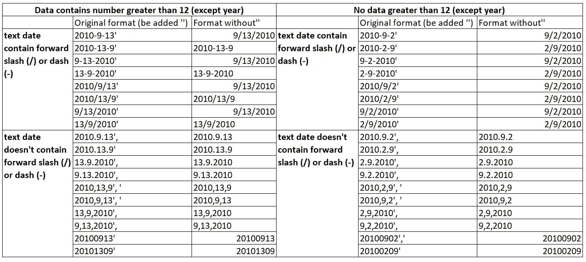
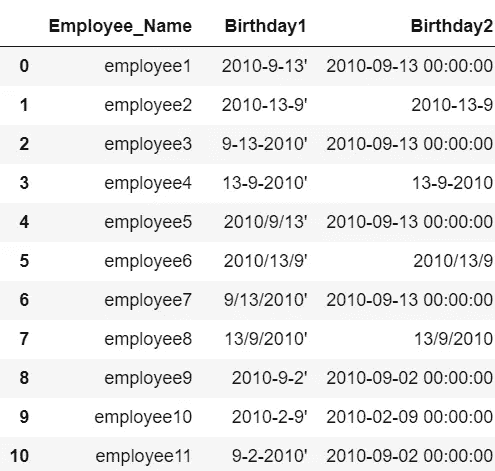
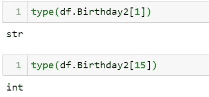
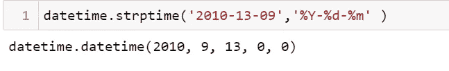
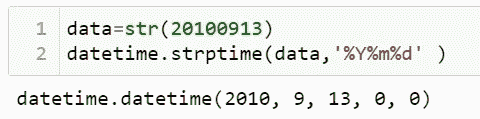
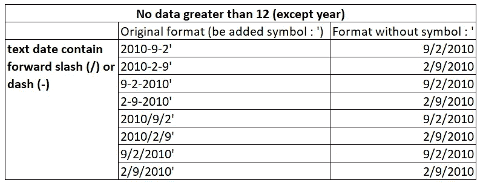
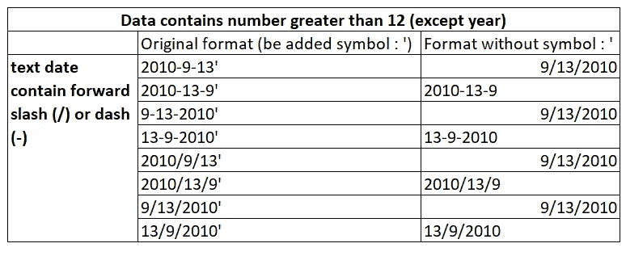
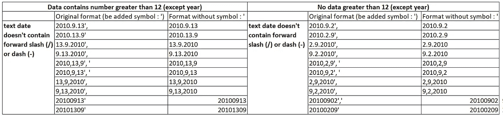
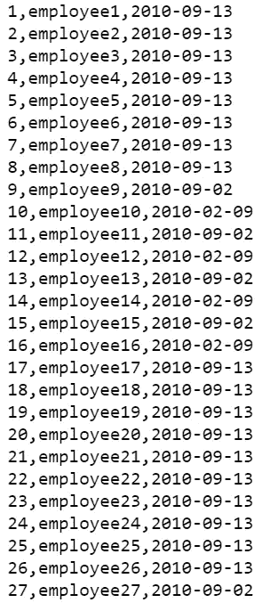

# 利用 Python 将多格式数据从 Excel 导入 MySQL 的案例研究

> 原文：<https://towardsdatascience.com/a-case-study-for-transferring-multi-format-date-data-from-excel-into-mysql-through-python-f87d3c2a1859?source=collection_archive---------49----------------------->

## [实践教程](https://towardsdatascience.com/tagged/hands-on-tutorials)


照片由[Cookie Pom](https://unsplash.com/@cookiethepom?utm_source=unsplash&utm_medium=referral&utm_content=creditCopyText)在 [Unsplash](https://unsplash.com/s/photos/computer?utm_source=unsplash&utm_medium=referral&utm_content=creditCopyText) 拍摄

在数据分析中，日期格式和相关问题是令人头疼的问题。今天我想举一个例子来说明现实中的日期数据存在什么样的问题，如何用 Python 来处理，插入到 MySQL 数据库中。

# **案例分析**

一家公司需要合并全球员工的信息，因为数据来自不同的国家，将生日输入到 Excel 中有不同的约定，并且也有错别字，所以当数据被合并时，生日看起来像:


Excel 中的表格(图片由作者提供)

**生日 1** :原来的生日是什么样子(为了表示，加了一个类似`'`的字符，使其显示原来的格式)
**生日 2** :我电脑上 Excel 里的生日是什么样子

如果我们总结一下这个案例，有如下表的情况:



可能的案例分析(图片由作者提供)

你可能已经知道了，数据左对齐默认是字符串，比如' 2010–13–09 '，数据右对齐默认是日期或者数字，比如' 9/13/2010 '，我不确定 20100913 的类型，就这样吧。

我把日期分为两种情况:

## 1.有一个大于 12 的数字(年份除外)

在这种情况下，有三种情况，分别是:
A. **字符串包含正斜杠'/'或破折号'-'** ，例如:' 2010/09/13 '，' 2010–09–13 '
b .**字符串不包含正斜杠'/'或破折号'-'** ，而是包含其他类似逗号或 Punkt 的字符，例如:' 2010，09，13 '，' 2010.09。

## 2.如果没有大于 12 的数字(年份除外)

在这种情况下，还有三种情况，分别是:
A. **字符串中包含正斜杠'/'或破折号'-'** ，例如:' 2010/09/02 '，' 2010–09–02 '
b .**字符串中不包含正斜杠'/'或破折号'-'** ，而是包含其他类似逗号或 Punkt 的字符，例如: **'2010，09，02 '，' 2010**

现在让我们将其导入 Python:

```
df = pd.read_excel('employee.xlsx')
```

看起来像是:



Python 中的数据(图片由作者提供)

Excel 中的日期在 python 中被转换成时间戳格式，现在右边是无日期数据，但不是时间戳格式。

表 employee_birthday 已经在 MySQL 中创建为:

让我们尝试将姓名和生日 2 的数据插入数据库。

当第一个错误发生时，它停止了。错误信息如下所示:

`**DataError: 1292 (22007): Incorrect date value: '2010-13-09' for column 'birthday' at row 1**`

# **用 Python 传输多格式数据的解决方案**

因此，我们需要在插入之前更正所有不正确的日期值。

首先，让我们检查错误日期值的类型，以“2010–13–09”和“20100913”为例。结果是:



*   对于数据类型为 str，使用 datetime.strptime 进行测试:



*   对于 int，首先将其转换为 str，然后使用 datetime.strptime，我们来试试:



它也能工作。

现在进入正题:有这么多不同的格式，我们如何高效地处理它们？让我们将情况分为四种情况:

1.  如果类型(生日)是熊猫。时间戳，返回生日
2.  如果类型(生日)是一个字符串，则创建一个格式列表，并与 datetime.strptime 组合以返回正确的日期
3.  如果类型是 int，首先将它转换成一个字符串，然后使用步骤 2 中的方法
4.  其他例外

**当数据类型为 str 时，格式列表中有一个窍门。**

> 1.如果连接符是正斜杠或破折号，如果没有大于 12 的数字(年份除外)，Excel 将以“yyyy-mm-d”或“mm/d/yyyy”的格式将数据传输到 date，如下所示:所有这些日期都将以熊猫的形式传输。时间戳



作者图片

> 2.如果连接符是正斜杠或破折号，如果有一个大于 12 的数字(年份除外)，默认情况下，Excel 将以“yyyy-m-d”或“m/d/yyyy”的格式传输数据，除非:如果日期(大于 12)在默认月份中，则这些情况需要在“fmt”中列出，以用于正斜杠和破折号:

*   %Y-%d-%m，如“2010–13–09”
*   %d-%m -%Y，如“2010 年 13 月 9 日”
*   %d/%m%Y，如 2010 年 13 月 9 日
*   %Y/%d/%m，例如“2010/13/9”



作者图片

> 3.对于其他连接器，应列出所有可能的情况。它们是:' %Y.%m.%d '，' %Y.%d.%m '，' %m.%d.%Y '，' %d.%m.%Y '，' %Y，%m，%d '，' %Y，%d，%m '，' %m，%d，%Y '，' %m，%d，%Y '，' %d，%m，%Y '



作者图片

因此，填充列表应该类似于:
('%Y-%d-%m '，' %d-%m-%Y '，' %Y/%d/%m '，' %d/%m/%Y '，' %Y . %m . %d . %m '，' %m.%d.%Y '，' %d.%m.%Y '，' %Y，%m，%d . % m . %Y '，' %Y，% m，%d，%d '，' % Y，%d，% m，%d '，' % Y，%d，% d，% d '

完整的日期解析函数如下:

# **结果:**

现在让我们再次尝试插入 MySQL。使用以下代码从表中查询数据:

结果如下图所示:



数据查询来自 MySql

# **备注:**

在本文中，我将重点介绍如何使用 Python 自动更正多格式日期数据，以便将日期数据从 Excel 插入 MySQL。

最后，我想澄清另外两点:

1.  对于 2010–9–2 和 2010–2–9 这样的数据:当从 Excel 导入到 python 时，系统已经将其转换为 yyyy-m-d 格式，如果要解析为 yyyy-d-m，这里解释的这种方法不起作用。
2.  对于**Excel**中不正确的日期，如果你想在 Excel 中进行处理，也有一些点击供你参考。

*   使用“替换”来转移除正斜杠('/')和破折号('-')以外的连接器
*   使用函数`=Date+right(),left() and mid(),`将数字转换为日期，例如:对于 20100209，使用' =DATE(LEFT(cell，4)，MID(cell，5，2)，RIGHT(cell，2))'将其转换为' 2/9/2010 '

感谢阅读，并享受它。