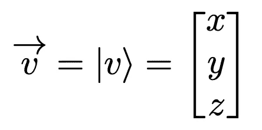

# 狄拉克符号的临时指南

> 原文：<https://towardsdatascience.com/a-casual-guide-to-dirac-notation-17961670ae7a?source=collection_archive---------18----------------------->

## 理解量子力学中的常用符号

来自 [Pexels](https://www.pexels.com/photo/woman-in-red-long-sleeve-writing-on-chalk-board-3769714/?utm_content=attributionCopyText&utm_medium=referral&utm_source=pexels) 的 Andrea Piacquadio 的照片

# 量子力学

> "如果你没有被量子力学完全弄糊涂，你就不会理解它."—尼尔斯·玻尔

量子力学的概念已经存在了将近一百年。尽管如此，由于相互竞争的理论和概率性质，它仍然是一个非常难以学习和理解的课题(如玻尔的引用所示)。无论多么难以理解，仍然有一些深奥的理论是现代量子力学的支柱。量子力学的一个更有趣的应用，特别是我自己的研究，是在量子计算领域。这绝不是一篇解释叠加、纠缠或平行世界潜力的文章。尽管如此，我还是想介绍一下讨论这些话题时常用的符号——当你读到它们时，你会对它们所描述的系统有一个大致的了解。

# Kets

让我们来看看三维空间中的传统向量…

三维空间中的基向量被定义为…

更一般地说，不管维数如何，基向量都表示为…

这意味着任何向量都可以分解成基本向量的线性组合…

类似地，使用狄拉克符号，ket 可以用来表示向量…

基向量也可以写成 kets…

这意味着我们可以使用 kets 将原始向量分解成基本向量的线性组合…

# 布拉斯

让我们考虑三维空间中的同一个向量…

转置和取复共轭产生…

转置将列向量转换为行向量，在这种情况下，复共轭只产生我们的原始值(因为我们假设它们是实数)。这被称为埃尔米特共轭，用匕首表示。

使用狄拉克符号，这可以写成一个 bra 向量…

# 胸罩扣

Bras 和 kets 也可以写在一起，表示内部产品。这个内积是点积的推广。考虑三维空间中的原始向量…

如果我们想用狄拉克符号来表示这个向量和它的厄米积之间的点积，我们可以把 bra 和 ket 组合成…

# 结论

量子力学既有趣又复杂。这个领域的重要性不能低估，尤其是量子计算机即将问世。理解这些研究领域的常用符号是发展对基本理论理解的第一步。如果你有兴趣了解更多关于量子力学的知识，我推荐这本书:

[严肃的量子力学](https://www.amazon.com/No-Nonsense-Quantum-Mechanics-Student-Friendly-Introduction-ebook/dp/B07L1Y9XR3)