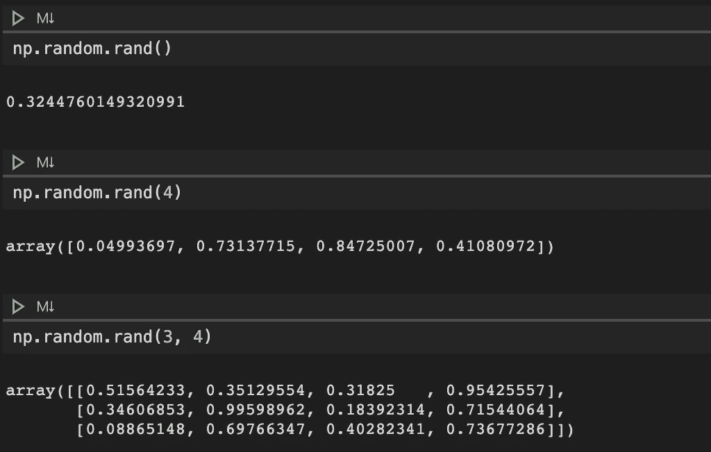
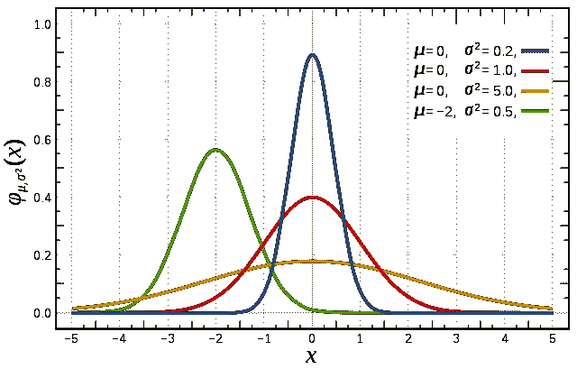
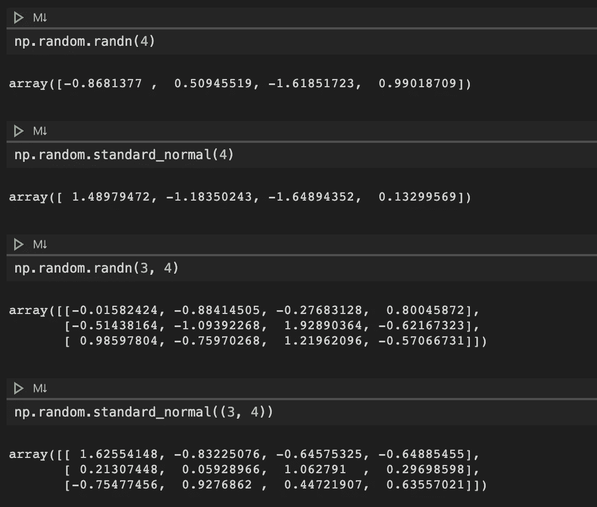
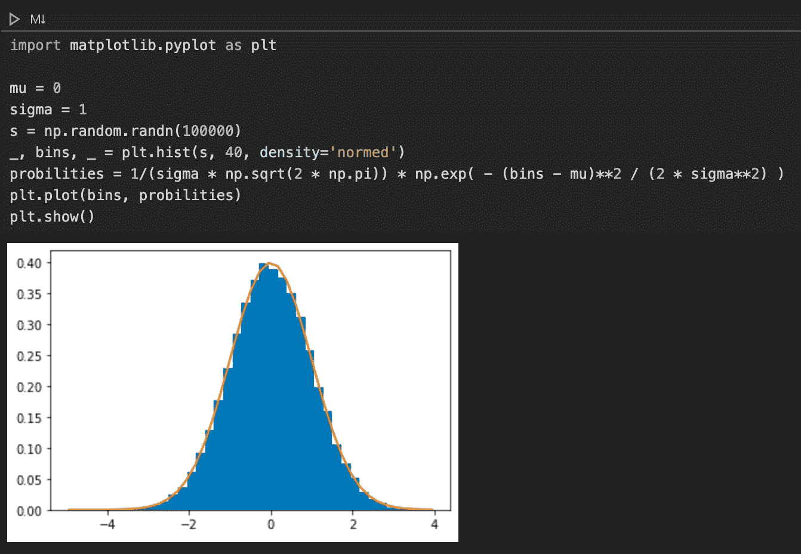
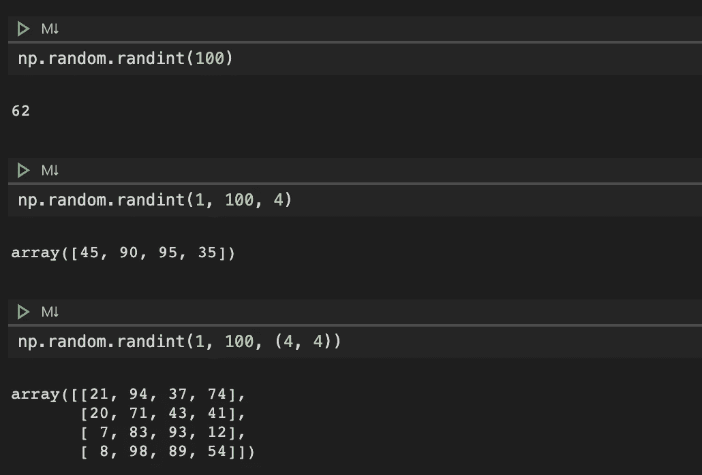
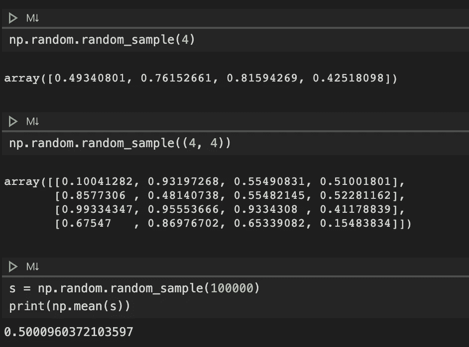
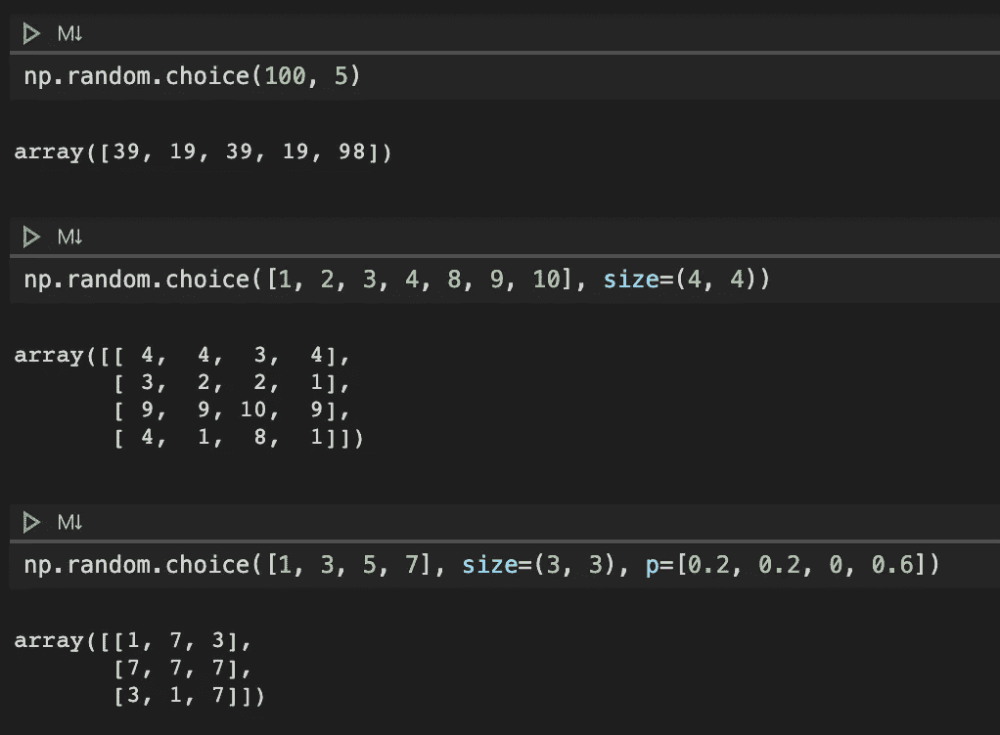
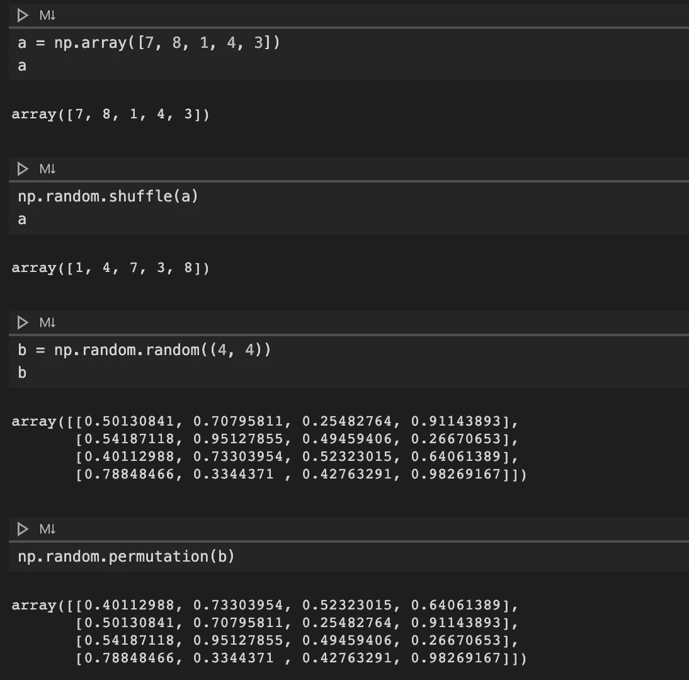

# 关于在 NumPy 中生成随机数的备忘单

> 原文：<https://towardsdatascience.com/a-cheat-sheet-on-generating-random-numbers-in-numpy-5fe95ec2286?source=collection_archive---------19----------------------->

[澳门图片社](https://unsplash.com/@macauphotoagency?utm_source=unsplash&utm_medium=referral&utm_content=creditCopyText)在 [Unsplash](https://unsplash.com/s/photos/roulette?utm_source=unsplash&utm_medium=referral&utm_content=creditCopyText) 上拍摄的照片

## 查看 NumPy 中最常用的生成随机数的函数。

NumPy 是我们用于机器学习研究和其他科学计算工作的最基本的 Python 包之一。作为一个 C 实现库的包装器，NumPy 在其多维数组和矩阵数据结构上提供了大量强大的代数和转换操作。

除了这些数学运算之外，它还提供了各种功能来生成随机数，这些随机数通常用于科学计算的不同目的。本文回顾了我们可以用来在 NumPy 中生成随机数的常用函数。

**请注意**如果您想在阅读时跟随本文，可以在 [GitHub](https://gist.github.com/ycui1/5121649aefd6ed65f914ab06715ceb75) 上找到所有相关代码。

首先，我们将通过运行`import numpy as np`首先导入 NumPy 模块，允许我们访问模块中所有相关的函数。

## `1\. rand(d0, d1, ..., dn)`

这种方法生成给定形状的随机数。下面是一些常见的例子。注意在`rand()`函数中指定的数字对应于将要生成的数组的维数。一个特例是，当函数中没有指定数字时，会生成一个随机值。

带有 rand()的随机数

## 2.randn(d0，d1，…，dn)和 standard_normal([size])

这两种方法都用于从标准的[正态分布](https://en.wikipedia.org/wiki/Normal_distribution)中产生随机数，其曲线如下图所示。红色曲线显示的是平均值为 0、标准差为 1 的标准正态分布。

读取曲线显示的标准正态分布(来源:[维基百科](https://en.wikipedia.org/wiki/Normal_distribution)

这两种方法都是从分布中随机抽取数字来生成定义形状的数组。它们的用法大致相同，只是对于`standard_normal()`方法，我们需要使用一个`tuple`来设置形状大小。下面是一些常见的例子。

带有 randn()和 standard_normal()的随机数

需要注意的一点是，因为我们知道这些方法是从标准正态分布中创建数字样本，因此我们可以验证这是否是下图所示的情况。

用 randn()生成的随机数直方图

与这两种方法相关的，还有一种方法叫做`normal([loc, scale, size])`，利用这种方法我们可以从`loc`和`scale`参数指定的正态分布中生成随机数。

## `3\. randint`(低[，高，尺寸，数据类型])

该方法生成离散均匀分布的从`low`(含)到`high`(不含)`size`定义形状的随机整数。可选地，我们也可以将`dtype`设置为`int64`、`int`或其他，默认值为`np.int`。

需要注意的一点是，当我们不设置`high`参数时，数字会在[0，`low`的范围内生成。

带有 randint()的随机数

## 4.`random_sample`([尺寸])、`random`([尺寸])、`ranf`([尺寸])、`sample`([尺寸])

所有这些函数都是为了在[0.0，1，0]范围内产生由`size`定义的形状的随机浮点数，这是一个连续的均匀分布。以`random_sample()`为例，相关用例如下所示。

需要注意的一点是，由于这些随机数是从[0.0，1.0]的连续均匀分布中抽取的，因此这些数的平均值在 0.5 左右，是 0.0 和 1.0 之和的一半。

带有 random_sample()的随机数

与这四种方法相关的，还有一种方法叫做`uniform([low, high, size])`，利用这种方法我们可以从`low`和`high`参数指定的半开均匀分布中产生随机数。

## 5.`choice` (a[，尺寸，替换，p])

该方法从参数`a`指定的给定一维数组中生成一个随机样本。然而，如果`a`被设置为一个 int，这个方法将会像`a`是从`np.arange(a)`生成的`ndarray`一样运行。使用这种方法的一些例子如下所示。

`size`参数指定返回的`ndarray`的形状，而`p`参数是一个浮点数列表，表示`a`中的元素被绘制的概率。需要注意的是，如果您设置了`p`参数，那么概率值的总和必须是 1.0。

带选择的随机数()

## 6.`shuffle` (x)和`permutation` (x)

这两种方法都用于随机排列序列。它们之间的主要区别在于，`shuffle()`方法就地修改序列并返回`None`，而 permutation()方法在修改后生成一个相同形状的新`ndarray`。下面我们来看一些例子。

需要注意的一点是，当我们置换一个多维数组时，它只在第一个轴上工作，如最后两个例子所示。换句话说，多维数组中子数组的内容保持不变。

具有洗牌()和排列()的随机数

# 外卖食品

本文回顾了在 NumPy 中生成随机数的常用方法，NumPy 是执行数组和矩阵计算的最强大的包之一。还有更多可以在它的[官网](https://docs.scipy.org/doc/numpy-1.14.0/reference/routines.random.html)探索。同样，感兴趣的读者可以在 [GitHub](https://gist.github.com/ycui1/5121649aefd6ed65f914ab06715ceb75) 上找到本文的相关代码。

在您离开之前，这里有一个关于这些方法的快速备忘单供您快速参考。

关于在 NumPy 中生成随机数的备忘单