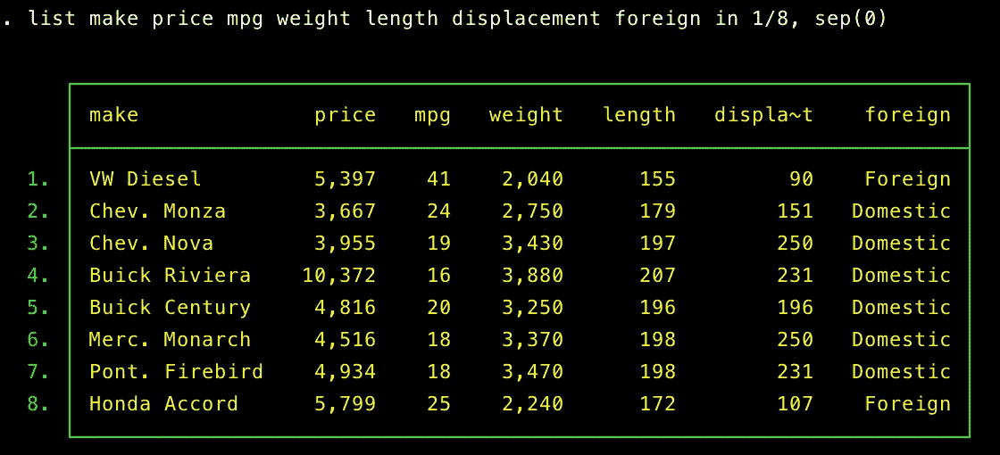
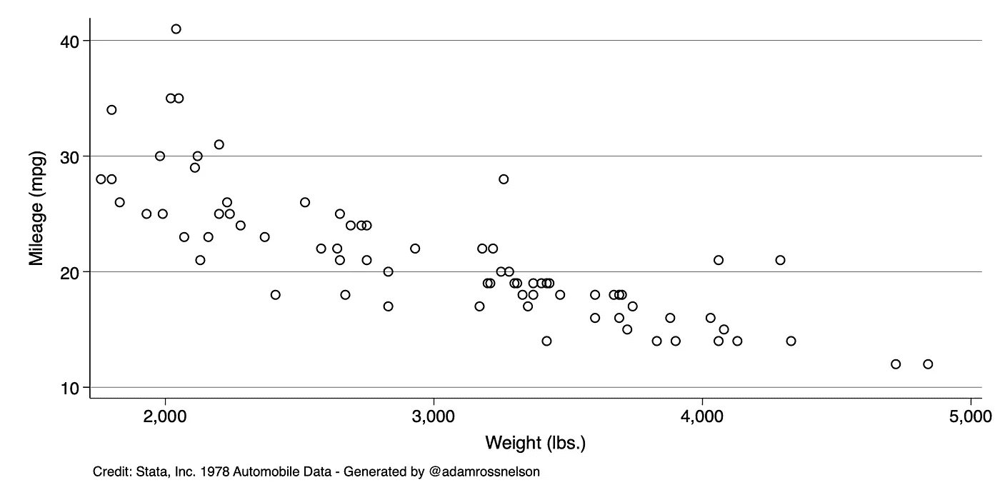
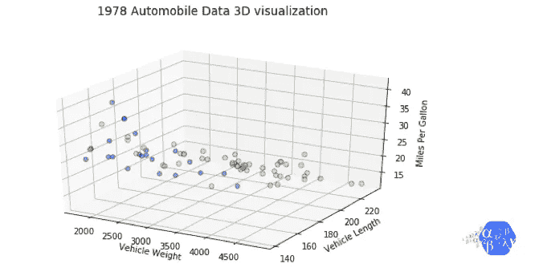
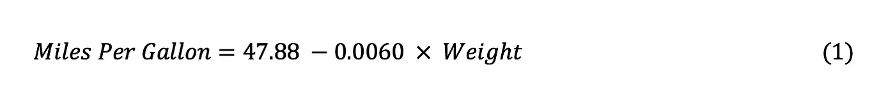
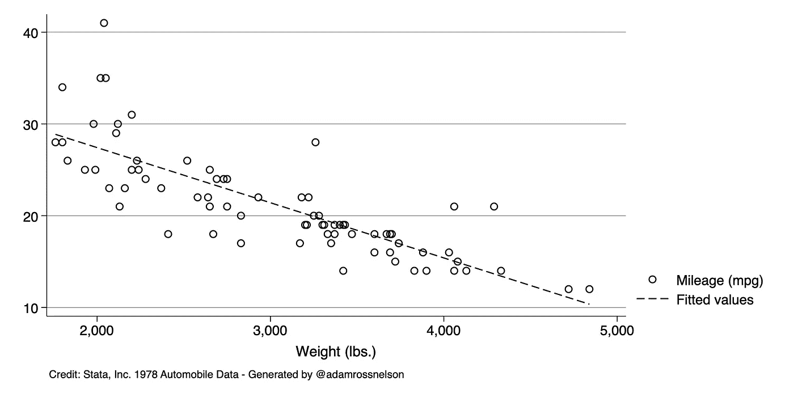

# 仔细查看数据集列

> 原文：<https://towardsdatascience.com/a-closer-look-at-dataset-columns-d6551b9d39e2?source=collection_archive---------32----------------------->


图片来源:“Via Design Pickle”——[更多关于属性](https://adamrossnelson.medium.com/image-credit-attributions-a24efcc730ad)。

## 查看数据集的列和其他相关的关键术语

# 介绍

R 研究人员和数据科学家处理数据集。数据集是原始材料。当我们将分析技术应用于这些原材料时，我们产生了总结、列表、估计和其他输出。

[我之前解释过数据集由行和列组成。](/what-is-a-data-set-9c6e38d33198)在工作过程中，我们有时也会将列称为维度或变量。

交换和互换这些术语(列、维度、变量等。)会导致混乱。本文试图通过展示我们有时如何以及为什么使用其他术语(如维度或变量)而不是列来澄清这种混乱。

# 数据

本文用一个称为 auto dataset 的数据集演示了它的关键术语和短语，该数据集由 Stata Corporation 提供，该公司是流行的 Stata 统计编程软件的制造商。图 1 显示了这个数据集的专家。



图 1:流行的 Stata 自动数据集的摘录。

假设您有一个包含 Pandas 的 Python 配置，您可以使用以下三行代码生成类似的输出:

```
import pandas as pddf = pd.read_stata('http://www.stata-press.com/data/r15/auto2.dta')df[['make','price','mpg','weight','foreign']].head(n=8)
```

# 维度是字面意义上的，而不是比喻意义上的

为了开始理解为什么我们有时互换使用术语“维度”来指代数据集的列，请看图 2。



图 2:1978 年汽车数据散点图。

图 2 是每加仑英里数(mpg，沿垂直 y 轴)和重量(重量，沿水平 x 轴)的散点图。散点图是一种以图形形式显示两个变量之间关系的方法。

当可视化为图表时，该图或任何散点图展示了 y 和 x 变量如何对应于图表的 y 和 x 维度*。这就是为什么研究人员和数据科学家有时会将数据集的*列*互换为*维度*。*

*为了进一步说明，有时我们想要添加第三、第四或第 k 个维度。图 3 显示了变量英里每加仑(mpg，沿垂直 y 轴)和重量(重量，沿水平 x 轴)和长度(长度，沿另一个水平 z 轴)的散点图。*

**

*图 3:1978 年汽车数据的三维散点图。*

*这种可视化技术有助于说明这三个变量之间的关系。然而，在三维之外，就很难想象了。但是，在这种情况下，技术上有第四维。虚线代表第四维度。在这种情况下，蓝色代表外国品牌，黄色代表国内品牌。*

*为了进一步处理额外的维度，可以使用各种统计技术，这些技术可以导出一个总结这种多维(也称为多变量)关系的方程。总结通常以等式的形式表示。*

*这个方程式反过来解释了为什么与*维度*同义的*列*，也与*变量*同义。*

# *变量也是一种文字构造*

*看看这些等式，开始理解为什么我们有时互换使用术语*变量*来指代数据集的*列*。*

*这两个等式总结了图 2 和图 3 所示的关系。等式 1 表明，车辆重量每增加一磅，每加仑英里数将减少 0.0060 英里。*

**

*等式 1:汽车重量和每加仑英里数之间的估计线性关系。*

*再次回到上面的图形示例，这个方程可以在 y 和 x 维坐标上绘制。这样一条线看起来如图 4 所示。*

**

*图 4:图 1 的复制品，增加了由等式 1 绘制的线。*

*展示如何将这些列或维度之间的关系总结为数学方程，说明为什么我们有时也将数据集的*列*称为*变量*。作为惯例，当处于方程形式时，习惯上将这些结构称为*变量*。*

*[](https://adamrossnelson.medium.com/membership) [## 加入我的介绍链接媒体-亚当罗斯纳尔逊

### 作为一个媒体会员，你的会员费的一部分会给你阅读的作家，你可以完全接触到每一个故事…

adamrossnelson.medium.com](https://adamrossnelson.medium.com/membership) 

# 结论

本文讨论了为什么我们有时会互换地将数据集的*列*称为*维度*或*变量*。为此，本文还展示了散点图作为一种分析技术，可以帮助理解两个或更多变量之间的关系。

鸣谢:三维可视化灵感来自@ [迪潘坚(DJ)萨卡尔](https://towardsdatascience.com/@dipanzan.sarkar?source=post_page-----6c7202990c57----------------------) [多维数据有效可视化的艺术](/the-art-of-effective-visualization-of-multi-dimensional-data-6c7202990c57)。

# 感谢阅读

如果你喜欢我要说的话，可以在:[adamrossnelson.medium.com](https://twitter.com/adamrossnelson)找到更多。

感谢阅读。把你的想法和主意发给我。你可以写信只是为了说声嗨。如果你真的需要告诉我是怎么错的，我期待着尽快和你聊天。推特:[@ adamrossnelson](https://twitter.com/adamrossnelson)| LinkedIn:[亚当·罗斯·纳尔逊](http://www.linkedin.com/in/arnelson) |脸书:[亚当·罗斯·纳尔逊](http://www.facebook.com/adamrossnelson)。*