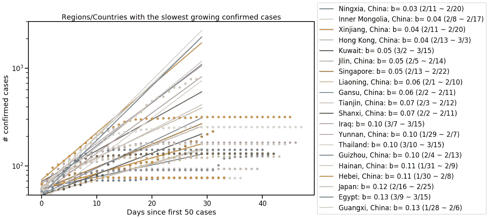
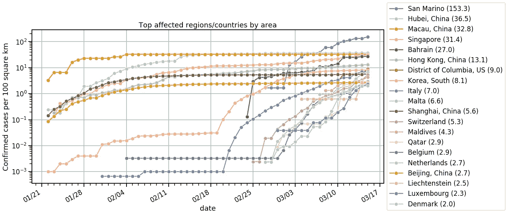
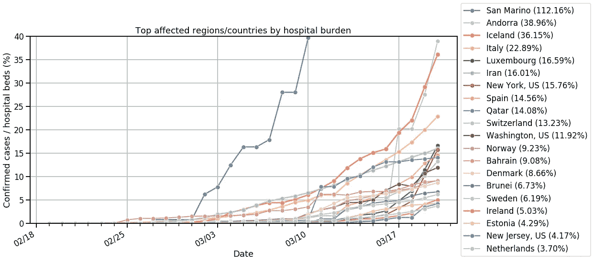

# 透视报道的冠状病毒数量

> 原文：<https://towardsdatascience.com/a-closer-look-at-the-reported-coronavirus-numbers-in-perspectives-abd4791f5e84?source=collection_archive---------47----------------------->

## 根据国家规模分析病例数

*免责声明:* [*迈向数据科学*](http://towardsdatascience.com/) *是一份以研究数据科学和机器学习为主的媒体出版物。我们不是健康专家或流行病学家，本文的观点不应被解释为专业建议。想了解更多关于疫情冠状病毒的信息，可以点击* [*这里*](https://www.who.int/emergencies/diseases/novel-coronavirus-2019/situation-reports) *。*

在短短几个月的时间里，冠状病毒(新冠肺炎)已经蔓延到世界各地，导致了事实上的全球疫情。在许多国家和地区，确诊病例仍在成倍增长。随着每天报告的确诊病例数，我非常关注病毒如何影响人们的生活、市场和全球经济。他来自中国北京，对 2003 年非典爆发记忆犹新。然而，我惊讶地发现，西方有那么多人对新冠肺炎的严重性漠不关心:“这只是一场流感”，“它只影响老年人”，“媒体宣传”，“群体免疫”……这些来自普通公众的高度让我夜不能寐。

也许有些人对报道的病例数量不以为然，认为大多数感染病例远在世界的另一端。我同意，的确，看那些确诊病例数字是抽象的。在这里，我画了一些图，把这些数字放入透视图中。

**注意事项:**模型的好坏取决于数据的来源。所有确诊的新冠肺炎病例都是由约翰·霍普金斯大学系统科学与工程中心([JHU·CSSE](https://github.com/CSSEGISandData/COVID-19))提供的，该中心汇编了来自世卫组织和世界各国政府的官方报告数字。毫无疑问，由于缺乏诊断测试、政府缺乏透明度以及人们因无知而未能接受测试，大多数国家都存在报告不足的情况。

以下所有数字均基于截至 2020 年 3 月 15 日的新冠肺炎确诊病例。

# 区域级累积案例

按累计确诊新冠肺炎病例排列的受影响最大的国家/地区

许多可视化(比如 [this](https://www.bloomberg.com/graphics/2020-wuhan-novel-coronavirus-outbreak/?srnd=premium) )只显示国家级的统计数据。从区域级别的图中，我们可以分离中国的不同省份和美国的不同州。湖北，曾经是新冠肺炎的中心，与中国几乎所有其他省份一样，确诊病例数量已经持平。伊朗、韩国、意大利和许多欧洲国家超过了中国第二大受灾省份广东。

# **拟合指数增长**

接下来，让我们看看新冠肺炎在地区内传播的速度。我用指数函数拟合了累计确诊病例，*y*= exp(*a*+*bx*)。这里我用普通最小二乘法(OLS)来确定参数 *a* 和 *b* ，斜率 *b* 对应的是指数曲线的陡度。

事实上，几乎没有什么会无限期地遵循指数增长。然而，传染病的初始爆发可以用指数函数来建模。对于不同的地区，我拟合了最初阶段累计确诊的新冠肺炎病例数，定义为至少 5 至 10 天有 50 例病例。根据指数函数对拟合的斜率( *b* )进行排序，我发现了一个惊人的列表，其中包括伊朗、芬兰、葡萄牙、意大利、韩国、丹麦、斯洛文尼亚和西班牙，这些国家的增长率在[01/23](https://en.wikipedia.org/wiki/2020_Hubei_lockdowns)左右高于湖北，其中许多国家现在正在经历指数增长(截至 3 月 15 日)。此外，美国的纽约州和华盛顿州在全球传播最快的地区中也分别排名第 15 和第 19 位。

发展最快的地区/国家。图例表示指数函数中的 *b* 和用于拟合增长曲线的日期周期。

另一方面，我们也可以发现新冠肺炎传播最慢的地区和国家。前 20 名几乎全在亚洲，其中许多是中国偏远的人口较少的省份，如宁夏、内蒙古和新疆。值得注意的是，自 2 月中旬以来，新加坡和日本出现了新冠肺炎病例，但传播速度要慢得多，这可能是因为早期有效地实施了社交距离。

传播最慢的地区/国家。

# 对人口进行标准化

正确看待感染人数的一个方法是根据该地区或国家的人口规模进行标准化。下面我列出了感染新冠肺炎病毒人口比例最高的 20 个地区/国家。圣马力诺，一个被意大利包围的飞地小国，人口密度在新冠肺炎排名第一。冰岛等其他人口较少的国家也名列前茅。

# 标准化到区域

了解感染人数的另一种方法是根据地区/国家的面积进行标准化，以得出地理上的病例密度。由于面积小，圣马力诺再次名列榜首。许多城市和城邦也名列前茅:澳门、新加坡和 DC 华盛顿。

# 使医院容量正常化

看待新冠肺炎病例数量的一个更有效的方法是量化该地区医院的负担。这可以通过对医院容量进行标准化来实现，医院容量是通过医院病床的估计数量来衡量的。

目前的新冠肺炎感染患者足以占据圣马力诺 72%的医院床位，而圣马力诺只有一家医院。负担非常重的其他国家包括冰岛、伊朗、义大利和卡达，新冠肺炎病患占用超过 10%的医院病床。请注意，这是假设最好的情况，即患者按比例分布在各个医院，这样他们就不会涌向同一家医院。

还应该考虑 ICU 的床位数和可用的机械通气机的数量，这些对于挽救那些症状严重的患者是必不可少的。根据[美国医院协会](https://www.aha.org/statistics/fast-facts-us-hospitals)的数据，ICD 的床位占美国所有医院床位的 5%。假设所有这些病人都需要入住 ICU，那么大约 10%的病床就变成了可怕的大约 200%的 ICU 容量。

## 基于截至 3 月 21 日确诊病例的最新医院负担

我能够使用来自[的数据来估算美国各州的医院床位。如图所示，圣马力诺的确诊病例已经超过了医院的床位数。意大利的医院负担跃升至约 23%。美国的三个州，纽约州、华盛顿州和新泽西州也排在前 20 名，假设所有医院都需要住院治疗，则所有医院床位的 16%、12%和 4%可能被确诊的新冠肺炎病例占用。](http://ghdx.healthdata.org/record/united-states-hospital-beds-1000-population-state)

## 代码:

[https://github.com/wangz10/covid_19_analyses](https://github.com/wangz10/covid_19_analyses)