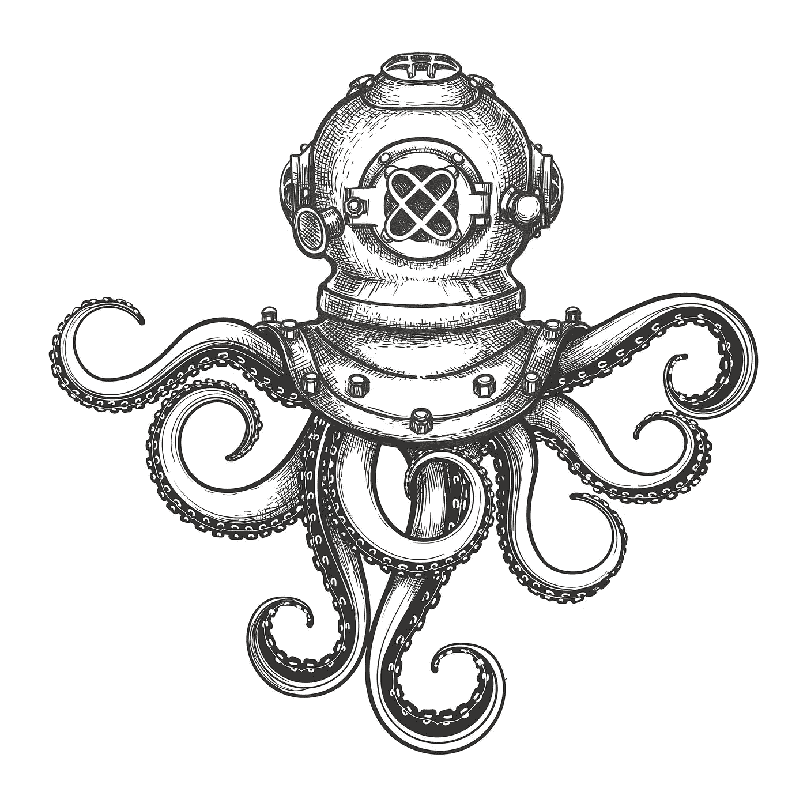
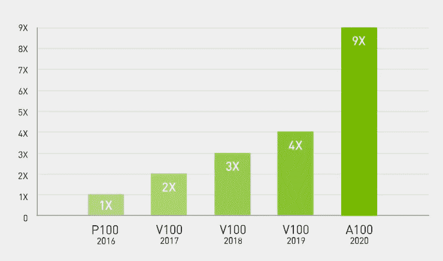
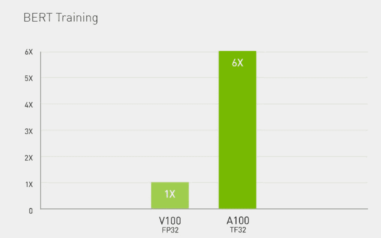

# A Cloud ML first: Google 的 AI 平台深度学习容器，搭配 NVIDIA Tensor Core A100 GPU

> 原文：<https://towardsdatascience.com/a-cloud-ml-first-googles-ai-platform-deep-learning-container-with-nvidia-tensor-core-a100-gpu-53ab9d313d17?source=collection_archive---------28----------------------->

## 在本文中，我们提供了对谷歌人工智能平台和深度学习容器的介绍，然后探索 A100 GPU 的惊人性能。


授权给作者的图像

基于云的深度学习的关键一步；数据科学家第一次可以访问 NVIDIA A100 Tensor Core GPU 前所未有的加速。

在本文中，我们提供了对谷歌人工智能平台和深度学习容器的介绍，然后探索 A100 GPU 的惊人性能。

# 谷歌云人工智能平台

对于那些不熟悉人工智能平台的人来说，本质上它是谷歌云平台上的一套服务，专门用于在云中构建、部署和管理机器学习模型。

人工智能平台旨在使数据科学家和数据工程师简化他们的 ML 工作流程。我们经常在 AutoML (Google 的点击式 ML 引擎)中使用它，但除此之外，它还支持使用 Tensorflow 构建的高级模型的训练、预测和版本管理。

> 通过像 TPUs 和 tensor flow
> **Google Cloud**这样的工具，利用谷歌在人工智能方面的专业知识，将我们的尖端人工智能技术注入到您的应用程序中

# 云人工智能平台服务

AI Platform 有一套服务，用于支持典型 ML 工作流中的活动。


谷歌云 AI 平台服务(图片来源谷歌云)

在本文中，我们将重点关注**深度学习容器**(这些属于上图中的**管道**部分)。虽然其他服务不在本文讨论范围内，但我们已经包括了对每个服务的简要描述以及一些链接，以防您想了解更多。

**1。准备**

我们通常首先在 [**大查询数据集**](https://cloud.google.com/bigquery/docs/datasets-intro) 中准备(摄取、清理、特征工程)我们的数据，大查询数据集是 Google Clouds 超大规模数据仓库中的表集合。

Google 提供了一个 [**数据标注服务**](https://cloud.google.com/ai-platform/data-labeling/docs) 用于标注训练数据
(通常我们用于图像、视频、音频和文本的分类)。

**2。构建**

我们已经提到过 **AutoML** ，训练模型的零代码平台。

我们使用 [**AI 平台笔记本**](https://cloud.google.com/ai-platform-notebooks) (托管 Jupyter 笔记本)来构建定制模型(通常是 Tensorflow 或 SkLearn)。

最后，我们使用 [**AI 平台训练**](https://cloud.google.com/ai-platform/training/docs) 进行方便的模型训练。

**3。验证**

[**可解释 AI**](https://cloud.google.com/explainable-ai) 是一套非常棒的工具，可以帮助您理解模型的输出，验证模型行为，识别模型中的偏差，并获得改进模型和训练数据的方法。这确实有助于消除模型调优等活动中的猜测。

[**AI 平台 Vizier**](https://cloud.google.com/ai-platform/optimizer/docs/overview) 更进一步，提供黑盒优化服务，调整超参数，优化模型输出。

**4。展开**

无论您是使用无代码 AutoML 训练的模型，还是使用 AI 平台笔记本构建的高级 Tensorflow 模型，AI 平台都提供了许多服务来帮助部署模型和生成预测。

[**AI 平台预测**](http://AI Platform Prediction that manages the infrastructure needed to run your model and makes it available for online and batch prediction requests. You can also use AutoML Vision Edge to deploy your models at the edge and trigger real-time actions based on local data. TensorFlow Enterprise offers enterprise-grade support for your TensorFlow instance.) 管理运行您的模型所需的基础设施，并使其可用于在线和批量预测请求。

[**AutoML Vision Edge**](https://cloud.google.com/vision/automl/docs/edge-quickstart)**帮助部署 Edge 模型(在本地设备上运行，例如智能手机、物联网设备)并可以基于本地数据触发实时操作。**

**[**TensorFlow Enterprise**](https://cloud.google.com/tensorflow-enterprise)**为您的 tensor flow 实例提供企业级支持。****

******5。ML 管道(ML 操作)******

****ML Ops 是部署健壮的、可重复的和可伸缩的 ML 管道来管理您的模型的实践。人工智能平台提供了许多服务来协助这些管道。****

********

****授权给作者的图像****

****[**AI 平台管道**](http://Continuous evaluation helps you monitor the performance of your models and provides continual feedback on how your models are performing over time.) 提供使用 Kubeflow 管道或 TensorFlow Extended (TFX)创建 ML 管道的支持。****

****[**持续评估**](http://Continuous evaluation helps you monitor the performance of your models and provides continual feedback on how your models are performing over time.) 帮助您监控您的模型的性能，并对您的模型在一段时间内的表现提供持续反馈。****

****[**深度学习虚拟机映像**](https://cloud.google.com/deep-learning-vm) 支持轻松调配深度学习 ML 应用的云虚拟机。****

****最后， [**深度学习容器**](https://cloud.google.com/ai-platform/deep-learning-containers) 为深度学习环境提供预配置和优化的容器。****

# ****深度学习容器****

********

****授权给作者的图像****

> ****AI 平台深度学习容器为您提供性能优化的一致环境，帮助您快速原型化和实施工作流。深度学习容器映像预装了最新的机器学习数据科学框架、库和工具。
> **谷歌云******

****人们很容易低估启动和运行机器学习项目所需的时间。通常，这些项目需要您管理不断发展的软件堆栈的兼容性和复杂性，这可能会令人沮丧、耗时，并使您无法做您真正想做的事情:花费时间迭代和细化您的模型。****

****深度学习容器旨在加速这一过程。****

****所有深度学习容器都有一个预先配置的 Jupyter 环境，因此每个容器都可以直接作为原型空间使用。首先，确保你已经安装并配置了 [gcloud](https://cloud.google.com/sdk/) 工具。然后，确定您想要使用的容器。所有容器都托管在 gcr.io/deeplearning-platform-release,下，可以使用以下命令列出:****

```
**gcloud container images list --repository=”gcr.io/deeplearning-platform-release”**
```

****每个容器都提供了一个与相应的深度学习虚拟机一致的 Python3 环境，包括选定的数据科学框架 conda，用于 GPU 映像的 NVIDIA 堆栈(CUDA，cuDNN，NCCL)，以及许多其他支持包和工具。****

******创建 CPU Tensorflow 容器的示例******

****这真的很简单。以下命令将在分离模式下启动 TensorFlow 深度学习容器，将正在运行的 Jupyter 服务器绑定到本地机器上的端口 8080，并将容器中的/path/to/local/dir 挂载到/home。****

```
**docker run -d -p 8080:8080 -v /path/to/local/dir:/home \
gcr.io/deeplearning-platform-release/tf-cpu.1–13**
```

****然后，可以在 localhost:8080 访问正在运行的 JupyterLab 实例。确保在/home 中开发，因为当容器停止时，任何其他文件都将被删除。****

****如果你想使用支持 GPU 的容器，你需要一个 CUDA 10 兼容的 GPU，相关的驱动程序，并安装 [nvidia-docker](https://github.com/NVIDIA/nvidia-docker) 。然后，您可以运行类似的命令。****

```
**docker run --runtime=nvidia -d -p 8080:8080 -v /path/to/local/dir:/home \
gcr.io/deeplearning-platform-release/tf-gpu.1–13**
```

****现在您只需使用这个容器开发您的模型。****

# ****NVIDIA A100 张量核心 GPU****

****所以，现在你已经定位于谷歌云人工智能平台及其深度学习容器，让我们先探索一下云；能够访问由 [NVIDIA A100 Tensor Core GPU](https://www.nvidia.com/en-us/data-center/a100/) 驱动的深度学习容器。****

********

****授权给作者的图像****

> ****A100 GPU。加速我们时代最重要的工作。
> 英伟达****

****那么这在现实世界中到底意味着什么呢？****

****首先要注意的是，这条 GPU 线是专门针对深度学习和其他高计算人工智能应用而设计的。第二点要注意的是，与它的前辈相比，A100 提供了高达**20 倍的性能，而代码变化为零**。这是一个巨大的飞跃。****

********

****高性能计算吞吐量(图像来源 Nvidia)****

******A100 GPU 技术规格******

****A100 的[数据表](https://www.nvidia.com/content/dam/en-zz/Solutions/Data-Center/a100/pdf/nvidia-a100-datasheet.pdf)的亮点包括:****

*   ******40GB** 的 GPU 内存****
*   ******1.6 TB/秒**内存带宽****
*   ****深度学习的 **312 万亿次浮点运算**(前代的 20 倍)****
*   ******250W-450W** 最大功耗****
*   ******结构稀疏性**A100s 张量内核的架构支持高达 2 倍的“稀疏”模型(其参数集包含大量零的模型，非常适合 NLP 应用)性能增益。****

****如果其中一个功能不足以满足您的使用案例，不要担心，因为由于 NVIDIA 的一些聪明的 SDK 支持，这些功能将**扩展到 1000 个 A100 GPUs。******

# ******对 A100 进行基准测试；训练伯特******

****[BERT](https://ai.googleblog.com/2018/11/open-sourcing-bert-state-of-art-pre.html) 代表来自变压器的双向编码器表示。最近由 Google 发布的 BERT 是一个自然语言处理(NLP) ML 模型。由于完全训练模型需要高计算量，BERT 经常用于基准测试。****

****A100 产生了一些惊人的结果:****

********

****性能基准训练 BERT(图片来源 Nvidia)****

****那么谷歌人工智能平台的深度学习容器中有哪些 A100 选项呢？****

******每台虚拟机高达 16 个 GPUs】******

****对于要求苛刻的工作负载，可以选择 **a2-megagpu-16g 深度学习容器。**使用**16**A100 GPU，这提供了惊人的**640 GB GPU 内存**，并在使用新的稀疏特性时，在单个虚拟机中提供高达 **10 petaflops 的 FP16 或 10 petaflops 的 int8 的有效性能**。哇哦。我们不得不把这些数字读两遍。****

****然后，我们必须加倍占用系统内存；惊人的 1.3 TB。并且不用担心访问它的任何瓶颈，内存总线支持高达**9.6 TB/s。******

****足以消耗最苛刻的工作负载…****

********

****授权给作者的图像****

****当然，A100 驱动的虚拟机也有较小的配置，允许您匹配应用对 GPU 计算能力的需求。****

# ****后续步骤****

****1.阅读[谷歌云 AI 平台发布说明](https://cloud.google.com/blog/products/ai-machine-learning/introducing-deep-learning-containers-consistent-and-portable-environments)****

****2.了解更多关于[安科瑞斯数据，分析&人工智能](https://www.ancoris.com/solutions/data_analytics_ai)****

****3.与[作者](https://www.linkedin.com/in/google-cloud-platform/)连线****