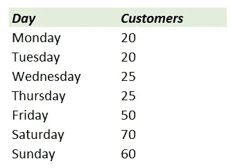
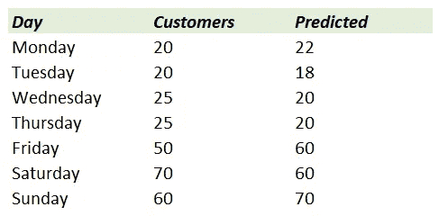
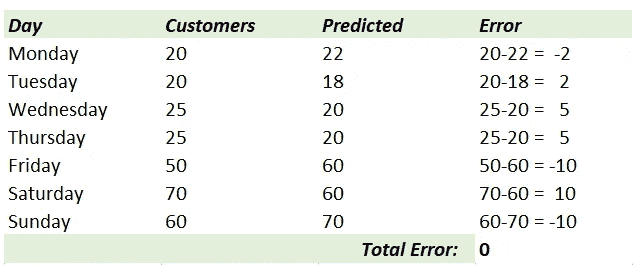
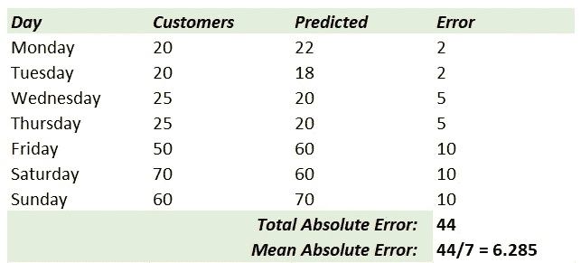
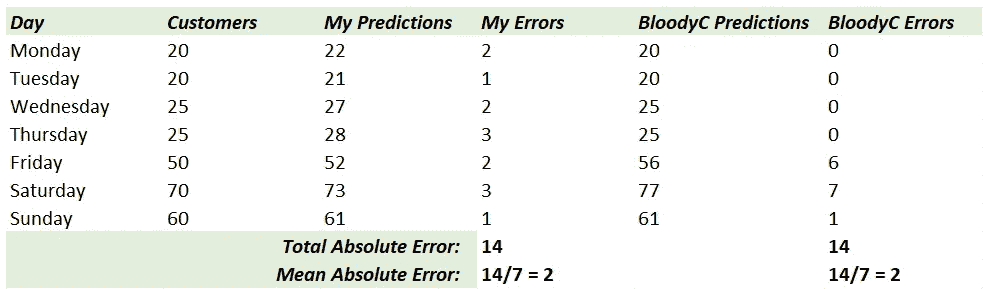
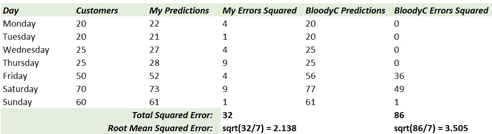

# 梅和 RMSE 的普通人指南

> 原文：<https://towardsdatascience.com/a-common-mans-guide-to-mae-and-rmse-d5efcd238221?source=collection_archive---------22----------------------->

用简单的话来理解——它们在现实世界中意味着什么，什么时候选择哪个？

图片由[皮克斯拜](https://pixabay.com/?utm_source=link-attribution&amp;utm_medium=referral&amp;utm_campaign=image&amp;utm_content=1594742)的 Gerd Altmann 提供

一位商人，我的潜在客户，昨天当我向他展示我的预测模型时，他问我，“你认为这些预测模型会有多准确？”。我准备好回答这个问题了。“**非常**”，我颇有些自信地说道。“它具有极低的 MAE”。

对我天真的回答，他藏起笑容，看着我，就像一个老人看着一个还不了解人情世故的青少年一样，他又问了一遍。“我不太擅长理解高级金融和数学术语，你能以简单的方式给我解释一下吗？这样我就能明白，相信你的预测，我在这里冒了多大的风险？”。

> 常识不是那么普通，简单也不是那么容易获得。

于是我礼貌地要求再给一天时间，跟他告辞了。

# 错误造就人

我们在生活中非常清楚地知道，同样大的错误在不同的情况下会有不同的分量。当你和朋友参加一个非正式的聚餐时，迟到 10 分钟可能不是坏事，但当你妻子的父母请客时，这将是一个改变一生的灾难性事件。

大多数情况下，你只要说自己很守时，就可能逃脱惩罚。你基本上是在要求考虑你的平均表现。

> 对你来说，这就是平均误差或平均误差。

我们应该从我委托人的角度考虑这个问题。几个月前，他开了一家不太大的家庭餐馆。他的任务是预测每天的顾客流量，以便他能够计划从批发市场购买正确数量的原材料。作为一家新企业，他同样害怕由于一天结束时浪费了过多的食物而招致损失，以及因为他没有更多的食物来烹饪一天而不得不请顾客回去。

让我们以周为单位来想象一下。假设这些是每天的实际客户数量:

每日顾客流量

我创建模型，并预测类似这样的事情:

每日预测

然后，我计算模型犯下的一个或多个错误:

预测误差

总误差= 0。很容易看出这种逻辑的谬误。我在积极方向上的错误被那些在消极方向上的错误抵消了。

我说，错误就是错误。从数学上来说，这意味着取错误的绝对值。

平均绝对误差

> 我们刚刚理解了什么是 MAE(平均绝对误差)。

它说，平均来说，我会错误预测一天的客户数 6.285。我是否会预测更多或更少，通过了解 MAE 并不明显。我的客户可能每天浪费 6.285 人的食物，或者平均每天拒绝 6.285 名顾客。

*为了便于理解，让我们假设我的模型只在正向出错，也就是说，我可能会错误地说，“今天会有 25 个客户”，而实际上可能只有 20 个。但绝不会出现我低估这个数字只有 15 的情况。这基本上意味着食物可能会被浪费掉，但所有的顾客都会得到款待。*

# 一个是小偷，另一个是强盗

那么这是否意味着具有相同 MAE 的两种方法(模型)同样好(或坏)？

想象一下，我的一个竞争对手，我称之为 BloodyC Pvt. Ltd .，也试图向这位拥有餐馆的先生推销它的方法。我们的预测大概是这样的:

两个预测，相同的 MAE

我每天都犯小错误，而 BloodyC 在大多数日子里都很准确，但在某些日子里会犯更大的错误。哪个更好？

光看数字是无法得出答案的。这是关于商业，它的愿景，它的道德和它背后的人。所以我会让你们想象一个离现实不远的情况，在这个情况下，我的模型会更好。

> (资料)科学从来都不是数字和逻辑。永远都是关于情感和生活的。

在许多国家、商店和家庭，当有多余的食物时，我们会尽量给那些比其他人更需要的人，或者喂宠物&流浪动物，如果这对它们无害的话。当然，每个人都有极限。因此，如果只剩下 2-3 个人的食物，很容易立即找到需要的人，但如果数量更多，大部分食物通常会被扔进垃圾箱。不是每个店主都和无家可归者收容所或类似的服务机构有联系。

我的潜在客户，餐馆老板，也有类似的行为。对许多人来说，看到如此多的食物被浪费也是一种情感上的痛苦。虽然对他来说在经济上是一样的，但他更喜欢我的型号，它每天浪费很少，相比之下，BloodyC 的几天就浪费很多。

发现情况太抽象或假设？这里有一个非常真实的例子:

# $克鲁奇·麦克达克

职业交易员通常更喜欢通过衍生品——期货期权——在股票市场进行投资/交易。在许多策略中，人们押注的是一只股票或衍生品在未来 *n* 天的价格区间。

我的模型现在感觉比 BloodyC 的更安全吗？即使我出错了，我也会出错一点点。交易者仍然会在这个有限的范围内赚钱，即使他的赌注不准确。如果价格大幅偏离交易者所相信的预测，这意味着在**的一次**错误投资中损失了巨额资金——相信 BloodyC 会让他付出高昂的代价。

如果这让您觉得我的模型更适合您的业务案例，那么在比较这两个模型时，您使用哪个指标来表达这一点？梅当然不能惩罚一个比另一个多。

# 进来吧，RMSE

R MSE 是 M**的平方 **R** oot 可以是 S**的平方**E**error。因此，如果你计算预测中每个错误的平方，并把它们加起来，然后除以 7(预测的总数)，你就得到 MSE。如果你想要 RMSE，只需要做一个额外的平方根。(唷，那不是一口！)

让我们看看 RMSE 如何看待我们的预测:

均方根误差

哟呼呼！

更大的错误，更大的惩罚——这是 RMSE 的特点之一。我的预测得到了比 BloodyC 的( *3.505* )更低的 RMSE ( *2.138* )值，这意味着当用这个目标评估时它更好。

# 向 RMSE 祈祷吧！

这是否意味着我们应该一直使用 RMSE 来检验模型的准确性？绝对不行！

如果我的潜在客户出售的不是米饭、鸡肉和印度咖喱，而是可以轻松存放数年的泡菜，允许一天的剩余很容易在第二天出售，那么他更有可能从关注 MAE 或任何其他类似指标中受益。

RMSE、梅、MAPE(平均绝对百分比误差)还有其他几个细微差别，人们当然应该考虑阅读这些，并深入研究其背后的数学。我觉得有趣的几篇文章是[这个](https://medium.com/human-in-a-machine-world/mae-and-rmse-which-metric-is-better-e60ac3bde13d)和[这个](https://www.machinelearningplus.com/time-series/arima-model-time-series-forecasting-python/)(跳转到*第 11 节:时间序列预测的准确性度量*)，供那些希望进一步探索的人参考。

# 离别的思绪

我希望我的潜在客户现在能够明白，通过相信我的预测，他将承担多大的风险，以及承担何种类型的风险。他的问题让我再次思考什么更适合他的用例。

至于那个不太守时的丈夫，他只能希望当他在不久的将来犯了大错时，不要被 RMSE 评头论足！

对分享想法、提问或简单讨论想法感兴趣？在 [LinkedIn](https://www.linkedin.com/in/himanshu-chandra-33512811/) 、 [YouTube](https://www.youtube.com/channel/UChNybQwpqrX9SOc1D4K_x5Q) 、 [GitHub](https://github.com/HCGrit/MachineLearning-iamJustAStudent) 上或通过我的网站与我联系:[我只是一个学生](http://iamjustastudent.com/about)。

回头见&学习愉快！