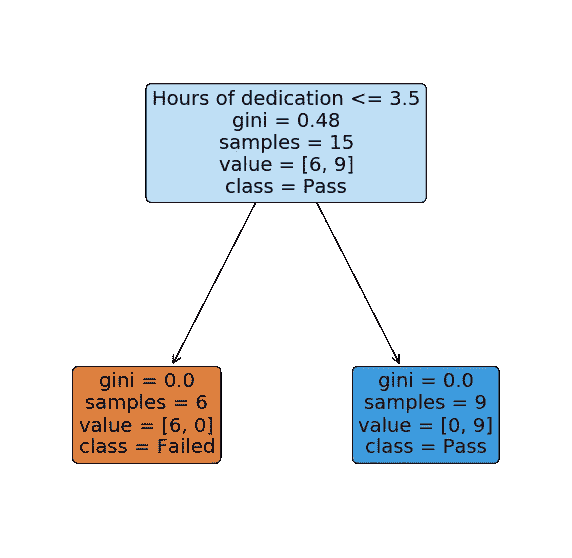
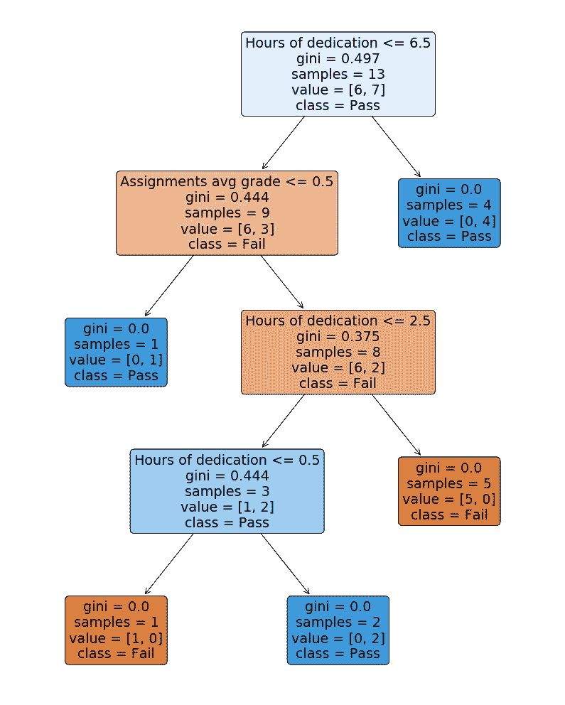

# 为什么不应该将 LabelEncoder 用于分类特征

> 原文：<https://towardsdatascience.com/a-common-mistake-to-avoid-when-encoding-ordinal-features-79e402796ab4?source=collection_archive---------21----------------------->

## 如何处理分类特征和避免一个常见的陷阱


[英格玛机](https://canalhistoria.es/wp-content/uploads/2020/03/Enigma_Portada.jpg)

在处理分类特征时，选择一种合适的方式对它们进行编码可能并不那么简单。这是一个需要考虑的非常重要的方面，它将决定一个特性将为模型增加的价值。

这同样适用于顺序特征，这是一种非常常见的分类数据类型，其中不同的类别呈现出一种*自然顺序。*一个例子可以是是*温度*特征，取类别*冷*、*温和*和*热。*

一个相当常见的错误是，只给特性的每个类别分配一个唯一的数值，而不考虑它可能具有的任何顺序。并且类似地具有标称特征；不同之处在于它们并不自然地呈现任何顺序。

这篇文章的想法是探索和理解为什么这不是一个好主意，用一个带有顺序特征的例子来更好地说明这一点，以及我们应该用什么方法来代替。

**找到所有的代码连同解释** [**也作为一个 jupyter 笔记本**](https://github.com/AlexanderNixon/Machine-learning-reads/blob/master/How-to-encode-ordinal-features.ipynb) **。**

将特征的固有顺序映射到错误的比例会对模型的性能产生非常负面的影响(即与特征的相关性成比例)。

如前所述，序数特征有一个*自然排序，*或者换句话说，它们有一个带有**等级的序数尺度**。因此，如果我们想在编码后保留特性的值，我们想确保它类似于它们的排名。


照片由 [veeterzy](https://www.pexels.com/@veeterzy?utm_content=attributionCopyText&utm_medium=referral&utm_source=pexels) 从[像素](https://www.pexels.com/photo/nature-forest-trees-park-38136/?utm_content=attributionCopyText&utm_medium=referral&utm_source=pexels)拍摄

## 用决策树可视化

一种直观的思考方式是决策树设置阈值的方式。在训练过程中，决策树将学习在每个节点设置的最佳特征，以及确定未知样本通过每个节点的路径的最佳阈值。

如果我们用一个简单的`LabelEncoder`对一个序数特征进行编码，这可能会导致这样一个特征，比如说`1`代表*热*，`2`可能会翻译成*热*，而`0`代表*沸腾*。在这种情况下，结果将是一个具有不必要的大量分裂的树，因此对于本应更简单的建模来说，复杂性要高得多。

虽然实际上*看到*为什么这是一个坏主意会比仅仅是文字更直观。让我们用一个简单的例子来说明上面的内容，这个例子由两个序数特征组成，这两个特征包含一个学生准备考试所花费的小时数和所有以前作业的平均分数的范围，以及一个指示考试是否通过的目标变量。我已经将数据框的列定义为`[pd.Categorical](https://pandas.pydata.org/pandas-docs/stable/user_guide/categorical.html)`:

将分类列定义为熊猫分类的好处是，我们可以在它的分类中建立一个*顺序*。这使得基于既定顺序的排序比基于词汇排序快得多。它也可以作为一种简单的方法，根据不同类别的顺序得到不同类别的*代码*。

也就是说，对于使用`fit` / `transform`方法的更一般的方法，我们应该看看其他工具，我将在下一节中介绍。

因此，我们将使用的数据帧如下所示:

```
 Hours_of_dedication   Assignments_avg_grade  Result
0                20-25                       B    Pass
1                20-25                       C    Pass
2                 5-10                       F    Fail
3                 5-10                       C    Fail
4                40-45                       B    Pass
5                  0-5                       D    Fail
6                15-20                       C    Fail
7                20-25                       A    Pass
8                30-35                       B    Pass
9                 5-10                       B    Fail
10               10-15                       D    Fail
...
```

如上所述，我们可以使用`[pd.Series.cat.codes](https://pandas.pydata.org/pandas-docs/stable/reference/api/pandas.Series.cat.codes.html)`方法，根据`categories`参数中的顺序，获得分配给每个类别的代码:

```
X = df.apply(lambda x: x.cat.codes)
print(X) Hours_of_dedication  Assignments_avg_grade  Result
0                     4                      3       1
1                     4                      2       1
2                     1                      0       0
3                     1                      2       0
4                     7                      3       1
5                     0                      1       0
6                     3                      2       0
7                     4                      4       1
8                     6                      3       1
9                     1                      3       0
10                    2                      1       0
...
```

现在让我们安装一个`[DecisionTreeClassifier](https://scikit-learn.org/stable/modules/generated/sklearn.tree.DecisionTreeClassifier.html)`，看看树是如何定义分割的:

```
from sklearn import tree
dt = tree.DecisionTreeClassifier()
y = X.pop('Result')
dt.fit(X, y)
```

`[sklearn.tree](https://scikit-learn.org/stable/modules/generated/sklearn.tree.plot_tree.html#sklearn.tree.plot_tree)`模块提供了绘制拟合决策树的功能。让我们用它来看看决策树是什么样子的:

```
g = tree.plot_tree(dt, 
                   feature_names = X.columns,
                   class_names=['Failed', 'Pass'],
                   filled = True,
                   label='all',
                   rounded=True)
```



就这些吗？？嗯… **是的**！我实际上以这样一种方式设置了特征，即在`Hours of dedication`特征和考试是否通过之间存在这种简单而明显的关系，这表明问题应该*非常*容易建模。

现在让我们试着做同样的事情，用一个我们可以通过`LabelEncoder`获得的编码方案直接编码所有的特征，所以不考虑特征的实际普通性，只是随机分配一个值:

```
from sklearn.preprocessing import LabelEncoderX_wrong = df.apply(LabelEncoder().fit_transform)
dt_wrong = tree.DecisionTreeClassifier()
dt_wrong.fit(X_wrong, y)g = tree.plot_tree(dt_wrong, 
                   feature_names = X_wrong.columns,
                   class_names=['Fail', 'Pass'],
                   filled = True,
                   label='all',
                   rounded=True)
```



正如所料，对于我们试图建模的简单问题来说，树结构比必要的要复杂得多。为了让树正确地预测所有的训练样本，它已经扩展到深度为`4`，这时单个节点就足够了。

这意味着分类器可能会过拟合，因为我们大大增加了复杂性。通过修剪树和调整必要的参数来防止过度拟合，我们也没有解决问题，因为我们通过错误地编码特征添加了太多的*噪声*。

## 序数特征应该如何编码？

在上面的例子中，我们已经看到了一种使用`pd.Categorical`对序数特征进行编码的简单方法。但是大多数时候，我们感兴趣的不仅仅是转换一组给定的特性，还包括在*看不见的*数据上*复制*应用的转换。

为此，我们有来自[类别编码器](https://contrib.scikit-learn.org/categorical-encoding/#)的`[OrdinalEncoder](https://contrib.scikit-learn.org/categorical-encoding/)`。本课程使我们能够:

*   定义将类别映射到代码的字典
*   **用映射字典安装**编码器，用**转换**看不见的数据

让我们通过一个例子来看看如何使用它，这个例子包含几个特性:

`OrdinalEncoder`接收一个映射参数，期望一个字典列表，每个字典包含键`col`和`mapping`:

然后，我们可以使用以下内容创建编码器的新实例:

```
import category_encoders as ce
encoder = ce.OrdinalEncoder(mapping = ordinal_cols_mapping, 
                             return_df = True)
```

因此，通过在与上述相同的数据框架上进行转换，我们得到:

```
df_train = encoder.fit_transform(df)
print(df_train) Outlook  Temperature  Humidity  Windy  PlayTennis
0         2            2         1      0           0
1         2            2         1      1           0
2         1            2         1      0           1
3         0            1         1      0           1
4         0            0         0      0           1
5         0            0         0      1           0
6         1            0         0      1           1
7         2            1         1      0           0
8         2            0         0      0           1
9         0            1         0      0           1
10        2            1         0      1           1
11        1            1         1      1           1
12        1            2         0      0           1
13        0            1         1      1           0
```

因此，总而言之，一旦对特征进行编码，保持它们的平凡性是至关重要的，否则正如这个例子所表明的那样，我们将失去它们所有的可预测能力，而只是将*噪声*添加到我们的模型中。

找到所有的代码和解释[，也可以作为一个笔记本](https://github.com/AlexanderNixon/towards-ds-posts/blob/master/Encoding_ordinal_features.ipynb)。希望你喜欢并发现这很有帮助！