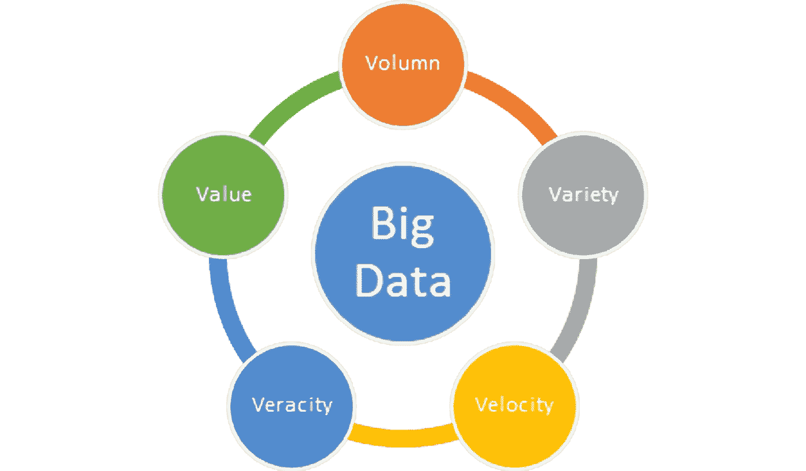
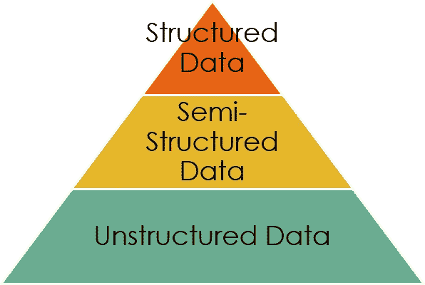
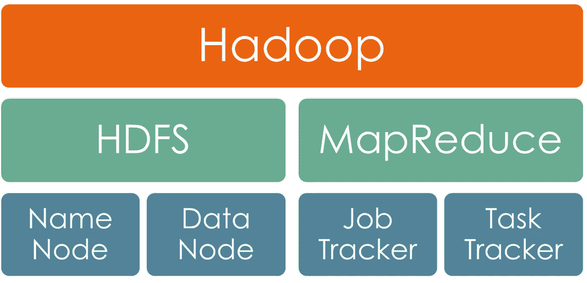
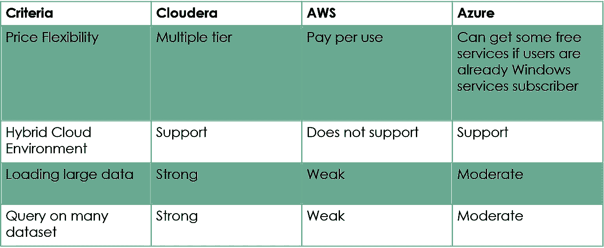

# Cloudera、Amazon Web Services 和 Microsoft Azure 的比较研究

> 原文：<https://towardsdatascience.com/a-comparative-study-on-cloudera-amazon-web-services-and-microsoft-azure-32c0b240fb8e?source=collection_archive---------18----------------------->

在 [Unsplash](https://unsplash.com/s/photos/cloud?utm_source=unsplash&utm_medium=referral&utm_content=creditCopyText) 上由 [C Dustin](https://unsplash.com/@dianamia?utm_source=unsplash&utm_medium=referral&utm_content=creditCopyText) 拍摄的照片

## [理解大数据](https://towardsdatascience.com/tagged/making-sense-of-big-data)

*摘要* —本文旨在比较 Cloudera、亚马逊 Web 服务和微软 Azure 提供的云计算服务。大数据是指大量数据，包含结构化、半结构化和非结构化数据。传统技术无法存储和处理大数据。Hadoop 框架支持存储和处理如此复杂的数据。Cloudera、Amazon Web Services 和 Microsoft Azure 部署了 Hadoop 框架，并在云上实现数据存储和处理。这三个发行版都提供了云计算、云存储、数据库和机器学习。他们在不同方面都有自己的长处和短处。用户必须选择最符合他们需求的发行版。

*关键词—大数据、云计算、Hadoop、AWS、Azure*

# 一.导言(简要背景)

B ig 数据是一个术语，指庞大的规模(容量)、高增长率(速度)和各种数据集(多样性)。传统的技术和工具，例如关系数据库管理系统(RDBMS)，既不充分也不适合管理、捕获、处理或分析大数据并从大数据中创造有意义的洞察力[1][4]。

RDBMS 只适用于以表格形式存储的结构化数据，而对于大数据，数据种类繁多，不仅仅是表格。大数据包括非结构化数据，如移动生成的信息、图像、视频和 RFID。在 RDMBS 中，数据是基于关系进行分析的，这导致了它的另一个局限性，因为维护非结构化数据关系是不可想象的(至今)。除此之外，RDBMS 不能保证快速的处理速度，这是分析大数据的主要问题之一。因此，大数据分析更适合采用分布式文件系统方法的 NoSQL。最后但同样重要的是，在存储和处理大数据时，传统技术和工具将是一种昂贵的方法。[4]

图一。大数据的五大特征。(图片由作者提供)

从上面的陈述中，大数据被描述为具有巨大的量、高的多样性以及高的速度。从[2]和[7]来看，大数据还有另外两个定义，就是准确性和价值。

**卷:**卷是指数据的大小。随着每秒钟产生大量数据，数据量已经从兆字节和千兆字节增长到千兆字节。据预测，到 2020 年，将会产生 40zb 的数据，这是 2005 年的 300 倍[1] [2]。

图二。数据量的增长。(图片由作者提供)

**多样性:**多样性是指不同类型的数据和不同来源的数据。大数据不仅仅是行和列形式的结构化数据，事实上，大数据中只有一小部分是结构化数据，大部分生成的数据是非结构化数据或半结构化数据，例如，音乐、视频、图像、电子邮件或社交媒体数据。Twitter 上有 2 亿活跃用户，每天发送 4 亿条推文。所有这些都有助于各种大数据的增长[1] [2]。

图 3。数据类型。(图片由作者提供)

**速度:**速度是指产生数据的速度和处理数据的速度。有不变的静态数据，也有变化非常频繁的数据。对于频繁变化的数据或高速生成的数据，例如社交媒体帖子，处理速度必须足够快，因为数据有时可能在[1] [2]之后不再有用。

**准确性:**准确性是指数据的准确性或不可靠性。收集数据的不一致性和不完整性导致数据的不确定性[2]。

**价值**:价值是指可以从数据中获得的利益。从[7]，大数据生态系统表明，数据购买者和数据使用者可以从数据价值链中其他人收集和组合的信息中提取价值。

# I .发行版/服务的历史和演变

随着传统技术和工具不再适合大数据存储和处理，各种分发和服务被发布。大多数发行版都支持 Hadoop 框架，能够处理复杂的大数据。

Hadoop(高度归档分布式面向对象编程)是一个开源的 Apache 框架，用 Java 编写，旨在使用简单的编程模型支持跨计算机集群的大规模数据集的分布式并行处理。Hadoop 得名于创造者儿子的玩具大象。2005 年，两名雅虎员工创建了 Hadoop，最初是为了支持开源网络爬虫 Nutch。2003 年，Google 发布了 Google 文件系统和 Google Map Reduce，随后 Google 在 2004 年的白皮书中分享了 Google 文件系统和 Map Reduce 的解释。谷歌激发了 Hadoop 的产生。2005 年，Hadoop 开始在雅虎服务。2008 年，Apache 接管了 Hadoop，这就是 Hadoop 现在被称为 Apache Hadoop 的原因。同时，Hadoop 已经成为分布式应用最强大的数据存储和处理框架之一[3] [4]。

Hadoop 有助于以分布式方式以最低的成本存储、访问和获取大数据中的大量资源，具有高扩展性和高可用性，因为它本身可以在应用层确定故障，这使得它非常具有容错性。Hadoop 不仅可以处理大量数据，还可以处理各种各样的数据，如图像、视频、音乐音频、文件、文件夹、软件和电子邮件。简而言之，Hadoop 可以处理任何类型的结构化、半结构化和非结构化数据。Cloudera、Hortonworks 和 MapR 是 Hadoop 的商业支持发行版[4]。

图 4。Hadoop 组件。(图片由作者提供)

Hadoop 提供多种服务，其中包括文档、位置感知、源代码和工作调度。Hadoop 包包含两个主要部分和其他各种组件。两个主要部分是 Hadoop 分布式文件系统(HDFS)和 MapReduce。HDFS 主要用于数据存储，MapReduce 用于数据处理和数据分析。HDFS 和 MapReduce 都实行主从架构。其他组件包括 Zookeeper、Sqoop、Pig、Oozie、Hive、HBase、Flume 和 Avro [3] [4]。

HDFS 是 Java 可移植文件系统，它在 Hadoop 框架环境中更具可伸缩性和可信任度。HDFS 包含一个名称节点和一个数据节点群集。数据节点存储文件数据，而名称节点存储元数据，如每个数据块地址的名称、文件属性、副本和位置。如果数据节点的数据块在复制副本中丢失或出现故障，名称节点将创建数据块的复制副本。数据节点中的块数由名称节点监控。因此，名称节点是非常重要的，因为只有它知道所有文件存储在哪里，这也是与数据节点通信的唯一方式[3]。

Map Reduce 是一款用于处理大型数据集的软件。它的名字代表了它的两个主要功能，Map 和 Reduce。映射函数将数据分离成一对键和值，减少推断最终输出，并生成中间值[4]。如上所述，MapReduce 采用与 HDFS 相同的主/从架构。在 MapReduce 中，主节点是作业跟踪器，从节点是任务跟踪器。在收到用户的订单后，MapReduce 向 HDFS 请求数据集。在此过程中，用户与 MapReduce 主节点(作业跟踪器)通信，然后作业跟踪器从 HDFS 的 Name 节点获取要处理的数据的位置。之后，作业跟踪器将作业传递给任务跟踪器进行处理。对于 HDFS 和 MapReduce，从节点和将定期向主节点发送心跳信号，以确保主节点仍然活着[5]。

Hadoop 是不可替代的，因为它的框架使大数据的存储和处理成为可能。虽然 Hadoop 架构是基于 Google 文件系统和 Google Map Reduce 的，但是提供的服务是免费的，因此许多发行版都部署了 Hadoop 的实现。

# A.Cloudera

如前所述，Cloudera 是 Hadoop 的商业支持发行版之一。2008 年，Cloudera 由包括甲骨文、脸书、谷歌和雅虎在内的硅谷领先公司的最聪明的头脑创建。。Hortonworks 成立于 2011 年，由 24 名雅虎！工程师，来自最初的 Hadoop 团队。Hortonworks 和 Cloudera 都认为开放标准、开源和开放市场对公司来说是最好的。2019 年，Cloudera 已经与 Hortonworks 合并[8]。

Cloudera 的创始人坚持认为，有了 Hadoop，整个商业市场都可以获得优势。例如，石油和天然气公司可以用一种新方法分析他们的油藏数据，这种方法可能提供不同的见解。该声明得到了 Accel Partners 的足够重视，Accel Partners 愿意投资资金启动 Cloudera 项目。然而，VMware 的联合创始人戴安娜·格林(Diana Greene)和 MySQL 的前首席执行官马丁·米科斯(Marten Mickos)以及脸书的首席财务官吉迪恩·于(Gideon Yu)也向该公司投入了资金。Cloudera 计划出售他们的咨询和支持服务，尽管 Hadoop 仍然是免费的[9]。

# B.亚马逊网络服务

亚马逊作为全球在线销售的领导者，拥有自己的云计算，即亚马逊网络服务(AWS)。2006 年，AWS 成立并开始向个人和组织提供云计算[6]。AWS 是作为 Amazon.com 的副业引入的[10]。AWS 业务的领导者 Andy Jassy 提到，AWS 不是任何一个人的想法，它的成立是因为该公司在推出新项目和支持客户的能力方面遇到了挫折。没有人知道 AWS 会成长为今天这样一个万亿美元的技术市场[11]。

根据 Jassy 的说法，在 AWS 的构建阶段，他们很快面临第一个关键决策，是应该从存储解决方案、计算解决方案和数据库解决方案中构建一个服务，还是构建一个包含所有三种服务的平台。由于他们认为所有应用程序都需要计算解决方案，大多数需要数据库，几乎所有应用程序都需要存储，因此他们得出结论，大多数开发人员需要这三种服务的组合。然后。AWS 于 2006 年 3 月推出[11]。

# C.微软 Azure

微软 Azure 于 2010 年首次发布。微软 Azure 使用户能够在云上运行服务，或者将云计算服务与任何基础设施、数据中心或应用程序相结合[6]。微软 Azure 原名 Windows Azure，2014 年 4 月 3 日更名为微软 Azure。同一天，微软声明他们将 Azure 作为客户的公共云平台。微软 Azure 支持来自任何公共云的各种操作系统、语言和服务，例如 Hadoop [12]。微软 Azure 是在 2008 年微软专业开发者大会上首次推出的，同时推出的还有微软 SQL 服务。NET Services、Live Services 以及 Microsoft SharePoint Services 和 Microsoft Dynamics CRM Services SaaS。随着这一系列新产品的推出，微软提供了五大关键类别的云服务，而不仅仅局限于云计算。Windows Azure 提供计算、存储和网络服务，而微软 SQL Services 提供数据库服务[14]。

微软一直是 IT 市场的领导者。虽然微软 Windows 软件过去和现在都在人们的生活中很受欢迎，但微软决定将他们的重点从个人电脑转移到移动和云计算。这一决定被证明是明智的决定，因为销售额翻了一番，股票上涨了 6.2%。

# 二。分发/服务及其组件的亮点

表 1。三种分布的比较概要。(图片由作者提供)

# A.Cloudera

Cloudera Enterprise 非常适合希望建立自己的企业大数据中心并在其上执行数据分析的组织。Cloudera Enterprise 利用 Hadoop (CDH)的开源 Cloudera 发行版，这是目前使用的 Hadoop 部署最多的实现之一[17]。

CDH 提供启动和运行大数据环境所需的所有工具。通过与 Apache Kudu 项目和 Apache Impala 项目的集成，Cloudera 现在能够支持实时分析和 SQL 分析查询。Cloudera 提供的四个主要功能是开源数据平台、分析、数据管理和预测建模。Cloudera 数据平台(CDP)拥有 Hortonworks 和 Cloudera 的最佳技术，可作为首个企业数据云。CDP 不仅包括数据中心服务，还包括数据仓库和机器学习。它提供了一个集成的控制平面来管理数据、基础架构和分析，CDP 还支持混合云或多云环境。CDP 是完全开源的发行版，可以避免供应商锁定。对于价格，Cloudera 提供了各种选项，包括 4，000 美元起的年费和每小时 0.08 美元的服务使用费[17]。

# B.亚马逊网络服务

Amazon Web Services 在存储和使用的服务方面提供高度可定制的服务。此外，成本是根据选择的服务数量计算的。这对小型和大型组织都非常有益。AWS 还提供 12 个月的免费试用。然而，AWS 目前有一些客户支持问题[6]。

AWS 提供的云计算服务可以分为 19 个类别，分别是计算、存储、数据库、迁移、网络和内容交付、开发者工具、管理工具、人工智能、分析、安全、身份和合规、移动服务、应用服务、消息传递、业务生产力、桌面和应用流、软件、物联网、联络中心和游戏开发[16]。

在所有服务中，AWS 最受欢迎的服务之一是用于云计算的弹性计算云(EC2)。它提供免费层、按使用付费和快速部署。付款从每小时 0.0059 美元开始。接下来是简单存储服务(S3)，也是免费层，适用于主存储和备份，因为他们声称该服务具有几乎 100%的耐用性。Glacier 是 AWS 提供的另一种存储服务，适用于档案存储，与 S3 集成。另一个流行的服务是关系数据库服务(RDS ),它提供六种数据库引擎供选择，价格从每小时 0.017 美元开始。亚马逊在人工智能方面有强大的投资，他们提供了亚马逊机器学习，能够进行实时预测，并包含可视化工具和向导。该费用按使用次数计算，其中数据分析和模型构建每小时花费 0.42 美元，批量预测每 1000 次交易花费 0.10 美元，实时预测每次预测花费 0.0001 美元[16]。

AWS 提供的最大好处是按使用付费，这使它不仅适用于大型组织，也适用于中小型企业，甚至个人。

# C.微软 Azure

微软 Azure 为不同类型的行业提供了各种各样的服务。他们考虑了各种业务需求，并推出了各种足以满足各种行业需求的软件包。它兼容 Windows 和 Linux，并提供 12 个月的免费试用。然而，它比 AWS 更贵，因为服务是打包提供的，这意味着即使你可能不需要某项服务，你仍然必须购买它[6]。

微软 Azure 提供的云服务可以分为 14 类，分别是计算、网络、存储、Web +移动、容器、数据库、数据+分析、AI +认知服务、物联网、企业集成、安全+身份、开发者工具、监控+管理、微软 Azure 栈[14]。

根据[14]，从 Azure 提供的各种各样的服务来看，最受欢迎的服务是用于计算的虚拟机、Blob 存储、SQL 数据库、用于安全+身份的 Azure Active Directory 以及用于开发人员工具的 Visual Studio Team Services。微软 Azure 的虚拟机提供按使用付费，每小时只需 0.018 美元。此外，虚拟机支持各种服务器软件，包括 Window Server、Linux、SOI Server、IBM、SAP 和 Oracle。对于 Blob 存储，价格取决于访问，以及它对大规模可扩展对象存储的支持。虚拟机和 Blob 存储都提供免费层，用户可以免费试用服务。其次是 SQL 数据库，它也提供按使用付费，价格从 0.10 美元到 3.23 美元每小时使用。Azure Active Directory 为云和云上应用程序提供单点登录服务，并与 Office 365 等微软云服务集成。提供免费等级，高级 P2 服务的费用为每个用户每月 9 美元，基本服务的费用为每个用户每月 1 美元。Visual Studio Team Services 对订阅其他微软服务的开发人员是免费的。对于不是微软服务订阅者的用户，前五个用户的服务是免费的，第六到第十个用户每月 6 美元，第 11-100 个用户 8 美元，第 101-1000 个用户 6 美元，其他用户 4 美元。

简而言之，微软 Azure 对那些已经在使用微软软件(例如 Windows 和 Office)的个人或组织有利。通过使用微软 Azure，微软服务用户可以很快采用它，并且微软 Azure 提供的一些服务对微软服务用户是免费的[14]。

# 三。分销商/服务及其组成部分之间的比较(分析/结果)

所有三个发行版，Cloudera，Amazon Web Services 和 Microsoft Azure 都支持数据存储，数据库，网络安全，云计算和机器学习。每种发行版都有自己的优缺点。本节将比较这三个发行版各自提供的服务。

基于产品功能和客户对 Cloudera、AWS 和 Microsoft Azure 的评级和评论可在[15]上获得。根据过去 12 个月的评级和评论[15]，Microsoft Azure 的总体同行评级最高，其次是 Cloudera，然后是 AWS。产品能力方面，Cloudera 和微软的平均评分高于 4.0，AWS 的平均评分在 3.5 左右。评级显示，AWS 在持续加载数据和查询多种数据类型/数据源方面的性能较低，而 Cloudera 在行政和管理方面较弱。除了管理大量数据、对许多数据类型/来源的查询、系统可用性和用户技能水平支持之外，Microsoft Azure 在大多数方面都获得了最高评级。AWS 在系统可用性方面排名最高，而 Cloudera 在许多数据类型/数据源的查询方面排名最高。就客户体验而言，所有三个发行版的平均评分都在 4.0 以上。Microsoft Azure 在所有标准方面都获得了最高评级，包括定价灵活性、易于部署、供应商响应的及时性和技术支持的质量。

根据评级，微软在大多数方面都是最好的，包括价格和部署的便利性。然而，基于[6]，微软 Azure 被评为昂贵。两个来源之间的差异，这是因为微软 Azure 非常适合已经是 Windows 服务订户的组织。他们可以获得一些免费的 Azure 服务，界面也更加熟悉，这使得他们更容易部署 Microsoft Azure。

根据评级[15]和评论[6]，AWS 在系统可用性方面有很高的评级，并推荐其低价和按使用付费的支付方式。但是，与其他两个发行版相比。AWS 在加载数据和执行查询方面较弱，而 Cloudera 在这方面有很强的性能。再者，AWS 不支持 Cloudera 和微软 Azure 这样的混合云环境，在某些方面限制了它的应用。

# 四。讨论和推荐(应用领域)

由于不同的分布有不同的优缺点，它们在现实生活中的大数据上的应用也是不同的。微软 Azure 对 Windows 服务有很强的支持，非常适合教育等广泛使用 Windows 服务的行业。从学生到教师或讲师，甚至是管理人员，都使用像 Microsoft Office 这样的 Windows 服务。大多数大学订阅了微软 Office 365 服务用于教育用途。Microsoft Office 365 的应用程序包括学生的作业、学生的讲课记录，以及学生和大学所有员工的详细记录。

Cloudera 是 Hadoop 部署最多的实现之一，具有最强的数据加载和查询能力，适合处理非结构化的复杂数据。比如医疗数据。不同病人身上疾病的特点和症状是不同的。Cloudera 还支持科学数据可视化。因此，Cloudera 适合在医疗保健领域应用。

亚马逊网络服务(AWS)适用于公共部门，因为支付是按使用量收费的。公共部门包括政府组织和非政府组织，他们可以使用 AWS 提供的服务来存储他们从调查中收集的数据，并在 AWS 平台上立即执行数据分析。AWS 允许按使用付费，这在成本方面可能对组织有利。AWS 也提供了机器学习服务，组织可以使用机器学习进行预测，例如预测住宅区的用电量。

从我的角度来看，所有这三个发行版都将增长，并在提供的服务方面变得越来越成熟，在产品质量、安全性、易于部署和客户服务方面。分布的应用范围只会越来越大。有可能在未来的某个时候，随着发行版之间的竞争，越来越多的服务变得免费。也有可能在未来的某个时候，云服务已经被创新，直到我们可以用智能设备而不是个人电脑或笔记本电脑来控制一切。大数据存储、处理、数据分析和机器学习都可以通过手指触摸来完成。

如果这已经成为我们的现实，网络安全对于发行版将是非常重要的。当我们生活中的一切都在云上时，如果云中断了，那将是一场灾难。那时，当人们选择服务时，发行版的安全性和持久性将是首先考虑的问题。

# 动词 （verb 的缩写）结论

总之，每个发行版都有其独特的功能、优点和缺点。因此，建议用户根据自己的情况选择最适合自己的发行版。 **Cloudera** 部署了 **Hadoop** 最多，因此在处理复杂数据方面有非常强的性能。**亚马逊网络服务**以其**价格灵活性**而闻名，它适合每一个用户。**微软 Azure** 最适合 **Windows 服务用户**。

# 保持联系

订阅 [YouTube](https://www.youtube.com/channel/UCiMtx0qbILP41Ot-pkk6eJw)

# 参考

[1] H. S. Bhosale 和 P. D. P. Gadekar，“关于大数据和 Hadoop 的综述论文”，*《国际科学与研究出版物杂志》，*第 4 卷第 10 期，2014 年 10 月。

[2] R. Beakta，《大数据与 Hadoop:综述论文》，*国际计算机科学与信息技术杂志，*2015 年第 2 卷第 2 期。

[3] B. Saraladevi，N. Pazhaniraja，P. V. Paul，M. S. Basha 和 P. Dhavachelvan，“大数据和 Hadoop-安全视角的研究”，载于*第二届大数据和云计算国际研讨会*，钦奈，2015 年。

[4] P. Vijay 和 B. Keshwani，“使用 Hadoop 的大数据的出现:综述”，*《IOSR 工程学报》，*第 6 卷，第 3 期，2016 年 3 月。

[5] M. R. Ghazi 和 D. Gangodkar，“Hadoop、MapReduce 和 HDFS:一个开发者的视角”，载于印度*智能计算、通信&融合*国际会议，2015 年。

[6] N. Drake，“2019 年最佳云计算服务:面向数字化转型”， *TechRadar* ，2019 年 11 月 4 日。【在线】。可用:https://www . techradar . com/best/best-cloud-computing-services。[访问时间:2019 年 10 月 13 日]。

[7] S. Gnanasundaram 和 A. Shrivastava,《信息存储和管理:以传统方式存储、管理和保护数字信息》,第二版。，交叉点大道:约翰威利父子公司，2012 年。【电子书】。

[8]《关于| Cloudera》， *Cloudera* ，2019。【在线】。可用城市:https://www.cloudera.com/about.html.[访问时间:2019 年 10 月 18 日]。

[9] A .万斯，“将谷歌和脸书背后的魔力装瓶”， *Bits，*2009 年 3 月 16 日。【在线】。可查:https://bits . blogs . nytimes . com/2009/03/16/bottling-the-magic-behind-Google-and-Facebook/。[访问时间:2019 年 10 月 18 日]。

[10] R. Miller，《AWS 是如何诞生的》， *TechCrunch* ，2016 年 7 月 2 日。【在线】。可用:https://TechCrunch . com/2016/07/02/Andy-jass ys-brief-history-of-genesis-of-AWS/。[访问时间:2019 年 10 月 29 日]。

[11] J. Furrier，“独家:AWS 和 Andy Jassy 的万亿美元宝贝的故事”， *Medium* ，2015 年 1 月 30 日。【在线】。可用:https://medium . com/@ furrier/original-content-the-story-of-AWS-and-Andy-jass ys-万亿美元-baby-4e8a35fd7ed。[访问时间:2019 年 10 月 29 日]。

[12] S. Martin，“Window Azure 即将更名”，T20 微软 Azure，2014 年 3 月 24 日。【在线】。可用:https://azure . Microsoft . com/en-us/blog/upcoming-name-change-for-windows-azure/。[访问时间:2019 年 10 月 29 日]。

[13] A. G. Tharakan 和 J. Dastin，“由于云业务超过预期，微软股价创下新高”，*路透社*，2016 年 10 月 21 日。【在线】。可用:https://uk . Reuters . com/article/uk-Microsoft-results-idukkcn 12k 2 JC。[访问时间:2019 年 10 月 29 日]。

[14] C .哈维，《微软 Azure》，*数据化*，2017 年 5 月 23 日。【在线】。可用:https://www . data mation . com/cloud-computing/Microsoft-azure . html[访问时间:2019 年 11 月 2 日]。

[15]《比较 Cloudera、微软、亚马逊网络服务(AWS)》， *Gartner* 。【在线】。可用:https://www . Gartner . com/reviews/market/data-warehouse-solutions/compare/cloud era-vs-Amazon-we B- services-vs-Microsoft。[访问时间:2019 年 11 月 2 日]。

[16] C. Harvey，“亚马逊网络服务(AWS)”，*数据化*，2017 年 5 月 11 日。【在线】。可用:https://www . data mation . com/cloud-computing/Amazon-we b-services . html[访问时间:2019 年 11 月 3 日]。

[17] S. M. Kerner，“Cloudera 企业:服务概述与洞察”，*数据化*，2019 年 4 月 25 日。【在线】。可用:https://www . data mation . com/big-data/cloud era-enterprise-data-analytics-tools . html[访问时间:2019 年 11 月 5 日]。