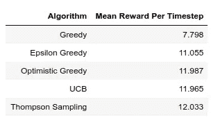
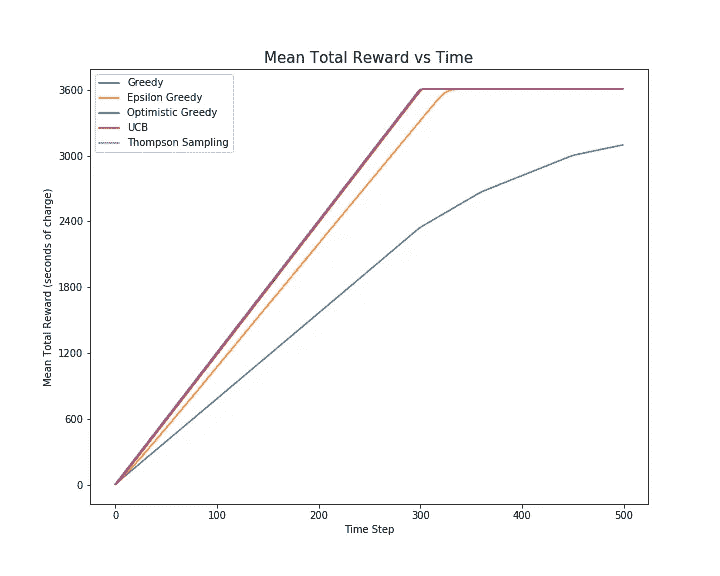
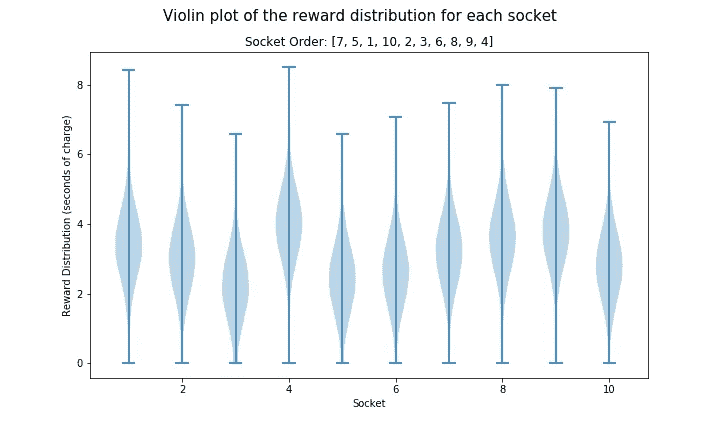
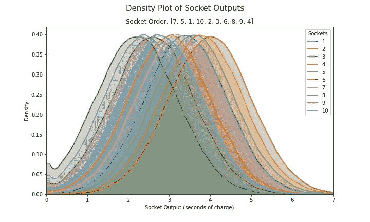
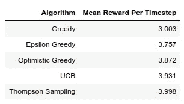
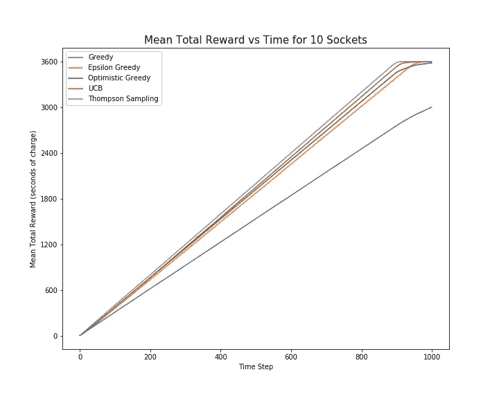
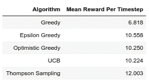
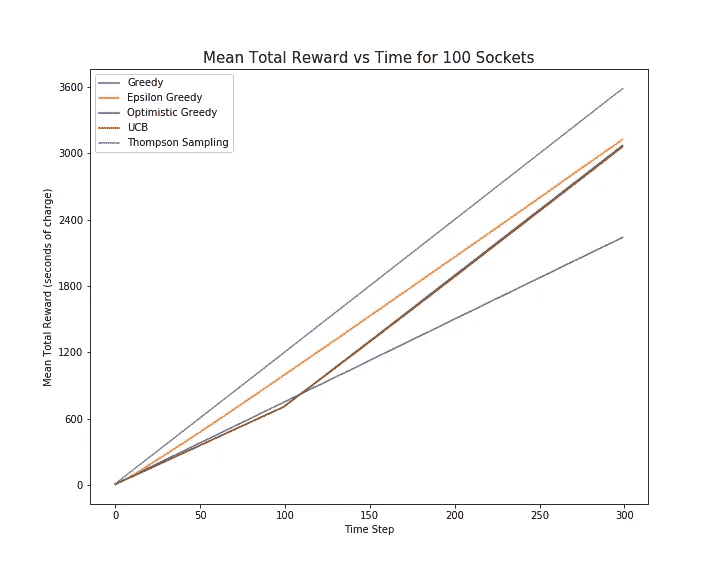

# Bandit 算法的比较

> 原文：<https://towardsdatascience.com/a-comparison-of-bandit-algorithms-24b4adfcabb?source=collection_archive---------13----------------------->

## [婴儿机器人强化学习指南](https://towardsdatascience.com/tagged/baby-robot-guide)

## 多武装匪徒:第 6 部分

[杰森·登特](https://unsplash.com/@jdent?utm_source=medium&utm_medium=referral)在 [Unsplash](https://unsplash.com?utm_source=medium&utm_medium=referral) 上的照片

# 概观

在本系列的课程中，我们已经了解了用于定义多臂匪徒的框架和术语。然后，我们将注意力转向一些可以用来解决这个问题的算法，从简单的贪婪算法，到复杂的汤普森抽样贝叶斯方法。现在只剩下一个问题需要回答了。这些方法中哪一种最能解决土匪问题？

对于那些还不熟悉多臂土匪问题，或希望刷新他们的知识的任何特定领域，在这一系列的其他部分如下:

*   [**第 1 部分:数学框架和术语**](/multi-armed-bandits-part-1-b8d33ab80697)——入门所需的全部基础信息
*   [**第二部分:Bandit 框架**](/multi-armed-bandits-part-2-5834cb7aba4b)
    *-* 代码和测试框架的描述
*   [**第三部分:强盗算法**](/bandit-algorithms-34fd7890cb18)
    *-*[*贪婪算法*](/bandit-algorithms-34fd7890cb18) *-*[*乐观-贪婪算法*](/bandit-algorithms-34fd7890cb18) *-*[*ε-贪婪算法【ε-贪婪】*](/bandit-algorithms-34fd7890cb18) *-*
*   *[**第四部分:置信上限(UCB) Bandit 算法**](/the-upper-confidence-bound-ucb-bandit-algorithm-c05c2bf4c13f)*
*   *[**第五部分:汤普森采样**](/thompson-sampling-fc28817eacb8)*-*[*伯努利汤普森采样*](/thompson-sampling-fc28817eacb8#f535)
    *-*[*高斯汤普森采样*](/thompson-sampling-fc28817eacb8#16db)*
*   *[**第 5b 部分:使用共轭先验的 Thompson 采样**](/thompson-sampling-using-conjugate-priors-e0a18348ea2d)*

*bandit 算法和测试框架的所有代码都可以在 github 上找到: [Multi_Armed_Bandits](https://github.com/WhatIThinkAbout/BabyRobot/tree/master/Multi_Armed_Bandits)*

# *概述*

> *机器人宝宝在商场走失。利用强化学习，我们想帮助他找到回到妈妈身边的路。然而，在他开始寻找她之前，他需要从一组电源插座充电，每个插座的电量略有不同。*
> 
> *使用多臂强盗问题中的策略，我们需要在最短的时间内找到最好的插座，让机器人宝宝充电上路。*

**

> *机器人宝宝进入了一个充电室，里面有 5 个不同的电源插座。每个插座返回的电荷数量略有不同。我们希望在最短的时间内给机器人宝宝充电，所以我们需要找到最好的插座，然后使用它，直到充电完成。*
> 
> *这与**多臂强盗**的问题是一样的，除了我们不是在找一个能给出最好回报的老虎机，而是在找一个能给出最多电量的电源插座。*

**

# *Bandit 算法的比较*

*为了回答哪个是最好的 bandit 算法的问题(就我们已经研究过的算法而言)，我们可以根据我们自己的问题来重新构建问题:哪个算法会让婴儿机器人在最短的时间内充满电？*

*为了进行这个实验，我们首先需要准确定义充满电的含义。对于这一点，我们将任意定义婴儿机器人在有足够的电量运行一小时(3600 秒)时充满电。*

*有了这个定义，我们现在可以运行每一个 bandit 算法，最多运行 500 个时间步，结果如下:*

**

*(注:用于生成这些结果的完整测试系统可在 [github 笔记本](https://github.com/WhatIThinkAbout/BabyRobot/blob/master/Multi_Armed_Bandits/Part%206%20-%20A%20Comparison%20of%20Bandit%20Algorithms.ipynb)中获得。)*

**

*图 6.1:在 5 插座电源问题上 bandit 算法的比较。*

*从上图我们可以看出:*

*   **乐观贪婪，UCB* 和*汤普森采样*都在大约相同的时间步数内达到所需的最大电荷(这就是为什么*乐观贪婪*和*汤普森采样*的线被 *UCB* 的线遮住)。*
*   *在每种情况下， [*后悔*](/bandit-algorithms-34fd7890cb18) 对于这些算法来说几乎为零。当任何插座的最大可用电量为 12 秒时，每个插座仅用了 300 个时间步来达到 3600 秒的最大所需电量。所以最佳插座被快速定位，然后被充分利用。*
*   **Epsilon Greedy* 另一方面，达到最大充电量需要稍长的时间。因为它在整个运行过程中继续探索套接字集，所以它未能完全利用最佳套接字。*
*   *而且，最糟糕的是*贪心*算法。它实际上无法在可用时间内达到最大电量。*

*所以，从给婴儿机器人充电的角度来看，任何一种*乐观贪婪*、 *UCB* 或*汤姆森采样*算法都可以完成这项工作。但是需要注意的是*乐观贪婪*和 *UCB* 都需要设置一个参数(这些参数是*乐观贪婪*的初始值和 *UCB* 的置信度值)。对这些参数做出错误的选择会导致算法性能下降。*

*由于*汤普森采样*不需要设置参数，所以这不是问题，因此这可能是选择使用哪种算法的决定性因素。*

# *增加了问题难度*

*我们到目前为止所使用的套接字问题被故意做得非常简单，以允许对每个算法的探索和利用机制进行说明。然而，在寻找最佳算法方面，它有几个主要缺点。*

*   *首先，它只有五个插座。因此，即使使用*贪婪*算法的随机搜索，也有 20%的机会找到最佳插座。对于更高级的搜索机制，它们可以快速定位并锁定最佳插座，因为要测试的插座很少。*
*   *其次，每个插座都有非常明显的奖励。由于我们设置的实验中插座的充电间隔为 2 秒钟，其奖励有一个单位变化，因此插座和下一个最佳插座返回的电量几乎没有重叠。一旦尝试了最好的插座，任何其他插座返回的电荷都不太可能大于该值。这使得识别哪个插座是最佳的变得非常容易。*

*为了克服我们原始实验中的这些不足，让我们将插座的数量增加一倍，并减少插座可以返回的电荷数量的差异，将充电时间从 2 秒减少到 0.2 秒。有了这些值，套接字的输出现在看起来如下:*

**

*图 6.2:10 个插座的奖励分布。插座顺序定义了插座的相对品质，从最低到最高输出，10 是最好的(插座 4)，1 是最差的(插座 3)。*

**

*图 6.3:插座输出的密度图。插座 4 的平均输出最高，插座 3 的平均输出最低。*

*现在我们有 10 个插座，一个插座的平均回报和下一个最好的插座之间有 0.2 秒的充电差异。这意味着回报有更大的重叠。*

*插座顺序[7，5，1，10，2，3，6，8，9，4]以递增的顺序定义了插座的好坏，因此插座号 1 是第七好的插座，并且将具有(7*0.2 +2) = 3.4 秒的充电的平均回报(+2 只是防止插座具有负值的偏移值)。因此，最好的插座是插座 4，平均回报为(10*0.2 +2) = 4，最差的插座是插座 3，平均回报为(1*0.2 +2) = 2.2。*

*需要注意的其他几点是:*

*   *因为我们已经减少了插座平均值的分布，最好的插座现在的输出比我们只测试 5 个插座时的输出低。因此，达到我们定义的最大总奖励(充电 3600 秒)所需的时间步数将会增加。*
*   *我们在 5 插槽实验中为 *UCB* 和*乐观贪婪*算法保留了相同的参数，因此调整这些值可能会得到更好的结果。*

*使用此新设置运行会产生以下结果:*

****

*图 6.4:bandit 算法在 10 插座电源问题上的比较，电荷分布为 0.2 秒。*

*现在我们可以看到算法性能的一些分离:*

*   *和以前一样，*贪婪*算法的表现比其他算法差得多。 *Epsilon Greedy* ，虽然比简单的 *Greedy* 算法好很多，但还是比其他 3 个算法差。*
*   *虽然数量不多，但汤普森取样比其他的要好。*

*如下所示，对于 100 个套接字，随着套接字数量的增加和平均奖励值的分布的减小，算法中的这种差异变得更加明显，分布为 0.1(注意，现在最大套接字输出再次为 12 (=0.1*100 +2):*

****

*图 6.5:bandit 算法在 100 插座电源问题上的比较，电荷分布为 0.1 秒。*

*对于 100 个插槽，有趣的是注意到 *UCB* 和*乐观贪婪*算法的性能比*ε贪婪*算法差。事实上，当*汤普森取样*达到最大电荷时，这些其他算法都没有超过*ε贪婪*的总平均回报。*

*可以看出，这是由 *UCB* 和*乐观贪婪*算法的启动回合引起的，在此期间，每个插座被精确地测试一次(注意直到第 100 个时间步长的较低梯度)。因此，对于第一个 100 时间步， *UCB* 和*乐观贪婪*正在努力完成 100 个套接字中的每一个，而*ε贪婪*和*汤姆森采样*已经开始利用他们发现的最好套接字。*

*如果我们让实验运行更多的时间步，那么 *UCB* 和*乐观贪婪*可能会超过*ε贪婪*的平均总回报，并在此之前达到满负荷。然而，如果机器人宝宝用汤普森取样算法选择了插座，他就已经充满电了。*

# *语境强盗*

*我们看到的基本 bandit 算法的一个主要缺点是它们没有考虑任何可用的上下文信息。*

*例如，想象一下电源插座是用颜色编码的，这种颜色表示将返回的电量。如果在完成我们的试验后，我们发现蓝色插座充电很多，而黄色插座充电很少，那么下次我们进入充电站时，优先选择蓝色插座而不是黄色插座是有道理的。*

*基本的强盗算法只是采取一个行动，收集奖励，并不关注他们的当前状态。因此，可能有助于选择最佳行动的当前状态的潜在有用信息被简单地忽略。*

*情境强盗(也称为“*关联强盗*”)通过使用来自当前状态的信息来帮助指导他们选择行动，从而解决了这一限制。因此，它们既可以被认为是复杂的强盗算法，也可以被认为是强化学习的简化版本。*

*在完全强化学习问题中，所采取的行动可以导致状态的改变，并因此导致新的上下文信息。因此，所选择的行动会对未来可能获得的回报产生影响。例如，在一盘棋中，一个看起来很好并能立即给予很大回报的走法(比如拿下对方的皇后)实际上可能会导致你输掉比赛。因此，这实际上被认为是一个糟糕的举动。真正的奖励会延迟，直到游戏结束才会收到。*

*在上下文盗匪中，这些条件都不存在；行动不会改变状态，回报是即时的，而不是延迟的。*

# *Bandit 算法的使用*

*那么，除了给婴儿机器人充电或者下次你在拉斯维加斯时在吃角子老虎机上赢得你的财富，多臂强盗算法还能用来做什么呢？*

> ****免责声明:*** 众所周知，拉斯维加斯的赌场老板对在赌场中使用算法的人非常敏感。因此，在使用这些算法的过程中，我不承担任何物理或经济损失的责任！*

*多武装匪徒可能有两个主要的使用领域:*

*首先是我们如何使用它们，作为全面强化学习的垫脚石。多臂土匪的很多概念，比如动作和奖励，直接适用于完全强化学习(RL)问题。实际上，在完全强化学习中，一个多臂强盗可以被认为代表一个单一的状态。此外，贪婪的动作选择虽然可能不是解决 bandit 问题的最佳方法，但通常用于在 RL 中的不同动作之间进行选择。*

*bandit 算法的第二个主要应用领域是在真实世界测试中。这可以发生在任何领域，但在在线商务、医疗保健和金融领域尤为普遍。*

*例如，当评估网页的变化如何影响其性能时，这可以通过多种方式来衡量，如页面产生的销售额或点击率，标准方法是使用 A/B 测试。这需要两个或更多不同的页面变体，然后通常将每个变体同等地呈现给站点用户，以观察他们的表现。在预定的时间段之后，比较来自每个页面的统计数据，然后将表现最好的页面作为获胜页面。*

*很明显，这种形式的测试有一个主要缺点:在测试期间，相同数量的客户被发送到一个性能不佳的网页。如果这个页面的性能特别差，它可能会对你的网站的整体性能产生很大的负面影响。通过有一段时间专门用于勘探，A/B 测试继续调查表现不佳的选项。*

*相比之下，在多臂 Bandit 方法中，页面根据用户测量的相对性能呈现给用户。表现好的页面将越来越多地显示，表现差的页面将较少显示。以这种方式，可以测试对网站的改变。提高性能的好特性会立即得到提升，产生积极的影响，而在 A/B 测试中会持续产生负面影响的坏特性会很快被丢弃。*

*多臂匪在临床试验中的使用方式类似。显然，在药物试验期间，继续给患者服用会导致患者出现负面副作用的药物是个坏主意。因此，多臂 Bandit 算法已经被用于决定给患者的药物和剂量，以最大化积极的结果。*

*为了更全面地了解 Bandit 算法的实际应用，我推荐阅读以下文章:*

*" [*多武装背景土匪*](https://arxiv.org/pdf/1904.10040.pdf) 实际应用调查"，Djallel Bouneffouf，Irina Rish (2019)*

# *结论*

*我们已经看到，当面临必须在各种不同选项之间进行选择的问题时，选择这些选项中任何一个的回报最初都是未知的，诸如*汤姆森抽样*或*置信上限(UCB)* 之类的算法比简单地从选项中随机选择要好得多。有了这些算法，我们可以最大限度地减少尝试错误行动的次数，最大限度地增加采取最佳行动的次数。*

*通过在插座选择问题中使用这些算法，我们能够快速定位和利用最佳插座，并让机器人宝宝充电上路。*

*在后续文章中，我们将会看到更高级的*强化学习(RL)* 技术，其中一些利用了这些 bandit 算法。利用这些，我们将帮助机器人宝宝找到回到妈妈身边的路！*

***注意:**虽然我们已经研究了很多解决多臂强盗问题的方法，但是我们实际上只是触及了所有可用算法的皮毛。如果你想看得更多的话，可以看一看强盗的书。*

# *参考资料:*

*[1] " [*强化学习:导论*](http://www.incompleteideas.net/book/RLbook2020.pdf) "，萨顿&巴尔托(2018)*

*[2]“[*汤普逊取样教程*](https://arxiv.org/abs/1707.02038) ”，鲁索等，(2017)*

*[3]“[*一场语境化的土匪烘培赛*](https://arxiv.org/abs/1802.04064) ”，比提等人，(2020)*

*[4] " [*关于多武装和背景土匪的实际应用的调查*](https://arxiv.org/pdf/1904.10040.pdf) "，Djallel Bouneffouf，Irina Rish (2019)*

*bandit 算法和测试框架的所有代码都可以在 github 上找到:*

* [## 我在想什么/婴儿机器人

### 婴儿机器人强化学习指南。通过创建一个……

github.com](https://github.com/WhatIThinkAbout/BabyRobot)* 

*下一个系列…*

## *强化学习导论:第 1 部分
陈述价值和政策评估*

* [## 国家价值观和政策评估

### 强化学习简介:第 1 部分

towardsdatascience.com](/state-values-and-policy-evaluation-ceefdd8c2369)* **