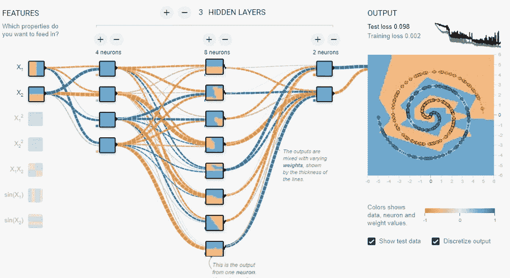
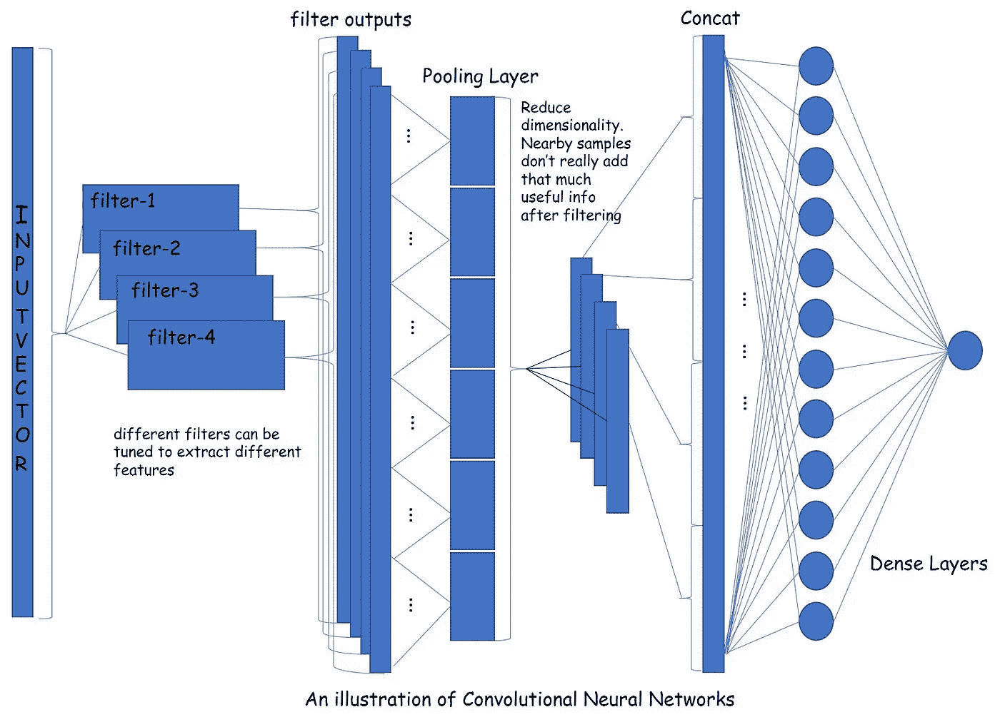
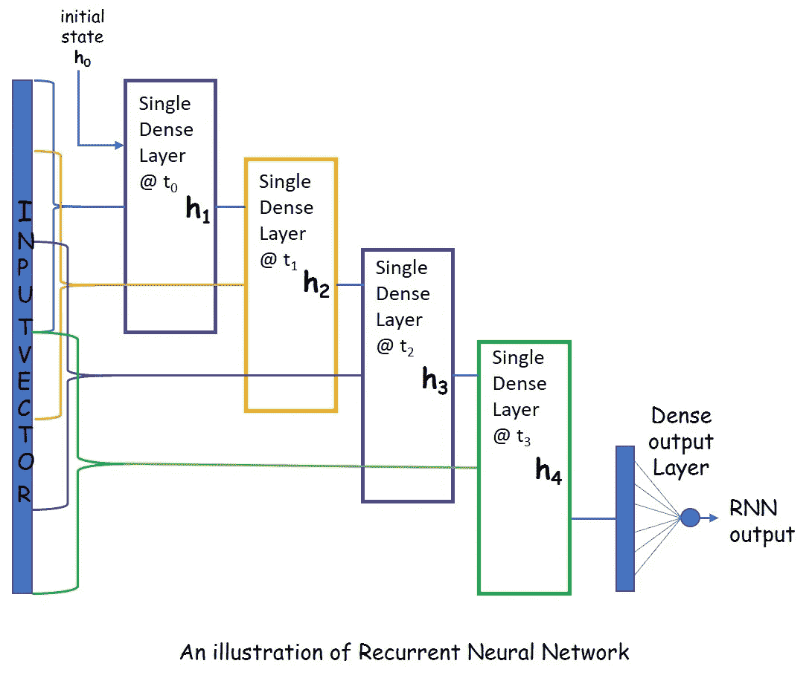
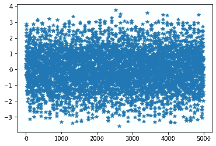
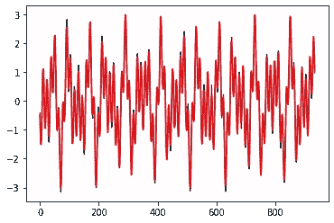
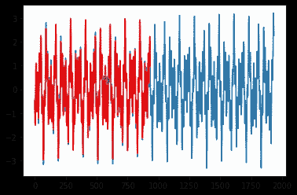
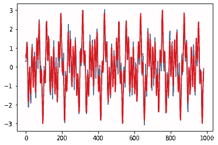
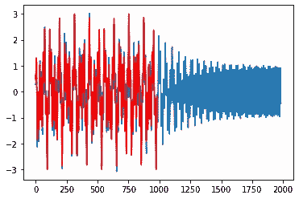
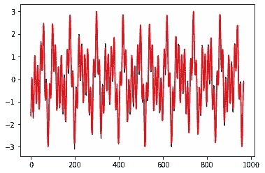
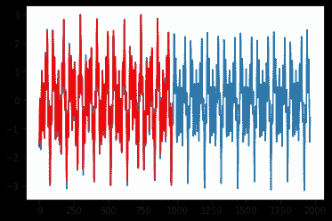

# 使用 TF/Keras 比较 DNN、CNN 和 LSTM

> 原文：<https://towardsdatascience.com/a-comparison-of-dnn-cnn-and-lstm-using-tf-keras-2191f8c77bbe?source=collection_archive---------6----------------------->

## [视频教程](https://towardsdatascience.com/tagged/video-tutorial)

## 快速浏览不同的神经网络架构及其优缺点。

视频教程

实验机器学习变得如此有趣！在我对用深度神经网络取代一些信号处理算法进行研究之后，我开始尝试另外两种著名的神经网络架构:LSTM 和 CNN，感兴趣的读者可以参考文章“[机器学习和信号处理](/machine-learning-and-signal-processing-103281d27c4b)”。

## 介绍 CNN 和 LSTM

在我们进入我的比较的细节之前，这里有一个介绍，或者说，我对其他神经网络架构的理解。我们都理解深度神经网络，它只是每层的一组神经元依次与下一层的另一组神经元互连，以此类推。每个神经元实现等式*y = f(****Wx****+****b****)*用于输入 ***x*** 和输出 *y* ，其中 *f* 是非线性激活函数， ***W*** 是权重矩阵，而【t3t】这是一张来自 https://playground.tensorflow.org/的图片



## 美国有线新闻网；卷积神经网络

一个卷积神经网络，CNN，正在增加额外的“过滤”层，除了每个神经元的权重和偏差之外，还可以学习过滤器权重(或者卷积核，如果你喜欢更华丽的词:)。仍然是反向传播在为我们做这项工作，但是我们不能让它对可靠的工作载体反向传播变得太容易！

这是我用 PowerPoint 制作的一张图片，用来解释 CNN。网上有更好的图片，图形很酷，但我不想抄袭别人的作品。当我创作我的内容时，我也必须创作我自己的插图！这就是为什么内容创作是一项艰巨的工作。尽管如此，今天的互联网是由那些创造了令人敬畏的内容的人建立的，因为他们乐在其中！



正如你在上面的图片中看到的，CNN 有几个平行的过滤器，可以被调整以提取不同的感兴趣的特征。当然，我们不会像信号处理中那样设计滤波器，但我们会让反向传播计算滤波器权重。

熟悉信号处理的读者可以连接滤波器组来分离高频和低频。这种思想在图像压缩中有重要作用，可以用滤波器组来分离低频和高频，只需要保留低频。然而，让我们不要跑题。

输入向量被这些“卷积”层中的每一层过滤。它们将输入向量与内核(滤波器脉冲响应)进行“卷积”。卷积是线性系统中的基本运算之一，就像乘法对于数字一样重要。实际上，卷积运算与多项式乘法完全相同。如果您将两个多项式相乘，并用 *x=10* 来计算结果，您将得到数字的常规长乘法。我又跑题了。

然后，每个卷积层生成自己的输出向量，因此，如果我们有 *K* 个卷积层，则维度增加 *K* 。为了减少维度，我们使用“池化”层—计算最大/最小或一定数量样本的平均值。连接所有池层的输出，并通过密集层来生成输出。

## RNN 和 LSTM

LSTM(长短期记忆)是一种递归神经网络(RNN)，其中通过“时间”上的输入序列来训练相同的网络。我用引号将“时间”括起来，因为这只是将输入向量分割成时间序列的一种方式，然后通过序列循环来训练网络。

由于在每个时间实例中训练的是同一个网络，或者更确切地说是同一套神经元，我们需要有一种跨时间传递“状态信息”的方法。在一个时间实例中神经元进化到的状态被用作下一个时间实例中神经元的附加输入。希望下图能说明这一点。

如果我们用“LSTM 层”代替 RNN 的单一致密层，我们就会得到一个 LSTM 网络。网上有很好的解释 RNN 和 LSTM 的文章——这里有一篇来自 Colah 的博客:“[了解 LSTM](http://colah.github.io/posts/2015-08-Understanding-LSTMs/) ”。

RNN 或 LSTM 捕捉输入向量中跨时间序列的相关性。使用 DNN 可以实现相同的效果，但这需要收集跨时间的输入向量，然后将其馈送到一个较大的图层，与 RNN 相比，这需要训练更大的参数集。



## 比较时间序列预测

有了对 CNN 和 RNN 的介绍，让我们进入本文的主题——比较 DNN、CNN 和 RNN/LSTM。我们将选择时间序列预测作为我们想要解决的问题，但有一个转折！一旦训练好网络，我们不仅会根据输入样本评估它们的预测，还会附加预测样本作为输入，以查看网络生成时间序列的效果如何。基于旧预测的新预测——这是一个很好的挑战！除了是一个有趣的实验，这也有实际应用。

例如，WLAN 中的信道估计发生在前同步码期间，但是需要用于解调，直到整个分组结束。如果它是一个很长的包，信道将随着时间慢慢变化，并且接近包的末尾，如果我们不跟踪信道的变化，我们将得到一个很差的信道估计。由于在有效载荷期间我们没有得到额外的训练符号来估计信道，所以我们需要“预测”信道变化来更新信道。基于预测更新信道估计，然后再次用于下一次预测。如果其中一个预测是错误的，这将导致该错误传播到未来的预测。

作为 ML 从业者的标准，我使用 Jupyter 笔记本来写这篇文章和相关的代码。让我们继续导入常用的。

让我们使用正弦曲线的总和作为输入时间序列。我挺喜欢这个数据的。即使只有三个正弦波叠加，时间序列看起来也足够随机！



## DNN 预测性能

我们将从 DNN 开始。我们将向 DNN 提供时间序列的 64 个样本，而 DNN 需要预测第 65 个样本。取 4000 个样本长的时间序列数据，我们将其分成 64 个样本的重叠序列，以生成大约 4000 个批次(换句话说，4000 个输入向量，每个 64 个样本长)。请随意将代码复制到您的 Python 或 Colab 环境中运行，并感受一下我们正在做的事情。

DNN 模型是一个 3 层顺序网络，第一层有 32 个神经元，第二层 8 和第三层 1。

现在让我们开始训练模型，很简单:)

```
Model: "sequential_7"
_________________________________________________________________
Layer (type)                 Output Shape              Param #   
=================================================================
dense_14 (Dense)             (None, 32)                2080      
_________________________________________________________________
dense_15 (Dense)             (None, 8)                 264       
_________________________________________________________________
dense_16 (Dense)             (None, 1)                 9         
=================================================================
Total params: 2,353
Trainable params: 2,353
Non-trainable params: 0
_________________________________________________________________
DNN training done. Time elapsed:  11.484532 s
```

我们现在生成测试数据的方式与生成训练数据的方式完全相同，并使用它来评估网络。正如您所看到的，预测与预期输出在合理的准确度上相匹配。



但是基于输入样本的预测很容易。我们有 64 个输入样本来预测第 65 个。让我们评估一下，如果 DNN 必须根据它过去的 64 次预测来预测第 65 个样本，它的表现会有多好！我们在这里所做的就是运行模型来获得每个预测，将预测附加到输入中，并在循环中重复这个过程。

下面的输出显示了相当好的性能。我们可以直观地看到，基于自己过去的预测生成的输出与输入模式相匹配。这意味着我们可以在任何时候关闭网络的输入，让网络依靠自己的输出来产生后续输出，就像信号发生器一样。到目前为止一切顺利！



## 使用 CNN 预测

现在让我们构建一个 CNN，但是每次只使用 16 个输入来预测下一个样本。“卷积”应该已经能够提取样本之间的时间相关性，并且我们使用 3 个不同的滤波器，每个滤波器具有 4 个抽头的核大小。如果下面的代码被很好地注释了，那么让我们快速地通过训练和验证，进入有趣的部分。

```
Model: "sequential_2"
_________________________________________________________________
Layer (type)                 Output Shape              Param #   
=================================================================
conv1d_2 (Conv1D)            (None, 13, 3)             15        
_________________________________________________________________
average_pooling1d_2 (Average (None, 3, 3)              0         
_________________________________________________________________
flatten_2 (Flatten)          (None, 9)                 0         
_________________________________________________________________
dense_6 (Dense)              (None, 16)                160       
_________________________________________________________________
dense_7 (Dense)              (None, 1)                 17        
=================================================================
Total params: 192
Trainable params: 192
Non-trainable params: 0
_________________________________________________________________
CNN training done. Time elapsed:  14.113128 s
```



同样，基于输入样本的预测非常好。但是，亲爱的读者，你有没有注意到 CNN 只需要 192 个参数，而 DNN 需要 2353 个参数？那就小了一个数量级！但是训练有点慢，DNN 是 16 秒，而不是 11 秒。

让我们来看看 CNN 的“信号生成”能力如何。运行下面的代码，我们看到 CNN 的输出在根据过去的预测生成时正在慢慢“衰减”。我知道，用引号说“腐朽”不是一个很科学的分析，但这只是一个有趣的实验！

虽然 CNN 只用 192 个参数就做了很好的预测，但与 DNN 相比，它在永久信号生成方面做得不好。也许增加 CNN 的规模会让它变得更好？很容易得到答案——试一试就知道了！然后去 LSTM。



## LSTM 预测

为 LSTM 准备好数据取决于我们希望“回顾”到什么程度。换句话说，在产生输出之前，将训练输入 LSTM 序列的数量。对于我们的例子，我们将使用 4 个序列的回看，并且每个序列是 8 个样本长。请注意，Keras LSTM 层要求输入张量的形状为 *(batch_size，lookback=4，input_size=8)* ，因此我们只对第一批采样 0 至 31，对第二批采样 1 至 32，依此类推。，连接成一个向量，然后我们将它调整到合适的尺寸。

```
Model: "sequential_14"
_________________________________________________________________
Layer (type)                 Output Shape              Param #   
=================================================================
lstm_8 (LSTM)                (None, 16)                1600      
_________________________________________________________________
dense_23 (Dense)             (None, 1)                 17        
=================================================================
Total params: 1,617
Trainable params: 1,617
Non-trainable params: 0
_________________________________________________________________
LSTM training done. Time elapsed:  27.157384 s 
```



我们看到，基于输入样本的预测性能非常准确，但训练速度要慢得多，即使参数数量是 DNN 的一半。

如果我们在信号产生模式下运行 LSTM，它似乎表现不错，但仍会遗漏 DNN 设法捕捉到的低频调制。这又是一个假象，DNN 看了 64 个样本，而 LSTM 只看了 32 个。继续尝试将回看增加到 8，让 LSTM 每次输出 64 个样本，你会发现它做得和 DNN 一样好。

顺便说一句，如果你尝试了上述改变回看的实验，你会注意到关于 LSTM 的另一个很酷的事实。当您改变回望时，我们必须训练的参数数量保持不变。这意味着你可以在不增加网络规模的情况下观察很长的输入序列——这就是它的威力所在！

LSTMs 已经非常成功地用于语音识别和 NLP 中的各种各样的问题，在这些问题中，我们必须着眼于长期历史。想象一下和 DNN 这样做，你会有一个庞大的网络在手。



```
%tensorboard --logdir logs
```

## 结束语

总结一下，我们看到，对于我们选择进行实验的简单时间序列预测问题，所有三个网络都表现相似。如果我们评估它们根据以前的预测生成新预测的能力，我们会再次看到，只要每个网络都在相同数量的输入样本上进行训练，性能还是相似的。

```
#plt.plot(dnn_predictions[1000:1200])
#plt.plot(lstm_predictions[1000+8:1200],'r')
#plt.show()
mse_dnn = np.mean(pow(keras_dnn_err,2))
mse_cnn = np.mean(pow(keras_cnn_err,2))
mse_lstm = np.mean(pow(keras_lstm_err,2))
print("MSE for DNN, CNN and LSTM: ", mse_dnn, mse_cnn, mse_lstm)MSE for DNN, CNN and LSTM:  0.015292015168751526 0.10264436557722294 0.021495189602411965# Summary of training run time
print("DNN training time: ", dnn_train_time, "s")
print("CNN training time: ", cnn_train_time, "s")
print("LSTM training time: ", lstm_train_time, "s")DNN training time:  11.484532 s
CNN training time:  14.113128 s
LSTM training time:  26.689297 s
```

CNN 可以用来减少我们需要训练的参数数量，而不牺牲性能——结合信号处理和深度学习的力量！但是训练比 DNN 慢了一点点。

LSTM 比 CNN 需要更多的参数，但只有 DNN 的一半。虽然训练速度最慢，但它们的优势在于能够在不增加网络规模的情况下观察长序列的输入。

亲爱的读者，这篇文章到此结束。我感谢你的时间，并希望你得到一点点的洞察力作为回报。

[https://www.linkedin.com/in/prasannasethuraman/](https://www.linkedin.com/in/prasannasethuraman/)