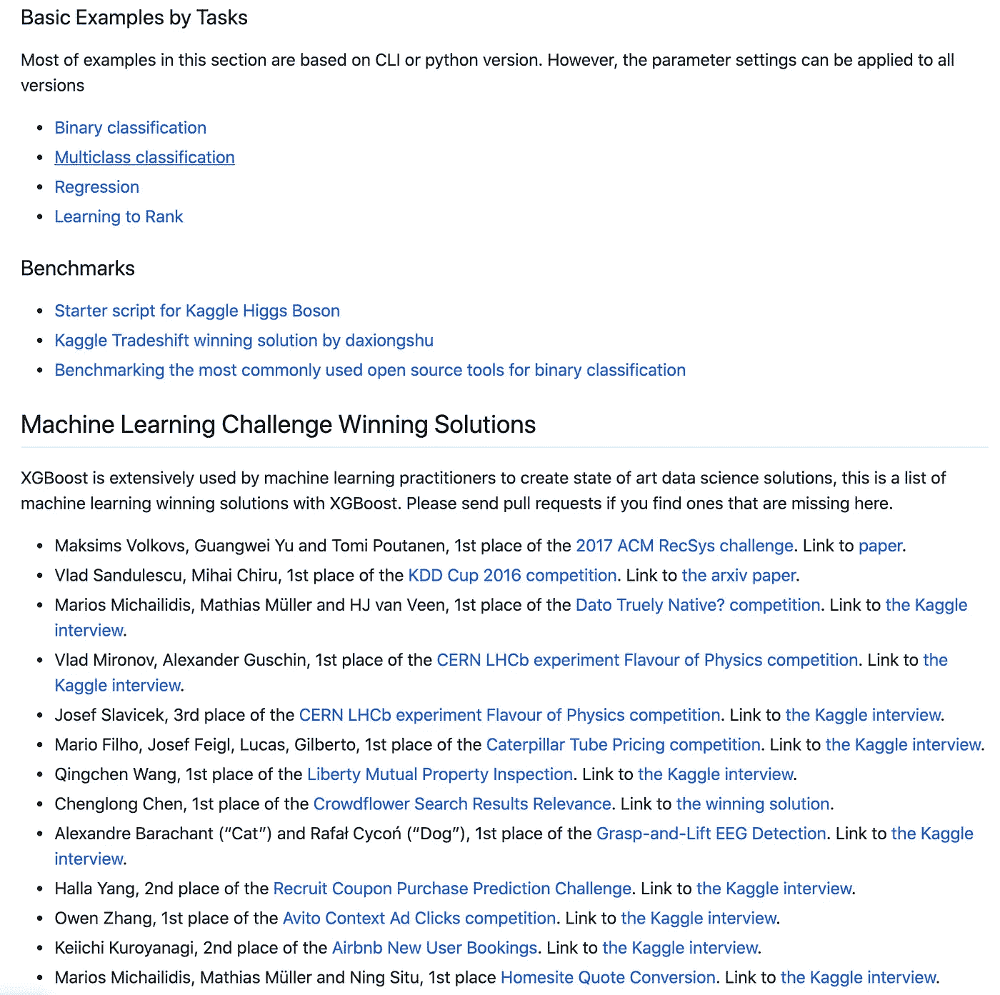
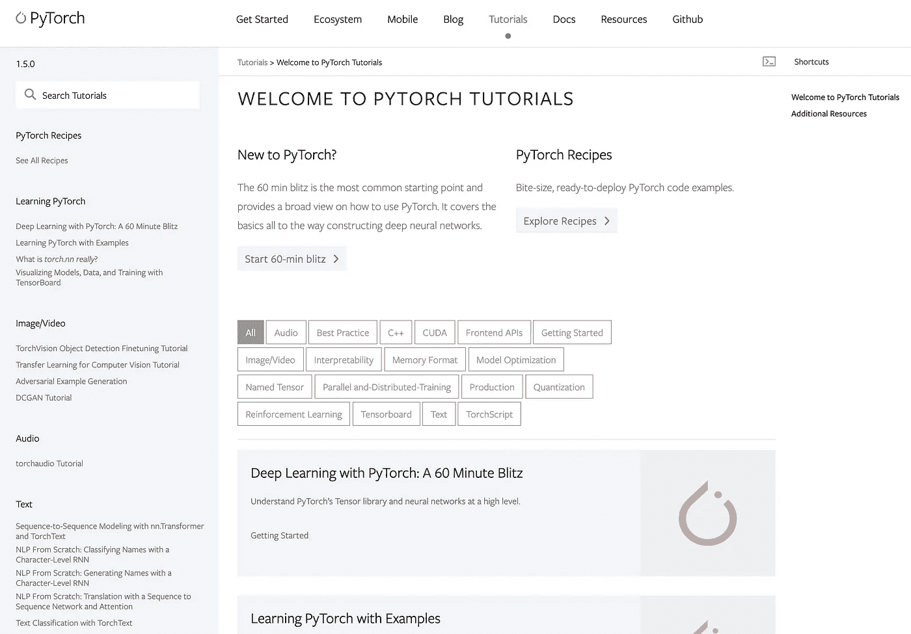
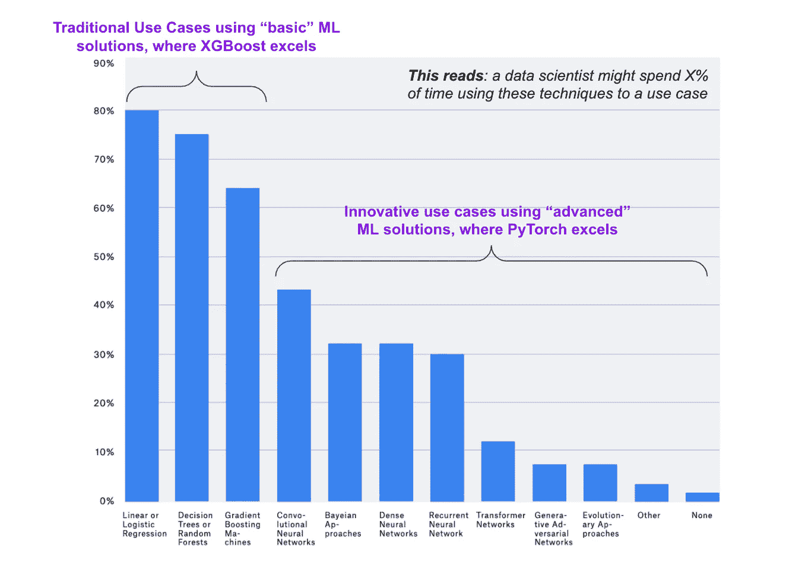

# XGBoost & PyTorch 之战

> 原文：<https://towardsdatascience.com/a-comparison-of-xgboost-pytorch-a87fb1bb267c?source=collection_archive---------44----------------------->

## XGBoost 和 PyTorch 的非技术性比较

在 [Unsplash](https://unsplash.com/s/photos/boxing?utm_source=unsplash&utm_medium=referral&utm_content=creditCopyText) 上[attendee](https://unsplash.com/@attentieattentie?utm_source=unsplash&utm_medium=referral&utm_content=creditCopyText)拍照

**TL；DR** —这篇文章比较了 XGBoost 和 py torch——两个最流行的 ML 库——并讨论了哪一个更好。你可以在现场调查中了解社区的想法。

***免责声明*** *:所有观点都是我的，不代表我雇主的。*我交替使用“算法”、“模型”和“库”。

# 一个选择

在一次虚拟咖啡会上 COVID 期间保持联系的新方式——我最小的表弟正在完成他的数据科学硕士学位，Shawn 问道:**“在 XGBoost 和 PyTorch 之间，我应该学哪个？”**

事实上，我经常遇到同样的问题，甚至当我与有多年行业经验的客户一起工作时。

一方面，XGBoost 帮助赢得了大部分 [Kaggle 比赛](https://www.import.io/post/how-to-win-a-kaggle-competition/)。另一方面，PyTorch 已经被领先的技术和研究公司公认为[最佳图书馆。这两个库在构建质量和活跃的社区支持方面不相上下。](https://openai.com/blog/openai-pytorch/)

如果你有世界上所有的时间、资源和精力，答案显然是“两者都学”。我们大多数人都没有这样的奢侈。在大多数情况下，我建议:从 XGBoost 开始，然后是 PyTorch。

让我们从**三个简单的角度**来看:供给、需求、以及你的情况和愿望。

## 1.供给:**图书馆擅长什么？**

通过设计，XGboost 和 PyTorch 可以有效地解决不同类型的 ML 用例。

XGBoost 对于使用结构化数据的**“传统的”ML 用例**非常有效(例如，使用良好的旧表格数据进行分类或回归)。PyTorch 专为需要神经网络模型架构的非结构化数据(例如，使用图像的生成模型或使用文本的自然语言处理)的**“创新”用例**而构建。每个图书馆的教程页面都反映了这种差异和他们想要的“定位”。

XGBoost 教程关于[牛逼的 XGBoost](https://github.com/dmlc/xgboost/tree/master/demo) ，2020 年 5 月 22 日抓拍

官方 [PyTorch 教程](https://pytorch.org/tutorials/)页，拍摄于 2020 年 5 月 24 日

鉴于 XGBoost 和 PyTorch 的不同优势，我们必须根据实际的 ML 用例进行挑选。

在学习的背景下，我相信一项新技能应该为我们提供**最大限度的即时适用性**(我能即时并频繁地使用它吗？)，这通常会带来更多的职业选择。

## 2.需求:工作中通常需要什么样的 ML 解决方案？

“无聊”和简单的东西。根据最新的 Kaggle 调查(以及我自己与该行业团队合作的经验)，大多数数据科学家将大部分时间花在使用“基本”ML 解决方案解决问题上，如线性回归、决策树或梯度推进。 **XGBoost 擅长这些任务。**

作者基于 2019 年 [Kaggle 调查](https://www.kaggle.com/kaggle-survey-2019)的分析

换句话说，如果你学习并使用 XGBoost，你可以更好更快地解决大部分枯燥的问题。然后，用节省下来的时间，你可以用 PyTorch 做创新的事情(或者只是喝杯咖啡，和家人在一起，或者做其他你喜欢的事情)🙂

## 3.你:你今天在哪里，你的志向是什么？

根据我的[调查](/the-most-realistic-data-science-career-guide-d12c4af87cc8)和一般观察，我们大多数人都在大公司工作，作为默默无闻的英雄——专注于非研究、运营业务问题的数据科学家。

作者的数据和分析

在大公司中，增加价值和获得认可的最直接、最可行的方法是进行渐进式创新。大公司中许多现有的 ML 应用程序是“无聊”的，但却是业务的核心用例；它们由过时和简单的算法驱动，例如使用 Sklearn ( [Kaggle 调查](http://docdroid.com/qzyxCr4/kaggle-state-of-data-science-and-machine-learning-2019-pdf#page=4)和作者的行业经验)的逻辑回归识别客户倾向，或者根据监管和领域经验使用基于规则的定制引擎标记欺诈活动。

用 XGBoost 改进这些应用程序可能会在最短的时间内提供最大的**预期投资回报**,相比之下，比如说，说服你的老板使用花哨的 PyTorch 模型将客户情绪与面部识别结合起来。

总之，如果你喜欢操作问题，并希望在当前的职位上留下来并取得进步，学习 XGBoost(以及类似的算法，如 Light GBM)可以让你立即取得成果，并使你成为一个著名的英雄。

如果你像调查中的许多人一样，希望成为超级极客，专注于研究型项目，仍然学习 XGBoost 以最大化职业选择性，但现在投资 PyTorch。

# 现场调查

这是一个现场社区调查，以捕捉更多人的想法，并消除我的观点和经验的偏见。

***喜欢读什么？*** *与我连线上* [*中*](https://medium.com/@ianxiao) *，*[*LinkedIn*](https://www.linkedin.com/in/ianxiao/)*，或者*[*Twitter*](https://twitter.com/ian_xxiao)*。还有，作为一名数据科学家，要不要学习商业思维和沟通技巧？查看我的《* [*用机器学习影响*](https://www.bizanalyticsbootcamp.com/influence-with-ml-digital) *》指南。*

# 您可能也会喜欢这些文章:

 [## 最有用的 ML 工具 2020

### 每个懒惰的全栈数据科学家都应该使用的 5 套工具

towardsdatascience.com](/the-most-useful-ml-tools-2020-e41b54061c58)  [## 我们应该留在数据科学领域吗？

### 数据科学家的 4 个现实职业选择

towardsdatascience.com](/the-most-realistic-data-science-career-guide-d12c4af87cc8)  [## 下一个最佳数据科学工作

### 数据科学家最受欢迎的过渡路线

towardsdatascience.com](/the-best-data-science-transition-routes-e809254934d0)  [## 被遗忘的算法

### 用 Streamlit 探索蒙特卡罗模拟

towardsdatascience.com](/how-to-design-monte-carlo-simulation-138e9214910a)  [## ML 和敏捷注定的联姻

### 如何不对 ML 项目应用敏捷

towardsdatascience.com](/a-doomed-marriage-of-ml-and-agile-b91b95b37e35)  [## 优步的机器学习让我失望

### 实时对抗优步黑客&给优步的建议

towardsdatascience.com](/how-to-improve-uber-machine-learning-c83051d6e57f)