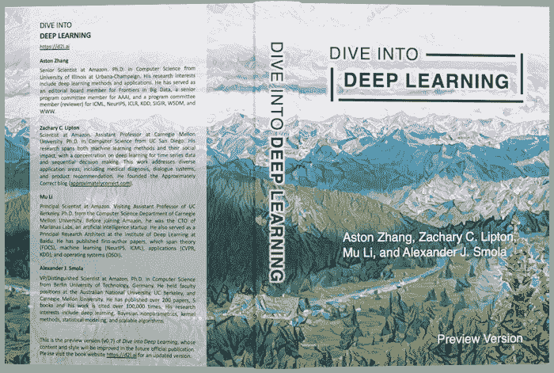
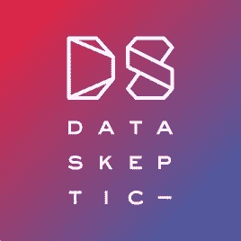

# 免费数据科学资源汇编

> 原文：<https://towardsdatascience.com/a-compilation-of-free-data-science-resources-7861f572cc85?source=collection_archive---------22----------------------->

## 自定进度学习

## 对于那些对学习数据科学感兴趣的人

想自学数据科学？不知道从哪里开始？或者，也许你想加深对某些话题的理解？继续读。

我已经按照媒体类型对免费资源的汇编进行了分类，其中一些可能包含统计、数据分析、python、机器学习和/或深度学习等主题的混合。我将说明(只要适用)何时资源仅用于一个特定的数据科学主题。也有很多网站可以帮助你学习/练习 R、Python、SQL 等语言的编码技巧。(HackerRank 是一个有趣的工具)，但本文将更侧重于帮助您学习数据科学概念以及如何在数据分析/机器学习应用程序中使用编码语言的工具。

快乐学习！

# 网站

## [数据科学 101](https://101.datascience.community/tag/free/)

这个网站有非常棒的资源档案(这个部分的标题直接链接到免费的资源)。从**的教科书到常春藤联盟的课程笔记到博客文章**，你可以从数据科学 101 中学到很多东西。

## 开源代码库

由[卢克·切瑟](https://unsplash.com/@lukechesser?utm_source=medium&utm_medium=referral)在 [Unsplash](https://unsplash.com?utm_source=medium&utm_medium=referral) 拍摄的照片

GitHub 奇妙的协作精神导致了**数据科学博客**的[这个巨型列表](https://github.com/rushter/data-science-blogs)。这里有大量的博客，所以我会确保你选择阅读/关注的博客是可信的。

## [宾州州立大学在线统计](https://online.stat.psu.edu/stat414/)

在您开始学习数据科学之前，这份在线课程材料对于学习基础统计学非常有用。我收藏了好几页宾夕法尼亚州立大学的书作为参考。

## [Udemy 上的免费机器学习课程](https://www.udemy.com/topic/machine-learning/free/?utm_source=adwords&utm_medium=udemyads&utm_campaign=DSA_Catchall_la.EN_cc.US&utm_content=deal4584&utm_term=_._ag_95911180068_._ad_420432380638_._kw__._de_c_._dm__._pl__._ti_dsa-392284169515_._li_9029015_._pd__._&matchtype=b&gclid=CjwKCAjwvZv0BRA8EiwAD9T2VYlcfUpi4RhjpbH9TeqFfEtbGek0Y-qU21ZI_z44sfnDzWKfCmGeEhoCW1QQAvD_BwE)

哇！本页有很多关于机器学习的免费课程。我建议看看评价最高的，也看看评论，找到一个适合你的需求。

# 开源教科书

## [用于数据分析的 Python](https://bedford-computing.co.uk/learning/wp-content/uploads/2015/10/Python-for-Data-Analysis.pdf)

老实说，我不相信这本书是免费的。在 Python 中，使用 **Pandas 和 NumPy 库进行数据分析非常深入**。还有一个 GitHub 库,里面有 Jupyter 笔记本，每一章都有练习的答案！****

## [深入学习](https://d2l.ai/)

开源，找到贡献者[这里](https://d2l.ai/index.html)。

我本人没有读过这本书，但它是我的数据科学导师推荐给我的。它的格式*非常好*,带有讨论板和 GitHub 上补充代码的链接。主题包括**多种类型的神经网络、优化算法&计算性能、自然语言处理、推荐系统等等**。当我有时间的时候，我很高兴能读完这本书。

# 播客

来自[dataskeptic.com](https://dataskeptic.com/)

## [**数据怀疑论者**](https://dataskeptic.com/)

这是我听过的唯一一个数据科学播客，但它太有趣了！对于主持人来说，现在的一大焦点是机器学习的可解释性，但他也在他的最新章节中涵盖了其他相关主题(如对抗性神经网络和伦理算法设计)。有些插曲对我来说有点太深入了，但总体来说，它加深了我对该领域热门话题的理解，并有助于增加我对数据科学的热情。([数据怀疑论者](https://medium.com/u/6529d0283370?source=post_page-----7861f572cc85--------------------------------))

# 其他的

## 数据科学会议

上[meetup.com](https://www.meetup.com/)网站，搜索你所在地区的数据科学会议(这主要适用于那些生活在大城市或大城市附近的人)*。我住在丹佛附近，我参加了一个为数据科学领域的[女性举办的名为“代码和咖啡”的聚会这是一个与其他女性讨论数据科学的美好时光，这些女性要么已经在这个领域工作，要么希望进入这个领域。这个团队的领导者非常棒——他们真心希望帮助其他女性实现职业目标或她们的副业项目。](https://www.meetup.com/data-science-women/)

* *由于冠状病毒疫情，目前没有安排见面会。但是，您仍然可以在他们的页面上搜索组。*

就我在本文中包含的链接数量而言，有些链接肯定会在某个时候过期或更改。如果您发现某个链接不再有效，请在下面发表评论。此外，请随意评论您自己喜欢的免费资源，这些资源不在此列表中！

所有没有注明出处的图片都是我自己在 canva.com 制作的。