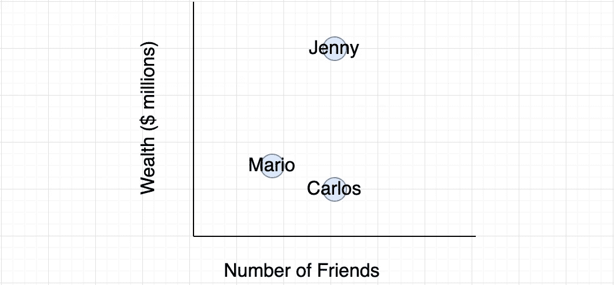
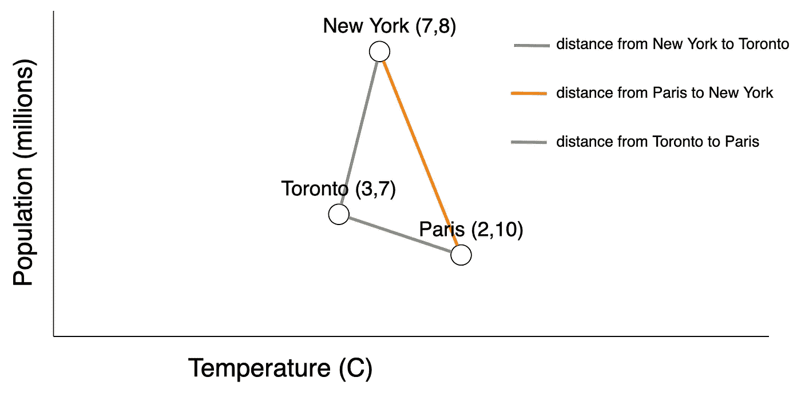
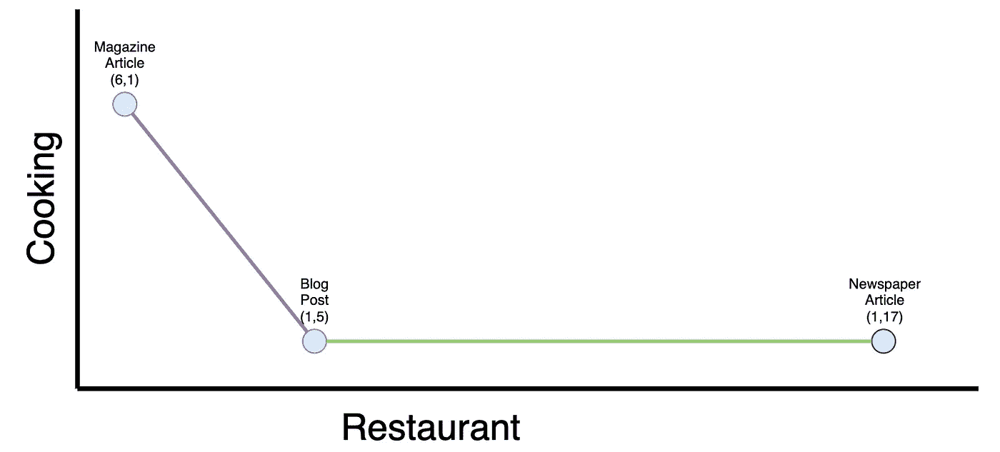
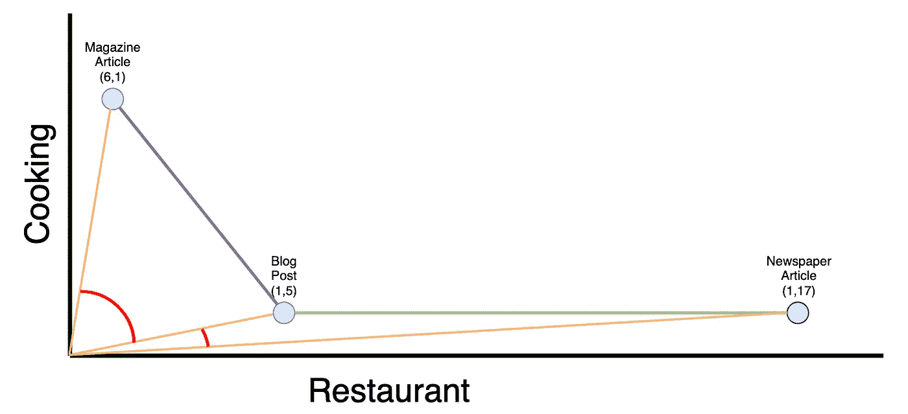
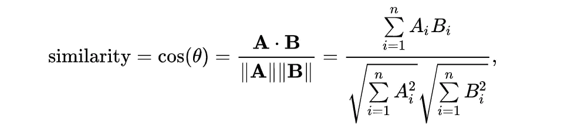
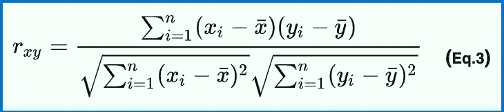

# 文档相似性算法初学者完全指南

> 原文：<https://towardsdatascience.com/a-complete-beginners-guide-to-document-similarity-algorithms-75c44035df90?source=collection_archive---------18----------------------->

## 了解欧几里得距离、余弦相似度和皮尔逊相关度背后的代码和数学，为推荐引擎提供动力


照片由[泰勒·尼克斯](https://unsplash.com/@jtylernix?utm_source=unsplash&utm_medium=referral&utm_content=creditCopyText)在 [Unsplash](https://unsplash.com/?utm_source=unsplash&utm_medium=referral&utm_content=creditCopyText) 上拍摄

我已经在产品中部署了一些推荐系统。毫不奇怪，最简单的被证明是最有效的。

大多数推荐系统的核心是协同过滤。协同过滤的核心是文档相似性。

我们将介绍计算文档相似性的 3 种算法。

1)欧几里德距离
2)余弦相似度
3)皮尔逊相关系数

即使是对它们如何工作的一般直觉也会帮助你选择合适的工具来工作，并建立一个更智能的引擎。

# **这些算法的共同点**

在我们讨论算法时，请记住这些警告。

1.  计算在对象的[矢量表示上进行。每个对象必须首先转换成一个数字向量。](/lets-understand-the-vector-space-model-in-machine-learning-by-modelling-cars-b60a8df6684f)
2.  一次计算一对向量之间的相似性/距离。
3.  无论算法如何，特征选择都会对结果产生巨大影响。

# 欧几里得距离

## 简单地

欧几里德距离是多维空间中两点之间的距离。



更近的点彼此更相似。进一步的点彼此更不同。所以以上，马里奥和卡洛斯比卡洛斯和珍妮更相似。

我有意选择了二维(又名。特点:【财富，朋友】)因为容易剧情。我们仍然可以计算超过 2 维的距离，但是需要一个公式。

直观上，这种方法作为距离测量是有意义的。您将文档绘制成点，并且可以用尺子测量它们之间的距离。

## **用欧几里德距离比较城市**

让我们比较三个城市:纽约、多伦多和巴黎。

多伦多= `[3,7]`
纽约= `[7,8]`
巴黎= `[2,10]`

特征向量包含两个特征:`[population, temperature]`。人口以百万计。温度单位是摄氏度。

现在，因为我们再次将问题框定为二维，我们可以用尺子测量点之间的距离，但我们将使用这里的公式。



无论是 2 维还是 1000 维，该公式都适用。

## 在 Python 中实现欧几里德距离

没有人比我更讨厌数学符号，但下面是欧几里得距离的公式。


原谅我的徒手画

让我们写一个函数来实现它并计算两点之间的距离。

```
from math import sqrtdef euclidean_dist(doc1, doc2):
    '''
    For every (x,y) pair, square the difference
    Then take the square root of the sum
    '''
    pre_square_sum = 0
    for idx,_ in enumerate(doc1):
        pre_square_sum += (doc1[idx] - doc2[idx]) ** 2

    return sqrt(pre_square_sum) toronto = [3,7]
new_york = [7,8] euclidean_dist(toronto, new_york)
#=> 4.123105625617661
```

好吧。多伦多和纽约之间的距离是`4.12`。

## 使用 Sklearn 的欧几里德距离

我们上面写的函数效率有点低。Sklearn 使用 Numpy 实现了一个更快的版本。在生产中，我们只用这个。

```
toronto = [3,7]
new_york = [7,8]import numpy as np
from sklearn.metrics.pairwise import euclidean_distancest = np.array(toronto).reshape(1,-1)
n = np.array(new_york).reshape(1,-1)euclidean_distances(t, n)[0][0]
#=> 4.123105625617661
```

注意，它需要数组而不是列表作为输入，但是我们得到了相同的结果。布雅！

# 余弦相似性

## 简单地

余弦相似度是多维空间中两点之间夹角的余弦。角度越小的点越相似。角度越大的点差别越大。

虽然难以理解，余弦相似性解决了欧几里德距离的一些问题。即大小。



一篇文章中提到“烹饪”和“餐馆”的次数

在上图中，我们根据三个文档包含单词“cooking”和“restaurant”的次数来比较它们。

欧几里德距离告诉我们博客和杂志比博客和报纸更相似。但我认为这是误导。

博客和报纸可以有相似的内容，但在欧几里得意义上是遥远的，因为报纸更长，包含更多的单词。

在现实中，他们都更多地提到“餐馆”而不是“烹饪”,可能彼此更相似。余弦相似度不属于这个陷阱。

## **用余弦相似度比较书籍和文章**

让我们完成上面的例子。我们将基于特定单词的计数来比较文档

```
magazine_article = [7,1]
blog_post = [2,10]
newspaper_article = [2,20]
```



我们现在从原点开始，取它们之间角度的余弦，而不是取它们之间的距离。现在，即使只是目测，博客和报纸看起来更相似。

## 在 Python 中实现余弦相似性

注意余弦相似度不是角度本身，而是角度的余弦。因此，较小的角度(小于 90 度)返回较大的相似性。



[https://en.wikipedia.org/wiki/Cosine_similarity](https://en.wikipedia.org/wiki/Cosine_similarity)

让我们自己实现一个函数来计算这个。

```
import numpy as np
from math import sqrtdef my_cosine_similarity(A, B):
    numerator = np.dot(A,B)
    denominator = sqrt(A.dot(A)) * sqrt(B.dot(B))
    return numerator / denominator

magazine_article = [7,1]
blog_post = [2,10]
newspaper_article = [2,20]m = np.array(magazine_article)
b = np.array(blog_post)
n = np.array(newspaper_article)

print( my_cosine_similarity(m,b) ) #=> 0.3328201177351375
print( my_cosine_similarity(b,n) ) #=> 0.9952285251199801
print( my_cosine_similarity(n,m) ) #=> 0.2392231652082992
```

现在我们看到，博客和报纸确实更加相似。

## 与 Sklearn 的余弦相似性

在生产中，我们最好导入 Sklearn 更高效的实现。

```
from sklearn.metrics.pairwise import cosine_similaritym = np.array(magazine_article).reshape(1,-1)
b = np.array(blog_post).reshape(1,-1)
n = np.array(newspaper_article).reshape(1,-1)print( cosine_similarity(m,b)[0,0] ) #=> 0.3328201177351375
print( cosine_similarity(b,n)[0,0] ) #=> 0.9952285251199801
print( cosine_similarity(n,m)[0,0] ) #=> 0.2392231652082992
```

相同的价值观。太好了！

# 皮尔逊相关

这通常量化了两个变量之间的关系。比如教育和收入。


完全虚构的数据

但是我们也可以用它来度量两个文档之间的相似性，我们将第一个文档的向量视为`x`，将第二个文档的向量视为`y`。

因为皮尔逊相关系数`r`返回 1 和-1 之间的值，所以皮尔逊距离可以计算为`1 — r`以返回 0 和 2 之间的值。

## 用 Python 实现皮尔逊相关系数

让我们自己实现这个公式来理解它是如何工作的。



[https://en . Wikipedia . org/wiki/皮尔逊相关系数](https://en.wikipedia.org/wiki/Pearson_correlation_coefficient)

我们将生成一些代表少数人的假数据。我们将基于三特征向量来比较它们有多相似。

```
emily = [1,2,5]
kartik = [1,3,5]
todd = [5,3,5]
```

我们的实现。

```
import numpy as npdef pearsons_correlation_coef(x, y):
    x = np.array(x)
    y = np.array(y)

    x_mean = x.mean()
    y_mean = y.mean() x_less_mean = x - x_mean
    y_less_mean = y - y_mean

    numerator = np.sum(xm * ym)
    denominator = np.sqrt(
        np.sum(xm**2) * np.sum(ym**2)
    )

    return r_num / r_denpearsons_correlation_coef(emily,kartik)
#=> 0.9607689228305226
```

酷毙了。艾米莉和卡蒂克看起来很相似。我们一会儿将把这三个和 Scipy 进行比较。

## 皮尔逊相关系数与 Scipy

Scipy 实现了一种更高效、更健壮的计算。

```
emily = [1,2,5]
kartik = [1,3,5]
todd = [5,3,5]pearsonr2(emily,kartik)print( pearsonr2(emily, kartik) ) 
#=> (0.9607689228305226, 0.1789123750220673)
print( pearsonr2(kartik, todd) ) 
#=> (0.0, 1.0)
print( pearsonr2(todd, emily) ) 
#=> (0.27735009811261446, 0.8210876249779328)
```

虽然我选择了随机数作为数据点，但我们可以看到艾米丽和卡蒂克比艾米丽和托德更相似。

# 结论

虽然我们已经解决了这个难题的一部分，但是通往完全成熟的推荐器的道路还没有完成。

在电子商务引擎的上下文中，我们接下来将构建每对用户之间的相似性得分矩阵。然后我们可以用它来推荐相似用户购买的产品。

也就是说，一个好的推荐系统可能还包含基于领域的规则和用户偏好。