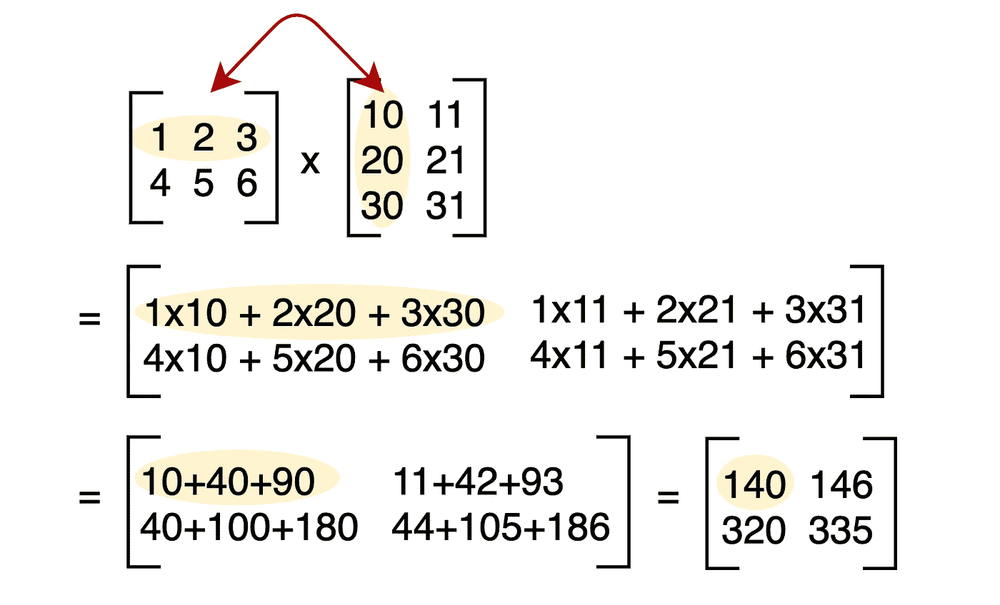
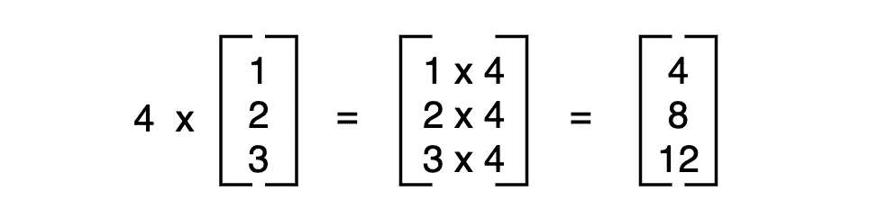
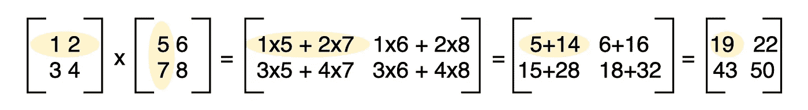
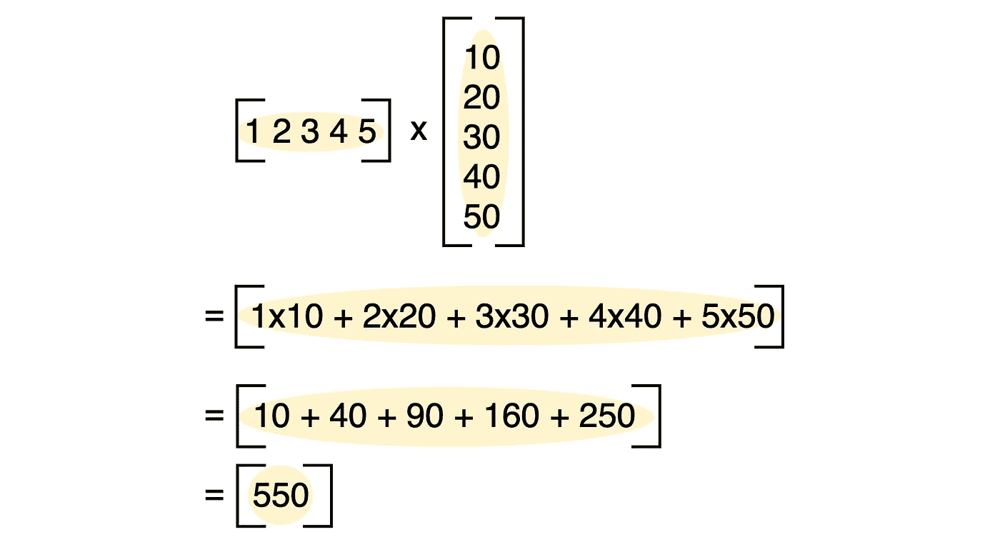

# Python Numpy 数据科学矩阵乘法初学者完全指南

> 原文：<https://towardsdatascience.com/a-complete-beginners-guide-to-matrix-multiplication-for-data-science-with-python-numpy-9274ecfc1dc6?source=collection_archive---------7----------------------->

## 通过 Python 示例学习机器学习的矩阵乘法



线性代数是从逻辑回归到深度神经网络的机器学习的基础。

如果你从事数据科学已经有一段时间了，但是不理解它背后的数学，矩阵乘法是最好的起点。它平易近人，实用，让你熟悉机器学习的数学对象:标量，向量和矩阵。

哦，是的，Numpy 在公园里散步。

到本文结束时，您将对矩阵乘法有一个实际的理解。

# 什么是矩阵

这里我们将对比矩阵和标量。


一个**矩阵**是一个 2D 数组，其中数组中的每个元素有 2 个索引。比如`[[1, 2], [3, 4]]`是一个矩阵，`1`的索引是(0，0)。

我们可以用 Python 和 Numpy 来证明这一点。

```
import numpy as npA = [[1, 2], 
     [3, 4]]np.array(A)**[0,0]**
=> 1
```

当谈到矩阵的形状时，我们说“行 x 列”。我们会说下面的第一个矩阵的形状是 2x2，第二个矩阵的形状是 3x2。

```
[[1, 2], 
 [3, 4]][[10, 20],
 [11, 21],
 [12, 22]]
```

相比之下，**标量**只是一个数字，就像数字`5`一样。

# 标量乘法

矩阵乘法的简单形式叫做**标量乘法**，将一个标量乘以一个矩阵。


标量乘法一般很容易。输入矩阵中的每个值都乘以标量，输出与输入矩阵的形状相同。

让我们用 Python 的 Numpy 来做上面的例子。

```
a = 7
B = [[1,2],
     [3,4]]np.dot(a,B)=> array([[ 7, 14],
=>        [21, 28]])
```

再举一个标量乘法的例子。这次是一个标量乘以一个 3×1 矩阵。



在 Numpy。

```
a = 4 
B = [[1],[2],[3]]np.dot(a,B)=> array([[ 4],
=>        [ 8],
=>        [12]])
```

标量乘法的顺序无关紧要。“标量 x 矩阵”和“矩阵 x 标量”给出了相同的结果。**但当两个矩阵相乘时就不一样了**。

# 矩阵乘法

现在到了有趣的部分。将 2D 矩阵乘以 2D 矩阵。



有几件事需要记住。

1.  现在秩序很重要。`AB != BA`
2.  如果第一个矩阵的列数等于第二个矩阵的行数，则矩阵可以相乘
3.  乘法是行和列的点积。第一个矩阵的行和第二个矩阵的列

## 示例 1

在上图中，输出矩阵的(0，0)索引中的`19`是第一个矩阵的**第一行和第二个矩阵**的**第一列的点积。**

让我们用 Python 复制这个结果。

```
A = [[1,2],
     [3,4]]B = [[5,6],
     [7,8]]np.dot(A,B)=> array([[19, 22],
=>        [43, 50]])
```

让我们反复强调秩序这一点。试试`np.dot(A,B)`再试试`np.dot(B,A)`。

```
np.dot(A,B)
=> array([[19, 22],
=>        [43, 50]])np.dot(B,A)
=> array([[23, 34],
=>        [31, 46]])
```

现在请注意输出是如何不同的！你会发现在纸上计算它会得到同样的结果(如果你不熟悉矩阵的话，这是很不直观的)。

## 示例 2

现在我们将一个 2×3 的矩阵乘以一个 3×2 的矩阵。


而在 Python 中用 Numpy。

```
A = [[1,2,3],
     [4,5,6]]B = [[10,11],
     [20,21],
     [30,31]]np.dot(A,B)=> array([[140, 146],
=>        [320, 335]])
```

## 示例 3

最后一个例子。将 1×5 乘以 5×1 矩阵。



请注意，我们在这里做的所有计算都只是返回输出矩阵中的一个单元格。

同样，在 Python 中。

```
A = [[1,2,3,4,5]]B = [[10],
     [20],
     [30],
     [40],     
     [50]]np.dot(A,B)=> array([[550]])
```

这涵盖了矩阵乘法的 3 种独特情况，应该能让你对它的工作原理有一个大致的了解。我在图表的每一步都展示了所有的计算，所以你很容易理解。

# 结论

矩阵乘法(和线性代数)是深度学习和机器学习的基础。

虽然你不需要它来即插即用 Sklearn，但对它的工作原理有一个清晰的印象将有助于你理解它的模型。有了这种理解，就可以更高效地调整这些模型，以获得更好的性能。