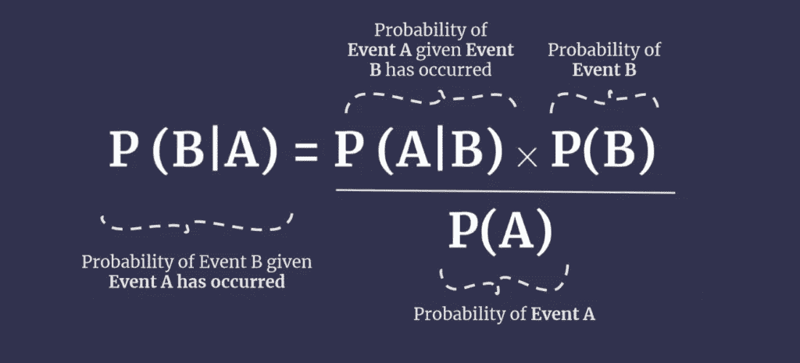
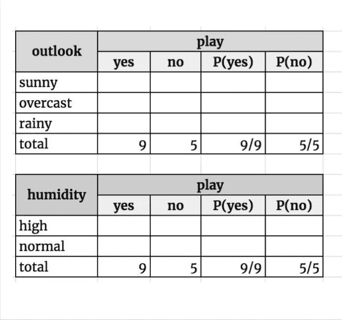
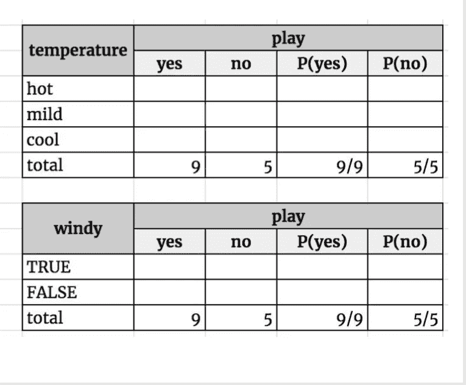
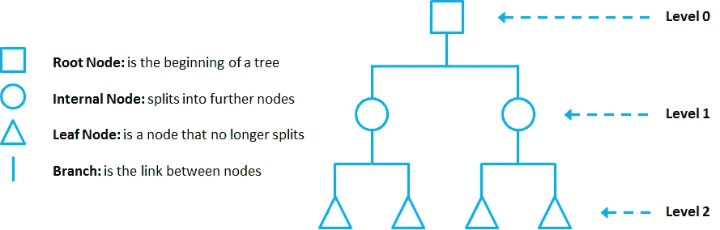
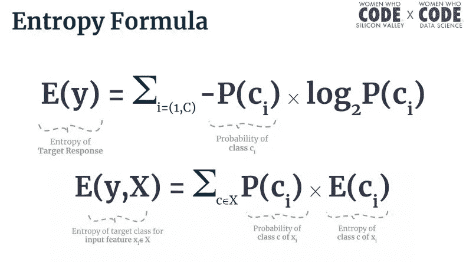
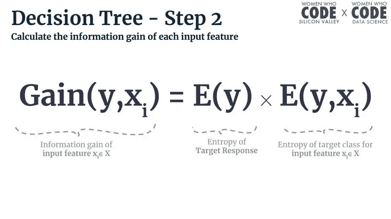
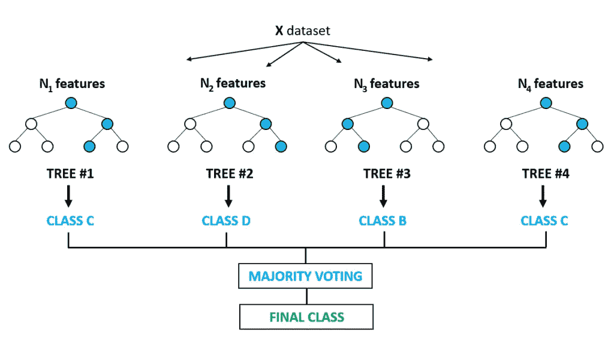

# 使用分类的机器学习完全入门

> 原文：<https://towardsdatascience.com/a-complete-beginners-introduction-to-machine-learning-using-classification-c2ab1cfa7093?source=collection_archive---------45----------------------->

[真诚媒体](https://unsplash.com/@sincerelymedia?utm_source=unsplash&utm_medium=referral&utm_content=creditCopyText)在 [Unsplash](https://unsplash.com/s/photos/girl-laptop?utm_source=unsplash&utm_medium=referral&utm_content=creditCopyText) 上拍摄的照片

*如果你对数据科学、人工智能或机器学习领域感兴趣，但不知道该去哪里或做什么，那就别再找了。如果你想在大考或面试前温习你的 ML 技能，你来对地方了。这个关于机器学习的介绍，会涉及到行业内数据科学家每天使用的一些最流行的机器学习算法。到本文结束时，您应该会对机器学习的概念更加熟悉，并觉得有能力大胆尝试一些自己的模型。*

# 机器学习基础

> 我们实施算法不是因为它们存在，我们实施算法是因为它们适合我们正在处理的数据。
> 
> *-苏马纳·拉维克里希南*

1.  机器学习历史

*   信不信由你，人工智能和机器学习的想法首次出现在 20 世纪 50 年代，当时艾伦·图灵引入了图灵测试的概念。投入人工智能的时间和金钱一直在波动，但人们对这个主题的兴趣空前高涨。

2.机器学习的类型

*   监督学习:您的模型正在从您试图预测的结果中获得的示例数据中学习(想想 x 值和 y 值)。这意味着您已经对目标以及它如何处理输入数据有了概念。
*   无监督学习:你的模型是从只有输入数据(基本上是没有 y 值的 x 值)的例子数据中学习的。因此，模型必须依靠自己的算法来检测观察值之间的模式。
*   半监督学习:您的模型正在从带有“半监督”数据和“半非监督”数据(一些 x 值有 y 值，一些没有)的示例数据中学习。
*   强化学习:你的模型正在从你试图预测的结果中获得的样本数据中学习——但是，该模型也从它在预测过程中收到的正面/负面反馈中学习。这种类型的学习与尝试和错误的想法有关。

3.监督学习的类型

*   有两种主要类型的监督学习，分类和回归。尊重上面 Sumana 给出的建议并选择适合您正在处理的数据的算法是很重要的。这将决定你使用哪一种。
*   分类:目标反应，或 y，是绝对的。例如，这可能是一个需要预测测试结果(通过/失败)、天气类型(晴天/下雨/刮风)或大学年份(大一/大二等)的模型。
*   回归:目标响应，或 y，是连续的或数字的。在这种情况下，这可能是一个可以预测美元年薪或千克体重的模型。

4.假设检验

*   假设检验由两个假设组成:零假设和替代假设。
*   当我们进行假设检验时，我们从检验中得到的驱动我们最终决策的可量化结果被称为 p 值。
*   显著性水平，或者我们希望在测试准确性上给自己留的回旋余地，被称为 alpha。
*   这种检验的目的是探索零假设是否成立，或者正在讨论的数据是否提供了足够的信息，使我们能够拒绝零假设并接受替代假设。

> 数据本身并不有趣。我们真正感兴趣的是对数据的解释。
> 
> *——苏马纳·拉维克里希南*

# 朴素贝叶斯分类

1.  分类

*   分类是监督学习的一种形式，旨在预测分类变量(职业、团队名称、颜色等)。)

2.条件概率

*   条件概率用于计算两个或更多相关事件发生的概率。
*   相关事件是其结果相互之间有某种影响的事件
*   例如，一个人从一副牌中抽出一张 k 和一张 8 的概率
*   这个事件是相关的，因为取出一张牌会使牌堆变小，并且在第二次尝试时更容易得到你想要的那张牌。

3.贝叶斯定理

*   在许多情况下，科学家需要知道一个事件发生的可能性。此外，他们通常有以前事件的数据来帮助他们的计算。贝叶斯定理来了，计算某个事件的概率，事件 B，给定一个已经发生的事件，事件 a。
*   通过使 P (B|A)和 P (A|B)相等，并做一些重新排列，贝叶斯定理的公式变成:

照片由 WWCode 数据科学公司提供

4.朴素贝叶斯

*   使用朴素贝叶斯时，您正在处理的数据集应分成两部分:
*   要素(x)-数据集中会以某种方式影响结果变量的列。把这些想象成一堆潜在的“事件作为”。
*   类变量(y)-数据集中我们试图预测或分类的列。将这些视为潜在的“事件 Bs”。
*   你可能在想——为什么贝叶斯如此天真？这是因为该定理的这个特定版本假设数据集的每个要素都是独立的(意味着一个要素对另一个要素没有影响)。
*   要使用朴素贝叶斯公式，您需要做的就是将表格数据转换为一个或多个列联表，这只是一个包含每个类别计数的表。这些计数将在适当的时候代入公式。

照片由 WWCode 数据科学公司提供

5.朴素贝叶斯变异

*   朴素贝叶斯算法有许多变体，对于某些数据集来说非常方便。

高斯朴素贝叶斯

*   当您有连续的数字特征时，您可以利用高斯朴素贝叶斯算法来预测分类结果。

多项式朴素贝叶斯

*   当您有一堆文本数据要用来预测分类结果时，此算法非常有用。
*   多项式朴素贝叶斯在计算中使用词频来进行预测。

贝叶斯网络

*   当您想要更复杂地调查特征子集之间的条件概率时，贝叶斯网络很有帮助。

# 决策树和随机森林分类

1.决策树

*   决策树是一种分类算法，它从数据集中学习一组规则，并使用它们进行预测。
*   决策树就像一个流程图。

照片由 WWCode 数据科学公司提供

*   一个根节点(正方形)和一个内部节点(圆形)都代表将要被询问的某种问题。天气晴朗吗？湿度是高、中还是低？
*   分支(线)表示在根或叶节点处对问题的回答。答案决定了您从一个节点沿着哪个分支前进。是的，是晴天还是不是，不是晴天。
*   叶节点(三角形)表示对正在讨论的数据点的最终预测。因为天气晴朗，湿度低，我们预测高尔夫球比赛将会举行。
*   通过观察熵和信息增益这两个度量来构建决策树，这将在下面解释。

2.熵

*   熵基本上是数据样本中不确定性的度量。
*   可以这样想，如果你的数据集中所有 100 场高尔夫比赛都进行了，并且没有一场被取消，那么熵值很低…因为你对这场比赛是否会进行的怀疑很低。
*   如果你的数据集中有 100 场高尔夫比赛，其中 50 场进行了，50 场取消了，这就是高熵。你对下一场比赛有很高的怀疑，因为数据是“命中或错过”。
*   这个过程需要两个熵公式——目标响应的熵(上图)和给定某个特征 X 的目标响应的熵(下图)。

照片由 WWCode 数据科学公司提供

3.信息增益

*   信息增益描述了我们通过向决策树添加节点来了解数据集的知识量。
*   这里有一个真实的例子——假设下周有一场高尔夫球比赛。如果我们知道会下雨，那么我们的预测就会有很大的不同，因为下雨对高尔夫比赛取消有很大的影响。知道是否在下雨会产生很高的信息增益。
*   信息增益的公式使用上面的公式。(这是有道理的，因为随着我们降低不确定性，我们获得了信息。)

照片由 WWCode 数据科学公司提供

4.建造圣诞树

*   基本上，构建决策树的过程是这样的:计算数据样本中每个特征的潜在信息增益。选择具有最高信息增益的一个作为当前节点中的“决策”特征。对其余特征重复计算。
*   一旦您的所有分支都指向一个叶节点(这意味着最终决策)，您就可以停止。

5.优点和缺点

*   决策树易于理解和解释，这使它们成为进行预测的直观方式。
*   此外，它们是朴素贝叶斯的升级，因为特性并不被认为是同等重要的。决策树的整个思想是把最重要的特征放在第一位。
*   然而，当类别标签开始增长时，决策树具有昂贵且复杂的计算。此外，他们无法估计缺失的数据。
*   最后，决策树容易过度拟合，因为它们总是偏向于具有更多样本的类值。例如，如果您的数据样本中有 100 场高尔夫比赛，其中 87 场比赛的湿度较低，那么低湿度可能会导致比赛无法进行。

6.克服决策树的缺点

*   减少决策树缺点的两种方法是剪枝和集成学习。
*   修剪一棵树就是删除那些几乎没有预测能力的节点和分支。我们可以将这些分支视为“边缘情况”或“随机噪声”，因此切断它们可以减少过度拟合。
*   集成学习是将多个“弱”机器学习模型放在一起以形成一个大型、性能更好的学习单元的过程。

7.随机森林

*   随机森林是一种用于决策树的特定类型的集成学习。
*   模型建立在数据的随机子集上，每个模型只关注特征的随机子集。
*   每个单独的树(或“弱学习者”)将做出预测。森林中投票最多的结果将成为真正的预测。

照片由 WWCode 数据科学公司提供

我希望你喜欢这本初学者分类指南。如果你有兴趣将这些知识付诸实践，你可以看看为数据科学 Github 编写代码的[女性，在那里她们有我们上面提到的每种机器学习算法的 Python 笔记本。](http://bit.ly/introtoml-github)

这篇文章是由从事数据科学编程的女性在为期六周的机器学习入门课程中发表的博文汇编而成。该系列的第一篇帖子最初发表于 2020 年 5 月 17 日[*https://data dreamer . io*](https://datadreamer.io/2020/05/17/introduction-to-machine-learning-by-wwcode-data-science-part-1-recap/)*。*