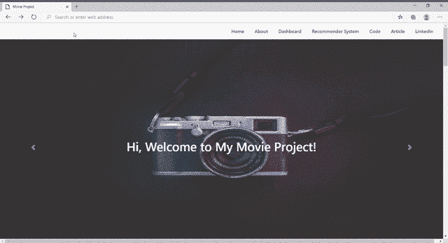
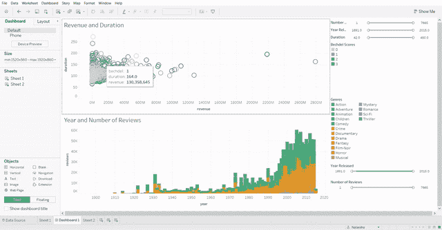
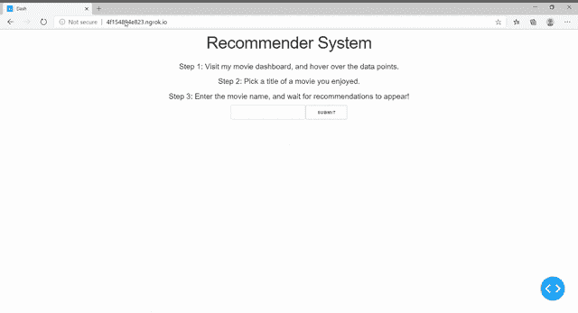

# 完整的数据科学组合项目

> 原文：<https://towardsdatascience.com/a-complete-data-science-portfolio-project-ebbced35ea84?source=collection_archive---------5----------------------->

## 我最新的端到端数据科学项目概述

马库斯·温克勒在 [Unsplash](https://unsplash.com/s/photos/resume?utm_source=unsplash&utm_medium=referral&utm_content=creditCopyText) 上的照片

在这篇文章中，我想展示我的**有史以来最简单的数据科学项目**。

过去，我花了数小时训练一个复杂得多的模型，并努力寻找正确的参数来创建机器学习管道。

尽管很简单，但如果我只能在简历上展示一个项目，那就是这个项目。

我来解释一下原因。

## 包装决定礼物的价值吗？

小时候，我总是对假期感到兴奋，因为我可以得到礼物。就迁就我一下吧，我保证我确实有道理。我阿姨送给我这件漂亮的衣服，也许比我那天收到的任何礼物都漂亮。

但问题是——我甚至不想打开它。她用报纸破旧地包了起来，在我看到里面的东西之前，礼物似乎已经失去了一半的价值。

回答上面的问题，**没有**。包装绝不决定礼物的价值。

然而，它可以极大地影响你对里面东西的期望，并改变你对它的看法。

**你花数周时间训练的机器学习模型很棒。证明一下。不要让它们死在你的笔记本里。**

招聘人员有数百份简历要看。他们几乎不可能通读你在 GitHub 上的所有代码，理解你所有的项目。

要想脱颖而出，你需要做一些稍微不同的事情。创造一个他们可以互动的界面。也许他们可以玩一个实时仪表盘。

即使它不是最好的仪表板或界面，它也会引起人们的兴趣，因为你创造了他们实际上可以使用的东西。

我正是想这样做，这就是为什么我想出了这个投资组合项目。在接下来的几节中，我将详细解释我做了什么，而不会过多涉及技术细节。

# 目标

我的目标是展示以下领域的技能:

*   数据收集
*   数据争论
*   数据可视化
*   机器学习
*   Web 开发

为此，我在项目中创建了以下组件:

*   前端接口
*   电影仪表板
*   电影推荐系统

我将详细解释和演示每个组件。

*注意:如果你不想通读整篇文章，只想看一看最终产品，只需向下滚动，看一看“* ***链接*** *”部分。*

# 前端接口

过去，我会创建项目，让代码放在我的 GitHub 存储库中。我偶尔写一篇文章来解释 Medium 上的项目。

在这里，我采取了不同的方法。

我创建了一个网页，并解释了我的项目的不同组成部分。我简要地写了用户如何与我创建的系统交互，并放上了我的代码和媒体文章的链接。

整个项目可以通过一个页面来理解和访问，这使得人们更容易参与其中。

你可以[在这里](https://natassha.github.io/movie_project/) — *查看笔记本电脑或个人电脑上的网站，以获得更好的用户界面体验。*

# 电影仪表板

接下来，我用 Tableau 创建了一个电影仪表盘。

涉及的步骤:

## 数据收集

我不得不从各种不同的地方收集数据。我还想可视化这些电影的 Bechdel 分数(*衡量好莱坞女性代表性的指标*)，所以我使用了一个 API 来获取这些数据。

## 数据争论

我清理了数据并将数据集合并在一起。一旦我完成了，我终于可以想象它了！

## 数据可视化

令人惊讶的是，与这个项目的其他部分相比，这占据了我很大一部分时间。

我花了两天时间试图创建一个视觉上吸引人的仪表板。

我用 Python Dash 应用程序创建了一个。我对布局不太满意，尝试用 R 语言创建一个闪亮的 web 应用程序。

它比我的 Dash 应用程序要好，我喜欢它的功能。然而，我根本不觉得这个设计有吸引力。

最后决定用 Tableau。这只花了我大约一个小时来创作。如果想入门 Tableau，可以看看我创作的这个[教程](https://medium.com/datadriveninvestor/tableau-tutorial-for-beginners-43483adf719)。

您可以在这里查看我的仪表板—*在笔记本电脑或 PC 上查看以获得更好的 UI 体验*。

# 推荐系统

最后，机器学习！

我使用与仪表板相同的数据创建了一个简单的推荐系统，并将其部署到 Dash 应用程序中。

只需输入电影名称，它就会使用后端推荐系统为您生成电影建议。

其实这个推荐系统是我刚开始学机器学习的时候创建的。

我在我的 Jupyter 笔记本中找到了代码，并决定对其进行一些清理，以创建这个简单的应用程序。

你可以看看这里的推荐系统—*在笔记本电脑或 PC 上查看，以获得更好的 UI 体验*。

就是这样！

# 链接

*   [前端接口](https://natassha.github.io/movie_project/)
*   [电影仪表盘](https://public.tableau.com/profile/natassha3299#!/vizhome/MovieDashboard_15979283229810/Dashboard1?publish=yes)
*   [推荐系统](http://e0ecbe84e0c0.ngrok.io/)
*   [代码](https://github.com/Natassha/Data-Preparation-for-Dashboard) ( *我很抱歉，因为代码很乱，我会尽快清理并重新上传。*)

我希望你喜欢这篇文章，并发现上面的提示很有帮助。Jupyter 笔记本很棒，但是不要让你的项目就这么放在那里。

用你的创造力创造一些其他人可以与之互动的东西。

我在 GitHub 上看到过一些只有一颗星的不可思议的项目。另一方面，我也看到一些非常简单的项目仅仅因为它的呈现方式就获得了很多关注。

然而最重要的是，创建你喜欢做的项目，做你觉得有趣的事情！