# 关于使用 AWS Glue、Athena 和 QuickSight 的无服务器数据湖的完整指南

> 原文：<https://towardsdatascience.com/a-complete-guide-on-serverless-data-lake-using-aws-glue-athena-and-quicksight-3a8a24cfa4af?source=collection_archive---------9----------------------->

## [无服务器数据湖](https://towardsdatascience.com/tagged/serverless-data-lake)

## 无服务器数据湖中 ETL 数据处理、查询和可视化的分步演练


照片由[乔治·沙卡拉什维利](https://unsplash.com/@gioshakara?utm_source=unsplash&utm_medium=referral&utm_content=creditCopyText)在 [Unsplash](https://unsplash.com/s/photos/data-lake?utm_source=unsplash&utm_medium=referral&utm_content=creditCopyText) 上拍摄

在上一篇 [**文章**](https://medium.com/swlh/serverless-data-lake-storing-and-analysing-streaming-data-using-aws-60cf3bfe1efd) 中，我们为流数据创建了一个无服务器的数据湖。我们处理流数据，使用 Kinesis Data Analytics 执行窗口功能，将其存储在 S3 上，使用 AWS Glue 创建目录，使用 AWS Athena 执行查询，最后在 QuickSight 上可视化。

> 现在让我们通过引入批量摄取来完成我们的 lambda 架构

# 关于 Lambda 架构的一些背景知识

[**Lambda 架构**](https://d1.awsstatic.com/whitepapers/lambda-architecure-on-for-batch-aws.pdf) 是一种数据处理设计模式，用于处理海量数据，并将批处理和实时处理集成在一个框架内。Lambda 架构是一种混合批处理和流(实时)数据处理的方法，并通过服务层使组合数据可用于下游分析或查看。

# 待办事项

在本教程中，我将通过自动化批处理摄取工作流来完成我们的 Lambda 架构。

本文将涵盖以下内容:

*   编写 Python Shell 作业以从本地文件服务器获取数据
*   编写一个 Pyspark 作业来处理 upserts、到 parquet 的转换并创建分区
*   运行爬网程序并更新数据目录
*   通过粘合工作流程自动化粘合作业和爬虫
*   在 AWS Athena 中编写分析查询
*   使用 Lambda 函数更新 Quicksight 的数据源
*   在 Quicksight 中创建视觉效果

# 解决方案概述

这篇帖子是我上一篇帖子的后续: [**无服务器数据湖:使用 AWS**](https://medium.com/swlh/serverless-data-lake-storing-and-analysing-streaming-data-using-aws-60cf3bfe1efd) **存储和分析流数据。**我将使用相同的数据集[芝加哥犯罪](https://www.kaggle.com/currie32/crimes-in-chicago)。该数据集包含 6M 条记录，重 2 GB。我们将把文件放在本地文件服务器上。Python Shell Glue 作业将被安排为每天运行，它将执行批处理摄取。它还将处理 CDC(变更数据捕获)。文件的初始加载完成后，我们将运行 ETL 作业来进行转换和分区数据存储。一旦我们的粘合工作完成，我们将运行我们的爬行器，以注册新创建的分区和模式更改。目录更新后，Athena 将使用 Glue Catalog 对 S3 数据进行查询。我们将使用 lambda 函数来更新 Quicksight 数据源。然后我们的图表会在 Quicksight 上更新。

**这里是高层架构:**

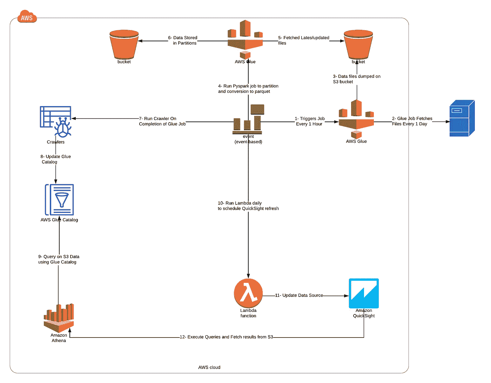

体系结构

# 步骤 1-创建您的数据接收作业

首先，我们需要一个数据转储自动化作业，从本地文件服务器的文件夹中取出文件，并将其转储到 S3 存储桶中。这一过程可以通过 Python-Shell Glue job 实现自动化，因为不需要对数据进行转换，而且它是简单的 I/O。我们将使用 python-shell job，该 job 在第一次运行时将执行满负荷，在后续运行时将仅转储新创建或更新的文件。

下面是 Glue Python-Shell 代码:

让我们深入代码，看看那里发生了什么。首先，我们正在导入 boto3 SDK。我们将使用 SSM 参数存储来存储文件服务器的凭证、存储桶路径、文件夹路径和上次 ETL 执行时间。要在参数存储中创建参数，只需登录 AWS 控制台，转到系统管理器，创建一个标准参数并保存其值。我已经分别创建了所有的参数，你可以做同样的事情或者用逗号分隔的值存储一个参数，然后在你的代码中分割它们。

以下是创建参数的方法:

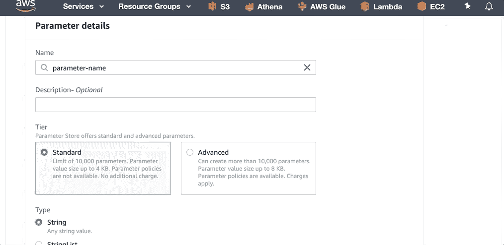

参数存储 Gif

这里我只是加载所有的参数。

接下来，我们使用给定的凭证创建一个与 FTP 服务器的安全 ssh 连接，然后继续打开 SFTP 连接。

这里，我们正在设置 **TransferConfig** 参数。当上传、下载或复制文件或 S3 对象时，您可以将配置设置存储在[boto 3 . S3 . transfer . transfer config](https://boto3.amazonaws.com/v1/documentation/api/latest/reference/customizations/s3.html#boto3.s3.transfer.TransferConfig)对象中。对象被传递给一个**传输方法**(上传文件、下载文件等)。)在 **Config=参数中。**通常默认设置非常适合一般情况，但是您可以更改此配置来处理您的特殊情况。我正在设置以下参数:

*   **multipart_threshold:** 当文件大小超过 multipart_threshold 属性值时，会发生多部分传输。我已经设置为 **100MB** 。
*   **multipart_chunksize:** 多部分传输的每个部分的分区大小。我将它设置为 20MB，因为我的文件是 200MB(最大值),默认情况下 **max_concurrency** 是 10，我的线程得到了适当的利用。你可以根据你的上网带宽定制，增加并发。

```
config = TransferConfig(multipart_threshold=100 * MB, multipart_chunksize=10 * MB)
```

接下来，我将遍历文件服务器中的文件，并将它们的最后修改日期与我的 **last_etl_execution_time 进行比较。**每次我的作业成功完成时，它都会将 last_etl_execution_time 存储在参数存储中，以便下次我只加载 last_etl_execution_time 之后更新/创建的文件。

## **重要的一点**

> 这里需要注意的重要一点是，我使用≥来比较时间，而不是更长，这有一个重要的原因:当我们在 SSM 注册我们的 last_etl_execution_time 时，完全有可能一些新文件上传到我们的文件服务器中，并与我们的 last_etl_execution_time 进行了相同的修改，因此我们需要使用≥来上传我们的 S3 桶中的那些文件，以便任何新文件也得到上传，同时，任何重复的文件都将被自动覆盖(默认的 S3 行为)。

所以总结一下，

*   我们仅在 S3 上使用 last_etl_execution_time 上传新建或更新的文件。
*   使用≥以便与我们的 last_etl_execution_time 具有相同修改日期的任何文件都不会丢失。

最后，我们正在更新我们在 SSM 的**last _ ETL _ execution _ time**。请记住，第一次执行这个作业时，它将执行满负荷，因此您需要将这个 last_etl_execution_time 设置为一个更早的日期。在我的场景中，我将其设置为 2000–01–01 00:00:00

```
ssm.put_parameter(Name='Last_ETL_Execution_Time', Value=str(datetime.datetime.now().strftime('%Y-%m-%d %H:%M:%S')),
                  Type='String', Overwrite=True)
```

嗯，就是这样。到目前为止，我们已经完成了 Python-Shell 的工作，并将文件转储到了 S3 bucket 上。现在让我们转到数据的转换和分区。

# 步骤 2-创建 Pyspark ETL 作业

现在我们将创建一个 Pyspark 作业，该作业将获取更新的或新的文件，根据某个列对它们进行重新分区，并保存为**bucket/year =<year>/month =<month>/**格式和 **parquet 格式**。我们需要一种方法来跟踪着陆桶中已处理的数据。

> [使用工作书签跟踪已处理的数据](https://docs.aws.amazon.com/glue/latest/dg/monitor-continuations.html)

AWS Glue 通过保存作业运行的状态信息来跟踪在 ETL 作业的上一次运行中已经处理过的数据。该持久状态信息被称为*作业书签*。我们将为 Glue Pyspark 作业启用书签。

> 让我们去 AWS 控制台

**步骤 1:** 在 AWS Glue 控制台中创建一个新的 Pyspark 作业。

**步骤 2:** 附加一个具有所需权限的 IAM 角色。在我的例子中，我附加了 [AmazonS3FullAccess](https://console.aws.amazon.com/iam/home?region=us-east-1#/policies/arn%3Aaws%3Aiam%3A%3Aaws%3Apolicy%2FAmazonS3FullAccess) 、 [AWSGlueServiceRole](https://console.aws.amazon.com/iam/home?region=us-east-1#/policies/arn%3Aaws%3Aiam%3A%3Aaws%3Apolicy%2Fservice-role%2FAWSGlueServiceRole) 、[CloudWatchLogsFullAccess](https://console.aws.amazon.com/iam/home?region=us-east-1#/policies/arn%3Aaws%3Aiam%3A%3Aaws%3Apolicy%2FCloudWatchLogsFullAccess)、[amazonsmsmfullaccess](https://console.aws.amazon.com/iam/home?region=us-east-1#/policies/arn%3Aaws%3Aiam%3A%3Aaws%3Apolicy%2FAmazonSSMFullAccess)策略

第三步:选择一个由你创作的新剧本。

**第四步:**在类型中选择 **Spark** ，在 ETL 语言中选择 **Python** 。

**步骤 5:** 在高级属性中，**启用作业书签。**

**步骤 6:** 其余配置可以保留默认配置，在运行和测试胶合作业时，您可以以较低的成本将最大容量更改为 2 个 dpu。

这里是我的配置的一瞥

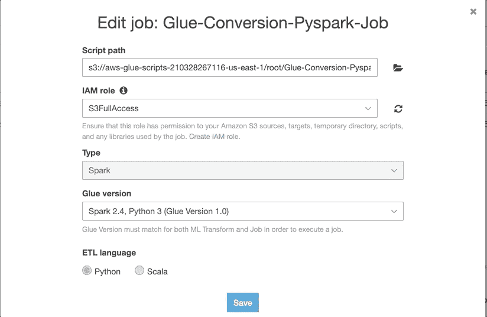

粘附配置

# 现在让我们深入研究 ETL 脚本

这里是 Github 上传的代码。请关注或给一颗星:)

让我们一部分一部分地分解它:

*   首先，我导入 Glue 库并创建 Glue 上下文。
*   从目录表创建动态框架。如果您还没有创建表，您需要转到**表>添加新表>手动添加列并定义文件的模式。**
*   将动态帧转换为数据帧以利用 spark SQL。
*   然后，我创建分区键(月、日)并追加到现有的数据框中(不需要创建年份，因为它已经存在于数据集中)。
*   在我们的**bucket/year =<year>/month =<month>/data**文件夹中，我们将存储按天分区的数据文件(每天单独的文件)。
*   如果在源文件(本地文件服务器)中更新了文件，那么各个 S3 分区文件夹中的数据将被最新的数据覆盖**(处理的更新)**。
*   重新划分的数据帧被转换回动态帧并存储在 S3 桶中，其中提到了分区键和拼花格式。

> 这是我们的 Glue Pyspark 作业的输出

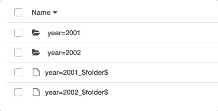

S3 桶数据

查看 S3 桶中的输出文件。数据以拼花格式按年和月进行分区。每个月文件夹中的每个文件都包含按天划分的犯罪数据。

## 创建你的爬虫

一旦您的工作完成，您需要在 S3 桶中注册新创建的分区。我们将使用这项工作的爬虫。如果您的模式从不改变，您可以使用`batch_create_partition()` glue api 来注册新的分区。更多信息，请参考我的博客[这里](https://medium.com/swlh/serverless-data-lake-storing-and-analysing-streaming-data-using-aws-60cf3bfe1efd)。在这里，因为我们需要检测任何模式更改，所以我们将为这项工作运行一个 crawler。以下是爬虫的配置。

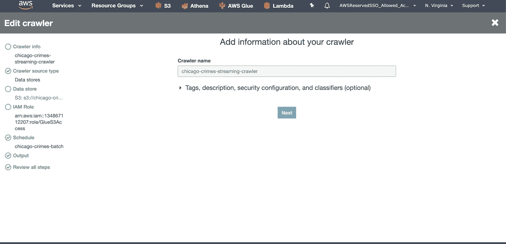

爬虫配置

运行此 crawler 来注册分区。接下来，我们将在工作流程中使用这个爬虫。

# 步骤 3:让我们用粘合工作流来编排粘合作业和触发器

工作流通过在粘合实体(触发器、爬行器和作业)之间建立依赖关系来实现 ETL 工作负载的编排。您可以在控制台上直观地跟踪工作流中不同节点的状态，从而更容易监控进度和解决问题。此外，您可以在工作流程中的实体之间共享参数。

> 通过使用工作流，您不必手动设置不同触发器、爬行器和粘合作业之间的流程

**所以是时候了！我们应该创建一个工作流程。但是首先，我们需要决定执行流程。**

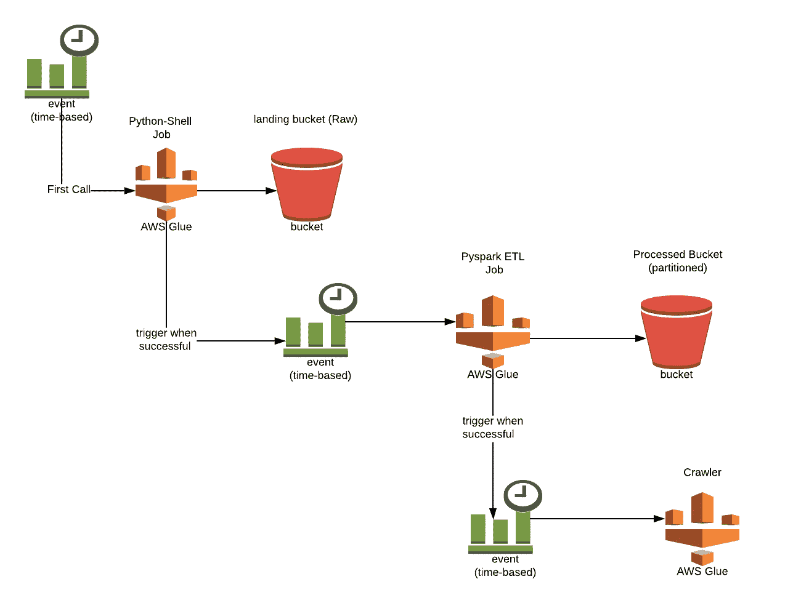

ETL 执行流程

以上是我们的 ETL 执行流程。我们可以创建一个工作流，轻松监控进度并排除错误，而不是配置 Cloudwatch 事件并自行管理。

> **现在让我们创建第一个工作流程！！！**

*   转到 AWS Glue 控制台，选择**工作流程。**
*   给它起个**名字**和**描述**。点击**添加**。

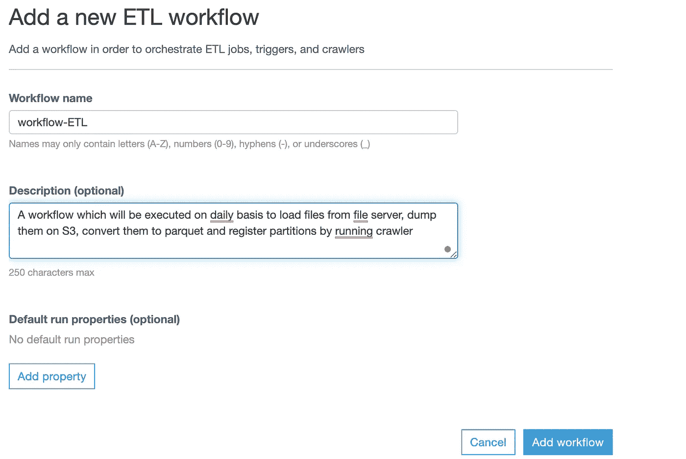

*   选择您的工作流程并移至**图表**选项卡。
*   选择**添加触发器。**
*   选择**添加新的，**给它一个名称和描述。
*   选择触发类型为**计划。**
*   选择运行触发器的时间，然后单击**添加。**
*   现在您可以添加一个将被触发的**节点**。添加您的 Python-Shell 作业。
*   选择 Python-Shell 作业后，在它之后添加另一个触发器节点，并继续执行流程。最后，您的工作流将如下所示:

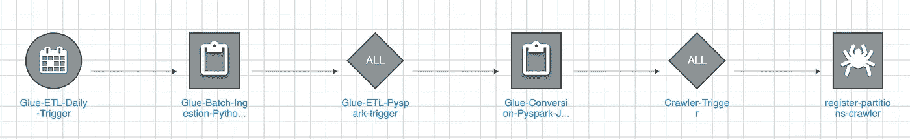

胶水工作流程

完成粘合工作流程后，您就可以运行您的工作流程了。

> **重要提示:**完成教程后，不要忘记删除您的工作流，否则它将被安排在您设定的时间运行。

# 用亚马逊雅典娜分析数据

Amazon Athena 是一种交互式查询服务，它使得使用标准 SQL 分析亚马逊 S3 中的数据变得很容易。Athena 能够查询 CSV 数据。然而，Parquet 文件格式大大减少了查询数据的时间和成本。

> **现在来查询一些数据吧！！！**

打开 **Athena** 的 AWS 管理控制台，连接你的**数据库**和**表**。

让我们看看芝加哥每年的犯罪率是多少。

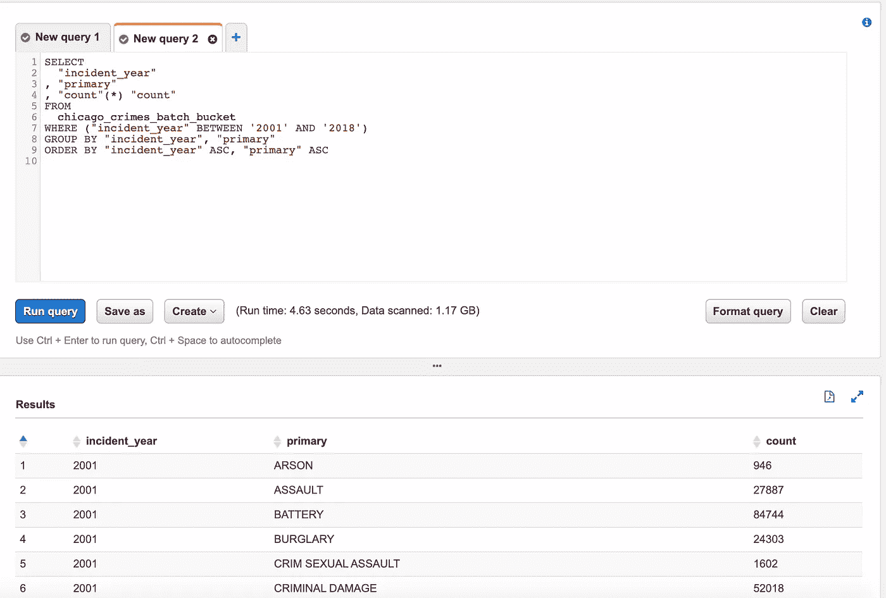

每年的犯罪率

我们将在 Athena 中创建**视图**，稍后将由 **Quicksight 导入。**您只需在查询请求中添加以下行。

```
CREATE OR REPLACE VIEW chicago_crimes_usecase1 AS
```

让我们来看看每月的犯罪率

```
CREATE OR REPLACE VIEW chicago_crimes_usecase3 AS
SELECT
  "date_format"("incident_date", '%M') "month"
, "primary" "primary_type"
, "count"(*) "count"
FROM
  chicago_crimes_batch_bucket
WHERE ("primary" IS NOT NULL)
GROUP BY "primary", "date_format"("incident_date", '%M')
ORDER BY "month" ASC
```

下面是查询结果:

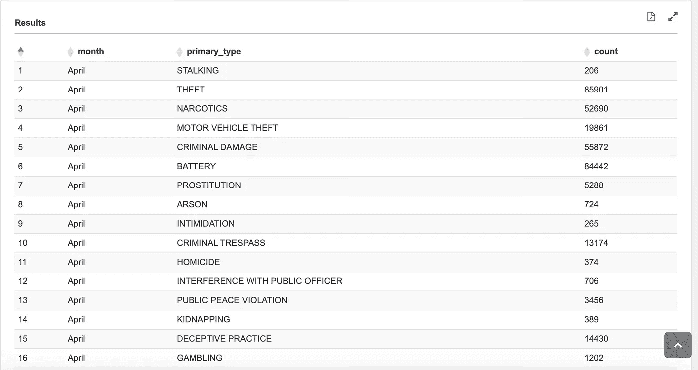

每月犯罪率

让我们来看看芝加哥排名前五的犯罪趋势。

```
CREATE OR REPLACE VIEW chicago_crimes_usecase6 AS
SELECT
  "primary"
, "incident_year"
, "count"
FROM
  (
   SELECT
     "primary"
   , "incident_year"
   , "count"("primary") "count"
   , "row_number"() OVER (PARTITION BY "incident_year" ORDER BY "count"("primary") DESC) "rn"
   FROM
     chicago_crimes_batch_bucket
   WHERE ("incident_year" BETWEEN '2001' AND '2070')
   GROUP BY "primary", "incident_year"
)  tmp
WHERE ("rn" <= 5)
GROUP BY "primary", "incident_year", "count"
ORDER BY "incident_year" ASC
```

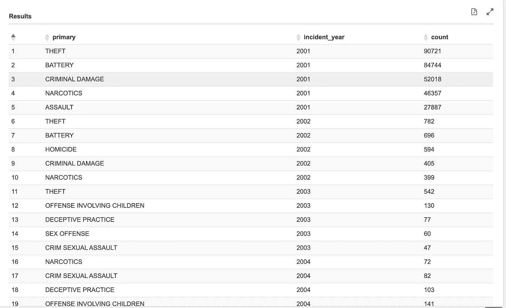

热门犯罪

我们也有位置数据，所以我们可以显示前 5000 个位置点，并确定哪些地方是**热点犯罪区域。**

> **QuickSight 在一张地理图上最多只能显示 5000 个位置点**

```
CREATE OR REPLACE VIEW chicago_crimes_usecase8 AS
SELECT
  TRY(CAST("col20" AS double)) "latitude"
, TRY(CAST("col21" AS double)) "logitude"
FROM
  chicago_crimes_batch_bucket
WHERE (("col20" <> 'null') AND ("col21" <> 'null'))
LIMIT 5000
```

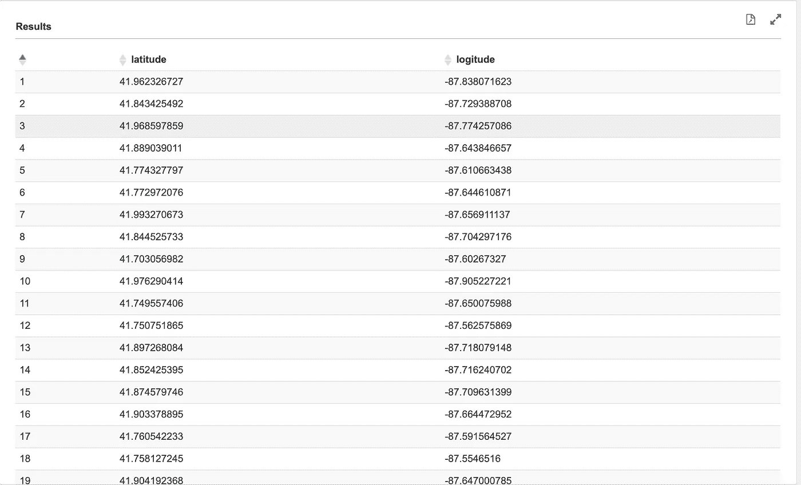

位置数据

您可以创建更多类似的查询并分析您的数据。将它们存储在视图中，接下来我们将在 QuickSight 中导入它们。

> [在我的 Github 上上传了其余的查询](https://github.com/ShafiqaIqbal/AWS-Athena-Queries)

# 是时候使用 QuickSight 进行一些数据可视化了

**第一步:**打开[亚马逊 QuickSight 控制台](https://us-east-1.quicksight.aws.amazon.com/sn/start)如【1】所述。

**第二步:**第二步:设置[亚马逊 QuickSight 账号设置](https://us-east-1.quicksight.aws.amazon.com/sn/console/resources?)到[访问雅典娜和你的 S3 桶](https://docs.aws.amazon.com/quicksight/latest/user/managing-permissions.html)。您可以查看[1]了解更多信息。

**第三步:**选择**管理数据。**

**第四步:**选择**新数据集**然后选择**雅典娜**。

**步骤 5:** 输入您的数据源名称并选择您的视图。

**第七步:**这里你可以选择**香料**(缓存)。

**第 8 步:**你可以添加一个新的可视化，字段和指标。

这里有一些我用 Athena 的**视图**创建的样本图表。

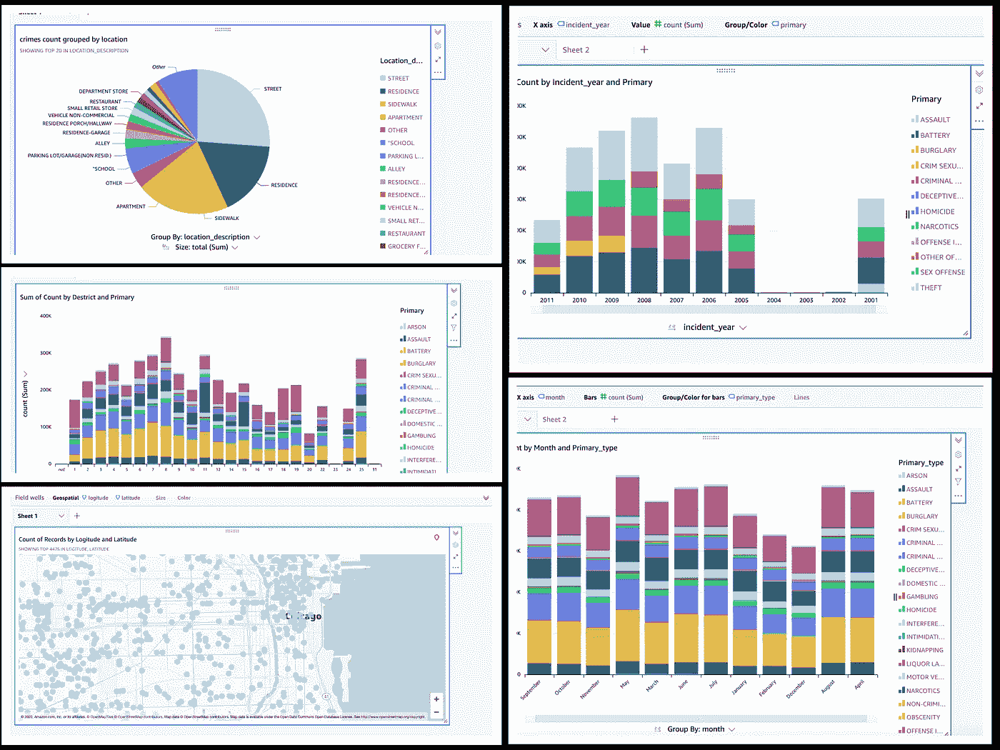

快速浏览图表

您还可以创建报表可视化，就像这里的这个。它将为您提供雅典娜风格的查询输出外观。

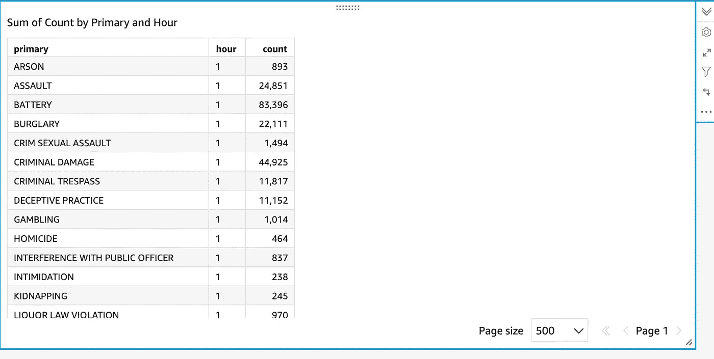

Quicksight 报告可视化

# QuickSight 仪表板中的计划数据刷新

您可以使用时间表自动刷新 **SPICE** 数据集。标准版或企业版可以选择**每日**、**每周**或**每月**。

*   **每日**:每天重复
*   **每周**:每周的同一天重复
*   **每月**:每月的同一天重复。要在每月的 29 日、30 日或 31 日刷新数据，从列表中选择**每月的最后一天**。

仅限企业版，可以选择**小时**。此设置从您选择的时间开始，每小时刷新您的数据集。

但是，如果您想要维护数据集刷新的自定义计划，可以使用 AWS SDK Boto3 来实现。在 lambda 函数中运行下面的代码，并调度您的 lambda。

从上面的代码中得到的关键信息:

*   过滤掉带有前缀“chicago_crimes”的数据集
*   在第一个循环中为每个数据集启动数据集刷新过程
*   检查第二个循环中每个数据集的状态

# 就是这样！

> 很棒吧？

在这个逐步演练中，我们使用 AWS Glue、AWS Athena 和 AWS QuickSight 开发了一个无服务器数据湖。我们执行了从摄取和治疗到可视化的每个步骤。

对于即将到来的故事，你应该关注我的简介。

当你点击并按住**拍手**按钮时，你想看到一些魔法吗？

[](https://www.buymeacoffee.com/shafiqaiqbal)

*   每当我发表一篇文章，就会收到一封 [**电子邮件**](http://Get an email whenever I publish an article) ，如果你喜欢这个故事，可以考虑成为 [**会员**](https://medium.com/@shafiqa_iqbal/membership) 。
*   在 insta gram[](https://www.instagram.com/__shafiqaiqbal__/)**上与 **45，000+** 其他关注者一起关注我，了解技术更新、谷歌的工作文化以及更多信息。**
*   ****48，000+** 人们在 [**Linkedin**](https://www.linkedin.com/in/shafiqa-iqbal/) 上关注职业建议、技术建议和日常激励。**

## **参考资料:**

**[1][https://AWS . Amazon . com/blogs/big-data/create-real-time-click stream-sessions-and-run-analytics-with-Amazon-kinesis-data-analytics-AWS-glue-and-Amazon-Athena/](https://aws.amazon.com/blogs/big-data/create-real-time-clickstream-sessions-and-run-analytics-with-amazon-kinesis-data-analytics-aws-glue-and-amazon-athena/)**