# 深度学习推理的人工智能加速器完全指南——GPU、AWS 推理和亚马逊弹性推理

> 原文：<https://towardsdatascience.com/a-complete-guide-to-ai-accelerators-for-deep-learning-inference-gpus-aws-inferentia-and-amazon-7a5d6804ef1c?source=collection_archive---------2----------------------->

## 了解 CPU、GPU、AWS 推理和 Amazon 弹性推理，以及如何为推理部署选择正确的 AI 加速器

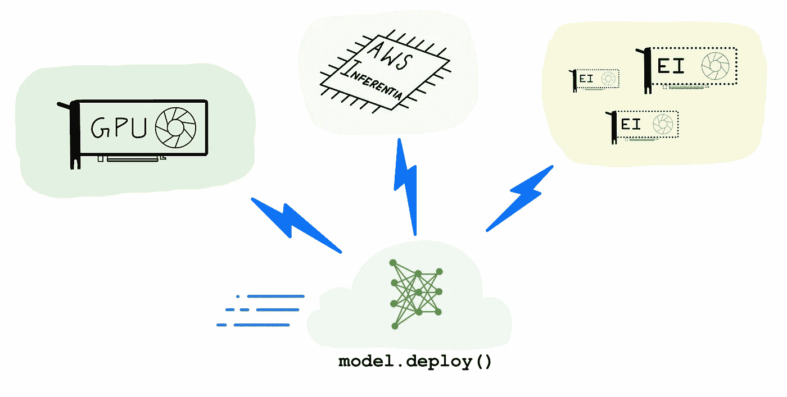

如何选择—推理用 GPU、AWS 推理和亚马逊弹性推理(*作者图解*)

## 让我们从回答“什么是 AI 加速器”这个问题开始。

人工智能加速器是一种专用处理器，旨在加速机器学习计算。机器学习，特别是它的子集，深度学习主要由大量的线性代数计算组成，(即矩阵-矩阵，矩阵-向量运算)，这些运算可以很容易地并行化。人工智能加速器是一种专门的硬件，旨在加速这些基本的机器学习计算，提高性能，减少延迟，并降低部署基于机器学习的应用程序的成本。

## 机器学习(ML)推理需要 AI 加速器吗？

假设你有一个 ML 模型作为你软件应用的一部分。预测步骤(或推断)通常是应用程序中最耗时的部分，会直接影响用户体验。一个需要数百毫秒来生成文本翻译或对图像应用过滤器或生成产品推荐的模型，可以让用户远离你的“迟缓”、“缓慢”、“令人沮丧”的应用。

通过加速推理，您可以减少应用程序的整体延迟，并提供可以用“流畅”、“爽快”和“令人愉快”来描述的应用程序体验。你可以通过将 ML 模型预测计算卸载到 AI 加速器来加速推断。

随着巨大的市场需求而来的是大量的替代产品，因此自然有多种方式来加速您在云中的 ML 模型。

在这篇博文中，我将探索三种流行的选择:


(*作者插图*)

1.  **GPU**:特别是高性能的英伟达 T4 和英伟达 V100 GPUs
2.  **AWS 推理**:AWS 定制设计的机器学习推理芯片
3.  **Amazon Elastic Inference(EI)**:一个加速器，通过为不需要专用 GPU 的模型提供可变大小的 GPU 加速来节省成本

为您的工作负载选择正确的硬件加速类型可能是一个很难做出的选择。在这篇文章的其余部分，我将带您了解各种考虑因素，如目标吞吐量、延迟、成本预算、模型类型和大小、框架选择以及其他因素，以帮助您做出决策。我还将展示大量代码示例，并讨论开发人员友好性和选项的易用性。

> 免责声明:本文中的观点和建议是我自己的，不代表我现在或过去的雇主的观点。

# 一点硬件加速器的历史

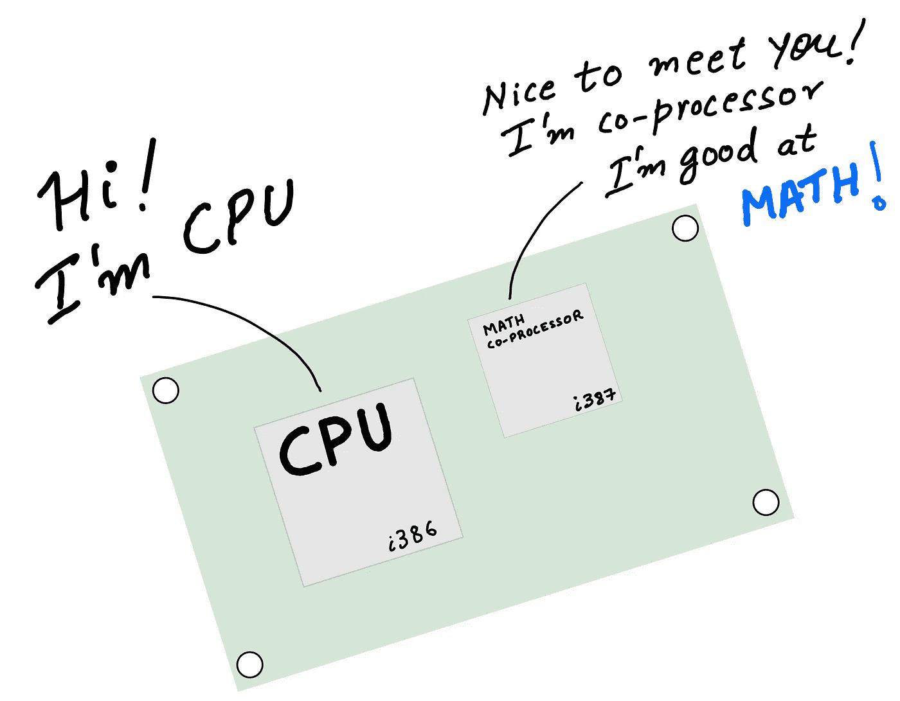

(*作者插图*)

在计算的早期(70 年代和 80 年代)，为了加快计算机上的数学计算，你将 CPU(中央处理器)与 FPU(浮点单元)配对，也就是数学协处理器。想法很简单——允许 CPU 将复杂的浮点数学运算卸载到专门设计的芯片上，这样 CPU 就可以专注于执行应用程序的其余部分，运行操作系统等。由于系统有不同类型的处理器(CPU 和数学协处理器)，这种设置有时被称为异构计算。

快进到 90 年代，CPU 变得更快、更好、更高效，并开始配备集成浮点硬件。更简单的系统占了上风，而协处理器和异构计算对于普通用户来说已经过时了。

大约在同一时间，特定类型的工作负载开始变得更加复杂。设计师需要更好的图形，工程师和科学家需要更快的计算机进行数据处理、建模和模拟。这意味着对高性能处理器有一些需求(和市场),这种处理器可以比 CPU 更快地加速“特殊程序”,从而释放 CPU 来做其他事情。计算机图形是工作负载被卸载到特殊处理器的早期例子。你可能知道这种特殊的处理器的通用名，古老的 GPU。

2010 年代初，又出现了另一类工作负载——深度学习，或具有深度神经网络的机器学习——需要硬件加速才能实现，就像计算机图形一样。GPU 已经出现在市场上，经过多年的发展，已经变得高度可编程，不像早期的 GPU 是固定功能的处理器。自然地，ML 从业者开始使用 GPU 来加速深度学习训练和推理。

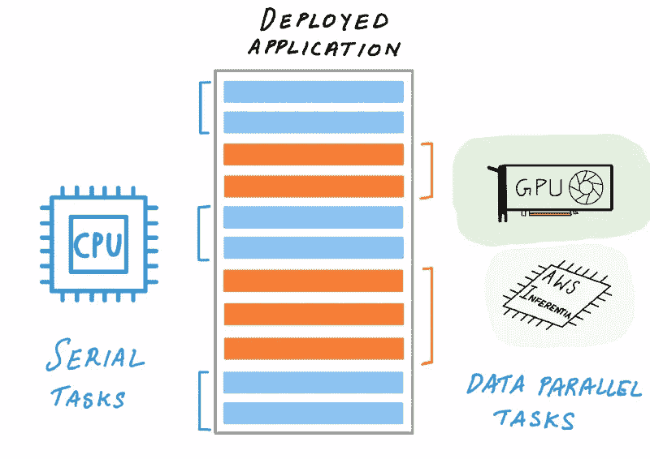

CPU 可以将复杂的机器学习操作卸载到人工智能加速器上(作者的*插图)*

如今的深度学习推理加速格局有趣多了。CPU 获得了对高级向量扩展(AVX-512)的支持，以加速深度学习中常见的矩阵数学计算。GPU 获得了新的功能，例如支持简化精度算法(FP16 和 INT8)，进一步加快了推理速度。

除了 CPU 和 GPU，今天你还可以使用专门的硬件，定制设计的芯片只是为了深度学习推理而构建的。如果处理器支持您的工作负载，这些专用处理器，也称为专用集成电路或 ASICs，与通用处理器相比，性能更高，成本更低。这种专用处理器的一个很好的例子是 AWS Inferentia，这是 AWS 为加速深度学习推理而定制设计的 ASIC。

一开始，为您的应用选择正确的硬件加速可能并不明显。在下一节中，我们将讨论每种方法的优势和考虑事项，如吞吐量、延迟、成本和其他会影响您选择的因素。

# 人工智能加速器和如何选择正确的选项

很难回答“GPU 比 CPU 好吗？”或者“CPU 比 GPU 便宜吗”或者“ASIC 总是比 GPU 快吗”。实际上，没有一种硬件解决方案能适用于所有使用情形，答案取决于您的工作负载和几个考虑因素:

1.  **模型类型和可编程性:**模型大小、定制操作符、支持的框架
2.  **目标吞吐量、延迟和成本:**在预算范围内提供良好的客户体验
3.  **编译器和运行时工具链的易用性:**应该有快速的学习曲线，不需要硬件知识

虽然模型支持和目标延迟等考虑是客观的，但易用性可能是非常主观的。因此，我反对不考虑上述所有具体应用的一般性建议。这种高水平的建议往往是有偏见的。

让我们回顾一下这些关键考虑事项。

## **1。型号类型和可编程性**

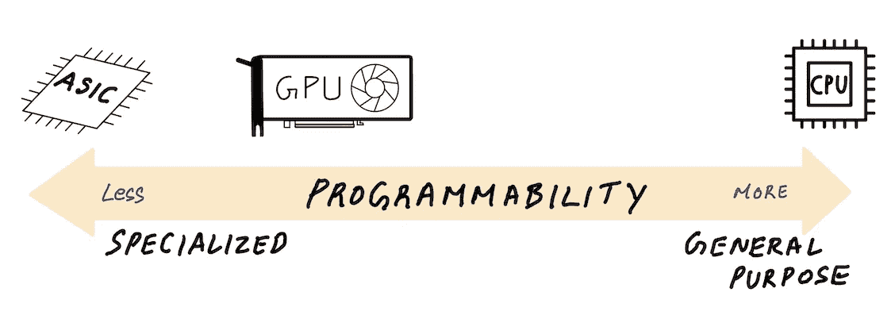

(*作者插图*)

对人工智能加速器进行分类的一种方式是基于它们的可编程程度。在“完全可编程”的一端，有 CPU。作为通用处理器，你可以用定制的层、架构和操作为你的机器学习模型编写定制的代码。

另一个极端是 ASICs，如 AWS Inferentia，它通过 AWS Neuron SDK 编译器公开了一组固定的受支持操作。介于两者之间，但更接近 ASIC 的是 GPU，它比 ASIC 更具可编程性，但远不如 CPU 通用。在通用和提供性能之间总会有一些折衷。

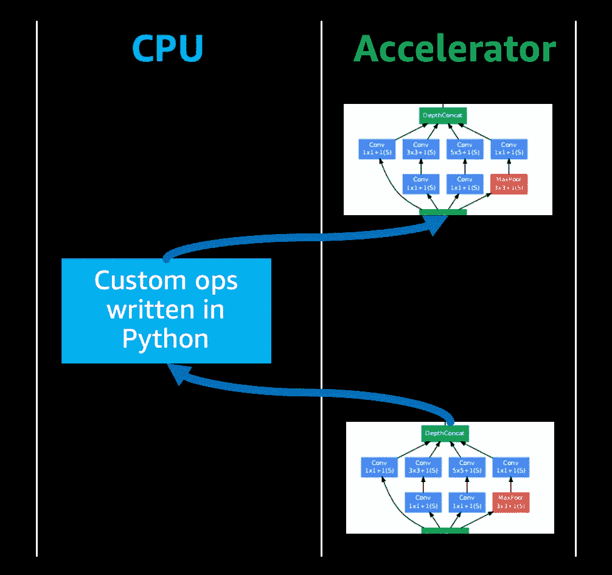

定制代码可能会退回到 CPU 执行，从而降低整体吞吐量(作者的*插图)*

如果您正在通过自定义神经网络操作来拓展深度学习研究的边界，您可能需要为自定义操作编写自定义代码。你通常用像 Python 这样的高级语言来做这件事。

大多数人工智能加速器不能自动加速用高级语言编写的定制代码，因此这段代码将退回给 CPU 执行，降低了整体推理性能。

NVIDIA GPUs 的优势在于，如果你想提高自定义代码的性能，你可以使用 CUDA 编程语言重新实现它们，并在 GPU 上运行它们。但是如果你的 ASIC 的编译器不支持你需要的操作，那么 CPU 回退可能会导致较低的性能。

## **2。目标吞吐量、延迟和成本**

一般来说，与通用处理器相比，专用处理器(如 AWS Inferentia)往往提供更低的性价比，并改善延迟。但在人工智能加速的世界里，所有的解决方案都可能是有竞争力的，这取决于工作负载的类型。

GPU 是吞吐量处理器，可以在指定的延迟时间内提供高吞吐量。如果延迟不重要(批处理、离线推理)，那么 GPU 利用率可以保持在较高水平，使其成为云中最具成本效益的选项。CPU 不是并行吞吐量设备，但是对于较小模型的实时推理，CPU 可能是最具成本效益的，只要推理延迟低于您的目标延迟预算。如果您的模型完全受 AWS Neuron SDK compiler 支持，AWS Inferentia 的性能和较低的成本可能使其成为相对于 CPU 和 GPU 最具成本效益和性能的选择。

这确实是一个微妙的话题，并且非常依赖于工作负载。在接下来的章节中，我们将进一步了解每个加速器的性能、延迟和成本。如果某个特定的选择不适合你，没关系，在云中切换选项很容易，直到你找到适合你的选项。

## **3。编译器和运行时工具链以及易用性**

为了在人工智能加速器上加速您的模型，您通常必须经历一个编译步骤，该步骤分析计算图形并针对目标硬件进行优化，以获得最佳性能。当部署在 CPU 上时，深度学习框架拥有您需要的一切，因此通常不需要额外的 SDK 和编译器。

如果你正在部署一个 GPU，你可以依靠深度学习框架来加速你的模型进行推理，但你将把性能留在桌面上。为了充分利用你的 GPU，你必须使用一个专用的推理编译器，比如 NVIDIA TensorRT。

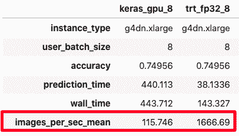

(*作者截图*)

在某些情况下，与使用深度学习框架相比，您可以获得 10 倍以上的额外性能(见图)。我们将在后面的代码示例部分看到如何重现这些结果。

NVIDIA TensorRT 是两件事——推理编译器和运行时引擎。通过使用 TensorRT 编译您的模型，您可以获得更好的性能和更低的延迟，因为它执行了许多优化，如图形优化和量化。同样，当以 AWS 推理为目标时，AWS Neuron SDK 编译器将执行类似的优化，以充分利用您的 AWS 推理处理器。

让我们更深入地挖掘一下这些人工智能加速器选项

# 加速器选项 1:用于推理的 GPU 加速


(*作者插画*)

您在 GPU 上训练您的模型，因此很自然会考虑将 GPU 用于推理部署。毕竟，GPU 大大加快了深度学习训练，而推理只是你已经在 GPU 上加速的神经网络的向前传递。这是真的，GPU 确实是推理的优秀硬件加速器。

首先，我们来谈谈 GPU 到底是什么。

GPU 首先是吞吐量处理器，正如 NVIDIA 的这篇[博客文章所解释的](https://developer.nvidia.com/blog/cuda-refresher-reviewing-the-origins-of-gpu-computing/)。它们旨在利用算法中固有的并行性，并通过并行计算来加速算法。GPU 最初是作为计算机图形的专用处理器出现的，但今天的 GPU 已经发展成为可编程处理器，也称为通用 GPU (GPGPU)。它们仍然是专门的并行处理器，但也是高度可编程的，用于可以通过并行化来加速的狭窄范围的应用。

事实证明，早在深度学习之前，高性能计算(HPC)社区就已经在使用 GPU 来加速线性代数计算了。深度神经网络计算主要由类似的线性代数计算组成，因此用于深度学习的 GPU 是寻找问题的解决方案。毫不奇怪，Alex Krizhevsky 的 AlexNet 深度神经网络赢得了 ImageNet 2012 竞赛，并(重新)向世界介绍了深度学习，它是在 NVIDIA 现成的可编程消费 GPU 上训练的。

自那以后，GPU 的速度变得更快了[我会让你去 NVIDIA 的网站了解他们最新的流行机型的训练和推理基准](https://developer.nvidia.com/deep-learning-performance-training-inference)。虽然这些基准很好地表明了 GPU 的能力，但您的决定可能取决于下面讨论的其他因素。

## **1。GPU 推理吞吐量、延迟和成本**

由于 GPU 是吞吐量设备，如果您的目标是最大限度地提高吞吐量，它们可以根据所需的延迟提供同类最佳的吞吐量，具体取决于部署的 GPU 类型和型号。GPU 大放异彩的一个用例是离线或批量推理。GPU 还将为小批量预测提供一些最低的延迟，但如果您无法始终将 GPU 利用率保持在最高水平，例如由于零星的推理请求(波动的客户需求)，您的成本/推理请求会上升(因为您为相同的 GPU 实例成本提供的请求较少)。对于这些情况，您最好使用 Amazon Elastic Inference，它可以让您以较低的成本获得足够的 GPU 加速。

在示例部分，我们将看到不同精度(FP32、FP16、INT8)的 GPU 性能比较。

## **2。GPU 推理支持的模型大小和选项**

在 AWS 上，您可以使用不同的 NVIDIA GPUs、vCPUs 数量、系统内存和网络带宽启动 18 个不同的 Amazon EC2 GPU 实例。两种最受欢迎的深度学习推理 GPU 是 G4 EC2 instance type 提供的英伟达 T4 GPU 和 P3 EC2 instance type 提供的英伟达 V100 GPUs。

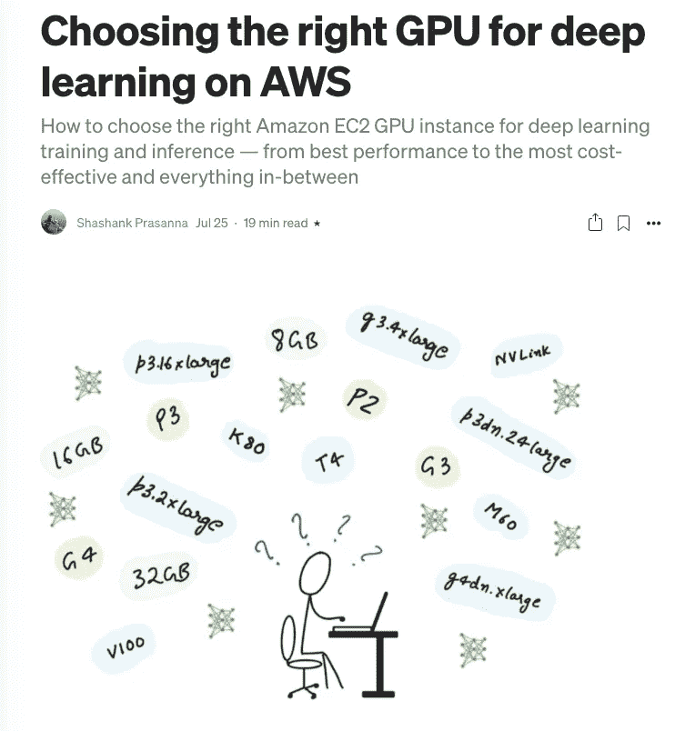

博文:[为 AWS 上的深度学习选择合适的 GPU](/choosing-the-right-gpu-for-deep-learning-on-aws-d69c157d8c86?source=friends_link&sk=a7b056b6fdbed24ecb5e23f6ea8625cc)(*作者截图*)

关于 AWS 所有 GPU 实例类型的完整总结，请阅读我之前的博客文章:[为 AWS 上的深度学习选择正确的 GPU](/choosing-the-right-gpu-for-deep-learning-on-aws-d69c157d8c86?source=friends_link&sk=a7b056b6fdbed24ecb5e23f6ea8625cc)

G4 实例类型应该是深度学习推理部署的首选 GPU 实例。

基于英伟达图灵架构，英伟达 T4 GPU 具有 FP64、FP32、FP16、张量内核(混合精度)和 INT8 精度类型。它们还拥有 16 GB 的 GPU 内存，对于大多数型号来说已经足够了，并结合了降低的精度支持。

如果您需要更大的吞吐量或每个 GPU 需要更多的内存，那么 P3 实例类型提供了更强大的 NVIDIA V100 GPU，通过`p3dn.24xlarge`实例大小，您可以访问 NVIDIA V100，它具有高达 32 GB 的 GPU 内存，可用于大型模型或大型图像或其他数据集。

## 3.GPU 推理模型类型、可编程性和易用性

与固定功能处理器的 AWS Inferentia 等 ASICs 不同，开发人员可以使用 NVIDIA 的 CUDA 编程模型来编写自定义层，这些层可以在 NVIDIA GPU 上加速。这正是 Alex Krizhevsky 在 2012 年对 AlexNet 所做的。他手工编写定制的 CUDA 内核，在 GPU 上训练他的神经网络。他称他的框架为 cuda-convnet，你可以说 cuda-convnet 是第一个深度学习框架。如果你正在推动深度学习的边界，并且不想将性能留在桌面上，GPU 是你的最佳选择。

> **可编程性与性能是 GPU 最大的优势之一**

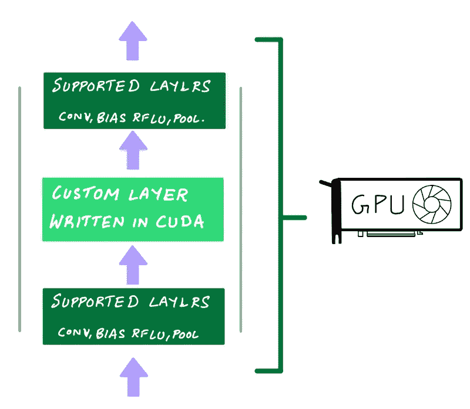

使用 NVIDIA 的 CUDA 编程模型来编写可以在 NVIDIA GPU 上加速的自定义层。(*作者插图*)

当然，你不需要写低级别的 GPU 代码来做深度学习。NVIDIA 已经通过 cuDNN 和 cuBLAS 等库提供了神经网络原语，TensorFlow、PyTorch 和 MXNet 等深度学习框架在幕后使用这些库，因此您只需使用这些框架就可以免费获得 GPU 加速。这就是 GPU 在易用性和可编程性方面获得高分的原因。

## 4.NVIDIA TensorRT 的 GPU 性能

如果你真的想让你的 GPU 发挥最佳性能，NVIDIA 提供了 TensorRT，一个用于推理部署的模型编译器。对经过训练的模型进行额外的优化，完整的列表可在 NVIDIA 的 TensorRT 网站上找到。需要注意的关键优化是:

*   **量化**:将模型精度从 FP32(单精度)降低到 FP16(半精度)或 INT8 (8 位整数精度)，从而减少计算量，加快推理速度
*   **图形融合**:在 GPU 上将多个层/操作融合成一个对 CUDA 内核的函数调用。这减少了每个层/操作的多个函数调用的开销

使用 NVIDIA TensorRT 部署 FP16 非常简单。TensorRT 编译器将在编译步骤中自动量化您的模型。

要使用 INT8 precision 进行部署，需要量化模型的权重和激活，以便可以使用适当的范围将浮点值转换为整数。你有两个选择。

*   **选项 1** :执行量化感知训练。在量化感知训练中，从量化权重和张量到 INT8 的误差在训练期间被建模，允许模型适应和减轻该误差。这需要在培训期间进行额外的设置。
*   **选项二:**进行训练后量化。在量化后培训中，不需要任何部署前准备。您将提供全精度(FP32)的训练模型，还需要提供训练数据集中的数据集样本，TensorRT 编译器可以使用该样本来运行校准步骤以生成量化范围。在下面的示例 2 中，我们将看看选项 2 的实现。

## **GPU 加速推理示例**

使用以下 AWS 深度学习 AMI 在亚马逊 EC2 `g4dn.xlarge`上测试了以下示例:深度学习 AMI (Ubuntu 18.04)版本 35.0。为了运行 TensorRT，我使用了以下 NVIDIA TensorFlow Docker 映像:`nvcr.io/nvidia/tensorflow:20.08-tf2-py3`

**数据集**:50000 张测试图片的 ImageNet 验证数据集，转换为 TFRecord
**模型**:resnet 50 的 TensorFlow 实现

您可以在 Jupyter 笔记本上找到以下示例的完整实现:

> [https://github . com/shashankprasanna/ai-accelerators-examples/blob/main/GPU-TF-tensorrt-resnet 50 . ipynb](https://github.com/shashankprasanna/ai-accelerators-examples/blob/main/gpu-tf-tensorrt-resnet50.ipynb)

## **示例 1:部署 ResNet50 TensorFlow 模型(1)框架的原生 GPU 支持和(2)NVIDIA tensort**

TensorFlow 的原生 GPU 加速支持开箱即用，无需额外设置。您不会获得 NVIDIA TensorRT 所能提供的额外性能，但当一切正常工作时，生活会变得多么轻松，这一点毋庸置疑。

使用框架的本地 GPU 支持运行推理需要 3 行代码:

```
model = tf.keras.models.load_model(saved_model_dir)for i, (validation_ds, batch_labels, _) in enumerate(dataset):
    pred_prob_keras = model(validation_ds)
```

但是你真的把性能留在桌面上了(有时是性能的 10 倍)。为了提高 GPU 的性能和利用率，您必须使用推理编译器和运行时，如 NVIDIA TensorRT。

下面的代码展示了如何用 TensorRT 编译您的模型。你可以在 GitHub 上找到[的完整实现](https://github.com/shashankprasanna/ai-accelerators-examples/blob/main/gpu-tf-tensorrt-resnet50.ipynb)

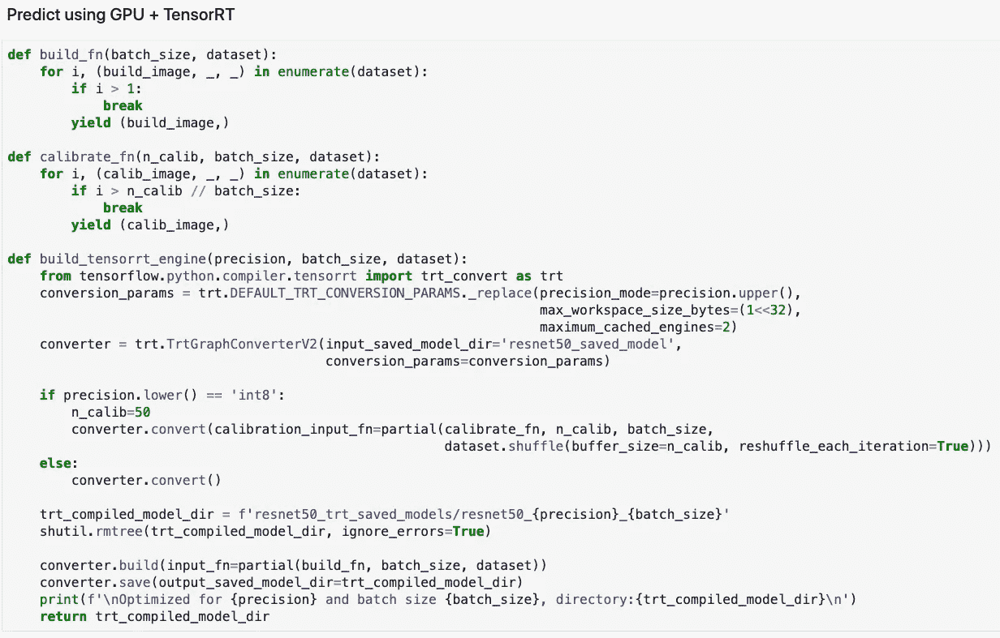

摘自:[https://github . com/shashankprasanna/ai-accelerators-examples/blob/main/GPU-TF-tensorrt-resnet 50 . ipynb](https://github.com/shashankprasanna/ai-accelerators-examples/blob/main/gpu-tf-tensorrt-resnet50.ipynb)(*作者截图*)

TensorRT 编译有以下步骤:

1.  向 TensorRT 的`TrtGraphConverterV2`(用于 TensorFlow2)提供您未编译的 TensorFlow 保存模型
2.  指定 TensorRT 编译参数。最重要的参数是精度(FP32、FP16、INT8)。如果您正在使用 INT8 支持进行编译，TensorRT 希望您从训练集中提供一个代表性样本来校准比例因子。当您调用`converter.convert()`时，您将通过为参数`calibration_input_fn`提供一个 python 生成器来实现这一点。您不需要为 FP32 和 FP16 优化提供额外的数据。
3.  TensorRT 编译您的模型并将其保存为 TensorFlow 保存的模型，该模型包括特殊的 TensorRT 运算符，可加速 GPU 上的推理并更有效地运行它们。

以下是 TensorFlow ResNet50 推理的准确性和性能对比:

1.  TensorFlow 原生 GPU 加速
2.  tensor flow+tensort FP32 精度
3.  tensor flow+tensort FP16 精度
4.  tensor flow+tensort int 8 精度

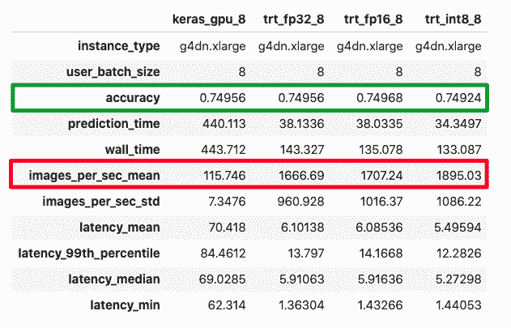

(*作者截图*)

我测量的不仅仅是性能，还有精度，因为降低精度意味着信息的损失。在 ImageNet 测试数据集上，我们看到所有精度的精度损失可以忽略不计，而吞吐量略有增加。您的里程可能因型号而异。

## **示例 2:使用 Amazon SageMaker 托管 ResNet50 TensorFlow 模型**

在示例 1 中，我们离线测试了性能，但是在大多数情况下，您将在云中托管您的模型，作为客户端应用程序可以向其提交推理请求的端点。最简单的方法之一是使用 Amazon SageMaker 托管功能。

这个例子是在亚马逊 SageMaker Studio 笔记本上测试的。使用以下亚马逊 SageMaker Studio conda 环境运行该笔记本:TensorFlow 2 CPU 优化。完整的实现可从以下网址获得:

> [https://github . com/shashankprasanna/ai-accelerators-examples/blob/main/sage maker-TF-CPU-GPU-ei-resnet 50 . ipynb](https://github.com/shashankprasanna/ai-accelerators-examples/blob/main/sagemaker-tf-cpu-gpu-ei-resnet50.ipynb)

使用 SageMaker 托管模型端点包括以下简单步骤:

1.  使用您的 TensorFlow 保存的模型创建 tar.gz 存档文件，并将其上传到亚马逊 S3
2.  使用 Amazon SageMaker SDK API 创建一个 TensorFlowModel 对象
3.  使用英伟达 T4 GPU 将 TensorFlowModel 对象部署到 G4 EC2 实例

使用 TensorFlow 保存的模型创建 model.tar.gz:

```
$ tar cvfz model.tar.gz -C resnet50_saved_model .
```

将模型上传到 S3 并部署:

您可以通过调用端点来测试模型，如下所示:

输出:

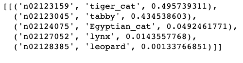

# 加速器选项 2: AWS 推理

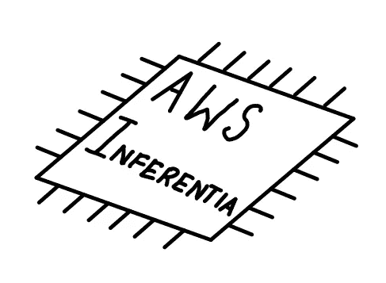

(*作者插画*)

AWS 推理是亚马逊设计的定制芯片，用于经济高效、高吞吐量、低延迟的推理。

詹姆斯·汉密尔顿(AWS 副总裁兼杰出工程师)在他的博客文章 [AWS 推理机器学习处理器](https://perspectives.mvdirona.com/2018/11/aws-inferentia-machine-learning-processor/)中深入探讨了 ASICs、通用处理器、AWS 推理以及围绕它们的经济学，如果你对人工智能硬件感兴趣，我鼓励你阅读这篇文章。

针对特定工作负载使用特定处理器的想法并不新鲜。降噪耳机中的芯片和 DVD 播放器中的视频解码器是专用芯片的例子，有时也称为专用集成电路(ASIC)。

ASICs 有一项工作(或有限的责任)，并被优化来做好它。与通用处理器(CPU)或可编程加速器(GPU)不同，大部分芯片并不专用于运行任意代码。

AWS 推理是专门为在云中以最低的成本提供高推理性能而构建的。AWS 推理芯片可以通过 Amazon EC2 Inf1 实例访问，这些实例有不同的大小，每个实例有 1 个 AWS 推理芯片，每个实例最多有 16 个 AWS 推理芯片。每个 AWS 推理芯片有 4 个神经元，支持 FP16、BF16 和 INT8 数据类型。NeuronCore 是一个高性能的[脉动阵列](https://en.wikipedia.org/wiki/Systolic_array)矩阵乘法引擎，每个都有一个两级内存层次，一个非常大的片上缓存。

在大多数情况下，如果您的模型:

*   曾在 MXNet、TensorFlow、PyTorch 接受培训或已转换为 ONNX
*   拥有由 AWS Neuron SDK 支持的[操作符](https://github.com/aws/aws-neuron-sdk/tree/master/release-notes/neuron-cc-ops)

如果您有 AWS Neuron SDK 不支持的操作符，您仍然可以在 Inf1 实例上成功地部署它，但是这些操作将在主机 CPU 上运行，并且不会在 AWS Inferentia 上加速。正如我前面所说的，每个用例都是不同的，所以用 AWS Neuron SDK 编译您的模型，并测量性能，以确保它满足您的性能、延迟和吞吐量需求。

## 1.AWS 推理吞吐量、延迟和成本

AWS 比较了流行模型的 AWS 推理与 GPU 实例的性能，并报告了流行模型的较低成本: [YOLOv4 模型](https://aws.amazon.com/blogs/machine-learning/improving-performance-for-deep-learning-based-object-detection-with-an-aws-neuron-compiled-yolov4-model-on-aws-inferentia/)、 [OpenPose](https://aws.amazon.com/blogs/machine-learning/deploying-tensorflow-openpose-on-aws-inferentia-based-inf1-instances-for-significant-price-performance-improvements/) ，并提供了 TensorFlow、MXNet 和 PyTorch 的 BERT 和 SSD 的[示例。对于实时应用程序，AWS Inf1 实例是 AWS 上可用的所有加速选项中最便宜的，与 GPU 和 CPU 相比，AWS Inferentia 可以在目标延迟下以更低的成本提供更高的吞吐量。最终，您的选择可能取决于下面讨论的其他因素。](https://github.com/aws/aws-neuron-sdk/tree/master/src/examples)

## **2。AWS 推理支持的模型、运算符和精度**

AWS 推理芯片支持通过 AWS Neuron SDK 公开的一组固定的神经网络操作符。当您使用 AWS Neuron SDK 编译一个面向 AWS 推理的模型时，编译器将检查您的模型中是否有您的框架支持的[操作符。如果不支持某个操作符，或者如果编译器确定某个特定操作符在 CPU 上执行效率更高，它将对图形进行分区，以包括 CPU 分区和 AWS 推理分区。亚马逊弹性推理也是如此，我们将在下一节讨论。如果您将 TensorFlow 与 AWS 推理一起使用，这里列出了所有在 AWS 推理](https://github.com/aws/aws-neuron-sdk/tree/master/release-notes/neuron-cc-ops)上加速的 [TensorFlow 操作。](https://github.com/aws/aws-neuron-sdk/blob/master/release-notes/neuron-cc-ops/neuron-cc-ops-tensorflow.md)

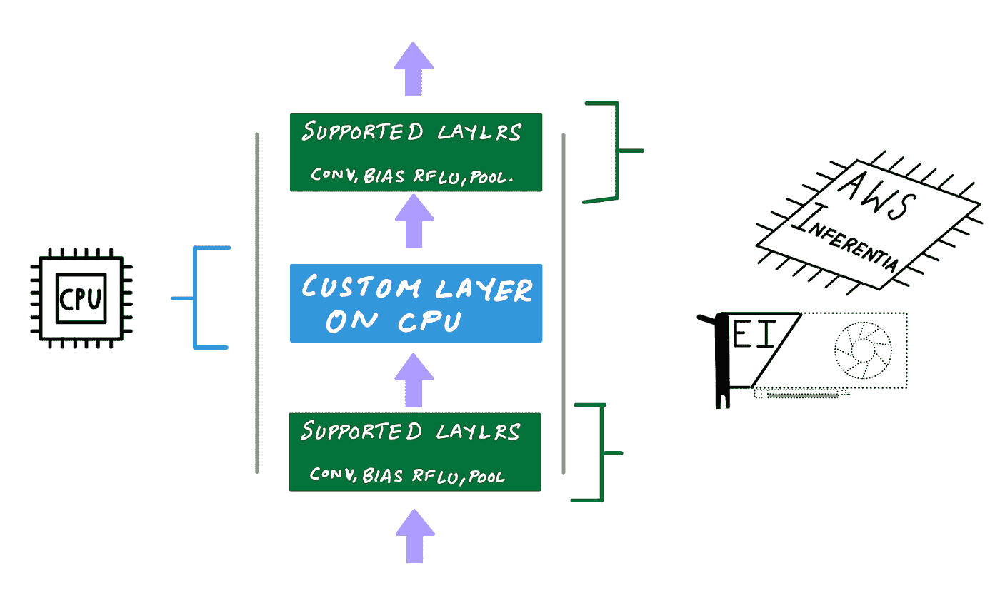

定制操作将是 CPU 分区的一部分，并将在主机实例的 CPU 上运行(作者的*插图)*

如果您在 FP32(单精度)中训练您的模型，AWS Neuron SDK 编译器会自动将您的 FP32 模型转换为 BF16 以提高推理性能。如果您更喜欢在 FP16 中提供模型，无论是通过在 FP16 中训练还是通过执行训练后量化，AWS Neuron SDK 将直接使用您的 FP16 权重。虽然 INT8 受 AWS 推理芯片支持，但 AWS Neuron SDK 编译器目前不提供支持 INT8 的部署方式。

## **3。AWS 推理灵活性和对如何使用推理神经元的控制**

在大多数情况下，AWS Neuron SDK 使 AWS 推理真正易于使用。使用 AWS 推理和 GPU 的用户体验的一个关键区别是，AWS 推理让您可以更好地控制每个内核的使用方式。

AWS Neuron SDK 支持两种利用所有 NeuronCores 提高性能的方式: **(1)批处理**和 **(2)流水线**。因为 AWS Neuron SDK 编译器是一个超前编译器，所以您必须在编译阶段显式启用这些选项。

让我们看看这些是什么以及它们是如何工作的。

## **a .使用批处理来最大化较大批量的生产量**

当您使用 AWS Neuron SDK 编译器编译一个大于 1 的模型时，批处理将被启用。在推理过程中，您的模型权重存储在外部存储器中，当开始向前传递时，由神经元运行时确定的层权重子集被复制到片上缓存中。使用缓存中该图层的权重，对整个批次计算向前传递。

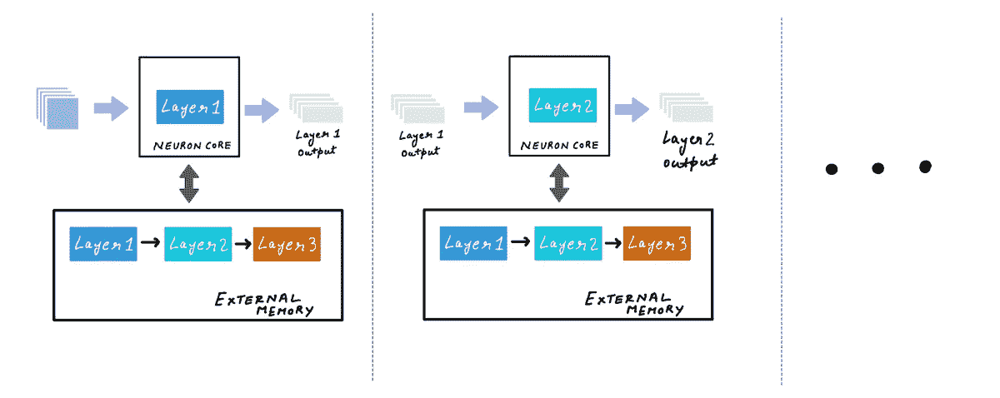

(*作者插图*)

之后，将下一组图层权重加载到缓存中，并对整个批次计算向前传递。这个过程继续进行，直到所有的权重都用于推理计算。当层仍在缓存中时，通过对大批量进行推理，批处理允许更好地分摊从外部存储器读取权重的成本。

所有这些都发生在后台，作为用户，您只需在编译期间使用示例输入设置所需的批处理大小。

即使批处理大小是在编译阶段设置的，在启用动态批处理的情况下，模型也可以接受可变大小的批处理。在内部，neuron runtime 将把用户批量分解为编译后的批量，并运行推理。

## **b .使用流水线技术，通过跨多个神经元缓存模型来改善延迟**

在批处理期间，模型权重从外部存储器逐层加载到片内缓存。借助流水线技术，您可以将整个模型权重加载到多核的片上缓存中。这可以减少延迟，因为神经元运行时不必从外部存储器加载权重。同样，所有这些都发生在幕后，作为用户，您只需在编译阶段使用`—-num-neuroncores`设置所需的内核数量。

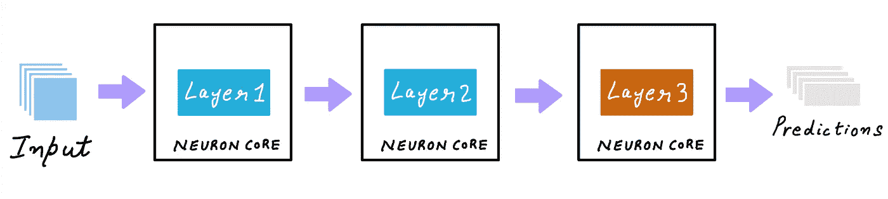

(*作者插图*)

批处理和流水线可以一起使用。但是，您必须尝试不同的流水线内核和编译批处理大小的组合，以确定最适合您的模型的组合。

在编译步骤中，批次大小和神经元核心数量的所有组合(对于流水线)可能都不适用。您必须通过扫描不同的值并监控编译器错误来确定批处理大小和神经元核心数量的工作组合。

## **在你的 Inf1 实例上使用所有神经核心**

根据您编译模型的方式，您可以:

1.  编译您的模型，以便在具有特定批处理大小的单个 NeuronCore 上运行
2.  通过管道将模型编译到具有特定批处理大小的多个神经元

成本最低的 Amazon EC2 Inf1 实例类型，`inf1.xlarge`有 1 个 AWS 推理芯片和 4 个神经元。如果您将模型编译为在单个 NeuronCore 上运行，`tensorflow-neuron`将自动在所有 4 个 neuron core 上并行执行数据。这相当于将您的模型复制 4 次，并将其加载到每个 NeuronCore 中，然后运行 4 个 Python 线程将数据输入到每个核心中。自动数据并行执行在 1 AWS 推理芯片之外不起作用。例如，如果您想将您的模型复制到一个`inf1.6xlarge`上的所有 16 个神经元，您必须生成多个线程来向所有 AWS 推理芯片提供数据。在 python 中你可以使用[concurrent . futures . threadpoolexecutor](https://docs.python.org/3/library/concurrent.futures.html#concurrent.futures.ThreadPoolExecutor)。

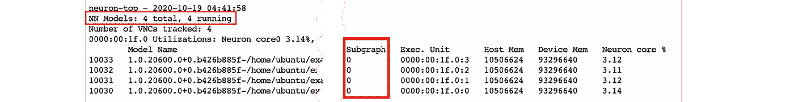

(*作者截图*)

当你为多个神经核心编译一个模型时，运行时将为每个神经核心分配不同的子图(作者截图)

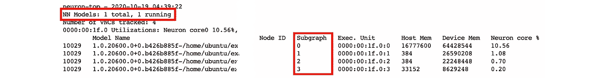

当你用流水线编译一个模型时，运行时会给每个 NeuronCore 分配不同的子图(作者截图)

## **4。在 Inf1 实例上部署多个模型**

AWS Neuron SDK 允许您将神经元分组到逻辑组中。每组可以有一个或多个神经元，可以运行不同的模型。例如，如果您在 inf1.6xlarge EC2 Inf1 实例上进行部署，您可以访问 4 个推理芯片，每个芯片有 4 个神经内核，即总共有 16 个神经内核。你可以把 16 个神经元分成 3 组。第 1 组有 8 个神经元核心，将运行一个使用流水线来使用所有 8 个核心的模型。第 2 组使用 4 个神经元核心，运行用 1 个神经元核心编译的模型的 4 个副本。第 3 组使用 4 个神经元核，并运行用 2 个神经元核通过流水线编译的模型的 2 个副本。您可以使用 neuron core _ GROUP _ size 环境变量来指定此配置，并将其设置为 NEURONCORE _ GROUP _ SIZES =，1，1，1，1，2，2

之后，您只需在单个 python 进程中按指定顺序加载模型，即首先加载编译为使用 8 个内核的模型，然后加载编译为使用 1 个内核的模型四次，然后使用加载编译为使用 2 个内核的模型两次。适当的核心将被分配给模型。

## Amazon EC2 Inf1 实例上的 AWS 推理加速推理示例

AWS Neuron SDK 预装在 AWS 深度学习 AMI 上，你也可以[安装 SDK 和神经元加速的框架和库](https://github.com/aws/aws-neuron-sdk/blob/master/docs/neuron-install-guide.md) TensorFlow、TensorFlow Serving、TensorBoard(带神经元支持)、MXNet 和 PyTorch。

下面的例子是在亚马逊 EC2 `Inf1.xlarge`和深度学习 AMI(Ubuntu 18.04)35.0 版本上测试的。

您可以在 Jupyter 笔记本上找到以下示例的完整实现:

> [https://github . com/shashankprasanna/ai-accelerators-examples/blob/main/in f1-neuron-SDK-resnet 50 . ipynb](https://github.com/shashankprasanna/ai-accelerators-examples/blob/main/inf1-neuron-sdk-resnet50.ipynb)

## **示例 1:在 AWS 推理系统**上部署带有 AWS Neuron SDK 的 ResNet50 TensorFlow 模型

在这个例子中，我比较了 3 个不同的选项

1.  **无批处理，无流水线**:编译 ResNet50 模型，批量= 1，核数= 1
2.  **有批处理，无流水线**:编译 ResNet50 模型，批处理大小= 5，内核数= 1
3.  **无批处理，带流水线**:编译 ResNet50 模型，批量= 1，核数= 4

你可以在这个 Jupyter 笔记本中找到完整的实现[。我就在这里回顾一下结果。](https://github.com/shashankprasanna/ai-accelerators-examples/blob/main/inf1-neuron-sdk-resnet50.ipynb)

下面的比较表明，在 Inf1.xlarge 实例上，使用选项 2(批处理大小= 1，无流水线)可以获得最佳吞吐量。您可以在大型 Inf1 实例上用其他组合重复这个实验。

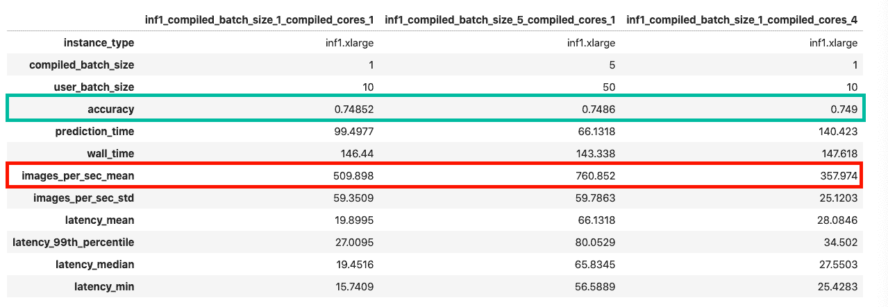

(*作者截图*)

# 加速器选项 3:亚马逊弹性推理(EI)推理加速

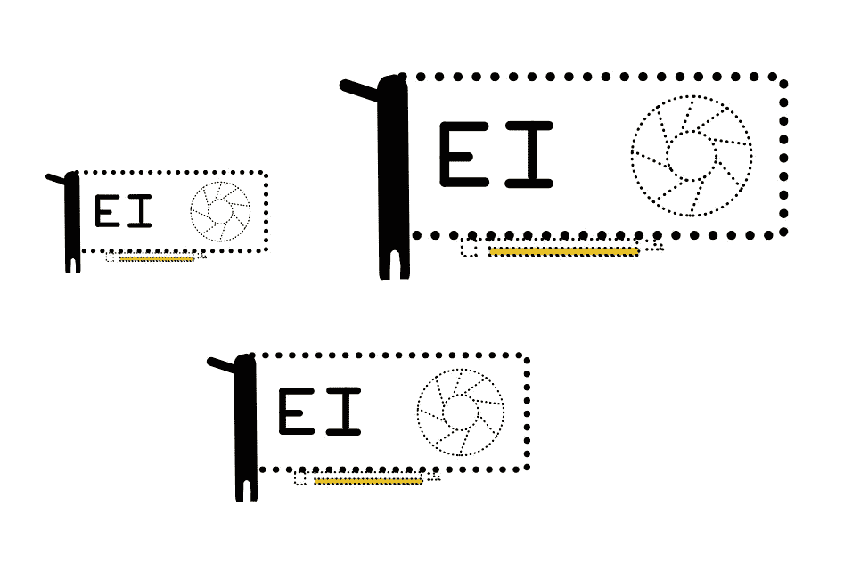

亚马逊弹性推理(*作者插图*)

[亚马逊弹性推理(EI)](https://aws.amazon.com/machine-learning/elastic-inference/) 允许您向纯 CPU 实例添加经济高效的可变大小 GPU 加速，而无需配置专用的 GPU 实例。要使用 Amazon EI，您只需提供一个纯 CPU 实例，如 Amazon EC2 C5 实例类型，并在发布时从 6 个不同的 EI 加速器选项中进行选择。

EI 加速器不是构成您的 CPU 实例的硬件的一部分，相反，EI 加速器通过使用 AWS PrivateLink 端点服务的网络连接，该服务将流量从您的实例路由到使用您的实例配置的弹性推理加速器。当您使用支持 EI 的服务框架(如 TensorFlow serving)时，所有这些都在幕后无缝发生。

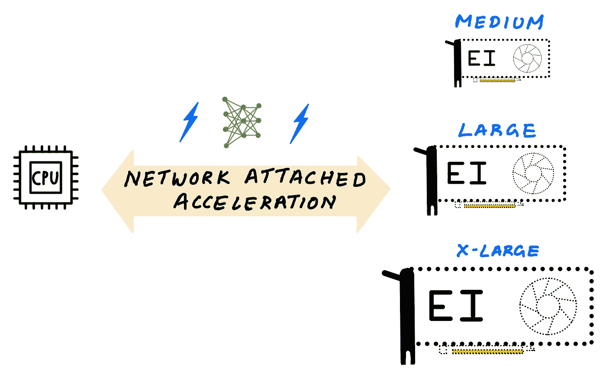

弹性推理允许您访问可变大小的 GPU 加速(*作者插图*)

Amazon EI 使用 GPU 来提供 GPU 加速，但与专用 GPU 实例不同，您可以选择添加 6 种不同加速器大小的 GPU 加速，您可以通过每秒万亿次浮点运算(TFLOPS)或 GPU 内存来选择。

## **为什么选择 Amazon EI 而不是专用 GPU 实例？**

正如我前面所讨论的，GPU 主要是吞吐量设备，当处理实时应用程序常见的较小批量时，当您部署不需要 GPU 的全部处理能力或全部内存的模型时，GPU 往往得不到充分利用。此外，如果您没有足够的需求或多个模型来服务和共享 GPU，那么单个 GPU 可能不具成本效益，因为成本/推理会上升。

您可以从 6 种不同的 EI 加速器中进行选择，这些加速器提供 1–4 TFLOPS 和 1–8 GB 的 GPU 内存。假设您有一个计算要求较低的模型，内存占用较小，您可以将最小的 EI 加速器(如`eia1.medium`)连接到一个 CPU 实例，该加速器提供 1 TFLOPS 的 FP32 性能和 1 GB 的 GPU 内存。如果您有一个要求更高的模型，您可以将一个具有 4 TFLOPS 性能和 8 GB GPU 内存的`eia2.xlarge` EI 加速器附加到一个 CPU 实例上。

CPU 实例+ EI 加速器的成本仍然比专用 GPU 实例便宜，并且可以降低推理成本。您不必担心 GPU 利用率的最大化，因为您添加的容量刚好满足需求，不会过度配置。

## **什么时候选择亚马逊 EI 而不是 GPU，选择什么样的 EI 加速器尺寸？**

让我们考虑下面的假设场景。比方说，如果您的总延迟(应用+网络+模型预测)低于 200 毫秒，您的应用可以提供良好的客户体验。比方说，使用 G4 实例类型，您可以将总延迟降至 40 毫秒，这完全在您的目标延迟范围内。您还尝试了使用纯 CPU C5 实例类型进行部署，您只能获得 400 毫秒的总延迟，这不符合您的 SLA 要求，导致客户体验不佳。

通过弹性推理，您可以将足够的 GPU 加速通过网络连接到一个 CPU 实例。在探索了不同的 EI 加速器尺寸(比如`eia2.medium`、`eia2.large`、`eia2.xlarge`)之后，您可以使用`eia2.large` EI 加速器将总延迟降至 180 毫秒，低于预期的 200 毫秒。由于 EI 比配置专用 GPU 实例便宜得多，因此您可以节省总部署成本。

## **1。亚马逊弹性推理性能**

由于 GPU 加速是通过网络添加的，因此与专用 GPU 实例相比，EI 会增加一些延迟，但仍比纯 CPU 实例更快，并且比专用 GPU 实例更具成本效益。与 EI 相比，专用 GPU 实例仍将提供更好的推理性能，但如果额外的性能没有改善您的客户体验，使用 EI 您将保持在目标延迟 SLA 之下，提供良好的客户体验，并节省总体部署成本。AWS 有许多[博客帖子，谈论与使用流行的深度学习框架的 CPU 和 GPU 相比的性能和成本节省](https://aws.amazon.com/blogs/machine-learning/category/artificial-intelligence/amazon-elastic-inference/)。

## **2。支持的型号类型、可编程性和易用性**

亚马逊 EI 支持在 TensorFlow、Apache MXNet、Pytorch 和 ONNX 模型上训练的模型。在您启动一个连接了 Amazon EI 的 Amazon EC2 实例后，要访问加速器，您需要一个支持 EI 的框架，比如 TensorFlow、PyTorch 或 Apache MXNet。

支持 EI 的框架预装在 [AWS 深度学习 AMI](https://docs.aws.amazon.com/dlami/latest/devguide/what-is-dlami.html) 上，但如果你更喜欢[手动安装，](https://docs.aws.amazon.com/elastic-inference/latest/developerguide/ei-tensorflow.html)Python wheel 文件也已可用。

大多数流行的模型，如 Inception，ResNet，SSD，RCNN，GNMT，都经过测试，在与 Amazon EI 一起部署时，可以节省成本。如果您正在部署带有自定义操作符的自定义模型，则支持 EI 的框架会对图形进行分区，以便在主机 CPU 上运行不支持的操作符，并在通过网络连接的 EI 加速器上运行所有支持的操作。这使得使用 EI 非常简单。

## **示例:使用 Amazon EI 部署 ResNet50 TensorFlow 模型**

这个例子是在亚马逊 EC2 c5.2xlarge 下面的 AWS 深度学习 AMI 上测试的:深度学习 AMI (Ubuntu 18.04)版本 35.0

您可以在此处找到 Jupyter 笔记本的完整实现:

> [https://github . com/shashankprasanna/ai-accelerators-examples/blob/main/ei-tensor flow-resnet 50 . ipynb](https://github.com/shashankprasanna/ai-accelerators-examples/blob/main/ei-tensorflow-resnet50.ipynb)

Amazon EI enabled TensorFlow 提供的 API 允许您使用 EI 加速器加速模型，其行为就像 TensorFlow API 一样。作为一名开发人员，您应该尽可能少地修改代码。

要加载模型，只需运行以下代码:

```
from ei_for_tf.python.predictor.ei_predictor import EIPredictoreia_model = EIPredictor(saved_model_dir,accelerator_id=0)
```

如果有多个 EI 加速器连接到您的实例，您可以使用 accelerator_id 参数来指定它们。只需用 eia_model 替换 TensorFlow 模型对象，脚本的其余部分保持不变，您的模型现在在 Amazon EI 上加速了。

下图比较了在同一个 CPU 实例上的纯 CPU 推理和 EI 加速推理。在本例中，您可以看到使用 EI 加速器后速度提高了 6 倍以上。

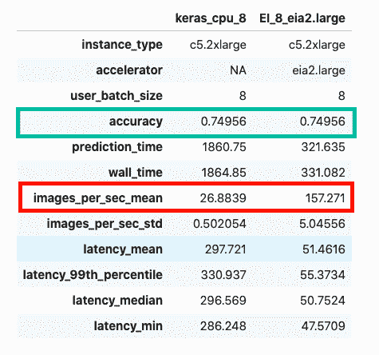

(*作者截图*)

# 摘要

如果我想让你从这篇博文中学到什么，那就是:部署需求是独一无二的，没有放之四海而皆准的方法。回顾您的部署目标，将它们与本文中的讨论进行比较，并测试所有选项。云让你在提交之前尝试变得简单。

在选择时，请牢记以下注意事项:

*   模型类型和可编程性(模型大小、自定义操作符、支持的框架)
*   目标吞吐量、延迟和成本(在预算范围内提供良好的客户体验)
*   编译器和运行时工具链的易用性(快速学习曲线，不需要硬件知识)

如果可编程性非常重要，并且您的性能目标较低，那么 CPU 可能正好适合您。

如果可编程性和性能很重要，那么您可以为在 GPU 上加速的定制操作开发定制 CUDA 内核。

如果您想要最低成本的选项，并且您的模型在 AWS 推理上受支持，那么您可以节省总体部署成本。

易用性是主观的，但没有什么能打败原生框架体验。但是，稍加努力，AWS Neuron SDK for AWS Inferentia 和 NVIDIA TensorRT for NVIDIA GPUs 都可以提供更高的性能，从而降低成本/推理。

感谢您的阅读。在本文中，我只能给你一瞥我们在本文中讨论的所有样本代码。如果您想重现结果，请访问以下 GitHub repo:

> [https://github . com/shashankprasanna/ai-accelerators-examples](https://github.com/shashankprasanna/ai-accelerators-examples)

如果你觉得这篇文章有趣，请看看我在[媒体](https://medium.com/@shashankprasanna)上的其他博文。

想让我写一个特定的机器学习主题吗？我很想收到你的来信！在 twitter ( [@shshnkp](https://twitter.com/shshnkp) )， [LinkedIn](https://www.linkedin.com/in/shashankprasanna/) 关注我或者在下面留言评论。