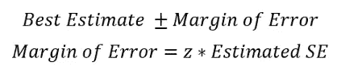
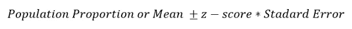
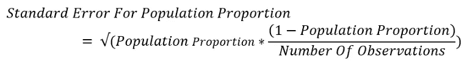
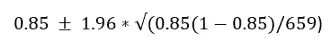
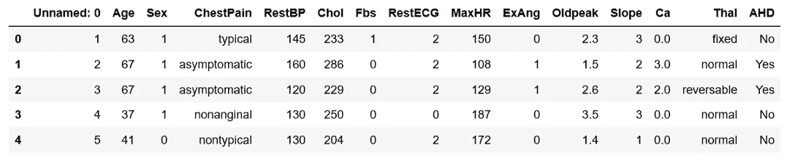
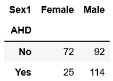
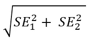
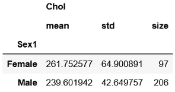
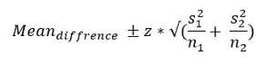
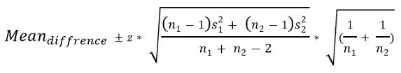

# 置信区间的完整指南，以及 Python 中的示例

> 原文：<https://towardsdatascience.com/a-complete-guide-to-confidence-interval-and-examples-in-python-ff417c5cb593?source=collection_archive---------1----------------------->


蒂姆·蒂德曼在 [Unsplash](https://unsplash.com?utm_source=medium&utm_medium=referral) 上的照片

## 对统计学中一个非常流行的参数——置信区间及其计算的深入理解

置信区间是统计学中的基本概念，对数据科学家来说非常重要。在本文中，我将用必要的公式彻底解释它，并演示如何使用 python 计算它。

## 置信区间

听起来，置信区间是一个数值范围。在理想情况下，它应该包含统计参数的最佳估计。它用百分比表示。95%置信区间最常见。如果您的研究需要，您可以使用其他值，如 97%、90%、75%，甚至 99%的置信区间。我们通过一个例子来理解一下:

这里有一个声明:

“在对 659 名带着蹒跚学步的孩子的父母进行的抽样调查中，大约 85%的人表示，他们在带着孩子的所有旅行中都使用汽车安全座椅。根据这些结果，提供了 95%的置信区间，从大约 82.3%到 87.7%。”

这句话的意思是，我们 95%确定带着蹒跚学步的孩子旅行时使用汽车安全座椅的人口比例将会下降到 82.3%到 87.7%。如果我们从这 659 人中抽取一个不同的样本或子样本，在 95%的时间里，带着他们的孩子在所有旅行中使用汽车安全座椅的人口比例将在 82.3%和 87.7%之间。

> 记住，95%的置信区间并不意味着 95%的概率

置信区间如此流行和有用的原因是，我们无法从所有人群中获取数据。就像上面的例子一样，我们不可能从所有有小孩的父母那里得到信息。我们必须计算来自 659 位家长的结果。从这个结果，我们试图得到一个总人口的估计。因此，合理的做法是考虑误差幅度并取一个范围。这就是为什么我们取一个置信区间，它是一个范围。

> 我们需要一个简单的随机样本和一个正态分布来构造一个置信区间。但是，如果样本量足够大(30 或更多)，正态分布是没有必要的。

来源:[吉菲](https://giphy.com/)

## 如何计算置信区间

置信区间的计算包括通过样本和误差幅度获得的最佳估计。因此，我们采用最佳估计，并加上误差幅度。下面是置信区间和误差幅度的公式:



**这里 SE 是标准误差**。

> 通常，CI 是针对两个统计参数计算的:比例和平均值。

结合上面的这两个公式，我们可以将 CI 的公式阐述如下:



人口比例或平均数是从样本中计算出来的。在“带着蹒跚学步的孩子的父母”的例子中，在带着他们的孩子的所有旅行中使用汽车座椅的父母的最佳估计或人口比例是 85%。所以，最好的估计(人口比例)是 85。置信水平(CL)的 z 得分是固定的。

> 对于足够大的样本量(30 或更多)，95%置信区间的 z 得分为 1.96。

以下是一些常用置信度的 z 值:


计算标准误差的方法因人口比例和平均值而异。计算人口比例标准误差的公式为:



计算样本平均值标准误差的公式为:


根据这份声明，带着孩子旅行时使用汽车安全座椅的人口比例为 85%。所以，这是我们最好的估计。我们需要增加误差幅度。为了计算误差幅度，我们需要 z 分数和标准误差。我将计算 95%的置信区间。z 值应该是 1.96，我已经提到了人口比例的标准误差公式。插入所有值:



置信区间是 82.3%和 87.7%正如我们之前在声明中看到的。

来源: [GIPHY](https://giphy.com/)

## Python 中的置信区间

我假设你已经是 python 用户了。但是，即使您不是 python 用户，您也应该能够理解计算的概念，并使用自己的工具进行计算。我在这个练习中使用的工具是:

1.  [Numpy 图书馆](https://numpy.org/)
2.  [熊猫图书馆](https://pandas.pydata.org/)
3.  [Statsmodels 库](https://devdocs.io/statsmodels/)
4.  [Jupyter 笔记本](https://jupyter.org/)环境。

如果你安装了一个 anaconda 包，你会得到一个 Jupyter 笔记本和其他工具。如果您还没有安装 anaconda 包，youtube 上有一些很好的视频可以演示如何安装。

## Python 中人口比例的 CI

我将使用来自 [Kaggle](https://www.kaggle.com/johnsmith88/heart-disease-dataset) 的心脏数据集。请点击链接下载数据集。首先，我导入了包和数据集:

```
import pandas as pd
import numpy as np
df = pd.read_csv('Heart.csv')
df
```



数据的最后一栏是“AHD”。它说一个人是否有心脏病。一开始，我们也有一个“性”专栏。

**我们将为患有心脏病的女性人口比例构建一个 CI。**

*首先，在新列“Sex1”中用“男性”和“女性”替换 1 和 0。*

```
df['Sex1'] = df.Sex.replace({1: "Male", 0: "Female"})
```

我们不需要数据集中的所有列。我们将只使用“AHD”列，因为它包含一个人是否患有心脏病以及我们刚刚创建的性别 1 列。制作一个只有这两列的数据帧，删除所有的空值。

```
dx = df[["AHD", "Sex1"]].dropna()
```

我们需要患心脏病的女性人数。*下面的代码行将给出患有心脏病和没有心脏病的男性和女性的数量。*

```
pd.crosstab(dx.AHD, dx.Sex1)
```

以下是输出表:



患有心脏病的女性人数是 25。*计算女性人口中患心脏病的比例。*

```
p_fm = 25/(72+25)
```

“p_fm”是 0.26。*女性人口数量:*

```
n = 72+25
```

女性人口为 97 人。*计算标准误差*

```
se_female = np.sqrt(p_fm * (1 - p_fm) / n)
```

标准误差为 0.044。

*现在使用上面的公式*构建配置项。对于 95%的置信区间，z 得分为 1.96。

```
z_score = 1.96
lcb = p_fm - z_score* se_female #lower limit of the CI
ucb = p_fm + z_score* se_female #upper limit of the CI
```

置信区间为 0.17 和 0.344。

您可以使用库“statsmodels”来计算它。

```
import statsmodels.api as sm
sm.stats.proportion_confint(n * p_fm, n)
```

置信区间出来和上面一样。

来源: [GIPHY](https://giphy.com/)

## 人口比例差异 CI

女性患心脏病的人口比例和男性患心脏病的人口比例一样吗？如果它们相同，那么两者的人口比例差异将为零。

**我们将计算患有心脏病的女性和男性人口比例差异的置信区间。**

以下是一步一步的过程:

*使用相同的程序计算患有心脏病的男性人口比例和标准误差。*

```
p_male = 114/(114+92)  #male population proportion
n = 114+92             #total male population
```

患有心脏病的男性人口比例为 0.55，男性人口数量为 206 人。*计算男性人口比例的标准误差。*

```
se_male = np.sqrt(p_male * (1 - p_male) / n)
```

男性人口的标准误差为 0.034。*计算标准误差的差值。*

> 标准误的区别不仅仅是减法。使用适当的公式。

下面是计算两个标准误差之差的公式:



让我们用这个公式来计算患有心脏病的男性和女性人口的标准误差的差异。

```
se_diff = np.sqrt(se_female**2 + se_male**2)
```

使用此标准误差计算患有心脏病的男性和女性的人口比例差异，并构建差异的置信区间。

```
d = 0.55 - 0.26
lcb = d - 1.96 * se_diff  #lower limit of the CI
ucb = d + 1.96 * se_diff  #upper limit of the CI
```

置信区间为 0.18 和 0.4。此范围中没有 0。这两个数字都大于零。因此，我们不能得出女性患心脏病的人口比例与男性患心脏病的人口比例相同的结论。如果置信区间为-0.12 和 0.1，我们可以说男性和女性患心脏病的比例是相同的。

资料来源: [GIPHY](https://giphy.com/)

## 平均值置信区间的计算

我们将使用相同的心脏病数据集。数据集有一个包含胆固醇水平的“胆固醇”列。对于这个演示，

我们将计算女性平均胆固醇水平的置信区间。

让我们找出女性人口的平均值、标准差和人口规模。我也想得到男性人口的相同参数。因为它将对我们的下一个练习有用。为此，请使用 pandas groupby 和 aggregate 方法。如果您需要了解 pandas groupby 和 aggregate 方法，请查看这篇文章:

[](/master-pandas-groupby-for-efficient-data-summarizing-and-analysis-c6808e37c1cb) [## Pandas 的 Groupby 功能详细，可进行高效的数据汇总和分析

### 学习对数据进行分组和汇总，以使用聚合函数、数据转换、过滤、映射、应用函数…

towardsdatascience.com](/master-pandas-groupby-for-efficient-data-summarizing-and-analysis-c6808e37c1cb) 

以下是获取男性和女性人口的平均值、标准差和人口规模的代码:

```
df.groupby("Sex1").agg({"Chol": [np.mean, np.std, np.size]})
```



如果我们只提取女性人口的必要参数:

```
mean_fe = 261.75  #mean cholesterol of female
sd = 64.9         #standard deviation for female population
n = 97            #Total number of female
z = 1.96          #z-score from the z table mentioned before
```

这里 1.96 是 95%置信水平的 z 值。

***使用平均值的标准误差公式计算标准误差***

```
se = sd /np.sqrt(n)
```

现在我们有了一切来构建女性平均胆固醇的置信区间。

***构造 CI***

```
lcb = mean_fe - z* se  #lower limit of the CI
ucb = mean_fe + z* se  #upper limit of the CI
(lcb, ucb)
```

CI 出来是 248.83 和 274.67。

> 这意味着女性胆固醇的真实平均值将在 248.83 和 274.67 之间

资料来源: [GIPHY](https://giphy.com/)

## 计算均值差的置信区间

有两种方法可以计算两个总体均值差异的置信区间。

> 集合方法和非集合方法

如前所述，我们需要一个简单的随机样本和一个正态分布。如果样本很大，正态分布是不必要的。

> 集合方法还有一个假设。即两个总体的方差相同或几乎相同。

如果方差不相同，则无池方法更合适。

集合方法的标准误差公式为:



这里，s1 和 s2 是人口 1 和人口 2 的标准误差。同样，n1 和 n2 是人口 1 和人口 2 的人口规模。

无池方法的标准误差公式为:



**这里，我们将构建男性和女性人群胆固醇水平均值差异的置信区间。**

在前一个例子中，我们已经从数据集中获得了所有必要的参数。他们在这里:

```
n1 = 97
n2 = 206
mean_female = 261.75
mean_male = 239.6
sd_female = 64.9
sd_male = 42.65
```

> 我们可以看到，两个目标人群的标准差是不同的。所以。方差也必须不同。

因此，对于本例，无缓冲池方法更合适。

*使用我们在上一示例中使用的公式计算男性和女性人口的标准误差*

```
sem_female = sd_female / np.sqrt(97)
sem_male = sd_male / np.sqrt(206)
```

*两个样本平均值的差异*

```
mean_d = mean_female - mean_male
```

平均值' mean_d '的差值为 22.15。

*使用无池方法的公式，计算标准误差的差异:*

```
sem_d = (np.sqrt((n1-1)*se_female**2 + (n2-1)*se_male**2)/(n1+n2-2))*(np.sqrt(1/n1 + 1/n2))
```

*最后，构建均值差异的 CI*

```
lcb = mean_d - 1.96*sem_d  #lower limit of the CI
ucb = mean_d + 1.96*sem_d  #upper limit of the CI
(lcb, ucb)
```

置信区间的下限和上限分别为 22.1494 和 22.15。他们几乎是一样的。这意味着女性人口的平均胆固醇与男性人口的平均胆固醇没有不同。

## 结论

在本文中，我试图用 python 中的计算过程来详细解释置信区间。我在这里使用的 Python 代码足够简单，任何人都可以理解。即使你不是 python 用户，你也应该能够理解这个过程并以你的方式应用它。

来源: [GIPHY](https://giphy.com/)

推荐阅读:

[](/a-complete-guide-to-hypothesis-testing-for-data-scientists-using-python-69f670e6779e) [## 数据科学家使用 Python 进行假设检验的完整指南

### 用样本研究问题、解决步骤和完整代码清楚地解释

towardsdatascience.com](/a-complete-guide-to-hypothesis-testing-for-data-scientists-using-python-69f670e6779e) [](/an-ultimate-guide-to-time-series-analysis-in-pandas-76a0433621f3) [## 熊猫时间序列分析终极指南

### 在 Pandas 中执行时间序列分析所需的所有 Pandas 功能。您也可以将此用作备忘单。

towardsdatascience.com](/an-ultimate-guide-to-time-series-analysis-in-pandas-76a0433621f3) [](/multivariate-linear-regression-in-python-step-by-step-128c2b127171) [## Python 中多元线性回归的逐步实现

### 学习用 Python 从头开始开发任意数量变量的多元线性回归。

towardsdatascience.com](/multivariate-linear-regression-in-python-step-by-step-128c2b127171) [](/indexing-and-slicing-of-1d-2d-and-3d-arrays-in-numpy-e731afff0bbe) [## Numpy 中 1D、2D 和 3D 数组的索引和切片

### 本文从基础到高级展示了 Numpy 数组的索引和切片。

towardsdatascience.com](/indexing-and-slicing-of-1d-2d-and-3d-arrays-in-numpy-e731afff0bbe) [](/multiclass-classification-algorithm-from-scratch-with-a-project-in-python-step-by-step-guide-485a83c79992) [## 使用 Python 从零开始的多类分类算法:分步指南

### 本文介绍两种方法:梯度下降法和优化函数法

towardsdatascience.com](/multiclass-classification-algorithm-from-scratch-with-a-project-in-python-step-by-step-guide-485a83c79992) [](/a-complete-k-mean-clustering-algorithm-from-scratch-in-python-step-by-step-guide-1eb05cdcd461) [## Python 中从头开始的完整 K 均值聚类算法:分步指南

### 还有，如何使用 K 均值聚类算法对图像进行降维

towardsdatascience.com](/a-complete-k-mean-clustering-algorithm-from-scratch-in-python-step-by-step-guide-1eb05cdcd461)