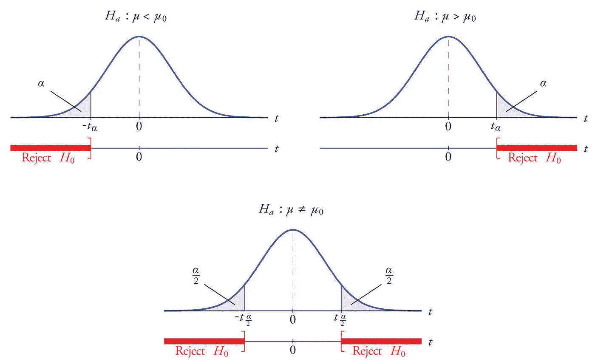
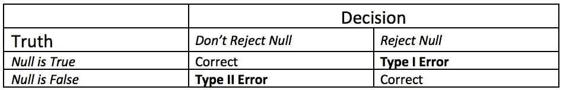
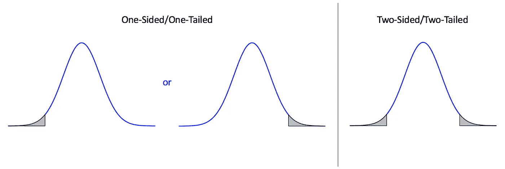
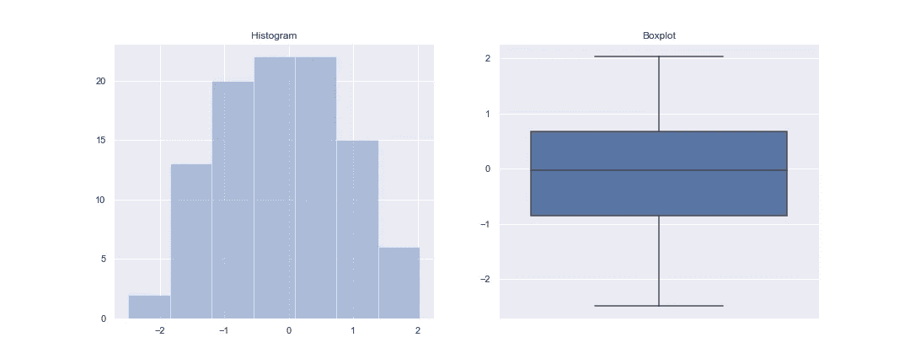
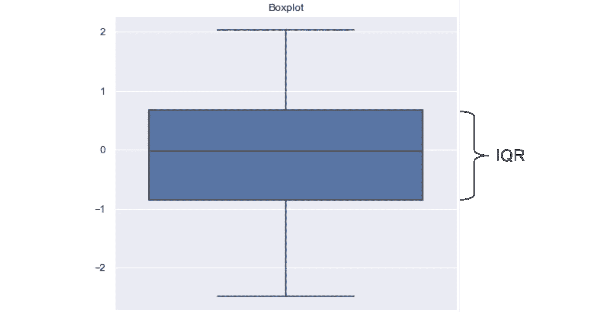

# 假设检验完全指南

> 原文：<https://towardsdatascience.com/a-complete-guide-to-hypothesis-testing-2e0279fa9149?source=collection_archive---------19----------------------->

## 从控制测试错误到选择正确的测试



照片来自[升压分析](https://courses.stepupanalytics.com/testing-of-hypothesis-and-its-application-using-r/)

假设检验是一种统计推断的方法，它考虑了零假设 H *₀* 与替代假设 H *a* 的对比，在这种情况下，我们通常会评估针对 H *₀* 的证据。此类测试用于将数据集相互比较，或将数据集与某种外部标准进行比较。前者是双样本检验(独立或配对)，后者是单样本检验。比如“A 组比 B 组有更高的疼痛耐受度吗？”或者“对照组的平均年龄是 21 岁吗？”，分别为。假设检验以基于预先指定的显著性水平α的决策结束——当我们有足够强的证据反对时拒绝零假设，或者拒绝零假设失败。

# 测试误差

现在的问题是，我们如何知道我们是否有足够强的证据来反对这个无效假设？要回答这个问题，我们必须首先了解测试中不同类型的错误。



任何一个错误都被认为是不好的，因此当对假设检验做出决定时，我们希望将这种错误的概率降到最低。通常，我们用α= P(I 型误差)和β= P(II 型误差)来表示。

## 控制第一类错误

重申一下，第一类错误包括错误地拒绝零假设，而事实上零假设是真的。如果您熟悉假设检验，您可能已经看到统计学家通常将显著性水平设置为α = 0.05，并在 p 值小于或等于α时拒绝零假设。也就是说，如果 null 为真，那么我们拒绝它的概率很小(I 型错误)。顺便提一下，p 值对应于如果 H *₀* 为真，我们获得类似结果的可能性。

## 控制第二类错误

另一方面，第二类错误包括当零假设实际上为假时不拒绝它。如前所述，β = P(第二类误差)。不犯第二类错误的概率叫做幂，幂= 1 - β。请注意，我们需要低β，因此高功率很好。功效取决于真参数θ的值和样本大小。

我们如何估计功率？考虑下面这个例子:假设我们测试 h*₀:*𝜇= 9 vs . h*a:*𝜇≠9，其中𝜇是总体均值，但实际上，𝜇 = 8。这意味着 H *₀* 是不正确的，我们想要拒绝它。为了确定这种情况发生的可能性有多大，我们还需要总体标准偏差，比如我们在之前的研究中得到𝜎 = 3，样本量，比如
*n* = 20。然后，我们通过从真实分布中反复抽取随机样本并测试其平均值是否为 9 来估计功效。如果我们对 1000 个随机样本进行测试，并正确剔除 H *₀* 比方说357 次，则估计功效为 0.357。

权力的另一个用途是，通常，研究人员会用它来确定他们研究所需的样本量。换句话说，需要多大的样本才能达到一定的功效？

# 样本和测试类型

假设检验可以是单样本检验、双样本检验或配对检验。此外，这些测试可以是单面或双面的。这两者之间的区别在于我们希望测试什么。

## 一个样本

单一样本测试包括将数据与外部值进行比较。这不是将两组进行比较，而是将一组与所述外部标准进行比较。

## 两个独立的样本

双独立样本测试将数据中的一组与另一组进行比较，其中两组是独立的。也就是说，为这些组记录的观察结果是独立的，然后我们将它们相互比较。

## 配对

当我们对每个受试者进行两次测量时，我们就有了配对，或两个从属样本。通常，我们会在一段时间后对受试者进行重新测试时看到这种情况。



单边测试和双边测试的区别

## 片面的

当我们希望确定比较组之间或与外部标准相比的差异在哪个方向时，就会出现单侧检验。在这种情况下，测试的目的只包括检查一端，而忽略另一端发生的情况。一个例子是测试 A 组是否比 B 组在考试中表现得更好。这里，我们注意到我们只关心 A 和 B 之间的差何时为正。

## 双面的

双边测试包括测试比较组之间或与外部标准相比是否存在差异。在这种情况下，差异可以是正的，也可以是负的。

# **检查假设**

## 评估常态

t 检验的主要假设是数据呈正态分布。更准确地说，我们需要样本均值的抽样分布近似正态…但我们现在忽略这一点，因为这需要一些关于 bootstrap 分布的知识，并简单地考虑数据的近似正态性。通常，对于大样本量，我们通过中心极限定理得到近似正态性。然而，如果我们的样本不是那么大，在进行 t 检验之前评估正态性是一个好主意。

检查正态分布数据的一些简单方法是检查数据的箱线图或直方图表示。在 Python 中获得这种图形的一个快速方法是通过 Seaborn 库。例如，这里有一个快速获得这些图的方法，其中 *x* 代表我们想要评估的数据样本。

```
import numpy as np 
import seaborn as sns
from matplotlib import pyplot as plt# generate normal data
sns.set()
np.random.seed(100)
x = np.random.normal(size=100)# put plots side by side
fig, ax = plt.subplots(1, 2, figsize=(15, 6))
# histogram
sns.distplot(x, kde=False, ax=ax[0]).set_title("Histogram")
# boxplot
sns.boxplot(x=x, orient="v", ax=ax[1]).set_title("Boxplot")
```



从上面两个图中的每一个来评估正态性是非常简单的。对于直方图，我们希望看到关于平均值和相当均匀的尾部的对称性。对于箱线图，我们希望胡须长度相当均匀(与正态分布的尾部相关)。此外，在这两种情况下，我们都不希望看到任何异常值，也不希望看到有偏差的数据。如果数据是右偏的，那么我们会注意到直方图上的大部分条形会浓缩到左边，并且箱线图上会有一个较长的上须。在我们的示例中，考虑到用于生成上述图的数据是从正态分布中直接采样的，因此生成的图符合正态分布是有意义的。

## 评估差异

一旦我们得出结论，我们的数据是近似正常的，我们需要决定使用哪两个样本 t 检验，因为还有进一步的假设要检查。该决定基于被比较的两组是否具有相等的价差/方差。为了评估这一点，我们将查看两组的箱线图。如果价差相同，两个箱线图的四分位数间距 **(** IQR)将大致相同。



# 选择正确的测试

最常见的假设检验是 t 检验。然而，t 检验(类似于其他检验)带有假设，如果这些假设不满足，结果就没有意义。除了数据中被比较的组的数量之外，我们还必须根据数据的分布选择合适的测试。下面提到的大多数测试都可以通过 Python 的 Scipy 库访问。

## t 检验

如果我们得出数据具有近似正态性的结论，那么我们可以使用 t 检验。有单样本 t 检验和两种双样本 t 检验:混合 t 检验(等方差)和 Welch-Satterthwaite t 检验(不等方差)。t 检验的另一种情况是当我们有两个彼此相关的样本时，即配对情况，我们将使用配对 t 检验。

对于一个单样本 t 检验，零假设 H *₀* 是“平均值等于θ *₀* ”对比另一个假设 H *a* 是“平均值不等于/小于/大于θ *₀* ”。

```
from scipy import stats
# one sample t-test (two-sided)
stats.ttest_1samp(group1, null_mean)
```

对于两个样本的 t 检验(其中样本是独立的)，H *₀* 是“a 组的平均值等于 b 组的平均值”，而另一个假设 H *a* 是“a 组的平均值不同于/大于/小于 b 组的平均值”。在两个样本的情况下，每个组都需要满足近似正态性。此外，我们需要评估两组的方差来决定使用哪两个样本 t 检验。缺省值是不等方差。

```
from scipy import stats
# two sample t-test (two-sided)
stats.ttest_ind(group1, group2, equal_var=True) #for Pooled
```

对于配对 t 检验，H *₀* 为“两组的平均值相等”或“两组平均值之间的真实差值为 0”。在这里，两组之间的差异必须是近似正常的。

```
from scipy import stats
# matched pairs t-test
stats.ttest_rel(group1, group2)
```

## 方差分析

当每个独立组都近似正态，并且正在比较三组或更多组的独立观察值时，我们必须使用方差分析(ANOVA)。ANOVA 有 H *₀* “所有组都有相同的平均值”与 H *a* “至少一个组有不同于其他组的平均值”。

同样，与 t-test 一样，我们需要检查各组之间的方差是否相等。如果两组之间的差异相等，我们可以进行常规的单向方差分析。如果各组之间的差异不相等，我们将需要使用韦尔奇方差分析。后一种测试可通过 Python 的 Pingouin 库获得。

```
from scipy import stats
# one-way ANOVA
stats.f_oneway(group1, group2, group3, ...)
```

请注意，这个测试不会让我们知道差异在哪里，因此我们必须做进一步的测试，以找出哪个组与其他组不同，如果有的话。在方差相等的情况下，我们将用 TukeyHSD 检验继续分析。在方差不相等的情况下，Games-Howell 是可行的。

## 符号测验和情绪中值测验

如果我们得出数据不是近似正态的结论，我们就不能从 t 检验中得到任何有意义的或可靠的结果。然后我们必须求助于一个不依赖于分布对称性的检验。对于一个样本测试，我们应该求助于符号测试。虽然当测试两个或更多组时，我们将使用 Mood 的中位数测试。这些测试基于数据的中位数而不是平均值来评估组间的关联。值得注意的是，这些基于中位数的测试并没有对数据的基本分布做任何假设。

符号检验有 H *₀* “中值等于θ *₀* ”，而 Mood 中值检验的零假设是“各组有相同的(大)中值”，而替代假设是“其中一组的中值不同于大中值”。

```
from scipy import stats
# Mood's median test
stats.median_test(group1, group2, ..., ties)
```

Mood 的中位数检验可用于比较两组或更多组。因此，如果我们比较两个以上的组，类似于方差分析，我们需要找到中位数的差异发生在哪里(如果有的话)。我们通过成对中位数检验来实现。