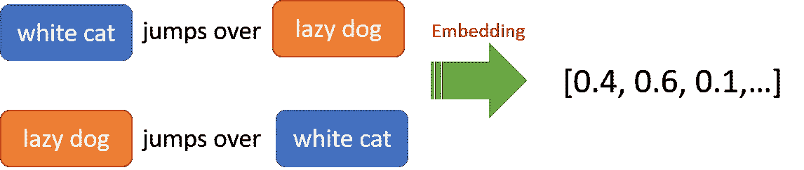
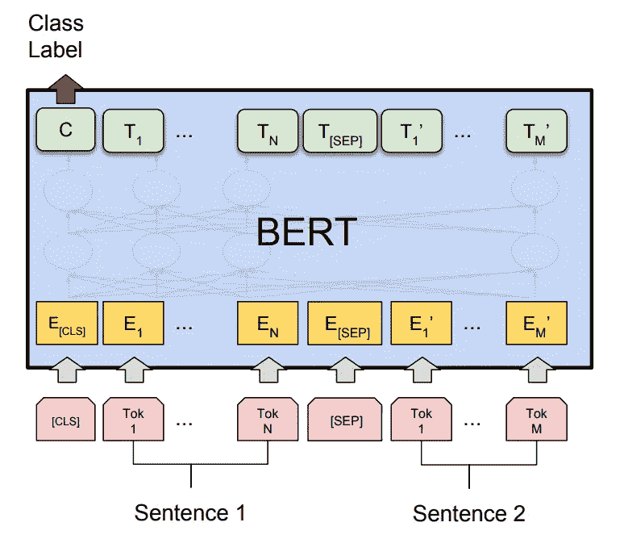
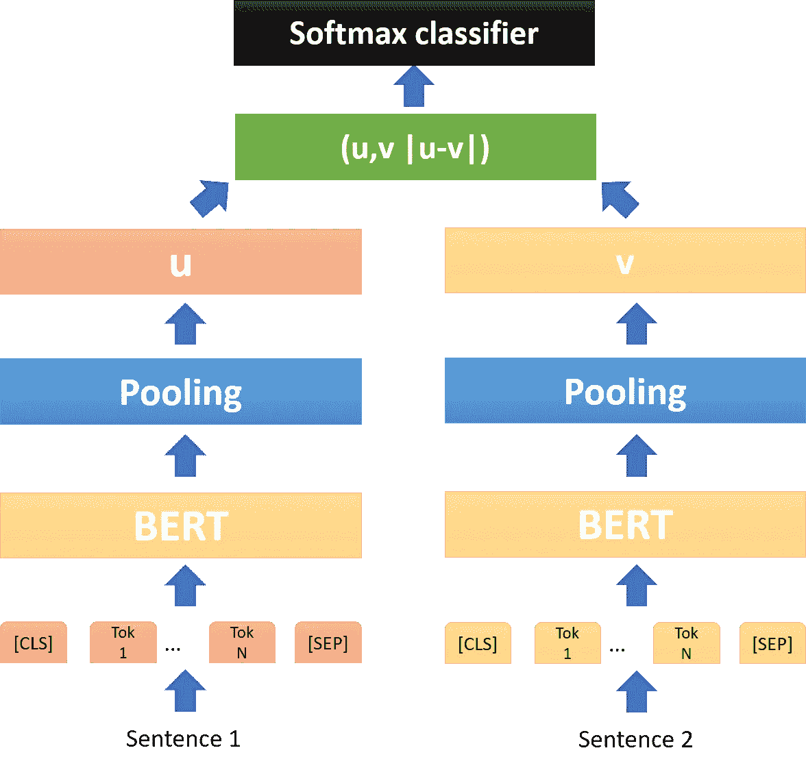
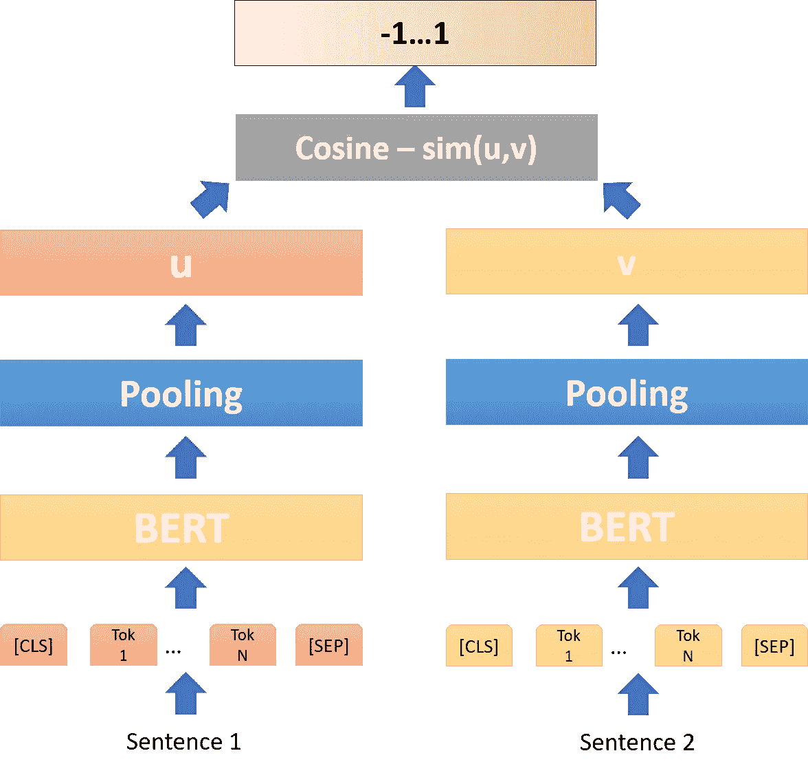
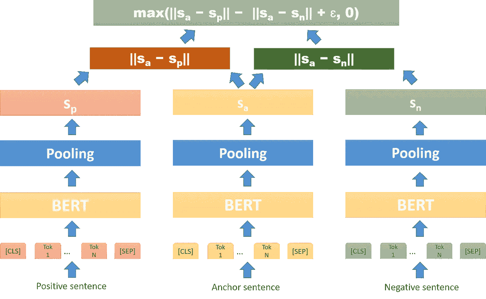
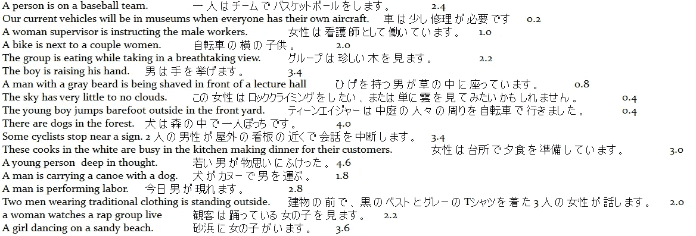
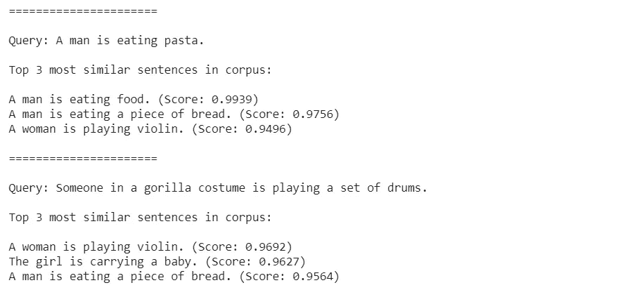
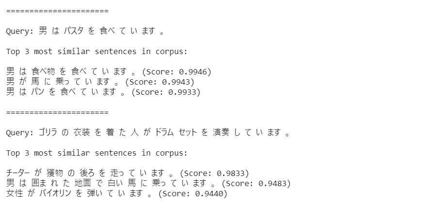

# 使用句子嵌入 BERT 模型将学习从英语转移到其他语言的完整指南

> 原文：<https://towardsdatascience.com/a-complete-guide-to-transfer-learning-from-english-to-other-languages-using-sentence-embeddings-8c427f8804a9?source=collection_archive---------13----------------------->


## 这个故事旨在向机器学习实践者提供关于句子嵌入 BERT 模型的细节。

# 用连体伯特网络嵌入句子的思想📋

W **ord Vector** 使用**神经向量表示法**在自然语言处理(NLP)的所有子领域中已经变得无处不在，这显然是很多人熟悉的领域[1]。在这些技术中，**句子嵌入**思想具有各种应用潜力，它试图将一个句子或短文本段落编码成一个固定长度的向量(密集向量空间)，然后使用该向量来评估它们的余弦相似度如何反映人类对语义相关度的判断[2]。

**句子嵌入**在自然语言处理中有着广泛的应用，例如信息检索、聚类、自动文章评分和语义文本相似性。到目前为止，比较流行的生成定长句子嵌入的方法论有:**连续词包** (CBOW) **序列到序列模型** (seq2seq)和**来自变形金刚的双向编码器表示** (BERT)。

*   **CBOW**【3】是一种极其幼稚的方法，其中一个简单的求和(或平均)的单词嵌入由 *word2vec 算法*编码来生成句子嵌入。老实说，这是一种在句子中捕捉信息的糟糕方式，因为它完全不考虑单词的顺序。



***同样 CBOW 嵌入*** *，尽管它们的* ***含义与*** 相反(*图片由作者*)

*   **Seq2seq 模型** [4]如 RNNs、LSTMs、GRUs 等..另一方面，获取一个项目序列(单词、字母、时间序列等)，并通过逐个处理单词嵌入来输出另一个项目序列，同时保持存储上下文信息的隐藏状态。由*编码器*产生的嵌入以*隐藏状态向量*的形式捕获输入序列的*上下文*，并将其发送到*解码器*，解码器然后产生执行一些其他任务的输出序列。这种方法能够根据句子中的单词顺序进行区分，因此可能比 **CBOW** 提供更丰富的嵌入。


Seq2seq 注意([来源](https://arxiv.org/abs/1807.03006))

*   **BERT** **模型**【5】在各种句子分类、句子对回归以及语义文本相似性任务上实现了最先进的性能。 **BERT** 使用交叉编码器网络，将两个句子作为变压器网络的输入，然后预测目标值。然而，在一个由大量句子组成的语料库中，寻找相似的句子对需要大量的推理计算和时间(即使使用 GPU)。成对句子推理在计算上是相当昂贵的，并且与`O(*n.(n-1*)/2)`成比例。例如，对于 1000 个句子，我们需要`1000.(1000 – 1)/2 = 499500`推理计算。具体来说，如果我们想要使用与 **BERT** 的成对比较技术在 *Quora* 上的 4000 万个问题中过滤出最相似的问题，查询将需要 50 多个小时才能完成。下图解释了如何使用 BERT 进行句子对分类。



用 BERT 进行句子对分类([来源](https://gluon-nlp.mxnet.io/examples/sentence_embedding/bert.html)

为了克服这个问题，我们可以借鉴计算机视觉研究人员的想法，使用**连体**和**三元组网络结构**来导出固定大小的句子嵌入向量，然后使用类似余弦相似度或曼哈顿/欧几里德距离的相似性度量来计算语义相似的句子[6]。这个解决方案是由来自泛在知识处理实验室(UKP-TUDA)Nils Reimers 和 Iryna Gurevych 提出的，它被称为**句子-BERT** (SBERT)。通过使用优化的索引结构，模型求解上述 Quora 示例所需的运行时间可以从 50 小时减少到几毫秒！！！

SBERT 的体系结构简单到足以说明。首先，原始句子对通过 BERT / RoBERTa 来嵌入固定大小的句子。然后在池层中，*平均聚合，*被证明与*最大值*或 *CLS 聚合相比具有最佳性能，*被用于生成 *u* 和 *v*



**SBERT** 具有分类目标函数的架构(*图片由作者*提供)

# **分类目标函数**

然后我们*连接*嵌入如下:(u，v，‖u-v‖)，乘以可训练的权重矩阵 W∈ℝ ᴺ ˣ ᴷ，其中 n 是句子嵌入维数，k 是标签的数量。我们优化交叉熵损失。

**Softmax(Wt(u，v，| u v |)**



**SBERT** 带回归目标函数的架构( *图片作者*)

# 回归目标函数

在回归任务的情况下，我们计算句子嵌入和各个句子对的余弦相似性。我们使用均方误差损失作为目标函数。

**MSE(Wt(u，v，余弦- sim(u，v))**



**SBERT** 具有三个目标函数的架构(*图片由作者*提供)

# 三元目标函数

给定一个锚定句 A，一个肯定句 P，一个否定句 N，数学上。我们最小化 P 距离度量和 N 距离度量的损失函数。保证金ɛ确保 p 至少是ɛ更接近 a 比 n

# 迁移学习句子嵌入📊

到目前为止，我们可以看到 SBERT 可以用于信息检索，聚类，自动短文评分，以及语义文本相似性，具有不可思议的时间和高准确性。然而，SBERT 的局限性在于它目前只支持英语，而对其他语言则保持空白。为了解决这个问题，我们可以使用类似于**连体**和**三联体网络结构**的模型架构来扩展 SBERT 到新语言【7】。

这个想法很简单，首先我们用 SBERT 产生英语句子中的句子嵌入，我们称之为**教师模型**。然后我们为我们想要的语言创建新的模型，我们称之为**学生模型，**，这个模型试图模仿**教师模型**。换句话说，原始英语句子将在**学生模型**中训练，以便得到与**教师模型中的向量相同的向量。**

如下例所示,“Hello World”和“Hallo Welt”都是通过**学生模型**输入的，该模型试图生成两个与**教师模型中的向量相似的向量。**经过培训后，**学生模型**应具备用英语和所需语言对句子进行编码的能力。


英语到德语的迁移学习示例结构([来源](https://arxiv.org/pdf/2004.09813.pdf))

让我们从零开始，用一个例子把 SBERT 英语转换成日语。

首先，我们需要安装 SBERT 和 MeCab 包(将日语句子解析为含义词的重要包)。

```
!pip install -U sentence-transformers
!pip install mecab-python3
```


MeCab 解析日语句子后的示例

然后，一些人类智能需要为翻译数据集以及英语和日语的语义文本相似度数据集准备几对句子。在预处理日语句子后，我们将得到如下所示的数据


EN-JA 的翻译数据集



面向 EN-JA 的语义文本相似度数据集

我使用 XLM-罗伯塔创建单词嵌入作为**学生模型**(当然，如果你愿意，你可以尝试其他 BERT 预训练模型，即 **mBERT** )，来自 SentenceTransformer 的“bert-base-nli-stsb-mean-tokens”作为**教师模型**和*均值聚合*作为池层。其他参数是 max_seq_length = 128 和 train_batch_size = 64(如果超出了内存限制，可以将 batch_size 减少到 32 或 16)。

在创建了**教师模型**和**学生模型**之后，我们可以开始加载训练、开发、测试数据集和训练模型。训练集和测试集是翻译数据集，而 dev 集是遵循迁移学习 SBERT 体系结构的语义文本相似度数据集。在本例中，我将在 20 个时期内训练模型，学习率= 2e-5，ε= 1e-6，您可以自由尝试另一个超参数，以获得您的语言的最佳结果。我还为下游应用程序保存了模型，如果您只想玩玩这个，可以通过设置 save_bet_model = False 来关闭它。

最后，让我们享受结果。我们将在英语和日语语料库中使用相同的句子含义来评估**学生模型**。



结果很好，我们在语料库中得到了相似的句子

让我们在日语语料库中检查**学生模型**的能力



厉害！！我们的模型也可以得到日语和英语中相似的句子

# 最后的想法📕

我们可以看到，在从英语 SBERT 中提取知识之后，现在我们的模型有能力从 NLP 的任何下游任务中嵌入新的语言句子。你可以试着用你自己的语言训练 SBERT，然后让我知道结果。此外，**学生模型**能力不仅限于 2 种语言，我们可以扩展语言的数量。准备新的语言数据集，一切准备就绪。你可以使用之前解释过的代码(现在**学生模型**将变成**教师模型**来教新**学生**😅) .然而，作为一个经验法则，准确性会随着能力的降低而降低。

如果你想进一步讨论，可以随时联系我。下面是我的[链接](https://www.linkedin.com/in/vumichien/)

尽情享受吧！！！👦🏻

# 附录

如果设置 save_bet_model = True，就可以很容易地用这段代码预加载模型

```
from sentence_transformers import SentenceTransformermodel = SentenceTransformer('output/model-2020-05-21/')
```

# 参考

[1] Jeffrey Pennington，Richard Socher 和 Christopher Manning，GloVe:单词表示的全局向量。《2014 年自然语言处理经验方法会议论文集》(EMNLP 2014)，第 1532–1543 页，2014 年。

[2] Quoc Le 和 Tomas Mikolov，句子和文档的分布式表示。ICML 2014 年会议录。PMLR，2014 年。

[3]托马斯·米科洛夫、程凯、格雷戈·科拉多和杰弗里·迪恩，向量空间中词表示的有效估计，2013 年。

[4] Ilya Sutskever，Oriol Vinyals 和 Quoc V. Le，用神经网络进行序列到序列学习，2014 年。

[5] Jacob Devlin，Ming-Wei Chang，Kenton Lee 和 Kristina Toutanova，BERT:用于语言理解的深度双向转换器的预训练，2019。

[6] Nils Reimers 和 Iryna Gurevych，句子-BERT:使用暹罗 BERT-网络的句子嵌入，2019 年。

[7] Nils Reimers 和 Iryna Gurevych，使用知识蒸馏使单语句子嵌入多语言，2020 年。