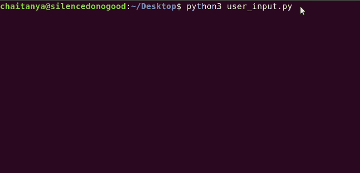
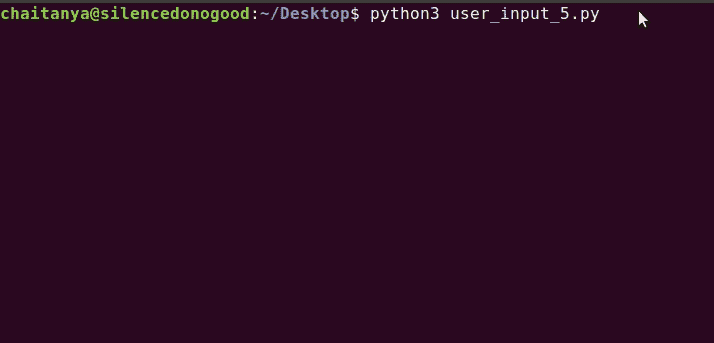
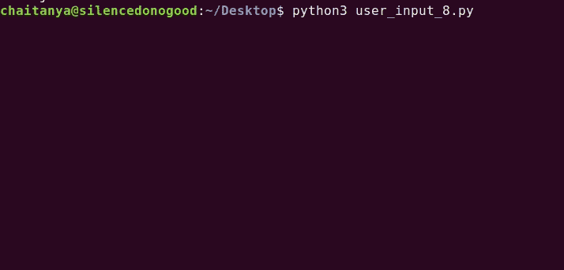

# Python 用户输入完全指南

> 原文：<https://towardsdatascience.com/a-complete-guide-to-user-input-in-python-727561fc16e1?source=collection_archive---------4----------------------->

## Python 初学者

## 详细了解 Python 输入函数及其许多用例


照片由[凯特琳·贝克](https://unsplash.com/@kaitlynbaker?utm_source=medium&utm_medium=referral)在 [Unsplash](https://unsplash.com?utm_source=medium&utm_medium=referral) 上拍摄

ser 输入对于构建交互式程序至关重要。每种编程语言都有其独特的输入接口实现。C++有`scanf`，Java 有`Scanner`类，Ruby 有`gets`。

虽然在大多数情况下，这种**输入来自键盘**，但也有其他形式，如鼠标点击、跟踪板、传感器等。也是可能的。

和往常一样， **Python 提供了一个简单的框架，以`input()`函数的形式获取用户输入**。

> **input 函数从控制台读取一行，转换成字符串，然后返回。**

在本教程中，我们将通过各种用例详细介绍`input()`功能。我们将讨论输入可能存在的几种形式，以及如何在代码片段的帮助下**将输入解析成我们需要的格式**。

资料来源:[吉菲](https://giphy.com/gifs/sherlock-anderson-input-thank-you-for-your-l0HlJ7aAQyvjxM6B2)

# 句法

> 输入([提示])

这里，
**提示**:可选字符串参数，用于向用户显示消息。示例:“输入姓名:”

当调用`input()`功能时，**程序流程暂停，直到用户输入一些输入**。然后用户添加一些信息并按下`Enter`键。input 函数用输入的字符串返回程序。

```
entered_value = input('Enter some value: ')
print(entered_value)
```

输出:



来源:作者

# 输入类型

input 函数将接收到的所有信息转换为字符串格式。让我们看一看:

输出:

```
Enter name: Chaitanya Baweja
Enter age: 20
data_type of name:  <class 'str'>
data_type of age:  <class 'str'>
```

我们使用了 [**类型函数**](https://www.geeksforgeeks.org/python-type-function/) 来检查对象的数据类型。正如您在上面看到的，我们输入数字还是字符串并不重要。**两者都以字符串对象的形式返回。**

# 接受用户输入的整数

由于`input()`函数以字符串的形式返回所有内容，我们需要执行一些显式的 [**类型转换**](https://www.geeksforgeeks.org/type-conversion-python/) 来接受整数。这里，我们将使用`[int()](https://www.w3resource.com/python/built-in-function/int.php)`函数。

输出:

```
Enter first num: 10
Enter second num: 5
Type of num_1: <class 'int'>
Type of num_2: <class 'int'>
The sum of given numbers is :  15
```

> `int(string)`将给定的字符串转换为整数类型。

# 接受来自用户的浮点输入

类似地，我们可以使用`[float()](https://www.geeksforgeeks.org/float-in-python/)`函数获得一个浮点值。

输出:

```
Enter value: 5.6
Type of float_1: <class 'float'>
Twice the given numbers is :  11.2
```

# 用户输入异常处理

类型转换的一个常见问题是 [**值错误**](https://docs.python.org/3/library/exceptions.html#ValueError) **异常**。

> 当用户输入无法转换成给定类型的输入时，我们会得到一个 ValueError 异常。

例如，用户输入一个随机字符串作为年龄。

```
num = int(input('Enter age: '))
```

在这里，`int()`函数期望一个包装在字符串中的整数值。任何其他类型的值都会导致错误。看看当我们输入`'nope'`作为输入时会发生什么。

输出:

```
Enter age: nope---------------------------------------------------------
ValueError                    Traceback (most recent call last)
<ipython-input-10-1fa1cb611d10> in <module>
----> 1 num_1 = int(input('Enter age: '))

ValueError: invalid literal for int() with base 10: 'nope'
```

为了确保用户输入有效的信息，我们需要处理用户输入中经常出现的错误。为此我们将使用 [**Python 异常处理**](https://www.tutorialspoint.com/python/python_exceptions.htm) 。看一看:

同样，如果我们输入`'nope'`作为输入:

```
Enter a number: nope
This is not a number.
```

在上面的代码片段中，如果用户输入一个非整数的输入，**代码将引发一个异常。**这个异常被 except 语句捕获，我们在其中打印:`‘This is not a number’`。

由于这个 try-except 块，我们的程序不会因为错误的用户输入而崩溃。

资料来源:[吉菲](https://giphy.com/gifs/nIc3xUWWpfamI)

我们可以将异常块与循环一起使用。因此，**用户将被反复提示，直到他们提供有效的输入**。



来源:作者

# 单行中的多个输入值

我们也可以只调用一次`input()`函数，直接在一行中请求多个值。例如，让我们从用户那里获得一些关于学生的信息，并将其存储在不同的变量中。

输出:

```
Enter student's name, age and score separated by space:Chaitanya 20 100
Student Name: Chaitanya
Student Age: 20
Student Score: 100
```

这里，我们使用`[split()](https://www.w3schools.com/python/ref_string_split.asp)`方法用空格分隔输入字符串。

# 获取一个数字列表作为输入

但是当您不知道输入值的数量时会发生什么呢？

让我们假设**您需要输入一个数字列表并返回它们的总和**。您不知道列表中的元素数量。我们如何输入这个列表？

我们同时使用了[](https://www.w3schools.com/python/ref_string_split.asp)**和 [**贴图**](https://www.geeksforgeeks.org/python-map-function/) 功能。`split()`方法将把输入的字符串分成一个字符串列表。然后，`map()`函数将对所有列表元素执行`int`操作。**

**输出:**

```
Enter a list of numbers separated by space: 10 20 30 40 50 60
Intermediate_list:  ['10', '20', '30', '40', '50', '60']
Number List:  [10, 20, 30, 40, 50, 60]
List sum: 210
```

**在上面的代码中:**

*   **`input()`返回包含由空格分隔的数字的字符串。**
*   **`split()`返回按空格划分的字符串列表。**
*   **`map()`对所有列表元素执行`int()`操作，并返回一个 map 对象。**
*   **`list()`函数将地图对象转换回列表。**

**资料来源: [Giphy](https://giphy.com/gifs/southparkgifs-3o6ZtjMLpFNzF5PBYc)**

# **来自用户的多行输入**

**`input()`函数**在遇到换行符**时返回(当用户按下`Enter`键时)。因此，如果你试图发送多行信息，`input()`将只返回第一行。**

**为了克服这一点，我们可以使用 [**for-loop**](https://www.w3schools.com/python/python_for_loops.asp) 。每次迭代我们得到一行输入，当我们得到一个空行时停止(在空行上按 Enter 键)。我们将所有这些行组合成一个列表。**

**输出:**

****

# **结论**

**Python 为获取用户输入提供了一个简单的框架。 [**输入函数**](https://www.w3schools.com/python/ref_func_input.asp) 从控制台读取一行，转换成字符串，并返回。**

**输入函数将其接收的所有信息转换成 [**字符串格式**](https://www.w3schools.com/python/python_strings.asp) 。我们使用 [**类型转换**](https://www.geeksforgeeks.org/type-conversion-python/) 将输入转换成所需的格式。**

**因无效输入而发生的异常可使用 [**try-except 块**](https://www.programiz.com/python-programming/exception-handling) 进行管理。 [**拆分**](https://www.w3schools.com/python/ref_string_split.asp) 和 [**映射**](https://www.w3schools.com/python/ref_func_map.asp) 功能帮助在同一行输入多个值。**

**[**柴坦尼亚·巴韦贾**](https://medium.com/@chaitanyabaweja1) 渴望用工程解决方案解决现实世界的问题。在 Twitter 和 Linkedin 上关注他的旅程。**