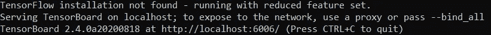
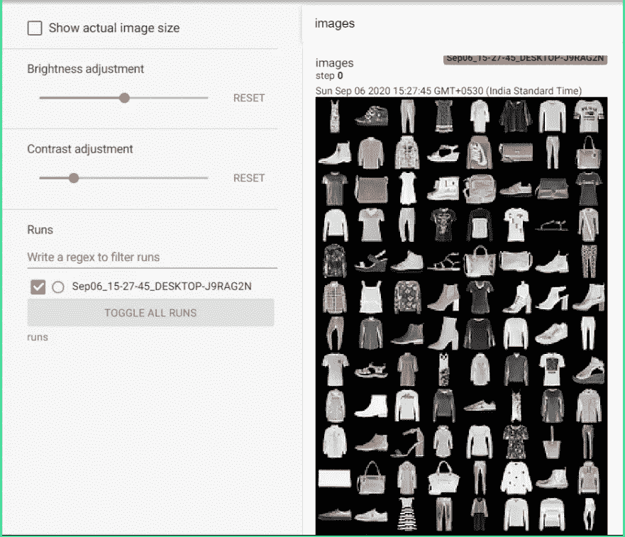
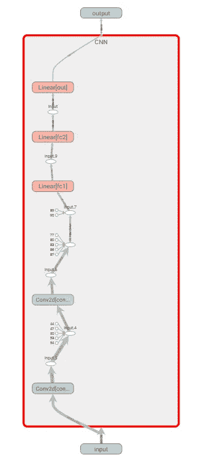
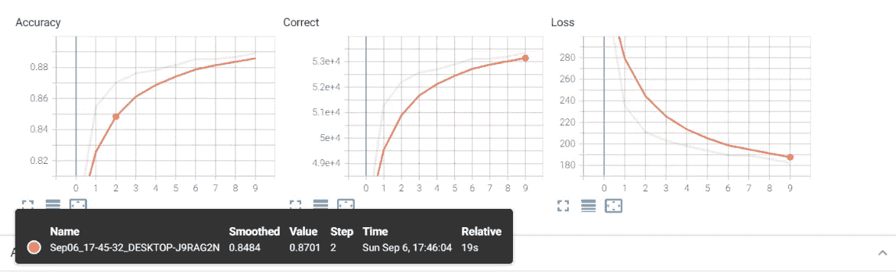
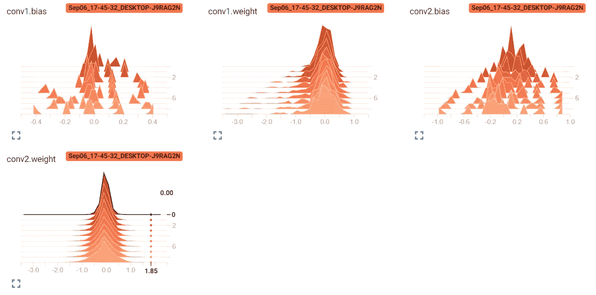
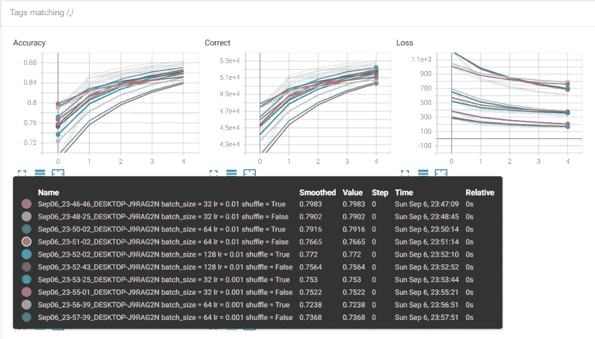
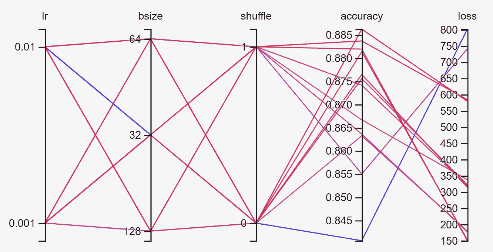

# 使用 PyTorch 的 TensorBoard 完全指南

> 原文：<https://towardsdatascience.com/a-complete-guide-to-using-tensorboard-with-pytorch-53cb2301e8c3?source=collection_archive---------2----------------------->


艾萨克·史密斯在 [Unsplash](https://unsplash.com?utm_source=medium&utm_medium=referral) 上拍摄的照片

在本文中，我们将把 TensorBoard 集成到我们的 **PyTorch** 项目中。TensorBoard 是一套用于检查和理解模型运行和图形的网络应用程序。TensorBoard 目前支持五种可视化:**标量、图像、音频、直方图和图形**。在本指南中，我们将涵盖除音频之外的所有五个方面，并学习如何使用 TensorBoard 进行高效的超参数分析和调谐。

# **安装指南:**

1.  确保您的 PyTorch 版本高于 1.10。对于本指南，我使用的是版本 **1.5.1。**使用此命令检查您的 PyTorch 版本。

```
import torch
print(torch.__version__)
```

2.安装 TensordBoard 有两个包管理器— **pip 或 Anaconda** 。根据您的 python 版本，使用以下任一选项:

Pip 安装命令:

```
pip install tensorboard
```

Anaconda 安装命令:

```
conda install -c conda-forge tensorboard
```

**注意:**安装 **TensorFlow** 并不是运行 TensorBoard 的先决条件，尽管它是 TensorFlow 生态系统的产品，TensorBoard 本身可以与 PyTorch 一起使用。

## 简介:

在本指南中，我们将使用 **FashionMNIST** 数据集(60，000 张服装图片和不同服装类型的 10 个类别标签)，这是一个内置在 **torch vision** 库中的流行数据集。它由衣服、鞋子、配饰等图像组成。以及对应于每个类别的整数标签。我们将创建一个简单的 CNN 分类器，然后从中进行推论。尽管如此，本指南将帮助您将 TensorBoard 的功能扩展到 PyTorch 中的任何项目，包括使用自定义数据集创建的项目。

请注意，在本指南中，我们不会详细介绍如何实现 **CNN** 模型以及如何设置训练循环。相反，本文的重点将是深度学习项目的簿记方面，以获得模型内部工作的可视化(权重和偏差)和评估指标(**损失，准确性，数量 _ 正确 _ 预测**)以及超参数调整。如果你是 PyTorch 框架的新手，在继续之前，看看我的另一篇关于在 PyTorch 中实现 CNN 的文章(**处理数据集，将数据移动到 GPU，创建模型和训练循环**)。

## 导入库和帮助函数:

```
import torch
import torch.nn as nn
import torch.optim as opt
torch.set_printoptions(linewidth=120)
import torch.nn.functional as F
import torchvision
import torchvision.transforms as transforms
**from torch.utils.tensorboard import SummaryWriter**
```

最后一个命令使我们能够导入 Tensorboard 类。我们将创建**“summary writer”**的实例，然后添加我们模型的评估特性，如损失、正确预测的数量、准确性等。敬它。TensorBoard 的一个新颖特性是，我们只需向它输入输出张量，它就会显示所有这些指标的绘图，这样 TensorBoard 就可以为我们处理所有的绘图工作。

```
def get_num_correct(preds, labels):
    return preds.argmax(dim=1).eq(labels).sum().item()
```

这一行代码帮助我们在训练模型并将训练好的模型应用到测试集之后获得正确标签的数量。 **"argmax "** 获取张量中最高值对应的索引。它是在 dim=1 上拍摄的，因为 dim=0 对应于一批图像。**“eq”**将批中的预测标签与真实标签进行比较，如果匹配则返回 1，如果不匹配则返回 0。最后，我们取 1 的总和**来得到正确预测的总数。对张量执行操作后，输出也作为张量返回。 **"item"** 将 correct_predictions 的一维张量转换为浮点值，以便将其附加到列表(total_correct)中，以便在 TensorBoard 中绘图(张量如果附加到列表中，则不能在 TensorBoard 中绘图，因此我们需要将其转换为浮点值，将其附加到列表中，然后将此列表传递给 TensorBoard 进行绘图)。**

## CNN 模型:

我们创建了一个简单的 CNN 模型，将图像通过两个卷积层，然后是一组完全连接的层。最后，我们将在最后使用一个 **Softmax** 层来预测类标签。

```
class CNN(nn.Module):
    def __init__(self):
        super().__init__()
        self.conv1 = nn.Conv2d(in_channels=1, out_channels=6, kernel_size=5)
        self.conv2 = nn.Conv2d(in_channels=6, out_channels=12, kernel_size=5)

        self.fc1 = nn.Linear(in_features=12*4*4, out_features=120)
        self.fc2 = nn.Linear(in_features=120, out_features=60)
        self.out = nn.Linear(in_features=60, out_features=10)

    def forward(self, x):
        x = F.relu(self.conv1(x))
        x = F.max_pool2d(x, kernel_size = 2, stride = 2)
        x = F.relu(self.conv2(x))
        x = F.max_pool2d(x, kernel_size = 2, stride = 2)
        x = torch.flatten(x,start_dim = 1)
        x = F.relu(self.fc1(x))
        x = F.relu(self.fc2(x))
        x = self.out(x)

        return x
```

## 导入数据并创建列车加载器:

```
train_set = torchvision.datasets.FashionMNIST(root="./data",
train = True,
 download=True,
transform=transforms.ToTensor())train_loader = torch.utils.data.DataLoader(train_set,batch_size = 100, shuffle = True)
```

## 用 TensorBoard 显示图像和图形:

```
**tb = SummaryWriter()**
model = CNN()
images, labels = next(iter(train_loader))
grid = torchvision.utils.make_grid(images)
**tb.add_image("images", grid)
tb.add_graph(model, images)
tb.close()**
```

我们创建一个 **SummaryWriter** 的实例‘TB ’,并通过使用 **tb.add_image** 函数向其添加图像。它有两个主要参数，一个是图像的**标题**，另一个是图像的**张量** **。在这种情况下，我们已经创建了一批 **100 个**图像，并将它们传递给一个**网格**，然后将其添加到 tb 实例中。对于 **tb.add_graph** 函数，我们传递我们的 CNN 模型和一批输入图像来生成模型的图形。运行代码后，将在项目目录中创建一个**“runs”**文件夹。所有进行中的运行将按**日期**在文件夹中分类。这样你就有了一个所有跑步的有效日志，可以在 TensorBoard 中查看和比较。**

现在使用命令行(我使用 Anaconda 提示符)重定向到 runs 文件夹所在的项目目录，并运行以下命令:

```
tensorboard --logdir runs
```

然后，它将在本地主机上为 TensorBoard 提供服务，其链接将显示在终端中:



“TensorFlow 未安装”警告可以忽略

打开链接后，我们将能够看到我们所有的运行。图像在**“图像”**选项卡下可见。我们可以使用正则表达式过滤运行，并勾选我们感兴趣的可视化。



张量板中图像的网格图

在**“图表”**选项卡下，您将找到该型号的图表。它给出了在每一次卷积和线性层操作之后，整批图像的尺寸如何变化的整个管道的细节。只需双击任一图标，即可从图表中获取更多信息。它还通过双击任何 Conv2d 或线性层给出所有权重和偏差矩阵的维度。



使用张量板为 CNN 模型生成的图形

# 可视化评估的训练循环:

```
device = ("cuda" if torch.cuda.is_available() else cpu)
model = CNN().to(device)
train_loader = torch.utils.data.DataLoader(train_set,batch_size = 100, shuffle = True)
optimizer = opt.Adam(model.parameters(), lr= 0.01)
criterion = torch.nn.CrossEntropyLoss()

**tb = SummaryWriter()**

for epoch in range(10):

    total_loss = 0
    total_correct = 0

    for images, labels in train_loader:
        images, labels = images.to(device), labels.to(device)
        preds = model(images)

        loss = criterion(preds, labels)
        total_loss+= loss.item()
        total_correct+= get_num_correct(preds, labels)

        optimizer.zero_grad()
        loss.backward()
        optimizer.step()

 **tb.add_scalar("Loss", total_loss, epoch)
    tb.add_scalar("Correct", total_correct, epoch)
    tb.add_scalar("Accuracy", total_correct/ len(train_set), epoch)

    tb.add_histogram("conv1.bias", model.conv1.bias, epoch)
    tb.add_histogram("conv1.weight", model.conv1.weight, epoch)
    tb.add_histogram("conv2.bias", model.conv2.bias, epoch)
    tb.add_histogram("conv2.weight", model.conv2.weight, epoch)**

    print("epoch:", epoch, "total_correct:", total_correct, "loss:",total_loss)

**tb.close()**
```

或者，我们也可以使用 for 循环迭代所有模型参数，包括 **fc** 和 **softmax** 层:

```
for name, weight in model.named_parameters():
 **tb.add_histogram(name,weight, epoch)
    tb.add_histogram(f'{name}.grad',weight.grad, epoch)**
```

我们运行循环 **10 个时期**，在训练循环结束时，我们将增量传递给我们创建的 tb 变量。我们已经创建了 **total_loss** 和 **total_correct** 变量来跟踪每个时期结束时的**损失**和**正确预测**。注意，每个“tb”都有三个参数，一个是字符串，它将是折线图/直方图的**标题**，然后是包含要绘制的**值**的张量，最后是**全局步骤**。由于我们正在做一个纪元式分析，我们将其设置为纪元。或者，也可以通过使用“枚举”移动 for 循环内的 tb 命令，将其设置为**批处理 id** ，并将步骤设置为**批处理 id** ，如下所示:

```
for batch_id, (images, labels) in enumerate(train_loader):
......
    **tb.add_scalar("Loss", total_loss, batch_id)**
```

如下图所示，运行前面提到的命令来运行 TensorBoard 将显示**损失、数量 _ 正确 _ 预测**和**精度的线图和直方图。**

## **线条图:**

沿着图表移动**橙色圆点**将为我们提供该特定**时期**的相应度量(准确度/正确/损失)的日志。



TensorBoard 生成的线图

## **直方图:**



TensorBoard 生成的直方图

## 超参数调谐:

首先，我们需要将 **batch_size、learning_rate、shuffle** 更改为动态变量。我们通过创建如下的字典来实现这一点:

```
from itertools import product
parameters = dict(
    lr = [0.01, 0.001],
    batch_size = [32,64,128],
    shuffle = [True, False]
)

param_values = [v for v in parameters.values()]
print(param_values)

for lr,batch_size, shuffle in product(*param_values):
    print(lr, batch_size, shuffle)
```

这将允许我们获得三个元组，对应于**三个超参数**的所有组合，然后在运行每个历元循环之前对它们调用 for 循环。这样，我们将能够对所有不同的超参数组合进行 **12** 次运行(2(learning _ rates)* 3(batch _ size)* 2(shuffles))，并在 TensorBoard 上进行比较。我们将按如下方式修改训练循环:

# 改进的训练循环:

```
for run_id, (lr,batch_size, shuffle) in enumerate(product(*param_values)):
    print("run id:", run_id + 1)
    model = CNN().to(device)
    train_loader = torch.utils.data.DataLoader(train_set,batch_size = batch_size, shuffle = shuffle)
    optimizer = opt.Adam(model.parameters(), lr= lr)
    criterion = torch.nn.CrossEntropyLoss()
    **comment = f' batch_size = {batch_size} lr = {lr} shuffle = {shuffle}'
    tb = SummaryWriter(comment=comment)**
    for epoch in range(5):
        total_loss = 0
        total_correct = 0
        for images, labels in train_loader:
            images, labels = images.to(device), labels.to(device)
            preds = model(images)

            loss = criterion(preds, labels)
            total_loss+= loss.item()
            total_correct+= get_num_correct(preds, labels)

            optimizer.zero_grad()
            loss.backward()
            optimizer.step()

        **tb.add_scalar("Loss", total_loss, epoch)
        tb.add_scalar("Correct", total_correct, epoch)
        tb.add_scalar("Accuracy", total_correct/ len(train_set), epoch)**

        print("batch_size:",batch_size, "lr:",lr,"shuffle:",shuffle)
        print("epoch:", epoch, "total_correct:", total_correct, "loss:",total_loss)
    print("__________________________________________________________")

 **tb.add_hparams(
            {"lr": lr, "bsize": batch_size, "shuffle":shuffle},
            {
                "accuracy": total_correct/ len(train_set),
                "loss": total_loss,
            },
        )**

**tb.close()**
```

如上所述，我们已经将所有内容移到 for 循环下，以检查所有不同的超参数组合，并且在每次运行时，我们必须重新实例化**模型**以及重新加载数据集的**批次**。**“注释”**允许我们根据指定的超参数在 runs 文件夹中创建不同的文件夹。我们将这个注释作为参数传递给 **SummaryWriter** 。请注意，我们将能够一起查看所有运行，并在 TensorBoard 中绘制所有超参数的对比分析。 **tb.add_scalar** 与之前的相同，只是这次我们将它显示在所有运行中。 **tb.add_hparams** 允许我们在里面添加**超参数**作为参数来跟踪训练进度。它将两个字典作为输入，一个用于超参数，另一个用于要分析的评估指标。结果被映射到所有这些超参数上。从底部的图形映射图可以清楚地看到。

## 组合图:



组合可视化的 12 次运行图

如上所述，我们可以过滤我们想要的任何运行，或者将它们绘制在同一个图表上。通过这种方式，我们可以对模型在多个超参数上的性能进行比较研究，并将模型调整到能够提供最佳性能的模型。在弹出框中可以看到所有细节，如批量大小、学习率、随机播放和相应的精度值。

从结果中可以明显看出，批量大小为 32，shuffle 设置为 True，学习率为 0.01 时产生最好的结果。出于演示的目的，它只运行 5 个时期。增加历元的数量可以很好地影响结果，因此用几个历元值进行训练和测试是很重要的。

## 超参数图:



张量板生成的超参数图

该图包含所有 12 次运行的组合日志，因此您可以使用最高的准确度和最低的损失值，并将其追溯到相应的批次大小、学习率和洗牌配置。

从超参数图可以清楚地看出，将 shuffle 设置为 False(0)往往会产生非常差的结果。因此，将 shuffle 设置为 always True(1)对于训练是理想的，因为它增加了随机化。

## 结论:

请随意使用 TensorBoard，尝试向图中添加更多的超参数，以获得尽可能多的关于给定各种超参数的模型的损失收敛模式和性能的信息。除了 Adam 之外，我们还可以添加一组优化器，并进行对比研究。在类似 LSTMs 的序列模型中，GRUs 可以将时间步长添加到图表中，并得出深刻的结论。希望这篇文章能让你对使用 PyTorch 的 TensorBoard 有一个全面的了解。

链接到代码:[https://github.com/ajinkya98/TensorBoard_PyTorch](https://github.com/ajinkya98/TensorBoard_PyTorch)